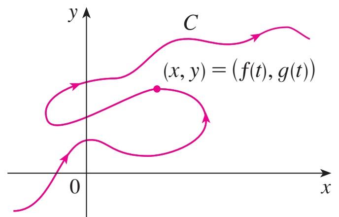
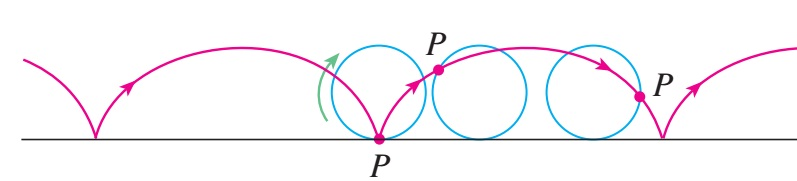
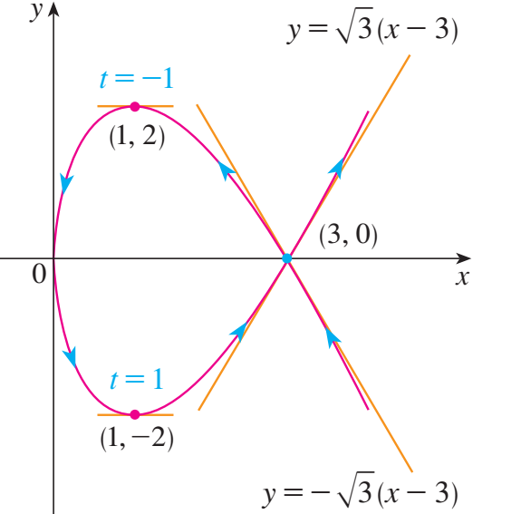

# Applications And Parametric CurvesỨng dụng đạo hàm và đường cong tham số

MT1003 Calculus 1 - Lecture 04
MT1003 Giải tích 1 - Bài giảng 04

Truong-Son Van 
tsvan@hcmut.edu.vn

Topics: L'Hospital's rule, Taylor and Maclaurin expansions, function analysis, optimization, and parametric curves.
Chủ đề: quy tắc L'Hospital, Taylor và Maclaurin, khảo sát hàm số, tối ưu, và đường cong tham số.

---

# Where We AreChúng ta đang ở đâu

From local slope to global behaviorTừ độ dốc cục bộ đến hình dáng toàn cục

Last time the derivative measured an instantaneous rate. Today we use it to compute difficult limits, approximate functions, locate extrema, sketch curves, and analyze paths given by a parameter.
Buổi trước đạo hàm đo tốc độ thay đổi tức thời. Hôm nay ta dùng nó để tính giới hạn khó, xấp xỉ hàm, tìm cực trị, phác họa đồ thị, và khảo sát quỹ đạo cho bởi tham số.

1<strong>LimitsGiới hạn</strong>L'HospitalL'Hospital

2<strong>ApproximationXấp xỉ</strong>Taylor and MaclaurinTaylor và Maclaurin

3<strong>ShapeHình dáng</strong>Monotonicity, concavityĐơn điệu, lồi lõm

4<strong>OptimizationTối ưu</strong>Model, differentiate, testMô hình, lấy đạo hàm, kiểm tra

5<strong>ParametricTham số</strong>$x=f(t), y=g(t)$$x=f(t), y=g(t)$

---

# Today's PlanKế hoạch hôm nay

0-20<strong>L'Hospital's rule</strong> - indeterminate forms and transformations<strong>Quy tắc L'Hospital</strong> - dạng vô định và cách biến đổi

20-55<strong>Taylor and Maclaurin</strong> - formula, standard expansions, limit estimates<strong>Taylor và Maclaurin</strong> - công thức, khai triển chuẩn, ước lượng giới hạn

55-72<strong>Your turn</strong> - limits by L'Hospital and Taylor<strong>Đến lượt bạn</strong> - giới hạn bằng L'Hospital và Taylor

72-82<strong>Break</strong><strong>Nghỉ giải lao</strong>

82-122<strong>Curve sketching and optimization</strong> - first and second derivative tests<strong>Khảo sát đồ thị và tối ưu</strong> - xét đạo hàm cấp một và hai

122-150<strong>Parametric curves</strong> - slope, tangent, concavity<strong>Đường cong tham số</strong> - hệ số góc, tiếp tuyến, lồi lõm

150-170<strong>Mixed practice</strong> - one problem from each block<strong>Luyện tập tổng hợp</strong> - mỗi khối một bài

---

# Lecture RoadmapMạch bài giảng

Approximation and shapeXấp xỉ và hình dáng

<ul>
<li>Taylor and Maclaurin expansionsKhai triển Taylor và Maclaurin</li>
<li>Analysis of the function $y=f(x)$Khảo sát hàm số $y=f(x)$</li>
<li>Optimization applicationsỨng dụng tối ưu hóa</li>
</ul>

Parametric viewGóc nhìn tham số

<ul>
<li>Curves given by $x=f(t), y=g(t)$Đường cong cho bởi $x=f(t), y=g(t)$</li>
<li>Tangents, horizontal/vertical points, concavityTiếp tuyến, điểm ngang/dọc, lồi lõm</li>
</ul>

Lecture 04 arcMạch Bài giảng 04

The through-line is local derivative information: use it to evaluate limits, approximate functions, locate extrema, sketch curves, and describe parametric motion.
Mạch chính là thông tin cục bộ từ đạo hàm: dùng nó để tính giới hạn, xấp xỉ hàm, tìm cực trị, phác họa đồ thị, và mô tả chuyển động tham số.

Limit bridgeCầu nối giới hạn

L'Hospital's rule is not a replacement for algebra or Taylor. It is a quick derivative-based tool for limits whose first substitution gives an indeterminate form.
Quy tắc L'Hospital không thay thế đại số hay Taylor. Nó là công cụ dựa trên đạo hàm để xử lý giới hạn mà phép thế đầu tiên cho dạng vô định.

---

# Indeterminate FormsCác dạng vô định

A warning sign, not an answerDấu hiệu cảnh báo, không phải đáp án

An indeterminate form means the first substitution does not decide the limit. More structure is needed.
Dạng vô định nghĩa là phép thế trực tiếp chưa quyết định được giới hạn. Ta cần thêm cấu trúc.

$\dfrac{0}{0}$

$\dfrac{\infty}{\infty}$

$\infty-\infty$

$0\cdot\infty$

$1^\infty$

$\infty^0$

$0^0$

Most forms are first transformed into $0/0$ or $\infty/\infty$, then L'Hospital can apply.
Phần lớn dạng vô định được đổi về $0/0$ hoặc $\infty/\infty$, rồi mới dùng L'Hospital.

---

# L'Hospital's RuleQuy tắc L'Hospital

TheoremĐịnh lý

Suppose $f$ and $g$ are differentiable near $a$, $g'(x)\ne0$, and substitution gives $0/0$ or $\infty/\infty$. If
Giả sử $f$ và $g$ khả vi gần $a$, $g'(x)\ne0$, và phép thế cho dạng $0/0$ hoặc $\infty/\infty$. Nếu

$$
\lim_{x\to a}\frac{f'(x)}{g'(x)}=L,
$$

thenthì

$$
\lim_{x\to a}\frac{f(x)}{g(x)}=L.
$$

Also worksCũng dùng được
One-sided limits and limits as $x\to\pm\infty$.Giới hạn một phía và giới hạn khi $x\to\pm\infty$.

Can repeatCó thể lặp
If the derivative ratio is still indeterminate, apply again.Nếu tỉ số đạo hàm vẫn vô định, áp dụng lần nữa.

Check firstKiểm tra trước
Do not use it on a non-indeterminate quotient.Không dùng cho thương không vô định.

---

# L'Hospital ExampleVí dụ L'Hospital

ComputeTính

$$
\lim_{x\to0}\frac{\tan x-x}{x-\sin x}.
$$

First substitutionThế trực tiếp

$$
\frac{\tan0-0}{0-\sin0}=\frac00.
$$

So L'Hospital is allowed.
Vì vậy được phép dùng L'Hospital.

Differentiate numerator and denominatorLấy đạo hàm tử và mẫu

$$
\lim_{x\to0}\frac{\sec^2x-1}{1-\cos x}
=\lim_{x\to0}\frac{\tan^2x}{1-\cos x}.
$$

$$
\frac{\tan^2x}{1-\cos x}
=\frac{\sin^2x}{\cos^2x(1-\cos x)}
=\frac{1+\cos x}{\cos^2x}\longrightarrow 2.
$$

---

# Transform The Other FormsĐổi các dạng còn lại

Product $0\cdot\infty$Tích $0\cdot\infty$

Move one factor into the denominator.
Đưa một thừa số xuống mẫu.

$$
f(x)g(x)=\frac{f(x)}{1/g(x)} \quad\text{or}\quad \frac{g(x)}{1/f(x)}.
$$

Difference $\infty-\infty$Hiệu $\infty-\infty$

Combine terms using algebra: common denominator, conjugate, or logs.
Gộp hạng tử bằng đại số: quy đồng, liên hợp, hoặc log.

$$
\sqrt{x^2+x}-x=\frac{x}{\sqrt{x^2+x}+x}.
$$

Powers $1^\infty,\infty^0,0^0$Lũy thừa $1^\infty,\infty^0,0^0$

Let $y=u(x)^{v(x)}$. Then $\ln y=v(x)\ln u(x)$. Find $\lim \ln y=M$, then $\lim y=e^M$.
Đặt $y=u(x)^{v(x)}$. Khi đó $\ln y=v(x)\ln u(x)$. Tìm $\lim \ln y=M$, rồi $\lim y=e^M$.

Example: $\displaystyle\lim_{x\to0^+}(1+\sin4x)^{\cot x}=e^4$ because $\cot x\,\ln(1+\sin4x)\to4$.
Ví dụ: $\displaystyle\lim_{x\to0^+}(1+\sin4x)^{\cot x}=e^4$ vì $\cot x\,\ln(1+\sin4x)\to4$.

---

# Taylor's FormulaCông thức Taylor

Taylor polynomial near $x_0$Đa thức Taylor quanh $x_0$

If $f$ has derivatives up to order $n$ near $x_0$, then
Nếu $f$ có đạo hàm đến cấp $n$ gần $x_0$, thì

$$
f(x)=\sum_{k=0}^{n}\frac{f^{(k)}(x_0)}{k!}(x-x_0)^k
+o\!\left((x-x_0)^n\right).
$$

MaclaurinMaclaurin

Taylor at $x_0=0$:
Taylor tại $x_0=0$:

$$
f(x)=\sum_{k=0}^{n}\frac{f^{(k)}(0)}{k!}x^k+o(x^n).
$$

Why it mattersVì sao quan trọng

Taylor turns a smooth function into a polynomial near the point. Polynomials are easier to estimate, compare, and integrate later.
Taylor biến một hàm trơn thành đa thức gần điểm xét. Đa thức dễ ước lượng, so sánh, và sau này dễ tích phân hơn.

---

# Maclaurin Expansions To KnowCác khai triển Maclaurin cần nhớ

$e^x =$

$1+x+\frac{x^2}{2!}+\cdots+\frac{x^n}{n!}+o(x^n)$

$\sin x =$

$x-\frac{x^3}{3!}+\frac{x^5}{5!}-\cdots+(-1)^m\frac{x^{2m+1}}{(2m+1)!}+o(x^{2m+2})$

$\cos x =$

$1-\frac{x^2}{2!}+\frac{x^4}{4!}-\cdots+(-1)^m\frac{x^{2m}}{(2m)!}+o(x^{2m+1})$

$\ln(1+x) =$

$x-\frac{x^2}{2}+\frac{x^3}{3}-\cdots+(-1)^{n-1}\frac{x^n}{n}+o(x^n)$

$(1+x)^\alpha =$

$1+\alpha x+\frac{\alpha(\alpha-1)}{2!}x^2+\cdots$

$+\frac{\alpha(\alpha-1)\cdots(\alpha-n+1)}{n!}x^n+o(x^n)$

Start from the function, recall the series, then reveal to check. Use only as many terms as the denominator order demands.
Nhìn hàm trước, tự nhớ chuỗi, rồi mở để kiểm tra. Chỉ lấy đủ số hạng theo bậc của mẫu số.

---

# Example: A Taylor LimitVí dụ: giới hạn bằng Taylor

ComputeTính

$$
\lim_{x\to0}\frac{\cos x-1+\frac{x^2}{2}}{x^4}.
$$

ExpansionKhai triển

$$
\cos x=1-\frac{x^2}{2}+\frac{x^4}{24}+o(x^4).
$$

Cancel the lower termsTriệt tiêu các hạng bậc thấp

$$
\cos x-1+\frac{x^2}{2}
=\frac{x^4}{24}+o(x^4).
$$

$$
\lim_{x\to0}\frac{\frac{x^4}{24}+o(x^4)}{x^4}=\frac{1}{24}.
$$

---

# Choosing A Limit ToolChọn công cụ tính giới hạn

Algebra firstĐại số trước

Factor, cancel, rationalize, use identities, or divide by the dominant power.
Phân tích nhân tử, rút gọn, nhân liên hợp, dùng đồng nhất thức, hoặc chia bậc cao nhất.

L'HospitalL'Hospital

Fast when the limit is a quotient of type $0/0$ or $\infty/\infty$ after transformation.
Nhanh khi giới hạn là thương dạng $0/0$ hoặc $\infty/\infty$ sau khi biến đổi.

TaylorTaylor

Best when cancellation order matters, or when several small functions interact.
Tốt khi cần biết bậc triệt tiêu, hoặc khi nhiều hàm bé tương tác.

4 min

Quick comparisonSo sánh nhanh

Which method would you try first for each limit?
Bạn sẽ thử phương pháp nào trước cho mỗi giới hạn?

$$
\lim_{x\to0}\frac{e^x-1-x}{x^2},
\qquad
\lim_{x\to\infty}\frac{\ln x}{x},
\qquad
\lim_{x\to0}\frac{\tan x-\sin x}{x^3}.
$$

---

# Function Analysis RoadmapLộ trình khảo sát hàm số

GoalMục tiêu

Use derivative information to sketch the graph and answer optimization questions.
Dùng thông tin đạo hàm để phác họa đồ thị và trả lời bài toán tối ưu.

<ol>
<li>Find the domain and symmetries.Tìm miền xác định và đối xứng.</li>
<li>Compute intercepts and important limits.Tìm giao điểm và các giới hạn quan trọng.</li>
<li>Find vertical, horizontal, or oblique asymptotes.Tìm tiệm cận đứng, ngang, xiên.</li>
</ol>

<ol start="4">
<li>Use $f'$ for monotonicity and extrema.Dùng $f'$ để xét đơn điệu và cực trị.</li>
<li>Use $f''$ for concavity and inflection.Dùng $f''$ để xét lồi lõm và điểm uốn.</li>
<li>Assemble a clean sign chart and sketch.Lập bảng dấu/bảng biến thiên và vẽ đồ thị.</li>
</ol>

---

# First Derivative TestKiểm tra bằng đạo hàm cấp một

Critical pointsĐiểm tới hạn

A number $c$ in the domain is critical if $f'(c)=0$ or $f'(c)$ does not exist.
Một điểm $c$ trong miền xác định là điểm tới hạn nếu $f'(c)=0$ hoặc $f'(c)$ không tồn tại.

IncreasingTăng

If $f'(x)>0$ on an interval, $f$ is increasing there.
Nếu $f'(x)>0$ trên một khoảng, $f$ tăng trên khoảng đó.

DecreasingGiảm

If $f'(x)<0$ on an interval, $f$ is decreasing there.
Nếu $f'(x)<0$ trên một khoảng, $f$ giảm trên khoảng đó.

Local extremaCực trị địa phương

$+$ to $-$ gives a local maximum. $-$ to $+$ gives a local minimum.
$+$ sang $-$ cho cực đại. $-$ sang $+$ cho cực tiểu.

Always test signs on intervals, not just at the critical point itself.
Luôn xét dấu trên các khoảng, không chỉ tại chính điểm tới hạn.

---

# Second Derivative TestKiểm tra bằng đạo hàm cấp hai

ConcavityTính lồi lõm

<ul>
<li>$f''(x)>0$: graph is concave up.$f''(x)>0$: đồ thị lõm lên.</li>
<li>$f''(x)<0$: graph is concave down.$f''(x)<0$: đồ thị lõm xuống.</li>
</ul>

Inflection pointĐiểm uốn

An inflection point is where concavity changes sign, provided the point is on the graph.
Điểm uốn là nơi tính lồi lõm đổi dấu, với điều kiện điểm đó thuộc đồ thị.

Second derivative test for extremaTiêu chuẩn đạo hàm cấp hai cho cực trị

If $f'(c)=0$ and $f''(c)>0$, then $f$ has a local minimum at $c$. If $f''(c)<0$, then $f$ has a local maximum at $c$. If $f''(c)=0$, the test is inconclusive.
Nếu $f'(c)=0$ và $f''(c)>0$, thì $f$ có cực tiểu tại $c$. Nếu $f''(c)<0$, thì $f$ có cực đại tại $c$. Nếu $f''(c)=0$, tiêu chuẩn chưa kết luận.

---

# Optimization WorkflowQuy trình tối ưu hóa

1<strong>ModelMô hình</strong>Draw, name variables, write the objective.Vẽ hình, đặt biến, viết đại lượng cần tối ưu.

2<strong>ConstraintRàng buộc</strong>Use the given data to reduce to one variable.Dùng dữ kiện để đưa về một biến.

3<strong>DifferentiateLấy đạo hàm</strong>Find critical points inside the feasible interval.Tìm điểm tới hạn trong miền khả thi.

4<strong>VerifyKiểm tra</strong>Compare endpoints or use derivative signs.So sánh biên hoặc xét dấu đạo hàm.

Common pitfallLỗi hay gặp

A critical point is only a candidate. The real maximum/minimum must also respect the domain and endpoints.
Điểm tới hạn chỉ là ứng viên. Giá trị lớn nhất/nhỏ nhất thật sự còn phải thỏa miền xác định và xét cả biên.

---

# Example: Maximum AreaVí dụ: diện tích lớn nhất

ProblemBài toán

A rectangular field has perimeter $100$ m. Which dimensions maximize the area?
Một mảnh đất hình chữ nhật có chu vi $100$ m. Kích thước nào cho diện tích lớn nhất?

ModelMô hình

Let the sides be $x$ and $y$.
Gọi hai cạnh là $x$ và $y$.

$$
2x+2y=100 \Rightarrow y=50-x.
$$

$$
A(x)=x(50-x),\qquad 0\le x\le50.
$$

Differentiate and testLấy đạo hàm và kiểm tra

$$
A'(x)=50-2x.
$$

$A'(x)=0$ gives $x=25$, so $y=25$.
$A'(x)=0$ cho $x=25$, nên $y=25$.

$$
A''(x)=-2<0.
$$

The maximum area occurs for a square: $25\text{ m}\times25\text{ m}$.
Diện tích lớn nhất đạt được khi là hình vuông: $25\text{ m}\times25\text{ m}$.

---

# Parametric CurvesĐường cong tham số

DefinitionĐịnh nghĩa

A plane curve can be described by
Một đường cong phẳng có thể được mô tả bởi

$$
x=f(t),\qquad y=g(t),\qquad t\in I.
$$

The parameter $t$ often represents time. Each value of $t$ gives a point $(x,y)$ on the curve.
Tham số $t$ thường biểu diễn thời gian. Mỗi giá trị của $t$ cho một điểm $(x,y)$ trên đường cong.

Key shiftĐiểm thay đổi chính

The curve may fail the vertical line test, but the motion $(f(t),g(t))$ is still perfectly meaningful.
Đường cong có thể không qua kiểm tra đường thẳng đứng, nhưng chuyển động $(f(t),g(t))$ vẫn hoàn toàn có nghĩa.

---

# Example: The CycloidVí dụ: đường cycloid

Rolling circleĐường tròn lăn

A point on a circle of radius $r$ rolling along a line traces a cycloid:
Một điểm trên đường tròn bán kính $r$ lăn trên đường thẳng vạch ra cycloid:

$$
x=r(\theta-\sin\theta),\qquad
y=r(1-\cos\theta).
$$

The parameter $\theta$ is the angle of rotation. The arrows show the direction of increasing $\theta$.
Tham số $\theta$ là góc quay. Mũi tên cho biết chiều tăng của $\theta$.

---

# Slope Of A Parametric CurveHệ số góc của đường cong tham số

Chain ruleQuy tắc hàm hợp

If $x=f(t)$ and $y=g(t)$ are differentiable and $dx/dt\ne0$, then
Nếu $x=f(t)$ và $y=g(t)$ khả vi và $dx/dt\ne0$, thì

$$
\frac{dy}{dx}=\frac{dy/dt}{dx/dt}=\frac{g'(t)}{f'(t)}.
$$

Horizontal tangentTiếp tuyến ngang

$dy/dt=0$ and $dx/dt\ne0$.
$dy/dt=0$ và $dx/dt\ne0$.

Vertical tangentTiếp tuyến đứng

$dx/dt=0$ and $dy/dt\ne0$.
$dx/dt=0$ và $dy/dt\ne0$.

This formula is the parametric version of slope as "rise over run".
Công thức này là phiên bản tham số của hệ số góc: "độ tăng $y$ chia độ tăng $x$".

---

# Second Derivative In Parametric FormĐạo hàm cấp hai dạng tham số

ConcavityTính lồi lõm

After computing $dy/dx$ as a function of $t$, differentiate with respect to $x$:
Sau khi tính $dy/dx$ theo $t$, lấy đạo hàm theo $x$:

$$
\frac{d^2y}{dx^2}
=\frac{d}{dx}\left(\frac{dy}{dx}\right)
=\frac{\frac{d}{dt}\left(\frac{dy}{dx}\right)}{dx/dt}.
$$

InterpretationÝ nghĩa

The sign of $d^2y/dx^2$ describes concavity with respect to the $x$ direction.
Dấu của $d^2y/dx^2$ mô tả lồi lõm theo hướng trục $x$.

CarefulCẩn thận

Do not compute $d^2y/dx^2$ by simply dividing $d^2y/dt^2$ by $d^2x/dt^2$.
Không tính $d^2y/dx^2$ bằng cách chia $d^2y/dt^2$ cho $d^2x/dt^2$.

---

# Worked Parametric ExampleVí dụ tham số đã giải

CurveĐường cong

$$
x=t^2,\qquad y=t^3-3t.
$$

SlopeHệ số góc

$$
\frac{dy}{dx}=\frac{3t^2-3}{2t}=\frac{3(t^2-1)}{2t}.
$$

<ul>
<li>Horizontal tangents: $t=\pm1$ at $(1,-2)$ and $(1,2)$.Tiếp tuyến ngang: $t=\pm1$ tại $(1,-2)$ và $(1,2)$.</li>
<li>Vertical tangent: $t=0$ at $(0,0)$.Tiếp tuyến đứng: $t=0$ tại $(0,0)$.</li>
</ul>

---

# Parametric Concavity ExampleVí dụ lồi lõm tham số

Same curveCùng đường cong

$$
x=t^2,\qquad y=t^3-3t,\qquad
\frac{dy}{dx}=\frac{3(t^2-1)}{2t}.
$$

DifferentiateLấy đạo hàm

Differentiate $\frac{dy}{dx}$ with respect to $t$.
Lấy đạo hàm $\frac{dy}{dx}$ theo $t$.

$$
\frac{d}{dt}\left(\frac{dy}{dx}\right)
=\frac{3}{2}\left(1+\frac{1}{t^2}\right).
$$

DivideChia

Divide by $dx/dt=2t$.
Chia cho $dx/dt=2t$.

$$
\frac{d^2y}{dx^2}
=\frac{3(t^2+1)}{4t^3}.
$$

The curve is concave down for $t<0$ and concave up for $t>0$.
Đường cong lõm xuống khi $t<0$ và lõm lên khi $t>0$.

---

# Your Turn A: L'HospitalĐến lượt bạn A: L'Hospital

10 min

Check the form firstKiểm tra dạng trước

<ol>
<li>$\displaystyle \lim_{x\to2}\frac{x^2-4}{x^2-x-2}$</li>
<li>$\displaystyle \lim_{x\to1}\frac{x^5-1}{2x^3-x-1}$</li>
<li>$\displaystyle \lim_{x\to0}\frac{\sin x-x\cos x}{\sin^3x}$</li>
<li>$\displaystyle \lim_{x\to0^+}x^x$</li>
</ol>

Check the indeterminate form before applying the rule.
Kiểm tra dạng vô định trước khi dùng quy tắc.

---

# Your Turn B: Taylor And MaclaurinĐến lượt bạn B: Taylor và Maclaurin

12 min

Use the shortest expansion that answers the questionDùng khai triển ngắn nhất đủ trả lời câu hỏi

<ol>
<li>Find the Maclaurin expansion of $f(x)=\ln^2(1+x)$ up to degree $3$.Tìm khai triển Maclaurin của $f(x)=\ln^2(1+x)$ đến cấp $3$.</li>
<li>Find the Maclaurin expansion of $f(x)=x\sin x$ up to degree $4$.Tìm khai triển Maclaurin của $f(x)=x\sin x$ đến cấp $4$.</li>
<li>Find the Maclaurin expansion of $f(x)=e^{\sin x}$ up to degree $3$.Tìm khai triển Maclaurin của $f(x)=e^{\sin x}$ đến cấp $3$.</li>
<li>$\displaystyle \lim_{x\to0}\frac{1-\frac{x^2}{2}-\cos x}{x^4+4x^5}$</li>
</ol>

---

# Your Turn C: Shape And OptimizationĐến lượt bạn C: đồ thị và tối ưu

8 min

ExtremaCực trị

Find the local extrema of $y=\dfrac{1+3x}{\sqrt{4+x^2}}$.
Tìm cực trị của $y=\dfrac{1+3x}{\sqrt{4+x^2}}$.

8 min

MonotonicityTính đơn điệu

Determine where $y=\dfrac{e^x}{x}$ is increasing or decreasing.
Khảo sát tính đơn điệu của $y=\dfrac{e^x}{x}$.

8 min

Absolute extremaGTLN, GTNN

Find the maximum and minimum of $y=(x-3)^2e^{-x}$ on $[-1,4]$.
Tìm GTLN, GTNN của $y=(x-3)^2e^{-x}$ trên $[-1,4]$.

10 min

Applied optimizationTối ưu ứng dụng

A farmer has $2400$ ft of fencing for a rectangular field beside a straight river. No fence is needed along the river. Maximize the area.
Một nông dân có $2400$ ft hàng rào cho mảnh đất chữ nhật sát sông thẳng. Không cần rào phía sông. Hãy tối đa hóa diện tích.

---

# Your Turn D: Parametric CurvesĐến lượt bạn D: đường cong tham số

12 min

Parametric practiceLuyện tập tham số

For the curveVới đường cong

$$
x=t^2,\qquad y=t^3-3t,
$$

<ol>
<li>show that the curve has two tangents at $(3,0)$ and find them;chứng minh đường cong có hai tiếp tuyến tại $(3,0)$ và tìm chúng;</li>
<li>find horizontal and vertical tangents;tìm tiếp tuyến ngang và đứng;</li>
<li>determine where the curve is concave up or down.xác định nơi đường cong lõm lên hoặc lõm xuống.</li>
</ol>

---

# Wrap-UpTổng kết

Tools added todayCông cụ hôm nay

<ul>
<li>L'Hospital for $0/0$ and $\infty/\infty$ formsL'Hospital cho dạng $0/0$ và $\infty/\infty$</li>
<li>Taylor/Maclaurin for local polynomial approximationsTaylor/Maclaurin cho xấp xỉ đa thức cục bộ</li>
<li>Derivative tests for graph shape and optimizationCác tiêu chuẩn đạo hàm cho đồ thị và tối ưu</li>
<li>Parametric slope and concavity formulasCông thức hệ số góc và lồi lõm dạng tham số</li>
</ul>

Next lectureBài giảng tiếp theo

We begin integration: antiderivatives, substitution, and integration by parts.
Ta bắt đầu tích phân: nguyên hàm, đổi biến, và tích phân từng phần.

Review: your notes for Lecture 04 plus the course reading map for applications of derivatives and parametric curves.
Ôn tập: ghi chú Bài giảng 04 và bản đồ đọc của môn học về ứng dụng đạo hàm và đường cong tham số.

