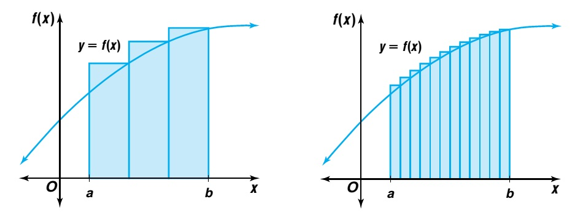
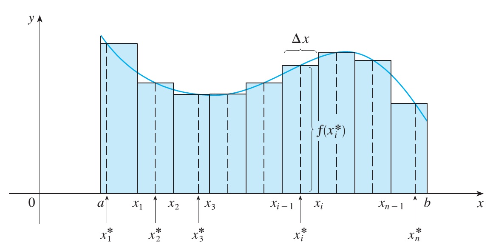
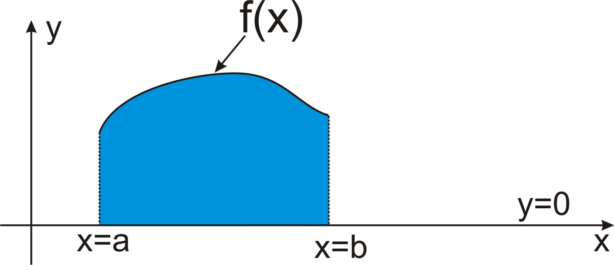
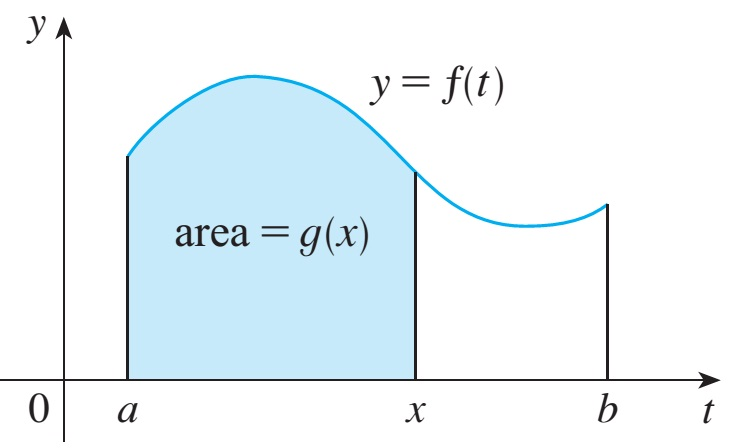

# Integration FoundationsCơ sở tích phân

MT1003 Calculus 1 - Lecture 05
MT1003 Giải tích 1 - Bài giảng 05

Truong-Son Van 
tsvan@hcmut.edu.vn

Topics: antiderivatives, indefinite integrals, substitution, integration by parts, Riemann sums, definite integrals, and the Fundamental Theorem of Calculus.
Chủ đề: nguyên hàm, tích phân bất định, đổi biến, tích phân từng phần, tổng Riemann, tích phân xác định, và định lý cơ bản của giải tích.

---

# Where We AreChúng ta đang ở đâu

From rate to totalTừ tốc độ đến tổng lượng

Derivatives turn a function into a rate of change. Integration starts with the reverse question: if we know the rate, how do we recover the total?
Đạo hàm biến một hàm thành tốc độ thay đổi. Tích phân bắt đầu với câu hỏi ngược: nếu biết tốc độ, làm sao khôi phục tổng lượng?

1<strong>ReverseNgược lại</strong>AntiderivativesNguyên hàm

2<strong>ComputeTính toán</strong>Formulas and substitutionCông thức và đổi biến

3<strong>Undo productGỡ tích</strong>Integration by partsTích phân từng phần

4<strong>AccumulateTích lũy</strong>Riemann sumsTổng Riemann

5<strong>ConnectLiên hệ</strong>FTCĐịnh lý cơ bản

---

# Today's PlanKế hoạch hôm nay

0-20<strong>Antiderivatives</strong> - notation, constants, basic formulas<strong>Nguyên hàm</strong> - ký hiệu, hằng số, công thức cơ bản

20-50<strong>Substitution</strong> - change variables in indefinite integrals<strong>Đổi biến</strong> - đổi biến trong tích phân bất định

50-75<strong>Integration by parts</strong> - reverse the product rule<strong>Tích phân từng phần</strong> - đảo quy tắc tích

75-85<strong>Break</strong><strong>Nghỉ giải lao</strong>

85-120<strong>Definite integrals</strong> - area, Riemann sums, properties<strong>Tích phân xác định</strong> - diện tích, tổng Riemann, tính chất

120-150<strong>Fundamental Theorem</strong> - accumulated area and antiderivatives<strong>Định lý cơ bản</strong> - diện tích tích lũy và nguyên hàm

150-170<strong>Mixed practice</strong> - one indefinite and one definite integral<strong>Luyện tập tổng hợp</strong> - một tích phân bất định và một tích phân xác định

---

# A Rate-To-Total ModelMô hình từ tốc độ đến tổng lượng

Population rateTốc độ dân số

Suppose the rate of world population growth is modeled by
Giả sử tốc độ tăng dân số thế giới được mô hình bởi

$$
p(t)=-0.012t^2+48t-47925
$$

in millions of people per year, where $t$ is the calendar year.
triệu người mỗi năm, trong đó $t$ là năm dương lịch.

QuestionCâu hỏi

If $P(2000)=6000$, find a model for $P(t)$.
Nếu $P(2000)=6000$, hãy tìm mô hình cho $P(t)$.

Key ideaÝ tưởng chính

$P$ is an antiderivative of $p$: $P'(t)=p(t)$.
$P$ là nguyên hàm của $p$: $P'(t)=p(t)$.

---

# AntiderivativesNguyên hàm

DefinitionĐịnh nghĩa

A function $F$ is an antiderivative of $f$ on an interval $I$ if
Hàm $F$ là một nguyên hàm của $f$ trên khoảng $I$ nếu

$$
F'(x)=f(x)\qquad (x\in I).
$$

Many answersNhiều đáp án

If $F'(x)=f(x)$, then $(F(x)+C)'=f(x)$ for every constant $C$.
Nếu $F'(x)=f(x)$, thì $(F(x)+C)'=f(x)$ với mọi hằng số $C$.

ExampleVí dụ

For $f(x)=x^2$, one antiderivative is $\frac{x^3}{3}$, so the general antiderivative is $\frac{x^3}{3}+C$.
Với $f(x)=x^2$, một nguyên hàm là $\frac{x^3}{3}$, nên nguyên hàm tổng quát là $\frac{x^3}{3}+C$.

---

# Indefinite IntegralsTích phân bất định

NotationKý hiệu

$$
\int f(x)\,dx=F(x)+C
$$

means $F'(x)=f(x)$.
nghĩa là $F'(x)=f(x)$.

VocabularyTừ vựng

<ul>
<li>$f(x)$: integrand$f(x)$: hàm dưới dấu tích phân</li>
<li>$dx$: variable of integration$dx$: biến lấy tích phân</li>
<li>$C$: constant of integration$C$: hằng số tích phân</li>
</ul>

Always checkLuôn kiểm tra

Differentiate your answer. If the derivative returns the integrand, the antiderivative is correct.
Hãy đạo hàm đáp án. Nếu đạo hàm trả về hàm dưới dấu tích phân, nguyên hàm là đúng.

---

# Basic FormulasCông thức cơ bản

$$
\int x^\alpha\,dx=\frac{x^{\alpha+1}}{\alpha+1}+C,\quad \alpha\ne-1
$$

$$
\int \frac{dx}{x}=\ln|x|+C
$$

$$
\int e^x\,dx=e^x+C
$$

$$
\int a^x\,dx=\frac{a^x}{\ln a}+C
$$

$$
\int \sin x\,dx=-\cos x+C
$$

$$
\int \cos x\,dx=\sin x+C
$$

$$
\int \frac{dx}{1+x^2}=\arctan x+C
$$

$$
\int \frac{dx}{\sqrt{1-x^2}}=\arcsin x+C
$$

The goal is recognition: choose the formula whose derivative would recreate the integrand.
Mục tiêu là nhận dạng: chọn công thức mà khi đạo hàm sẽ tạo lại hàm dưới dấu tích phân.

---

# Linearity And ScalingTuyến tính và đổi tỉ lệ

Constant multipleNhân hằng số

$$
\int a f(x)\,dx=a\int f(x)\,dx
$$

Sum and differenceTổng và hiệu

$$
\int(f\pm g)\,dx=\int f\,dx\pm\int g\,dx
$$

Linear insideBiểu thức tuyến tính bên trong

If $F'=f$, then
Nếu $F'=f$, thì

$\displaystyle \int f(ax+b)\,dx$ 
$\displaystyle =\frac1aF(ax+b)+C$

ExampleVí dụ

$$
\int \frac{dx}{x^2+a^2}
=\frac1a\arctan\frac{x}{a}+C,\qquad a>0.
$$

Think $t=x/a$, so $dx=a\,dt$.
Đặt $t=x/a$, khi đó $dx=a\,dt$.

---

# SubstitutionĐổi biến

Chain rule in reverseĐảo quy tắc dây chuyền

If $u=u(x)$ and $du=u'(x)\,dx$, then
Nếu $u=u(x)$ và $du=u'(x)\,dx$, thì

$$
\int f(u(x))u'(x)\,dx=\int f(u)\,du=F(u)+C.
$$

When it worksKhi nào dùng được

Look for a composite function and a nearby derivative.
Tìm hàm hợp và đạo hàm của phần trong nằm gần đó.

Mental patternMẫu tư duy

Inside expression becomes $u$; its differential becomes the leftover factor.
Biểu thức bên trong trở thành $u$; vi phân của nó trở thành phần còn lại.

---

# Substitution ExampleVí dụ đổi biến

ComputeTính

$$
\int \sin^3x\cos x\,dx
$$

ChooseChọn

$$
u=\sin x,\qquad du=\cos x\,dx
$$

IntegrateTính tích phân

$$
\begin{aligned}
\int \sin^3x\cos x\,dx
&=\int u^3\,du\\
&=\frac{u^4}{4}+C.
\end{aligned}
$$

Substitute back: $\displaystyle \frac{\sin^4x}{4}+C$.
Thay lại: $\displaystyle \frac{\sin^4x}{4}+C$.

---

# Inverse SubstitutionĐổi biến ngược

When the integrand has geometryKhi hàm dưới dấu tích phân có hình học

Expressions like $\sqrt{a^2-x^2}$ often simplify when $x=a\sin t$.
Biểu thức như $\sqrt{a^2-x^2}$ thường đơn giản hơn khi đặt $x=a\sin t$.

SubstituteĐổi biến

$$
x=a\sin t,\qquad dx=a\cos t\,dt
$$

$$
\sqrt{a^2-x^2}=a\cos t
$$

SimplifyRút gọn

After substitution, use $\cos^2t=\frac{1+\cos2t}{2}$ and then return to $x$.
Sau khi đổi biến, dùng $\cos^2t=\frac{1+\cos2t}{2}$ rồi đổi lại về $x$.

$$
\begin{aligned}
\int\sqrt{a^2-x^2}\,dx
&=\frac{x\sqrt{a^2-x^2}}2\\
&\quad+\frac{a^2}{2}\arcsin\frac{x}{a}+C
\end{aligned}
$$

---

# Integration By PartsTích phân từng phần

Product rule in reverseĐảo quy tắc tích

$$
\frac{d}{dx}(uv)=u\,v'+u'\,v
$$

Integrating both sides gives
Lấy tích phân hai vế cho ta

$$
\boxed{\int u\,dv=uv-\int v\,du.}
$$

Choose $u$Chọn $u$

Usually the factor that becomes simpler after differentiation.
Thường là nhân tử đơn giản hơn sau khi lấy đạo hàm.

Choose $dv$Chọn $dv$

The factor you can integrate cleanly.
Nhân tử mà ta lấy nguyên hàm được gọn.

---

# Parts ExampleVí dụ từng phần

ComputeTính

$$
I=\int x\sin x\,dx
$$

Set upThiết lập

$$
u=x,\quad dv=\sin x\,dx
$$

$$
du=dx,\quad v=-\cos x
$$

Apply formulaÁp dụng công thức

$$
I=x(-\cos x)-\int(-\cos x)\,dx
$$

$$
=-x\cos x+\sin x+C.
$$

---

# Choosing PartsCách chọn từng phần

Good candidatesCác dạng nên nghĩ tới

Integration by parts is especially useful when the integrand is a product and one factor simplifies under differentiation.
Tích phân từng phần đặc biệt hữu ích khi hàm dưới dấu tích phân là tích và một nhân tử đơn giản hơn sau khi lấy đạo hàm.

<ul>
<li>$\displaystyle\int x^k\ln^m x\,dx$</li>
<li>$\displaystyle\int x^k e^{ax}\,dx$</li>
<li>$\displaystyle\int x^k\sin(ax)\,dx$</li>
<li>$\displaystyle\int x^k\cos(ax)\,dx$</li>
</ul>

<ul>
<li>$\displaystyle\int e^{ax}\sin(bx)\,dx$</li>
<li>$\displaystyle\int e^{ax}\cos(bx)\,dx$</li>
<li>$\displaystyle\int \ln x\,dx$ by taking $dv=dx$</li>
</ul>

Rule of thumb: differentiate logs and powers; integrate exponentials and trig when possible.
Kinh nghiệm: đạo hàm log và lũy thừa; lấy nguyên hàm mũ và lượng giác khi có thể.

---

# Definite Integrals: AreaTích phân xác định: diện tích

Area by rectanglesDiện tích bằng hình chữ nhật

Approximate the region under $y=f(x)$ on $[a,b]$ by rectangles, then let the widths shrink to $0$.
Xấp xỉ miền dưới đồ thị $y=f(x)$ trên $[a,b]$ bằng các hình chữ nhật, rồi cho bề rộng tiến về $0$.

$$
\int_a^b f(x)\,dx
=\lim_{n\to\infty}\sum_{i=1}^n f(x_i^*)\,\Delta x
$$

---

# Riemann Sum SetupThiết lập tổng Riemann

PartitionChia khoảng

$$
\Delta x=\frac{b-a}{n},\qquad x_i=a+i\Delta x.
$$

Choose sample points $x_i^*\in[x_{i-1},x_i]$.
Chọn điểm mẫu $x_i^*\in[x_{i-1},x_i]$.

ApproximationXấp xỉ

$$
A_n=\sum_{i=1}^{n}f(x_i^*)\Delta x
$$

---

# Riemann Sum ExampleVí dụ tổng Riemann

Compute by the definitionTính bằng định nghĩa

$$
\int_0^1 x^2\,dx
$$

Right endpointsĐầu mút phải

$$
\Delta x=\frac1n,\qquad x_i^*=\frac{i}{n}
$$

$$
\sum_{i=1}^n\left(\frac{i}{n}\right)^2\frac1n
=\frac{1^2+2^2+\cdots+n^2}{n^3}
$$

LimitGiới hạn

Use $S_n=1^2+\cdots+n^2$ with
Dùng $S_n=1^2+\cdots+n^2$ với

$$
S_n=\frac{n(n+1)(2n+1)}6.
$$

$$
\int_0^1x^2\,dx=\frac13.
$$

---

# Meaning And PropertiesÝ nghĩa và tính chất

Geometric meaningÝ nghĩa hình học

If $f(x)\ge0$ on $[a,b]$, then $\int_a^b f(x)\,dx$ is the area under the curve.
Nếu $f(x)\ge0$ trên $[a,b]$, thì $\int_a^b f(x)\,dx$ là diện tích dưới đồ thị.

<ul>
<li>$\displaystyle \int_a^a f(x)\,dx=0$</li>
<li>$\displaystyle \int_b^a f(x)\,dx=-\int_a^b f(x)\,dx$</li>
<li>$\displaystyle \int_a^b f=\int_a^c f+\int_c^b f$</li>
</ul>

---

# Fundamental Theorem IĐịnh lý cơ bản I

Accumulation functionHàm tích lũy

If $f$ is continuous on $[a,b]$ and
Nếu $f$ liên tục trên $[a,b]$ và

$$
g(x)=\int_a^x f(t)\,dt,
$$

then $g'(x)=f(x)$ on $(a,b)$.
thì $g'(x)=f(x)$ trên $(a,b)$.

The derivative of accumulated area is the height of the curve at the moving boundary.
Đạo hàm của diện tích tích lũy là chiều cao của đồ thị tại biên đang di chuyển.

---

# Fundamental Theorem IIĐịnh lý cơ bản II

Newton-Leibniz formulaCông thức Newton-Leibniz

If $F'(x)=f(x)$ and $f$ is continuous on $[a,b]$, then
Nếu $F'(x)=f(x)$ và $f$ liên tục trên $[a,b]$, thì

$$
\boxed{\int_a^b f(x)\,dx=F(b)-F(a).}
$$

ExampleVí dụ

$$
\int_{\pi/6}^{\pi/4}\frac{dx}{\cos^2x}
=\tan x\Big|_{\pi/6}^{\pi/4}
$$

ValueGiá trị

$$
=\tan\frac{\pi}{4}-\tan\frac{\pi}{6}
=1-\frac{\sqrt3}{3}.
$$

---

# Definite SubstitutionĐổi biến trong tích phân xác định

Change limits tooĐổi cả cận

$$
\int_a^b f(u(x))u'(x)\,dx=\int_{u(a)}^{u(b)} f(u)\,du.
$$

ExampleVí dụ

$$
\int_1^e\frac{\ln^2x}{x}\,dx
$$

Let $u=\ln x$, so $du=\frac{dx}{x}$; the limits change from $x=1,e$ to $u=0,1$.
Đặt $u=\ln x$, nên $du=\frac{dx}{x}$; cận đổi từ $x=1,e$ thành $u=0,1$.

$$
\int_0^1u^2\,du=\frac13.
$$

---

# Definite Integration By PartsTừng phần cho tích phân xác định

FormulaCông thức

$$
\int_a^b u\,dv=uv\Big|_a^b-\int_a^b v\,du.
$$

Example setupThiết lập ví dụ

$$
I=\int_0^1 xe^{-x}\,dx
$$

$$
u=x,\quad dv=e^{-x}\,dx
$$

ComputeTính

$$
du=dx,\quad v=-e^{-x}
$$

$$
\begin{aligned}
I&=-xe^{-x}\Big|_0^1+\int_0^1e^{-x}\,dx\\
&=1-\frac2e.
\end{aligned}
$$

---

# Symmetry ShortcutMẹo đối xứng

On $[-a,a]$Trên $[-a,a]$

If $f$ is odd,Nếu $f$ là hàm lẻ,

$$
\int_{-a}^{a}f(x)\,dx=0.
$$

If $f$ is even,Nếu $f$ là hàm chẵn,

$$
\int_{-a}^{a}f(x)\,dx=2\int_0^a f(x)\,dx.
$$

Fast readNhìn nhanh

Before computing on a symmetric interval, test $f(-x)$.
Trước khi tính trên khoảng đối xứng, hãy kiểm tra $f(-x)$.

---

# Your Turn A: AntiderivativesĐến lượt bạn A: nguyên hàm

6 min

Basic formulasCông thức cơ bản

<ol>
<li>$\displaystyle \int\left(3x^2-\frac{4}{x}+2e^x\right)\,dx$</li>
<li>$\displaystyle \int\left(\cos x+\frac{1}{1+x^2}\right)\,dx$</li>
</ol>

6 min

SubstitutionĐổi biến

<ol>
<li>$\displaystyle \int x(1+x^2)^5\,dx$</li>
<li>$\displaystyle \int \frac{\ln^2x}{x}\,dx$</li>
</ol>

Check every answer by differentiating.
Kiểm tra từng đáp án bằng cách đạo hàm.

---

# Your Turn B: PartsĐến lượt bạn B: từng phần

8 min

Choose $u$ and $dv$Chọn $u$ và $dv$

$$
\int x\cos x\,dx
$$

Which factor should become simpler?
Nhân tử nào nên trở nên đơn giản hơn?

8 min

LogarithmLogarit

$$
\int \ln x\,dx
$$

Hint: take $dv=dx$.
Gợi ý: chọn $dv=dx$.

---

# Your Turn C: Definite IntegralsĐến lượt bạn C: tích phân xác định

8 min

FTCĐịnh lý cơ bản

$$
\int_0^2(3x^2-4x+1)\,dx
$$

8 min

SubstitutionĐổi biến

$$
\int_0^2 x\sqrt{4+x^2}\,dx
$$

8 min

SymmetryĐối xứng

$$
\int_{-1}^{1}\frac{x^3}{1+x^2}\,dx
$$

8 min

PartsTừng phần

$$
\int_0^1 xe^{-x}\,dx
$$

---

# Wrap-UpTổng kết

Today’s toolsCông cụ hôm nay

<ul>
<li>Antiderivatives and the constant $C$Nguyên hàm và hằng số $C$</li>
<li>Substitution for composite functionsĐổi biến cho hàm hợp</li>
<li>Integration by parts for productsTích phân từng phần cho tích</li>
<li>Riemann sums as accumulated areaTổng Riemann như diện tích tích lũy</li>
<li>FTC: definite integrals from antiderivativesĐịnh lý cơ bản: tính tích phân xác định bằng nguyên hàm</li>
</ul>

Next lectureBài giảng tiếp theo

We move into more integration techniques: rational functions, radicals, and trigonometric integrals.
Ta chuyển sang các kỹ thuật tích phân nâng cao hơn: hàm hữu tỷ, căn thức, và tích phân lượng giác.

Review by differentiating indefinite answers and by matching definite-integral problems to the most efficient method.
Ôn tập bằng cách đạo hàm đáp án bất định và ghép bài tích phân xác định với phương pháp hiệu quả nhất.

