# Applications of IntegrationỨng dụng tích phân

MT1003 Calculus 1 - Lecture 06
MT1003 Giải tích 1 - Bài giảng 06

Truong-Son Van 
tsvan@hcmut.edu.vn

Reading map: <a href="../../readings/">course readings</a>. Main lecture source: Active Calculus; student reading/practice: OpenStax and Stewart.
Bản đồ đọc: <a href="../../readings/">tài liệu đọc của môn</a>. Nguồn chính: Active Calculus; đọc và luyện tập: OpenStax và Stewart.

---

# From Total To GeometryTừ tổng lượng đến hình học

One idea, many objectsMột ý tưởng, nhiều đại lượng

A definite integral adds tiny pieces. Today each tiny piece has a geometric meaning: height times width, area times thickness, circumference times thickness, or length times radius.
Tích phân xác định cộng các phần rất nhỏ. Hôm nay mỗi phần nhỏ mang ý nghĩa hình học: cao nhân rộng, diện tích nhân độ dày, chu vi nhân độ dày, hoặc độ dài nhân bán kính.

<strong>AreaDiện tích</strong>$dA\approx h\,dx$

<strong>VolumeThể tích</strong>$dV\approx A(x)\,dx$

<strong>Arc lengthĐộ dài cung</strong>$ds=\sqrt{1+(y')^2}\,dx$

<strong>SurfaceDiện tích mặt</strong>$dS\approx 2\pi r\,ds$

Read: <a href="https://activecalculus.org/single/sec-6-1-area.html">Active Calculus 6.1</a>-<a href="https://activecalculus.org/single/sec-6-2-volume.html">6.2</a>; <a href="https://openstax.org/books/calculus-volume-1/pages/6-1-areas-between-curves">OpenStax Vol 1, 6.1</a>-<a href="https://openstax.org/books/calculus-volume-1/pages/6-4-arc-length-of-a-curve-and-surface-area">6.4</a>; Stewart 6.1-6.5, 8.1-8.4.
Đọc: <a href="https://activecalculus.org/single/sec-6-1-area.html">Active Calculus 6.1</a>-<a href="https://activecalculus.org/single/sec-6-2-volume.html">6.2</a>; <a href="https://openstax.org/books/calculus-volume-1/pages/6-1-areas-between-curves">OpenStax Tập 1, 6.1</a>-<a href="https://openstax.org/books/calculus-volume-1/pages/6-4-arc-length-of-a-curve-and-surface-area">6.4</a>; Stewart 6.1-6.5, 8.1-8.4.

---

# Today's PlanKế hoạch hôm nay

0-25<strong>Areas</strong> - area under a curve and area between curves<strong>Diện tích</strong> - diện tích dưới đồ thị và giữa hai đường cong

25-70<strong>Volumes</strong> - slicing, disks, washers, and shells<strong>Thể tích</strong> - lát cắt, đĩa, vòng đệm, và vỏ trụ

70-80<strong>Break</strong><strong>Nghỉ giải lao</strong>

80-115<strong>Arc length</strong> - build length from small line segments<strong>Độ dài cung</strong> - xây dựng độ dài từ các đoạn thẳng nhỏ

115-135<strong>Surface area</strong> - rotate a curve and add frustums<strong>Diện tích mặt</strong> - quay đường cong và cộng các nón cụt

135-155<strong>Physical/economic models</strong> - work, pressure, present value, surplus<strong>Mô hình vật lý/kinh tế</strong> - công, áp lực, hiện giá, thặng dư

155-170<strong>Exercise lab</strong> - setup first, compute second<strong>Luyện tập</strong> - thiết lập trước, tính sau

Session 9 reading map: Active Calculus 6.1, 6.2, 6.4; OpenStax Vol 1, 6.1-6.6; Stewart 6.1-6.5, 8.1-8.4.
Bản đồ đọc Buổi 9: Active Calculus 6.1, 6.2, 6.4; OpenStax Tập 1, 6.1-6.6; Stewart 6.1-6.5, 8.1-8.4.

---
class: compact
---

# Area Under A CurveDiện tích dưới đồ thị

Signed height, positive areaChiều cao có dấu, diện tích dương

If $f$ is integrable on $[a,b]$, the area between $y=f(x)$ and the $x$-axis is
Nếu $f$ khả tích trên $[a,b]$, diện tích giữa $y=f(x)$ và trục $x$ là

$$
A=\int_a^b |f(x)|\,dx.
$$

Watch the signChú ý dấu

If the graph crosses the $x$-axis, split the interval at the zeros.
Nếu đồ thị cắt trục $x$, hãy chia khoảng tại các nghiệm.

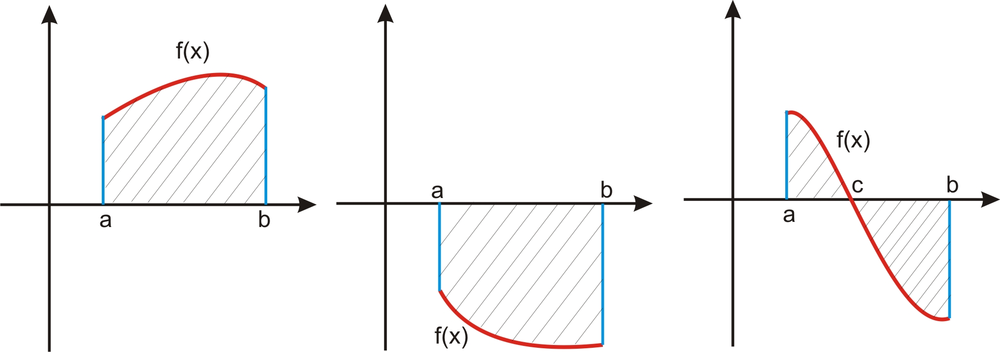

Read: <a href="https://activecalculus.org/single/sec-6-1-area.html">Active Calculus 6.1</a>; <a href="https://openstax.org/books/calculus-volume-1/pages/6-1-areas-between-curves">OpenStax Vol 1, 6.1</a>; extra practice: Stewart 6.1.
Đọc: <a href="https://activecalculus.org/single/sec-6-1-area.html">Active Calculus 6.1</a>; <a href="https://openstax.org/books/calculus-volume-1/pages/6-1-areas-between-curves">OpenStax Tập 1, 6.1</a>; luyện thêm: Stewart 6.1.

---

# Example: Area With The AxisVí dụ: diện tích với trục hoành

Find the areaTìm diện tích

Region bounded by $y=4x-x^2$ and the $x$-axis.
Miền giới hạn bởi $y=4x-x^2$ và trục $x$.

Set upThiết lập

$$
4x-x^2=x(4-x)=0
$$

$$
A=\int_0^4(4x-x^2)\,dx
$$

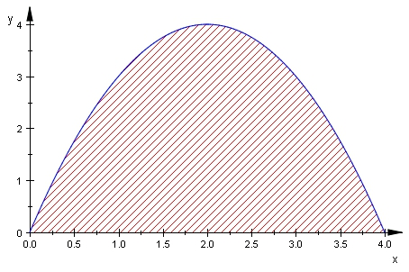

$$
A=\left[2x^2-\frac{x^3}{3}\right]_0^4=\frac{32}{3}.
$$

Area with the axis: <a href="https://activecalculus.org/single/sec-6-1-area.html">Active Calculus 6.1</a>; <a href="https://openstax.org/books/calculus-volume-1/pages/6-1-areas-between-curves">OpenStax Vol 1, 6.1</a>; Stewart 6.1.
Diện tích với trục tọa độ: <a href="https://activecalculus.org/single/sec-6-1-area.html">Active Calculus 6.1</a>; <a href="https://openstax.org/books/calculus-volume-1/pages/6-1-areas-between-curves">OpenStax Tập 1, 6.1</a>; Stewart 6.1.

---
class: compact
---

# Area Between CurvesDiện tích giữa hai đường cong

Top minus bottomTrên trừ dưới

$$
A=\int_a^b |f(x)-g(x)|\,dx.
$$

If $f(x)\ge g(x)$ on the interval, this becomes
Nếu $f(x)\ge g(x)$ trên khoảng, công thức trở thành

$$
A=\int_a^b\big(f(x)-g(x)\big)\,dx.
$$

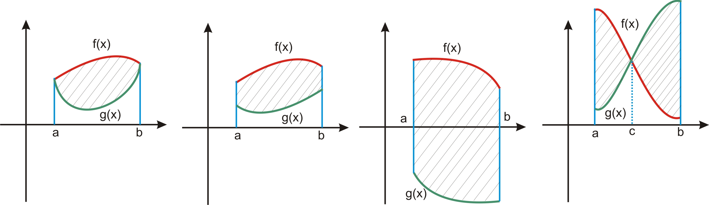

WorkflowQuy trình

Find intersections, decide which curve is on top, integrate the difference.
Tìm giao điểm, xác định đường nào ở trên, rồi tích phân hiệu.

Read: <a href="https://activecalculus.org/single/sec-6-1-area.html">Active Calculus 6.1</a>; <a href="https://openstax.org/books/calculus-volume-1/pages/6-1-areas-between-curves">OpenStax Vol 1, 6.1</a>; extra practice: Stewart 6.1.
Đọc: <a href="https://activecalculus.org/single/sec-6-1-area.html">Active Calculus 6.1</a>; <a href="https://openstax.org/books/calculus-volume-1/pages/6-1-areas-between-curves">OpenStax Tập 1, 6.1</a>; luyện thêm: Stewart 6.1.

---

# Example: Two CurvesVí dụ: hai đường cong

Find the enclosed areaTìm diện tích miền kín

$$
y=3-x,\qquad y=x^2-9.
$$

IntersectionsGiao điểm

$$
3-x=x^2-9
$$

$$
(x-3)(x+4)=0.
$$

$$
A=\int_{-4}^{3}(-x^2-x+12)\,dx=\frac{343}{6}.
$$

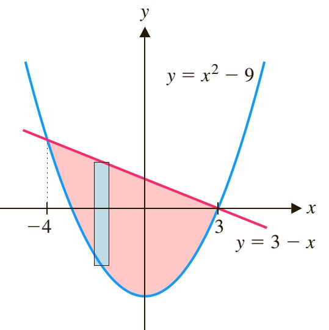

Practice source pattern: area-between-curves examples from <a href="https://activecalculus.org/single/sec-6-1-area.html">Active Calculus 6.1</a>, <a href="https://openstax.org/books/calculus-volume-1/pages/6-1-areas-between-curves">OpenStax 6.1</a>, and Stewart 6.1.
Dạng luyện tập: ví dụ diện tích giữa hai đường cong từ <a href="https://activecalculus.org/single/sec-6-1-area.html">Active Calculus 6.1</a>, <a href="https://openstax.org/books/calculus-volume-1/pages/6-1-areas-between-curves">OpenStax 6.1</a>, và Stewart 6.1.

---
class: compact exercise-heavy
---

# Your Turn: AreaTự luyện: diện tích

A1

Find the area enclosed by
Tìm diện tích miền kín bởi

$$
y=(x-1)^2,\qquad x^2-\frac{y^2}{2}=1.
$$

A2

Find the area enclosed by
Tìm diện tích miền kín bởi

$$
y=x-x^2,\qquad y=x\sqrt{1-x}.
$$

Setup hintsGợi ý thiết lập

A1 intersects at $x=1,3$; A2 intersects at $x=0,1$.
A1 giao tại $x=1,3$; A2 giao tại $x=0,1$.

AnswersĐáp số

$A_1=\displaystyle \frac{10}{3}-\frac{\sqrt2}{2}\ln(3+\sqrt8)$ 
$A_2=\displaystyle \frac{1}{10}$

Area practice: <a href="https://activecalculus.org/single/sec-6-1-area.html">Active Calculus 6.1</a>; <a href="https://openstax.org/books/calculus-volume-1/pages/6-1-areas-between-curves">OpenStax Vol 1, 6.1</a>; Stewart 6.1.
Luyện diện tích: <a href="https://activecalculus.org/single/sec-6-1-area.html">Active Calculus 6.1</a>; <a href="https://openstax.org/books/calculus-volume-1/pages/6-1-areas-between-curves">OpenStax Tập 1, 6.1</a>; Stewart 6.1.

---
class: compact
---

# Volume By SlicingThể tích bằng lát cắt

Slice the solidCắt vật thể

If a cross section perpendicular to the $x$-axis has area $A(x)$, then one thin slice has volume approximately $A(x)\,dx$.
Nếu lát cắt vuông góc trục $x$ có diện tích $A(x)$, thì một lát mỏng có thể tích xấp xỉ $A(x)\,dx$.

$$
V=\int_a^b A(x)\,dx.
$$

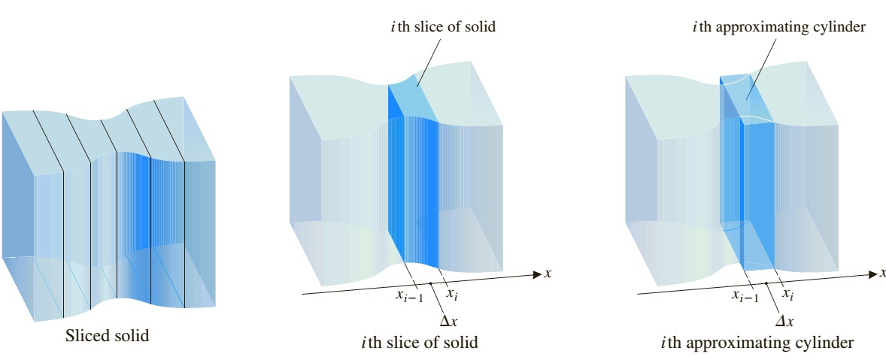

Read: <a href="https://activecalculus.org/single/sec-6-2-volume.html">Active Calculus 6.2</a>; <a href="https://openstax.org/books/calculus-volume-1/pages/6-2-determining-volumes-by-slicing">OpenStax Vol 1, 6.2</a>; extra practice: Stewart 6.2.
Đọc: <a href="https://activecalculus.org/single/sec-6-2-volume.html">Active Calculus 6.2</a>; <a href="https://openstax.org/books/calculus-volume-1/pages/6-2-determining-volumes-by-slicing">OpenStax Tập 1, 6.2</a>; luyện thêm: Stewart 6.2.

---

# Example: Volume Of A SphereVí dụ: thể tích hình cầu

Radius $r$Bán kính $r$

At position $x$, the circular cross section has radius $\sqrt{r^2-x^2}$.
Tại vị trí $x$, lát cắt tròn có bán kính $\sqrt{r^2-x^2}$.

Cross-section areaDiện tích lát cắt

$$
A(x)=\pi(r^2-x^2)
$$

$$
V=\int_{-r}^r A(x)\,dx=\frac{4}{3}\pi r^3.
$$

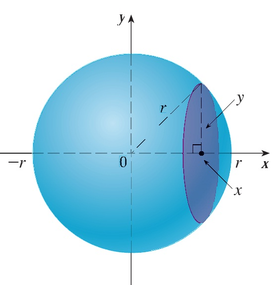

Slicing model: <a href="https://activecalculus.org/single/sec-6-2-volume.html">Active Calculus 6.2</a>; <a href="https://openstax.org/books/calculus-volume-1/pages/6-2-determining-volumes-by-slicing">OpenStax Vol 1, 6.2</a>; Stewart 6.2.
Mô hình lát cắt: <a href="https://activecalculus.org/single/sec-6-2-volume.html">Active Calculus 6.2</a>; <a href="https://openstax.org/books/calculus-volume-1/pages/6-2-determining-volumes-by-slicing">OpenStax Tập 1, 6.2</a>; Stewart 6.2.

---
class: compact
---

# Disks And WashersPhương pháp đĩa và vòng đệm

Rotate about the $x$-axisQuay quanh trục $x$

$$
V=\pi\int_a^b R(x)^2\,dx.
$$

With a hole, subtract the inner radius:
Nếu có lỗ, trừ bán kính trong:

$$
V=\pi\int_a^b\big(R(x)^2-r(x)^2\big)\,dx.
$$

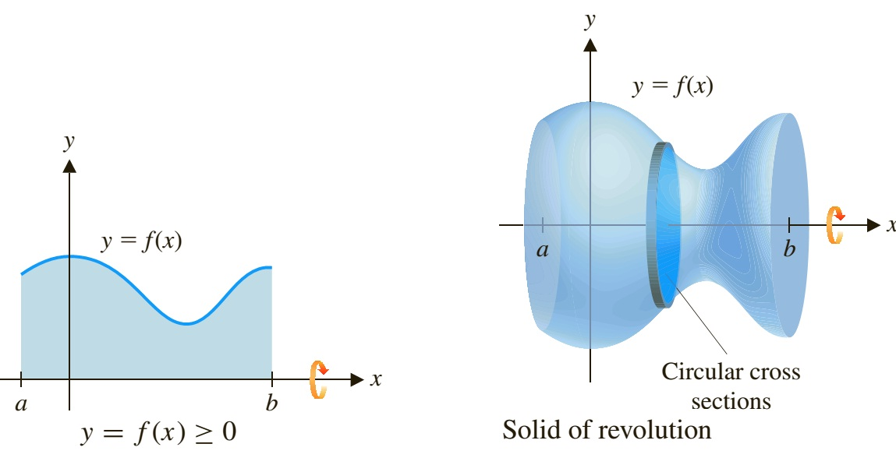

Choose slices perpendicular to the axis of rotation. Read: <a href="https://activecalculus.org/single/sec-6-2-volume.html">Active Calculus 6.2</a>; <a href="https://openstax.org/books/calculus-volume-1/pages/6-2-determining-volumes-by-slicing">OpenStax 6.2</a>; Stewart 6.2.
Chọn lát cắt vuông góc với trục quay. Đọc: <a href="https://activecalculus.org/single/sec-6-2-volume.html">Active Calculus 6.2</a>; <a href="https://openstax.org/books/calculus-volume-1/pages/6-2-determining-volumes-by-slicing">OpenStax 6.2</a>; Stewart 6.2.

---

# Example: Disk MethodVí dụ: phương pháp đĩa

RevolveQuay miền

The region under $y=\sqrt{x}$ on $[0,4]$ about the $x$-axis.
Miền dưới $y=\sqrt{x}$ trên $[0,4]$ quanh trục $x$.

$$
V=\pi\int_0^4(\sqrt{x})^2\,dx
=\pi\int_0^4 x\,dx=8\pi.
$$

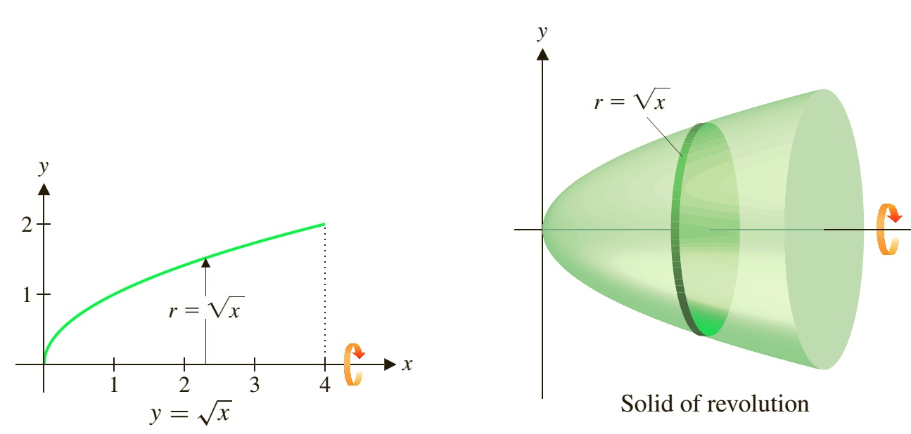

Disk/washer practice: <a href="https://activecalculus.org/single/sec-6-2-volume.html">Active Calculus 6.2</a>; <a href="https://openstax.org/books/calculus-volume-1/pages/6-2-determining-volumes-by-slicing">OpenStax Vol 1, 6.2</a>; Stewart 6.2.
Luyện đĩa/vòng đệm: <a href="https://activecalculus.org/single/sec-6-2-volume.html">Active Calculus 6.2</a>; <a href="https://openstax.org/books/calculus-volume-1/pages/6-2-determining-volumes-by-slicing">OpenStax Tập 1, 6.2</a>; Stewart 6.2.

---
class: compact
---

# Rotate About The $y$-AxisQuay quanh trục $y$

Horizontal disksĐĩa ngang

If $x=g(y)\ge0$ on $[c,d]$, rotating about the $y$-axis gives
Nếu $x=g(y)\ge0$ trên $[c,d]$, quay quanh trục $y$ cho

$$
V=\pi\int_c^d g(y)^2\,dy.
$$

Example setupThiết lập ví dụ

For $y=4-x^2$, use $x=\sqrt{4-y}$ and $1\le y\le4$.
Với $y=4-x^2$, dùng $x=\sqrt{4-y}$ và $1\le y\le4$.

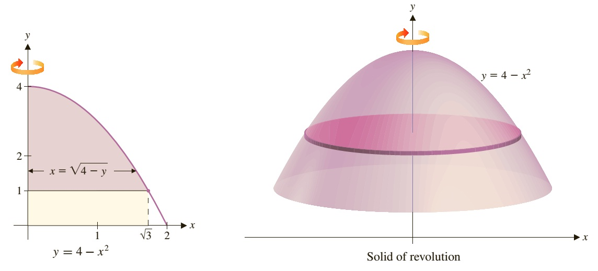

$$
V=\pi\int_1^4(4-y)\,dy=\frac{9\pi}{2}.
$$

Horizontal slicing: <a href="https://activecalculus.org/single/sec-6-2-volume.html">Active Calculus 6.2</a>; <a href="https://openstax.org/books/calculus-volume-1/pages/6-2-determining-volumes-by-slicing">OpenStax Vol 1, 6.2</a>; Stewart 6.2.
Lát cắt ngang: <a href="https://activecalculus.org/single/sec-6-2-volume.html">Active Calculus 6.2</a>; <a href="https://openstax.org/books/calculus-volume-1/pages/6-2-determining-volumes-by-slicing">OpenStax Tập 1, 6.2</a>; Stewart 6.2.

---
class: compact
---

# Cylindrical ShellsPhương pháp vỏ trụ

Thin shellVỏ trụ mỏng

A rectangle at $x$ with height $f(x)$ rotates about the $y$-axis into a shell.
Một hình chữ nhật tại $x$ có chiều cao $f(x)$ quay quanh trục $y$ thành vỏ trụ.

$$
dV\approx 2\pi x f(x)\,dx,
\qquad
V=2\pi\int_a^b x f(x)\,dx.
$$

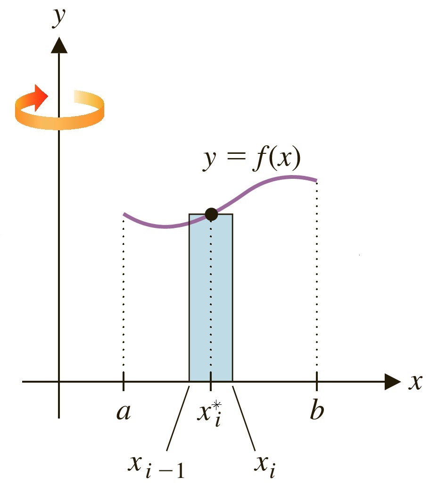
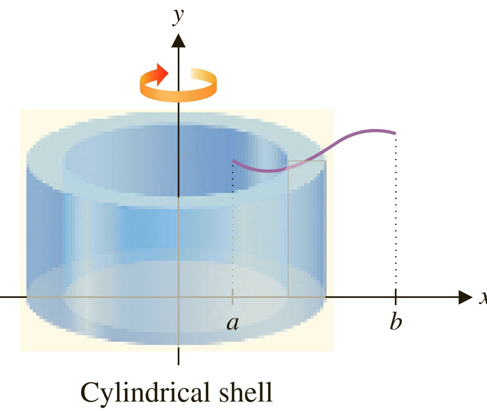
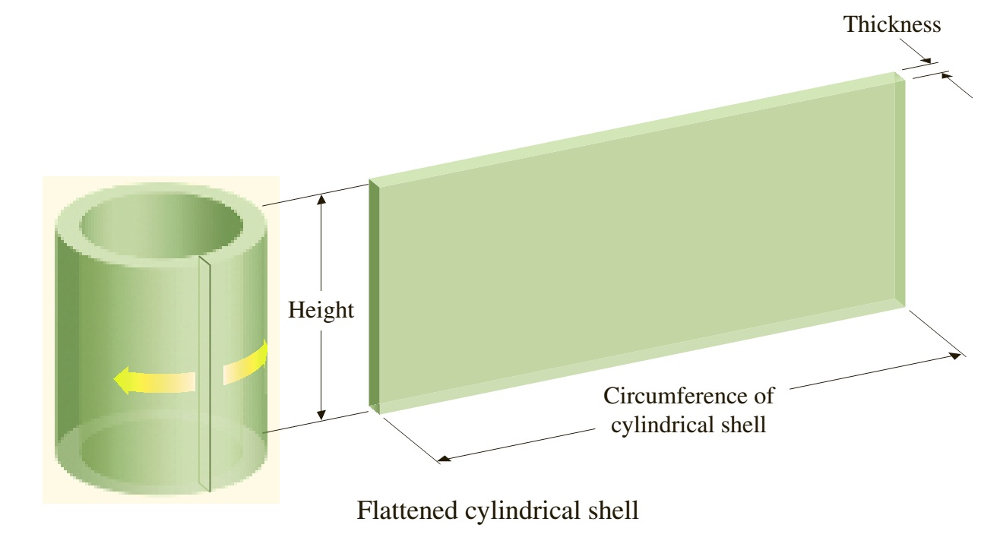

Shell method: <a href="https://activecalculus.org/single/sec-6-2-volume.html">Active Calculus 6.2</a>; <a href="https://openstax.org/books/calculus-volume-1/pages/6-3-volumes-of-revolution-cylindrical-shells">OpenStax Vol 1, 6.3</a>; Stewart 6.3.
Phương pháp vỏ trụ: <a href="https://activecalculus.org/single/sec-6-2-volume.html">Active Calculus 6.2</a>; <a href="https://openstax.org/books/calculus-volume-1/pages/6-3-volumes-of-revolution-cylindrical-shells">OpenStax Tập 1, 6.3</a>; Stewart 6.3.

---

# Example: Shells vs WashersVí dụ: vỏ trụ và vòng đệm

RegionMiền phẳng

Bounded by $y=x^2$, $x=1$, $x=2$, and $y=0$; rotate about the $y$-axis.
Giới hạn bởi $y=x^2$, $x=1$, $x=2$, và $y=0$; quay quanh trục $y$.

$$
V=2\pi\int_1^2 x\cdot x^2\,dx
=2\pi\left[\frac{x^4}{4}\right]_1^2
=\frac{15\pi}{2}.
$$

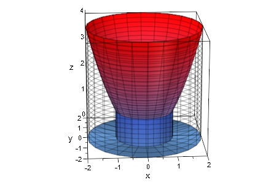

Compare methods: <a href="https://activecalculus.org/single/sec-6-2-volume.html">Active Calculus 6.2</a>; <a href="https://openstax.org/books/calculus-volume-1/pages/6-3-volumes-of-revolution-cylindrical-shells">OpenStax Vol 1, 6.3</a>; Stewart 6.2-6.3.
So sánh phương pháp: <a href="https://activecalculus.org/single/sec-6-2-volume.html">Active Calculus 6.2</a>; <a href="https://openstax.org/books/calculus-volume-1/pages/6-3-volumes-of-revolution-cylindrical-shells">OpenStax Tập 1, 6.3</a>; Stewart 6.2-6.3.

---
class: compact exercise-heavy
---

# Your Turn: VolumesTự luyện: thể tích

V1

Rotate $y^2=(x-1)^3$, $1\le x\le2$, about the $x$-axis.
Quay $y^2=(x-1)^3$, $1\le x\le2$, quanh trục $x$.

V2

Rotate the region bounded by $y=x^2$, $y=0$, $x+y=2$ about the $x$-axis.
Quay miền giới hạn bởi $y=x^2$, $y=0$, $x+y=2$ quanh trục $x$.

V3

Rotate the region under $y=4-x^2$ above $y=1$, $0\le x\le\sqrt3$, about the $y$-axis.
Quay miền dưới $y=4-x^2$ và trên $y=1$, $0\le x\le\sqrt3$, quanh trục $y$.

V4

Use shells for the region under $y=x^2$, $1\le x\le2$, about the $y$-axis.
Dùng vỏ trụ cho miền dưới $y=x^2$, $1\le x\le2$, quanh trục $y$.

AnswersĐáp số

V1: $\pi/4$ &nbsp; 
V2: $8\pi/15$ &nbsp; 
V3: $9\pi/2$ &nbsp; 
V4: $15\pi/2$

Volume practice: <a href="https://activecalculus.org/single/sec-6-2-volume.html">Active Calculus 6.2</a>; <a href="https://openstax.org/books/calculus-volume-1/pages/6-2-determining-volumes-by-slicing">OpenStax 6.2</a>-<a href="https://openstax.org/books/calculus-volume-1/pages/6-3-volumes-of-revolution-cylindrical-shells">6.3</a>; Stewart 6.2-6.3.
Luyện thể tích: <a href="https://activecalculus.org/single/sec-6-2-volume.html">Active Calculus 6.2</a>; <a href="https://openstax.org/books/calculus-volume-1/pages/6-2-determining-volumes-by-slicing">OpenStax 6.2</a>-<a href="https://openstax.org/books/calculus-volume-1/pages/6-3-volumes-of-revolution-cylindrical-shells">6.3</a>; Stewart 6.2-6.3.

---
class: compact
---

# Arc LengthĐộ dài cung

Small line segmentĐoạn thẳng nhỏ

Approximate each tiny piece of the curve by a line segment.
Xấp xỉ mỗi phần nhỏ của đường cong bằng một đoạn thẳng.

$$
ds=\sqrt{dx^2+dy^2}
$$

$$
ds=\sqrt{1+\left(\frac{dy}{dx}\right)^2}\,dx
$$

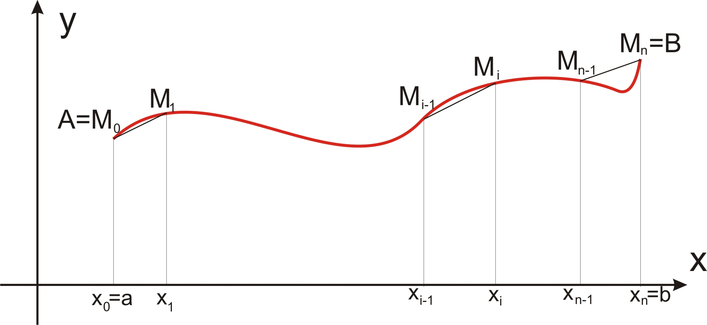

$$
L=\int_a^b\sqrt{1+\big(f'(x)\big)^2}\,dx.
$$

Arc length: <a href="https://openstax.org/books/calculus-volume-1/pages/6-4-arc-length-of-a-curve-and-surface-area">OpenStax Vol 1, 6.4</a>; extra practice: Stewart 8.1-8.4; see the <a href="../../readings/">reading map</a>.
Độ dài cung: <a href="https://openstax.org/books/calculus-volume-1/pages/6-4-arc-length-of-a-curve-and-surface-area">OpenStax Tập 1, 6.4</a>; luyện thêm: Stewart 8.1-8.4; xem <a href="../../readings/">bản đồ đọc</a>.

---

# Example: Arc LengthVí dụ: độ dài cung

Find the lengthTìm độ dài

$$
y=\frac{x^2}{2}-\frac{\ln x}{4},\qquad 1\le x\le3.
$$

DerivativeĐạo hàm

$$
y'=x-\frac{1}{4x}
$$

$$
\sqrt{1+(y')^2}=x+\frac{1}{4x}.
$$

$$
L=\int_1^3\left(x+\frac{1}{4x}\right)\,dx
=4+\frac14\ln3.
$$

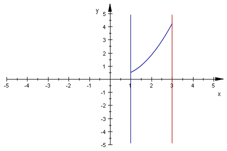

Arc length examples: <a href="https://openstax.org/books/calculus-volume-1/pages/6-4-arc-length-of-a-curve-and-surface-area">OpenStax Vol 1, 6.4</a>; extra practice: Stewart 8.1-8.4.
Ví dụ độ dài cung: <a href="https://openstax.org/books/calculus-volume-1/pages/6-4-arc-length-of-a-curve-and-surface-area">OpenStax Tập 1, 6.4</a>; luyện thêm: Stewart 8.1-8.4.

---
class: compact exercise-heavy
---

# Your Turn: Arc LengthTự luyện: độ dài cung

L1

Find the length of
Tìm độ dài của

$$
y=\frac{x^3}{12}+\frac1x,\qquad 1\le x\le4.
$$

L2

Find the length of
Tìm độ dài của

$$
y=\ln(1-x^2),\qquad -\frac12\le x\le\frac12.
$$

HintGợi ý

Both are chosen so the square root simplifies exactly.
Cả hai bài đều được chọn để căn bậc hai rút gọn đẹp.

AnswersĐáp số

L1: $6$ 
L2: $2\ln3-1$

Arc length practice: <a href="https://openstax.org/books/calculus-volume-1/pages/6-4-arc-length-of-a-curve-and-surface-area">OpenStax Vol 1, 6.4</a>; Stewart 8.1-8.4.
Luyện độ dài cung: <a href="https://openstax.org/books/calculus-volume-1/pages/6-4-arc-length-of-a-curve-and-surface-area">OpenStax Tập 1, 6.4</a>; Stewart 8.1-8.4.

---
class: compact
---

# Surface Area Of RevolutionDiện tích mặt tròn xoay

Unroll the surfaceTrải mặt ra

A small arc segment of length $ds$ rotating with radius $r$ sweeps out area approximately $2\pi r\,ds$.
Một đoạn cung nhỏ dài $ds$ quay với bán kính $r$ quét diện tích xấp xỉ $2\pi r\,ds$.

$$
S=2\pi\int_a^b f(x)\sqrt{1+\big(f'(x)\big)^2}\,dx
$$

for rotation about the $x$-axis.
khi quay quanh trục $x$.

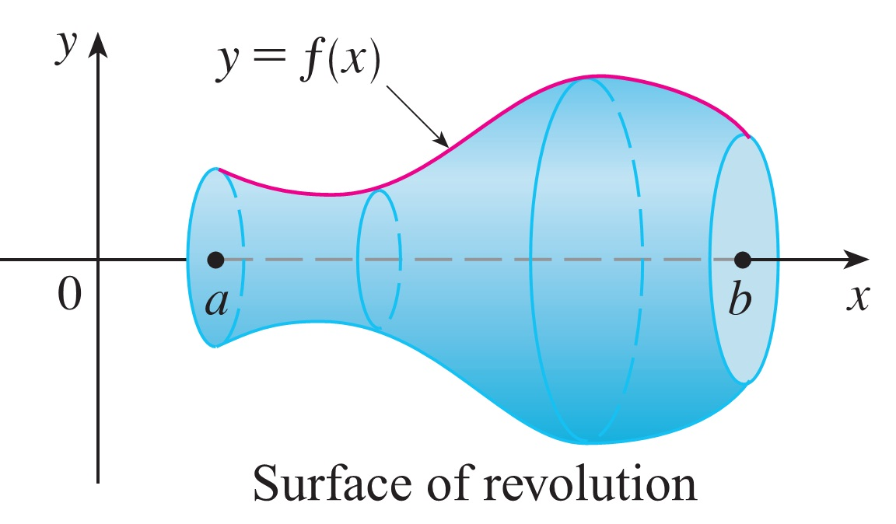

Surface area: <a href="https://openstax.org/books/calculus-volume-1/pages/6-4-arc-length-of-a-curve-and-surface-area">OpenStax Vol 1, 6.4</a>; extra practice: Stewart 8.1-8.4.
Diện tích mặt: <a href="https://openstax.org/books/calculus-volume-1/pages/6-4-arc-length-of-a-curve-and-surface-area">OpenStax Tập 1, 6.4</a>; luyện thêm: Stewart 8.1-8.4.

---

# Example: Surface AreaVí dụ: diện tích mặt

Rotate about the $x$-axisQuay quanh trục $x$

$$
y=\sin 2x,\qquad 0\le x\le\frac{\pi}{2}.
$$

Set upThiết lập

$$
y'=2\cos2x
$$

$$
S=2\pi\int_0^{\pi/2}\sin2x\sqrt{1+4\cos^2 2x}\,dx.
$$

SubstituteĐổi biến

$$
t=2\cos2x,\qquad dt=-4\sin2x\,dx
$$

$$
S=\pi\int_0^2\sqrt{1+t^2}\,dt.
$$

$$
S=\pi\left(\sqrt5+\frac12\ln(2+\sqrt5)\right).
$$

Surface-area setup: <a href="https://openstax.org/books/calculus-volume-1/pages/6-4-arc-length-of-a-curve-and-surface-area">OpenStax Vol 1, 6.4</a>; Stewart 8.1-8.4.
Thiết lập diện tích mặt: <a href="https://openstax.org/books/calculus-volume-1/pages/6-4-arc-length-of-a-curve-and-surface-area">OpenStax Tập 1, 6.4</a>; Stewart 8.1-8.4.

---
class: compact exercise-heavy
---

# Your Turn: Surface AreaTự luyện: diện tích mặt

6 min

ProblemBài toán

Find the area of the surface obtained by rotating
Tìm diện tích mặt tạo ra khi quay

$$
y=\sqrt{x^2+4},\qquad 0\le x\le1,
$$

about the $x$-axis.
quanh trục $x$.

AnswerĐáp số

$S=\pi\sqrt2\left(\sqrt3+2\ln\dfrac{1+\sqrt3}{\sqrt2}\right)$

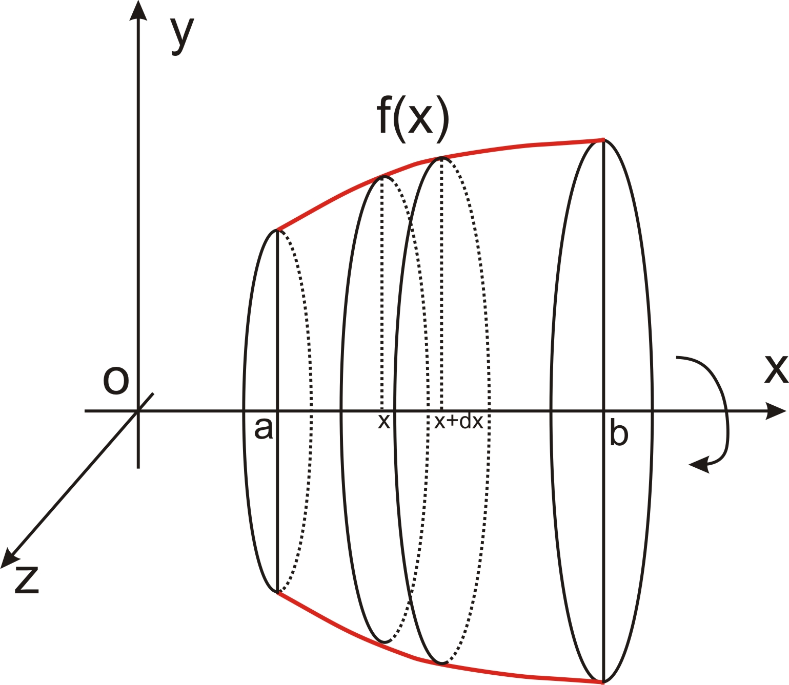

Surface-area practice: <a href="https://openstax.org/books/calculus-volume-1/pages/6-4-arc-length-of-a-curve-and-surface-area">OpenStax Vol 1, 6.4</a>; Stewart 8.1-8.4.
Luyện diện tích mặt: <a href="https://openstax.org/books/calculus-volume-1/pages/6-4-arc-length-of-a-curve-and-surface-area">OpenStax Tập 1, 6.4</a>; Stewart 8.1-8.4.

---
class: compact
---

# Physical ApplicationsỨng dụng vật lý

Same integral, different unitCùng tích phân, khác đơn vị

First identify the tiny contribution, then add it over the interval.
Trước hết nhận diện phần đóng góp rất nhỏ, rồi cộng trên khoảng.

<strong>WorkCông</strong>

$$
dW=F(x)\,dx
$$

<strong>SpringLò xo</strong>

$$
F(x)=kx
$$

<strong>Fluid forceÁp lực chất lỏng</strong>

$$
dF=\rho g\,hL\,dy
$$

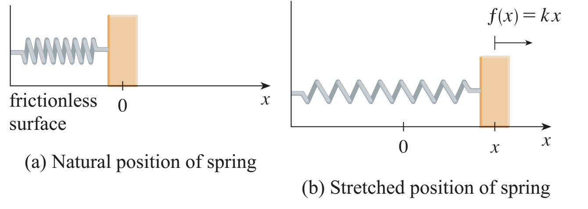
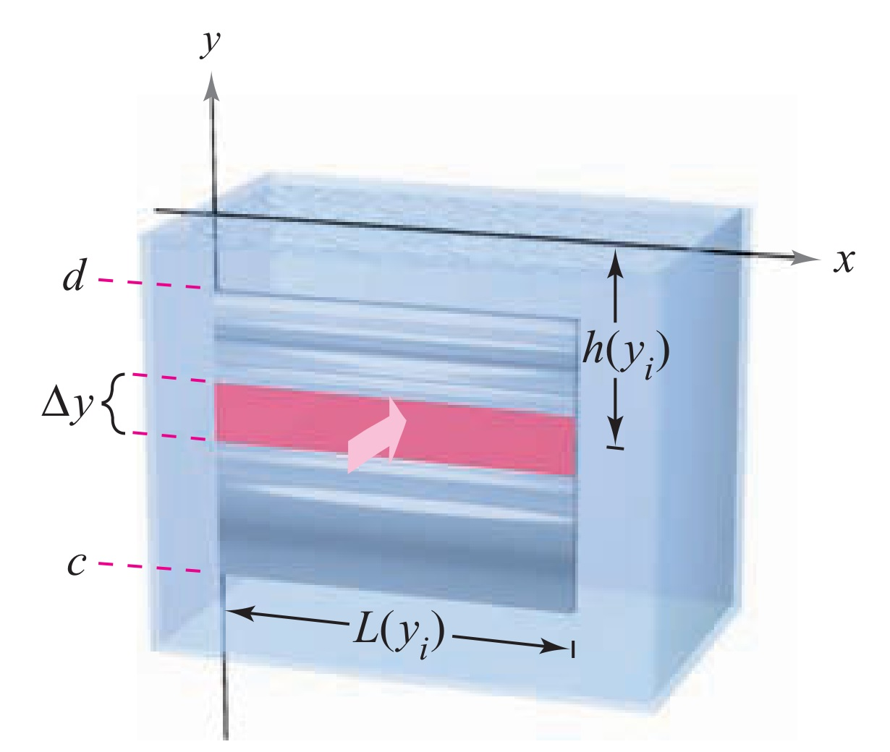
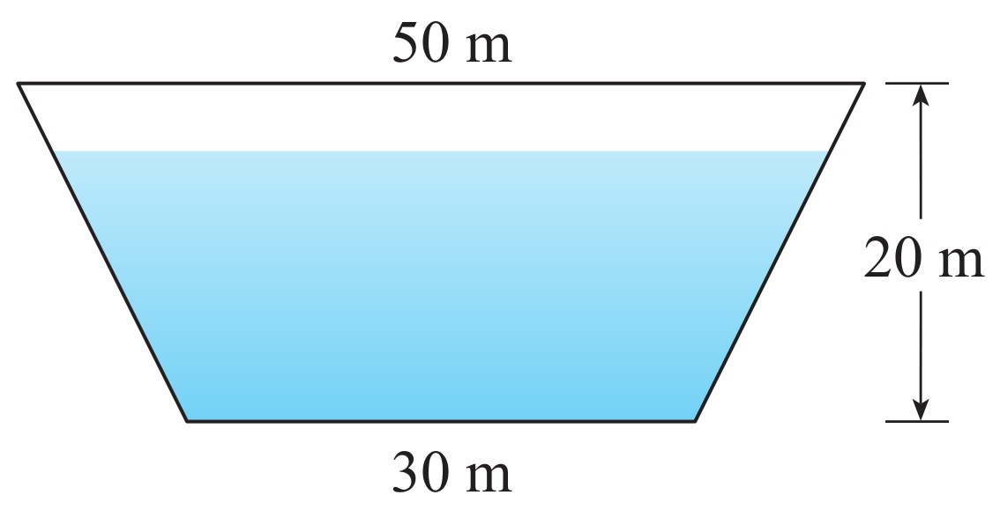

Physical applications: OpenStax Vol 1, 6.5; related setup ideas from Active Calculus 6.4 and Stewart 6.5.
Ứng dụng vật lý: OpenStax Tập 1, 6.5; ý tưởng thiết lập liên quan từ Active Calculus 6.4 và Stewart 6.5.

---
class: compact exercise-heavy
---

# Your Turn: Physical ModelsTự luyện: mô hình vật lý

P1 Work

A force of $F(x)=x^2+2x$ lb moves an object from $x=1$ to $x=3$ ft.
Lực $F(x)=x^2+2x$ lb di chuyển vật từ $x=1$ đến $x=3$ ft.

P2 Spring

A 40 N force holds a spring stretched from 10 cm to 15 cm. Find the work to stretch it from 5 cm to 8 cm past natural length.
Lực 40 N giữ lò xo giãn từ 10 cm đến 15 cm. Tính công để kéo từ 5 cm đến 8 cm so với chiều dài tự nhiên.

P3 Fluid

A vertical dam face is 20 m high, 50 m wide at the top and 30 m wide at the bottom. Water is 4 m below the top. Set up the force.
Mặt đập cao 20 m, rộng 50 m ở trên và 30 m ở đáy. Mực nước thấp hơn đỉnh 4 m. Thiết lập áp lực.

Before computingTrước khi tính

Write the small piece first, then check the unit of the final answer.
Viết phần nhỏ cần cộng trước, rồi kiểm tra đơn vị của đáp số.

Practice: OpenStax Vol 1, 6.5; extra practice: Stewart 6.5; local instructor exercises.
Luyện tập: OpenStax Tập 1, 6.5; luyện thêm: Stewart 6.5; bài tập bổ sung của giảng viên.

---
class: compact solution-slide
---

# Solution P1: Variable WorkLời giải P1: công với lực biến thiên

Small piecePhần nhỏ

During a tiny displacement $dx$, the force is nearly constant.
Trong một dịch chuyển rất nhỏ $dx$, lực gần như không đổi.

$$
dW=F(x)\,dx=(x^2+2x)\,dx.
$$

Add from $1$ to $3$Cộng từ $1$ đến $3$

$$
W=\int_1^3(x^2+2x)\,dx
$$

$$
W=\left[\frac{x^3}{3}+x^2\right]_1^3
=18-\frac43=\frac{50}{3}.
$$

The unit is force times distance, so $W=\dfrac{50}{3}$ ft-lb.
Đơn vị là lực nhân quãng đường, nên $W=\dfrac{50}{3}$ ft-lb.

Worked example: OpenStax Vol 1, 6.5; Stewart 6.5; local instructor exercises.
Ví dụ lời giải: OpenStax Tập 1, 6.5; Stewart 6.5; bài tập bổ sung của giảng viên.

---
class: compact solution-slide
---

# Solution P2: Spring WorkLời giải P2: công kéo lò xo

Find the spring constantTìm hằng số lò xo

The extension is $15-10=5$ cm, or $0.05$ m.
Độ giãn là $15-10=5$ cm, tức $0.05$ m.

$$
F=kx,\qquad 40=k(0.05)
$$

$$
k=800\ \text{N/m}.
$$

Integrate the forceTích phân lực

Stretching from 5 cm to 8 cm means $x=0.05$ to $0.08$ m.
Kéo từ 5 cm đến 8 cm nghĩa là $x=0.05$ đến $0.08$ m.

$$
W=\int_{0.05}^{0.08}800x\,dx
=400x^2\Big|_{0.05}^{0.08}
$$

$$
W=400(0.08^2-0.05^2)=1.56.
$$

The work is $1.56$ J, since N m = J.
Công bằng $1.56$ J, vì N m = J.

Worked example: OpenStax Vol 1, 6.5; Stewart 6.5; local instructor exercises.
Ví dụ lời giải: OpenStax Tập 1, 6.5; Stewart 6.5; bài tập bổ sung của giảng viên.

---
class: compact solution-slide
---

# Solution P3: Hydrostatic ForceLời giải P3: áp lực thủy tĩnh

Choose depth $x$Chọn độ sâu $x$

Let $x$ be depth below the water surface. Then $0\le x\le16$.
Gọi $x$ là độ sâu dưới mặt nước. Khi đó $0\le x\le16$.

Strip widthChiều rộng dải

The dam narrows linearly: at depth $x$, the width is $L(x)=46-x$.
Mặt đập hẹp tuyến tính: tại độ sâu $x$, chiều rộng là $L(x)=46-x$.

$$
dF=1000(9.8)\,x(46-x)\,dx
$$

$$
F=1000(9.8)\int_0^{16}x(46-x)\,dx
\approx4.43\times10^7\ \text{N}.
$$

Worked example: OpenStax Vol 1, 6.5; Stewart 6.5; local instructor exercises.
Ví dụ lời giải: OpenStax Tập 1, 6.5; Stewart 6.5; bài tập bổ sung của giảng viên.

---
class: compact
---

# Economic ApplicationsỨng dụng kinh tế

Accumulate money continuouslyTích lũy tiền liên tục

A payment made at time $t$ grows or discounts according to how far it is from the target time.
Một khoản tiền tại thời điểm $t$ tăng trưởng hoặc chiết khấu tùy khoảng cách đến thời điểm mục tiêu.

Future valueGiá trị tương lai

$$
FV=\int_0^T f(t)e^{r(T-t)}\,dt
$$

Present valueHiện giá

$$
PV=\int_0^T f(t)e^{-rt}\,dt
$$

Marginal profitLợi nhuận biên

$$
\Delta E=\int_a^b\big(R'(x)-C'(x)\big)\,dx
$$

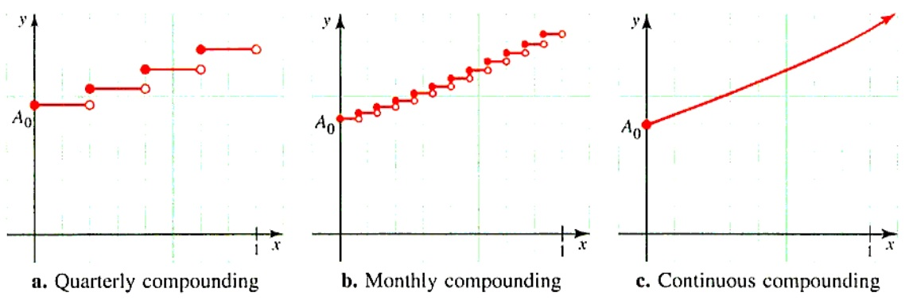
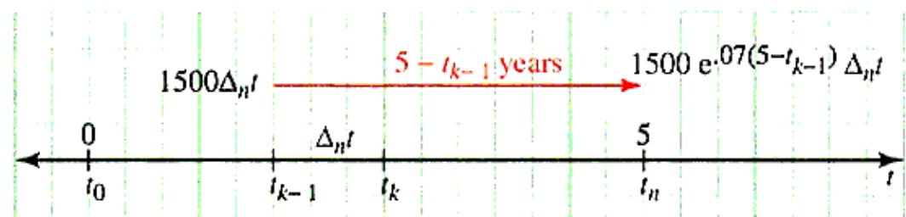
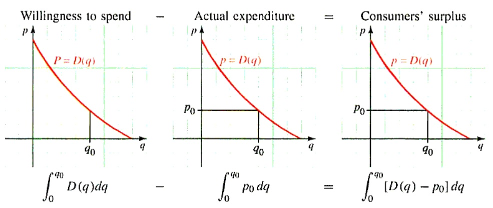

Economic applications use the same accumulation principle as OpenStax Vol 1, 6.1-6.6; practice anchors: Stewart 6.1-6.5 and local instructor exercises.
Ứng dụng kinh tế dùng cùng nguyên lý cộng dồn như OpenStax Tập 1, 6.1-6.6; nguồn luyện tập: Stewart 6.1-6.5 và bài tập bổ sung của giảng viên.

---
class: compact exercise-heavy
---

# Economic Models I: Money StreamsMô hình kinh tế I: dòng tiền

E1 Future value

Deposit 1500 dollars per year continuously for 5 years at 7% continuously compounded interest.
Gửi liên tục 1500 đô-la mỗi năm trong 5 năm với lãi suất ghép liên tục 7%.

E2 Present value

A machine earns $15-2t$ million dollars/year for $0\le t\le7$. Discount at 8% continuously.
Một máy tạo thu nhập $15-2t$ triệu đô-la/năm với $0\le t\le7$. Chiết khấu liên tục 8%.

Before computingTrước khi tính

For each dollar at time $t$, decide whether it grows forward to year 5 or discounts back to today.
Với mỗi đô-la tại thời điểm $t$, quyết định nó tăng đến năm 5 hay chiết khấu về hiện tại.

Practice: OpenStax Vol 1, 6.1-6.6 for integral setup fluency; Stewart 6.1-6.5; local instructor exercises.
Luyện tập: OpenStax Tập 1, 6.1-6.6 để thuần thục thiết lập tích phân; Stewart 6.1-6.5; bài tập bổ sung của giảng viên.

---
class: compact solution-slide
---

# Solution E1: Future ValueLời giải E1: giá trị tương lai

Model one small depositMô hình một khoản gửi nhỏ

A deposit $1500\,dt$ made at time $t$ grows for $5-t$ years.
Khoản gửi $1500\,dt$ tại thời điểm $t$ tăng trưởng trong $5-t$ năm.

$$
dFV=1500e^{0.07(5-t)}\,dt.
$$

Add all depositsCộng tất cả khoản gửi

$$
FV=\int_0^5 1500e^{0.07(5-t)}\,dt
$$

$$
FV=\frac{1500}{0.07}\left(e^{0.35}-1\right)
\approx8980.02.
$$

The future value after 5 years is about 8980 dollars.
Giá trị tương lai sau 5 năm xấp xỉ 8980 đô-la.

Worked example: continuous accumulation; OpenStax Vol 1, 6.1-6.6; Stewart 6.1-6.5; local instructor exercises.
Ví dụ lời giải: tích lũy liên tục; OpenStax Tập 1, 6.1-6.6; Stewart 6.1-6.5; bài tập bổ sung của giảng viên.

---
class: compact solution-slide
---

# Solution E2: Present ValueLời giải E2: hiện giá

Discount each paymentChiết khấu từng khoản

Income at time $t$ is worth less today by the factor $e^{-0.08t}$.
Thu nhập tại thời điểm $t$ có giá trị hiện tại giảm bởi hệ số $e^{-0.08t}$.

$$
PV=\int_0^7(15-2t)e^{-0.08t}\,dt.
$$

EvaluateTính tích phân

$$
\int(15-2t)e^{-0.08t}\,dt
=e^{-0.08t}(25t+125)
$$

$$
PV=300e^{-0.56}-125\approx46.36.
$$

The present value is about 46.36 million dollars.
Hiện giá xấp xỉ 46.36 triệu đô-la.

Worked example: continuous discounting; OpenStax Vol 1, 6.1-6.6; Stewart 6.1-6.5; local instructor exercises.
Ví dụ lời giải: chiết khấu liên tục; OpenStax Tập 1, 6.1-6.6; Stewart 6.1-6.5; bài tập bổ sung của giảng viên.

---
class: compact exercise-heavy
---

# Economic Models II: Margins And SurplusMô hình kinh tế II: biên và thặng dư

E3 Net earnings

$C'(x)=0.1x^2+4x+10$, $R'(x)=70-x$. Find net earnings from $0$ to $10$.
$C'(x)=0.1x^2+4x+10$, $R'(x)=70-x$. Tính lợi nhuận ròng từ $0$ đến $10$.

E4 Surplus

Demand $D(q)=-0.1q^2+90$; supply $S(q)=0.2q^2+q+50$. Find both surpluses.
Cầu $D(q)=-0.1q^2+90$; cung $S(q)=0.2q^2+q+50$. Tìm hai thặng dư.

Before computingTrước khi tính

Net earnings integrate marginal revenue minus marginal cost; surplus integrates the vertical gap from equilibrium price.
Lợi nhuận ròng là tích phân doanh thu biên trừ chi phí biên; thặng dư là tích phân khoảng cách theo phương đứng từ giá cân bằng.

Practice: OpenStax Vol 1, 6.1-6.6 for integral setup fluency; Stewart 6.1-6.5; local instructor exercises.
Luyện tập: OpenStax Tập 1, 6.1-6.6 để thuần thục thiết lập tích phân; Stewart 6.1-6.5; bài tập bổ sung của giảng viên.

---
class: compact solution-slide
---

# Solution E3: Net EarningsLời giải E3: lợi nhuận ròng

Build the marginal profitLập lợi nhuận biên

$$
R'(x)-C'(x)
=(70-x)-(0.1x^2+4x+10)
$$

$$
=60-5x-0.1x^2.
$$

Add from $0$ to $10$Cộng từ $0$ đến $10$

$$
\Delta E=\int_0^{10}(60-5x-0.1x^2)\,dx
$$

$$
\Delta E=\left[60x-\frac52x^2-\frac{x^3}{30}\right]_0^{10}
=\frac{950}{3}.
$$

Net earnings are $\dfrac{950}{3}$ thousand dollars, about 316667 dollars.
Lợi nhuận ròng là $\dfrac{950}{3}$ nghìn đô-la, xấp xỉ 316667 đô-la.

Worked example: marginal functions; OpenStax Vol 1, 6.1-6.6; Stewart 6.1-6.5; local instructor exercises.
Ví dụ lời giải: hàm biên; OpenStax Tập 1, 6.1-6.6; Stewart 6.1-6.5; bài tập bổ sung của giảng viên.

---
class: compact solution-slide
---

# Solution E4: Consumer And Producer SurplusLời giải E4: thặng dư tiêu dùng và sản xuất

EquilibriumĐiểm cân bằng

$$
-0.1q^2+90=0.2q^2+q+50
$$

$$
0.3q^2+q-40=0
$$

$$
q_0=10,\qquad p_0=80.
$$

Surplus integralsTích phân thặng dư

$$
CS=\int_0^{10}(D(q)-80)\,dq
=\int_0^{10}(10-0.1q^2)\,dq
$$

$$
CS=\frac{200}{3}
$$

$$
PS=\int_0^{10}(80-S(q))\,dq
=\int_0^{10}(30-q-0.2q^2)\,dq
$$

$$
PS=\frac{550}{3}.
$$

Worked example: surplus as area; OpenStax Vol 1, 6.1-6.6; Stewart 6.1-6.5; local instructor exercises.
Ví dụ lời giải: thặng dư như diện tích; OpenStax Tập 1, 6.1-6.6; Stewart 6.1-6.5; bài tập bổ sung của giảng viên.

---
class: compact exercise-heavy
---

# Life Science And Flow ModelsMô hình dòng chảy và khoa học sự sống

Survival with continuous intakeTồn tại với dòng vào liên tục

$$
P(T)=P_0f(T)+\int_0^T r(t)f(T-t)\,dt
$$

Blood-flow rateLưu lượng máu

$$
S(r)=k(R^2-r^2)
$$

$$
Q=\int_0^R2\pi rS(r)\,dr=\frac{\pi kR^4}{2}
$$

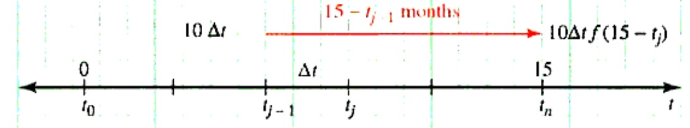
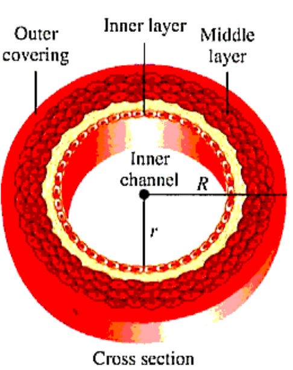

Flow and life-science models extend the same accumulation idea; reading/practice anchors: OpenStax Vol 1, 6.1-6.6; Stewart 6.1-6.5.
Mô hình dòng chảy và khoa học sự sống mở rộng cùng ý tưởng cộng dồn; nguồn đọc/luyện: OpenStax Tập 1, 6.1-6.6; Stewart 6.1-6.5.

---
class: compact exercise-heavy
---

# Your Turn: Flow ModelTự luyện: mô hình dòng chảy

4 min

ExerciseBài tập

A clinic has 300 patients, survival $f(t)=e^{-t/20}$, and admits 10 new patients per month. Estimate the number of patients after 15 months.
Một phòng khám có 300 bệnh nhân, hàm tồn tại $f(t)=e^{-t/20}$, và nhận thêm 10 người/tháng. Ước lượng số bệnh nhân sau 15 tháng.

Practice: renewal and flow models as continuous accumulation; OpenStax Vol 1, 6.1-6.6; Stewart 6.1-6.5.
Luyện tập: mô hình bổ sung và dòng chảy như tích lũy liên tục; OpenStax Tập 1, 6.1-6.6; Stewart 6.1-6.5.

---
class: compact solution-slide
---

# Solution: Flow ModelLời giải: mô hình dòng chảy

Two groups remainHai nhóm còn lại

Original patients survive for 15 months. A new patient admitted at time $t$ survives for $15-t$ months.
Bệnh nhân ban đầu tồn tại 15 tháng. Bệnh nhân mới vào lúc $t$ tồn tại trong $15-t$ tháng.

$$
P(15)=300e^{-15/20}+\int_0^{15}10e^{-(15-t)/20}\,dt.
$$

EvaluateTính

$$
\int_0^{15}10e^{-(15-t)/20}\,dt
=200(1-e^{-15/20})
$$

$$
P(15)=300e^{-0.75}+200(1-e^{-0.75})
$$

$$
P(15)\approx247.24\ \text{patients}.
$$

Worked example: renewal and flow models; OpenStax Vol 1, 6.1-6.6; Stewart 6.1-6.5; local instructor exercises.
Ví dụ lời giải: mô hình bổ sung và dòng chảy; OpenStax Tập 1, 6.1-6.6; Stewart 6.1-6.5; bài tập bổ sung của giảng viên.

---
class: compact exercise-heavy
---

# Mixed Practice I: SetupsLuyện tập tổng hợp I: thiết lập

M1 Area

Set up, but do not evaluate, the area between
Thiết lập, chưa cần tính, diện tích giữa

$$
y=4-x^2,\qquad y=1.
$$

M2 Washer

Set up the volume when the M1 region is rotated about the $x$-axis.
Thiết lập thể tích khi miền M1 quay quanh trục $x$.

M3 Shell

Set up the volume when the M1 region in $x\ge0$ rotates about the $y$-axis.
Thiết lập thể tích khi phần M1 với $x\ge0$ quay quanh trục $y$.

M4 Compare

Which setup uses fewer algebraic pieces: washers or shells?
Thiết lập nào ít phần đại số hơn: vòng đệm hay vỏ trụ?

GoalMục tiêu

Do not rush to integrate. First decide the axis, the slice direction, and the radius/height.
Đừng vội tính. Trước hết xác định trục quay, hướng lát cắt, và bán kính/chiều cao.

Setup practice: <a href="https://activecalculus.org/single/sec-6-1-area.html">Active Calculus 6.1</a>-<a href="https://activecalculus.org/single/sec-6-2-volume.html">6.2</a>; <a href="https://openstax.org/books/calculus-volume-1/pages/6-1-areas-between-curves">OpenStax 6.1</a>-<a href="https://openstax.org/books/calculus-volume-1/pages/6-3-volumes-of-revolution-cylindrical-shells">6.3</a>; Stewart 6.1-6.3.
Luyện thiết lập: <a href="https://activecalculus.org/single/sec-6-1-area.html">Active Calculus 6.1</a>-<a href="https://activecalculus.org/single/sec-6-2-volume.html">6.2</a>; <a href="https://openstax.org/books/calculus-volume-1/pages/6-1-areas-between-curves">OpenStax 6.1</a>-<a href="https://openstax.org/books/calculus-volume-1/pages/6-3-volumes-of-revolution-cylindrical-shells">6.3</a>; Stewart 6.1-6.3.

---
class: compact exercise-heavy
---

# Mixed Practice II: ComputeLuyện tập tổng hợp II: tính toán

C1

Area between $y=x-x^2$ and $y=x\sqrt{1-x}$.
Diện tích giữa $y=x-x^2$ và $y=x\sqrt{1-x}$.

C2

Volume from rotating $y=\sqrt{x}$, $0\le x\le4$, about the $x$-axis.
Thể tích khi quay $y=\sqrt{x}$, $0\le x\le4$, quanh trục $x$.

C3

Arc length of $y=\frac{x^3}{12}+\frac1x$, $1\le x\le4$.
Độ dài cung của $y=\frac{x^3}{12}+\frac1x$, $1\le x\le4$.

C4

Surface area for $y=\sqrt{x^2+4}$, $0\le x\le1$, about the $x$-axis.
Diện tích mặt của $y=\sqrt{x^2+4}$, $0\le x\le1$, quay quanh trục $x$.

Mixed practice: use the <a href="../../readings/">Session 9 reading map</a>; OpenStax 6.1-6.4 and Stewart 6.1-6.5, 8.1-8.4 are the student practice anchors.
Luyện tổng hợp: dùng <a href="../../readings/">bản đồ đọc Buổi 9</a>; OpenStax 6.1-6.4 và Stewart 6.1-6.5, 8.1-8.4 là nguồn bài tập chính.

---

# Decision ChartBảng chọn phương pháp

<strong>AreaDiện tích</strong>
Vertical slice: top minus bottom.
Lát dọc: trên trừ dưới.

$$
\int(\text{top}-\text{bottom})\,dx
$$

<strong>WasherVòng đệm</strong>
Slice perpendicular to rotation axis.
Lát vuông góc với trục quay.

$$
\pi\int(R^2-r^2)
$$

<strong>ShellVỏ trụ</strong>
Slice parallel to rotation axis.
Lát song song với trục quay.

$$
2\pi\int rh
$$

<strong>Length / SurfaceĐộ dài / mặt</strong>
Build from arc length.
Xây từ độ dài cung.

$$
ds=\sqrt{1+(y')^2}\,dx
$$

The most common errorLỗi thường gặp nhất

Using the right formula with the wrong radius or wrong interval.
Dùng đúng công thức nhưng sai bán kính hoặc sai khoảng lấy tích phân.

Review map: <a href="https://activecalculus.org/single/sec-6-1-area.html">Active Calculus 6.1</a>-<a href="https://activecalculus.org/single/sec-6-2-volume.html">6.2</a>; <a href="https://openstax.org/books/calculus-volume-1/pages/6-1-areas-between-curves">OpenStax 6.1</a>-<a href="https://openstax.org/books/calculus-volume-1/pages/6-4-arc-length-of-a-curve-and-surface-area">6.4</a>; Stewart 6.1-6.5, 8.1-8.4.
Bản đồ ôn tập: <a href="https://activecalculus.org/single/sec-6-1-area.html">Active Calculus 6.1</a>-<a href="https://activecalculus.org/single/sec-6-2-volume.html">6.2</a>; <a href="https://openstax.org/books/calculus-volume-1/pages/6-1-areas-between-curves">OpenStax 6.1</a>-<a href="https://openstax.org/books/calculus-volume-1/pages/6-4-arc-length-of-a-curve-and-surface-area">6.4</a>; Stewart 6.1-6.5, 8.1-8.4.

---

# Reading And Practice SourcesNguồn đọc và luyện tập

<strong>Boelkins, M.</strong>&nbsp;
<em>Active Calculus</em> (2nd ed.), Sections 6.1, 6.2, 6.4.
<em>Active Calculus</em> (ấn bản thứ 2), Mục 6.1, 6.2, 6.4.

<strong>Strang, G., & Herman, E. "Jed".</strong>&nbsp;
<em>Calculus Volume 1</em>, OpenStax, Sections 6.1-6.6.
<em>Calculus Volume 1</em>, OpenStax, Mục 6.1-6.6.

<strong>Stewart, J.</strong>&nbsp;
<em>Calculus: Early Transcendentals</em> (8th ed., metric version), Sections 6.1-6.5 and 8.1-8.4.
<em>Calculus: Early Transcendentals</em> (ấn bản thứ 8, bản metric), Mục 6.1-6.5 và 8.1-8.4.

<strong>Instructor notes.Ghi chú của giảng viên.</strong>&nbsp;
Local examples and extra exercises adapted for MT1003 Calculus 1.
Ví dụ và bài tập bổ sung được điều chỉnh cho MT1003 Giải tích 1.

Full map: <a href="../../readings/">course readings</a>. Use section titles if a Stewart edition has different numbering.
Bản đồ đầy đủ: <a href="../../readings/">tài liệu đọc của môn</a>. Nếu phiên bản Stewart khác số mục, hãy dùng tên mục.

