# Applications of IntegrationỨng dụng tích phân

MT1003 Calculus 1 - Lecture 06
MT1003 Giải tích 1 - Bài giảng 06

Truong-Son Van 
tsvan@hcmut.edu.vn

Reading map: <a href="../../readings/">course readings</a>. Main lecture source: Active Calculus; student reading/practice: OpenStax and Stewart.
Bản đồ đọc: <a href="../../readings/">tài liệu đọc của môn</a>. Nguồn chính: Active Calculus; đọc và luyện tập: OpenStax và Stewart.

---

# From Total To GeometryTừ tổng lượng đến hình học

One idea, many objectsMột ý tưởng, nhiều đại lượng

A definite integral adds tiny pieces. Today each tiny piece has a geometric meaning: height times width, area times thickness, circumference times thickness, or length times radius.
Tích phân xác định cộng các phần rất nhỏ. Hôm nay mỗi phần nhỏ mang ý nghĩa hình học: cao nhân rộng, diện tích nhân độ dày, chu vi nhân độ dày, hoặc độ dài nhân bán kính.

<strong>AreaDiện tích</strong>$dA\approx h\,dx$

<strong>VolumeThể tích</strong>$dV\approx A(x)\,dx$

<strong>Arc lengthĐộ dài cung</strong>$ds=\sqrt{1+(y')^2}\,dx$

<strong>SurfaceDiện tích mặt</strong>$dS\approx 2\pi r\,ds$

Read: <a href="https://activecalculus.org/single/sec-6-1-area.html">Active Calculus 6.1</a>-<a href="https://activecalculus.org/single/sec-6-2-volume.html">6.2</a>; <a href="https://openstax.org/books/calculus-volume-1/pages/6-1-areas-between-curves">OpenStax Vol 1, 6.1</a>-<a href="https://openstax.org/books/calculus-volume-1/pages/6-4-arc-length-of-a-curve-and-surface-area">6.4</a>; Stewart 6.1-6.5, 8.1-8.4.
Đọc: <a href="https://activecalculus.org/single/sec-6-1-area.html">Active Calculus 6.1</a>-<a href="https://activecalculus.org/single/sec-6-2-volume.html">6.2</a>; <a href="https://openstax.org/books/calculus-volume-1/pages/6-1-areas-between-curves">OpenStax Tập 1, 6.1</a>-<a href="https://openstax.org/books/calculus-volume-1/pages/6-4-arc-length-of-a-curve-and-surface-area">6.4</a>; Stewart 6.1-6.5, 8.1-8.4.

---

# Today's PlanKế hoạch hôm nay

0-25<strong>Areas</strong> - area under a curve and area between curves<strong>Diện tích</strong> - diện tích dưới đồ thị và giữa hai đường cong

25-70<strong>Volumes</strong> - slicing, disks, washers, and shells<strong>Thể tích</strong> - lát cắt, đĩa, vòng đệm, và vỏ trụ

70-80<strong>Break</strong><strong>Nghỉ giải lao</strong>

80-115<strong>Arc length</strong> - build length from small line segments<strong>Độ dài cung</strong> - xây dựng độ dài từ các đoạn thẳng nhỏ

115-135<strong>Surface area</strong> - rotate a curve and add frustums<strong>Diện tích mặt</strong> - quay đường cong và cộng các nón cụt

135-155<strong>Five models</strong> - spring work, dam force, present value, surplus, renewal<strong>Năm mô hình</strong> - công lò xo, áp lực đập, hiện giá, thặng dư, bổ sung

155-170<strong>Exercise lab</strong> - setup first, compute second<strong>Luyện tập</strong> - thiết lập trước, tính sau

Session 9 reading map: Active Calculus 6.1, 6.2, 6.4; OpenStax Vol 1, 6.1-6.6; Stewart 6.1-6.5, 8.1-8.4.
Bản đồ đọc Buổi 9: Active Calculus 6.1, 6.2, 6.4; OpenStax Tập 1, 6.1-6.6; Stewart 6.1-6.5, 8.1-8.4.

---
class: compact
---

# Area Under A CurveDiện tích dưới đồ thị

Signed height, positive areaChiều cao có dấu, diện tích dương

If $f$ is integrable on $[a,b]$, the area between $y=f(x)$ and the $x$-axis is
Nếu $f$ khả tích trên $[a,b]$, diện tích giữa $y=f(x)$ và trục $x$ là

$$
A=\int_a^b |f(x)|\,dx.
$$

Watch the signChú ý dấu

If the graph crosses the $x$-axis, split the interval at the zeros.
Nếu đồ thị cắt trục $x$, hãy chia khoảng tại các nghiệm.

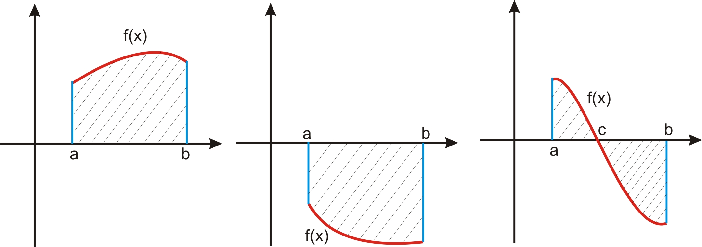

Read: <a href="https://activecalculus.org/single/sec-6-1-area.html">Active Calculus 6.1</a>; <a href="https://openstax.org/books/calculus-volume-1/pages/6-1-areas-between-curves">OpenStax Vol 1, 6.1</a>; extra practice: Stewart 6.1.
Đọc: <a href="https://activecalculus.org/single/sec-6-1-area.html">Active Calculus 6.1</a>; <a href="https://openstax.org/books/calculus-volume-1/pages/6-1-areas-between-curves">OpenStax Tập 1, 6.1</a>; luyện thêm: Stewart 6.1.

---

# Example: Area With The AxisVí dụ: diện tích với trục hoành

Find the areaTìm diện tích

Region bounded by $y=4x-x^2$ and the $x$-axis.
Miền giới hạn bởi $y=4x-x^2$ và trục $x$.

Set up and computeThiết lập và tính

$$
4x-x^2=x(4-x)=0
$$

$$
A=\int_0^4(4x-x^2)\,dx
=\left[2x^2-\frac{x^3}{3}\right]_0^4=\frac{32}{3}.
$$

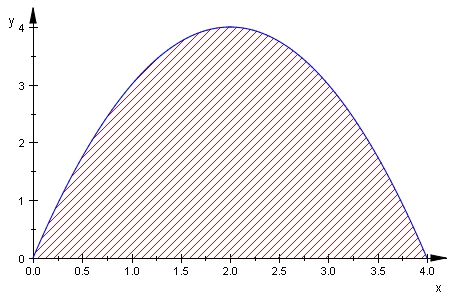

Area with the axis: <a href="https://activecalculus.org/single/sec-6-1-area.html">Active Calculus 6.1</a>; <a href="https://openstax.org/books/calculus-volume-1/pages/6-1-areas-between-curves">OpenStax Vol 1, 6.1</a>; Stewart 6.1.
Diện tích với trục tọa độ: <a href="https://activecalculus.org/single/sec-6-1-area.html">Active Calculus 6.1</a>; <a href="https://openstax.org/books/calculus-volume-1/pages/6-1-areas-between-curves">OpenStax Tập 1, 6.1</a>; Stewart 6.1.

---
class: compact
---

# Area Between CurvesDiện tích giữa hai đường cong

Top minus bottomTrên trừ dưới

$$
A=\int_a^b |f(x)-g(x)|\,dx.
$$

If $f(x)\ge g(x)$ on the interval, this becomes
Nếu $f(x)\ge g(x)$ trên khoảng, công thức trở thành

$$
A=\int_a^b\big(f(x)-g(x)\big)\,dx.
$$

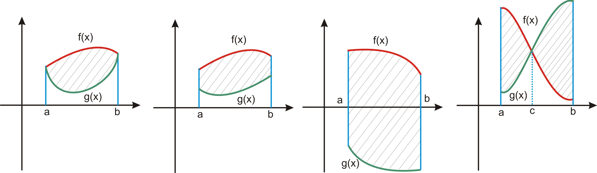

WorkflowQuy trình

Find intersections, decide which curve is on top, integrate the difference.
Tìm giao điểm, xác định đường nào ở trên, rồi tích phân hiệu.

Read: <a href="https://activecalculus.org/single/sec-6-1-area.html">Active Calculus 6.1</a>; <a href="https://openstax.org/books/calculus-volume-1/pages/6-1-areas-between-curves">OpenStax Vol 1, 6.1</a>; extra practice: Stewart 6.1.
Đọc: <a href="https://activecalculus.org/single/sec-6-1-area.html">Active Calculus 6.1</a>; <a href="https://openstax.org/books/calculus-volume-1/pages/6-1-areas-between-curves">OpenStax Tập 1, 6.1</a>; luyện thêm: Stewart 6.1.

---

# Example: Two CurvesVí dụ: hai đường cong

Find the enclosed areaTìm diện tích miền kín

$$
y=3-x,\qquad y=x^2-9.
$$

IntersectionsGiao điểm

$$
3-x=x^2-9
\ \Rightarrow\ (x-3)(x+4)=0
$$

$$
A=\int_{-4}^{3}(-x^2-x+12)\,dx=\frac{343}{6}.
$$

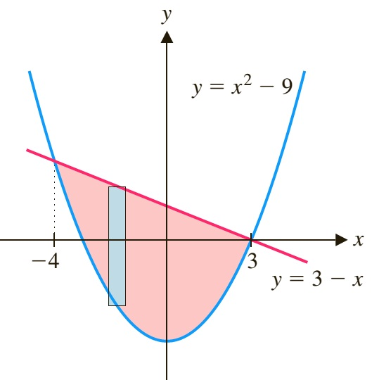

Practice source pattern: area-between-curves examples from <a href="https://activecalculus.org/single/sec-6-1-area.html">Active Calculus 6.1</a>, <a href="https://openstax.org/books/calculus-volume-1/pages/6-1-areas-between-curves">OpenStax 6.1</a>, and Stewart 6.1.
Dạng luyện tập: ví dụ diện tích giữa hai đường cong từ <a href="https://activecalculus.org/single/sec-6-1-area.html">Active Calculus 6.1</a>, <a href="https://openstax.org/books/calculus-volume-1/pages/6-1-areas-between-curves">OpenStax 6.1</a>, và Stewart 6.1.

---
class: compact exercise-heavy
---

# Your Turn: AreaTự luyện: diện tích

A1

Find the area enclosed by
Tìm diện tích miền kín bởi

$$
y=(x-1)^2,\qquad x^2-\frac{y^2}{2}=1.
$$

A2

Find the area enclosed by
Tìm diện tích miền kín bởi

$$
y=x-x^2,\qquad y=x\sqrt{1-x}.
$$

Setup hintsGợi ý thiết lập

A1 intersects at $x=1,3$; A2 intersects at $x=0,1$.
A1 giao tại $x=1,3$; A2 giao tại $x=0,1$.

AnswersĐáp số

$A_1=\displaystyle \frac{10}{3}-\frac{\sqrt2}{2}\ln(3+\sqrt8)$ 
$A_2=\displaystyle \frac{1}{10}$

Area practice: <a href="https://activecalculus.org/single/sec-6-1-area.html">Active Calculus 6.1</a>; <a href="https://openstax.org/books/calculus-volume-1/pages/6-1-areas-between-curves">OpenStax Vol 1, 6.1</a>; Stewart 6.1.
Luyện diện tích: <a href="https://activecalculus.org/single/sec-6-1-area.html">Active Calculus 6.1</a>; <a href="https://openstax.org/books/calculus-volume-1/pages/6-1-areas-between-curves">OpenStax Tập 1, 6.1</a>; Stewart 6.1.

---
class: compact
---

# Volume By SlicingThể tích bằng lát cắt

Slice the solidCắt vật thể

If a cross section perpendicular to the $x$-axis has area $A(x)$, then one thin slice has volume approximately $A(x)\,dx$.
Nếu lát cắt vuông góc trục $x$ có diện tích $A(x)$, thì một lát mỏng có thể tích xấp xỉ $A(x)\,dx$.

$$
V=\int_a^b A(x)\,dx.
$$

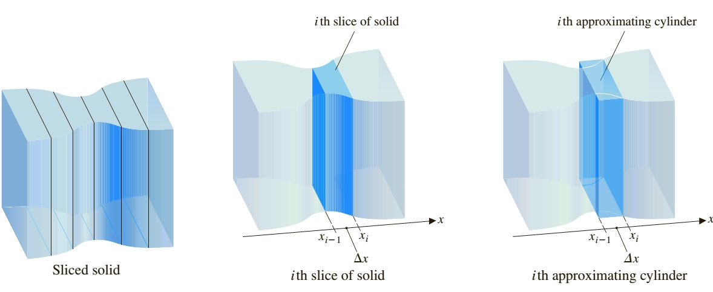

Read: <a href="https://activecalculus.org/single/sec-6-2-volume.html">Active Calculus 6.2</a>; <a href="https://openstax.org/books/calculus-volume-1/pages/6-2-determining-volumes-by-slicing">OpenStax Vol 1, 6.2</a>; extra practice: Stewart 6.2.
Đọc: <a href="https://activecalculus.org/single/sec-6-2-volume.html">Active Calculus 6.2</a>; <a href="https://openstax.org/books/calculus-volume-1/pages/6-2-determining-volumes-by-slicing">OpenStax Tập 1, 6.2</a>; luyện thêm: Stewart 6.2.

---

# Example: Volume Of A SphereVí dụ: thể tích hình cầu

Radius $r$Bán kính $r$

At position $x$, the circular cross section has radius $\sqrt{r^2-x^2}$.
Tại vị trí $x$, lát cắt tròn có bán kính $\sqrt{r^2-x^2}$.

Cross-section areaDiện tích lát cắt

$$
A(x)=\pi(r^2-x^2)
$$

$$
V=\int_{-r}^r A(x)\,dx=\frac{4}{3}\pi r^3.
$$

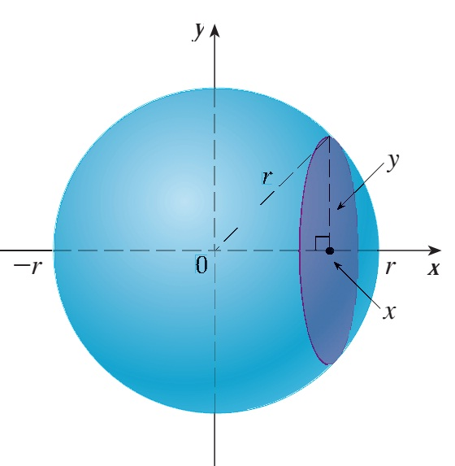

Slicing model: <a href="https://activecalculus.org/single/sec-6-2-volume.html">Active Calculus 6.2</a>; <a href="https://openstax.org/books/calculus-volume-1/pages/6-2-determining-volumes-by-slicing">OpenStax Vol 1, 6.2</a>; Stewart 6.2.
Mô hình lát cắt: <a href="https://activecalculus.org/single/sec-6-2-volume.html">Active Calculus 6.2</a>; <a href="https://openstax.org/books/calculus-volume-1/pages/6-2-determining-volumes-by-slicing">OpenStax Tập 1, 6.2</a>; Stewart 6.2.

---
class: compact
---

# Disks And WashersPhương pháp đĩa và vòng đệm

Rotate about the $x$-axisQuay quanh trục $x$

$$
V=\pi\int_a^b R(x)^2\,dx.
$$

With a hole, subtract the inner radius:
Nếu có lỗ, trừ bán kính trong:

$$
V=\pi\int_a^b\big(R(x)^2-r(x)^2\big)\,dx.
$$

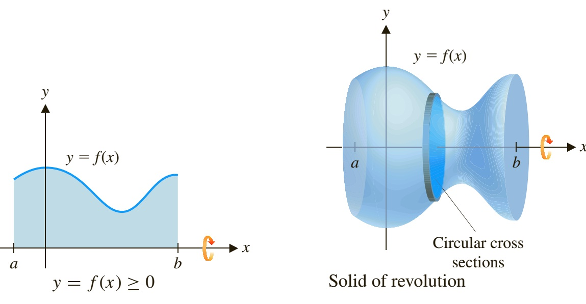

Choose slices perpendicular to the axis of rotation. Read: <a href="https://activecalculus.org/single/sec-6-2-volume.html">Active Calculus 6.2</a>; <a href="https://openstax.org/books/calculus-volume-1/pages/6-2-determining-volumes-by-slicing">OpenStax 6.2</a>; Stewart 6.2.
Chọn lát cắt vuông góc với trục quay. Đọc: <a href="https://activecalculus.org/single/sec-6-2-volume.html">Active Calculus 6.2</a>; <a href="https://openstax.org/books/calculus-volume-1/pages/6-2-determining-volumes-by-slicing">OpenStax 6.2</a>; Stewart 6.2.

---

# Example: Disk MethodVí dụ: phương pháp đĩa

RevolveQuay miền

The region under $y=\sqrt{x}$ on $[0,4]$ about the $x$-axis.
Miền dưới $y=\sqrt{x}$ trên $[0,4]$ quanh trục $x$.

$$
V=\pi\int_0^4(\sqrt{x})^2\,dx
=\pi\int_0^4 x\,dx=8\pi.
$$

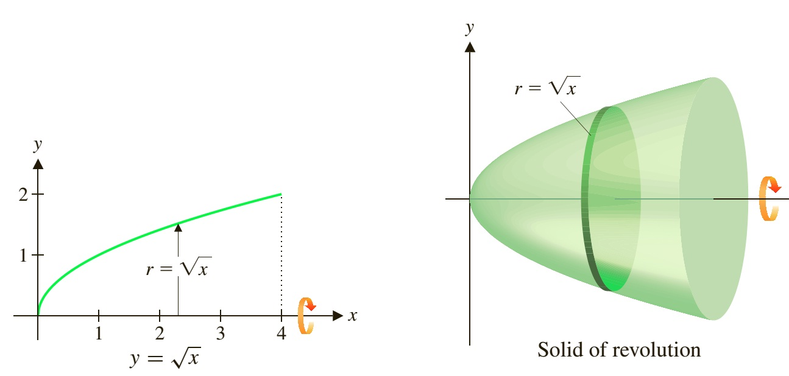

Disk/washer practice: <a href="https://activecalculus.org/single/sec-6-2-volume.html">Active Calculus 6.2</a>; <a href="https://openstax.org/books/calculus-volume-1/pages/6-2-determining-volumes-by-slicing">OpenStax Vol 1, 6.2</a>; Stewart 6.2.
Luyện đĩa/vòng đệm: <a href="https://activecalculus.org/single/sec-6-2-volume.html">Active Calculus 6.2</a>; <a href="https://openstax.org/books/calculus-volume-1/pages/6-2-determining-volumes-by-slicing">OpenStax Tập 1, 6.2</a>; Stewart 6.2.

---
class: compact
---

# Rotate About The $y$-AxisQuay quanh trục $y$

Horizontal disksĐĩa ngang

If $x=g(y)\ge0$ on $[c,d]$, rotating about the $y$-axis gives
Nếu $x=g(y)\ge0$ trên $[c,d]$, quay quanh trục $y$ cho

$$
V=\pi\int_c^d g(y)^2\,dy.
$$

Example setupThiết lập ví dụ

For $y=4-x^2$, use $x=\sqrt{4-y}$ and $1\le y\le4$.
Với $y=4-x^2$, dùng $x=\sqrt{4-y}$ và $1\le y\le4$.

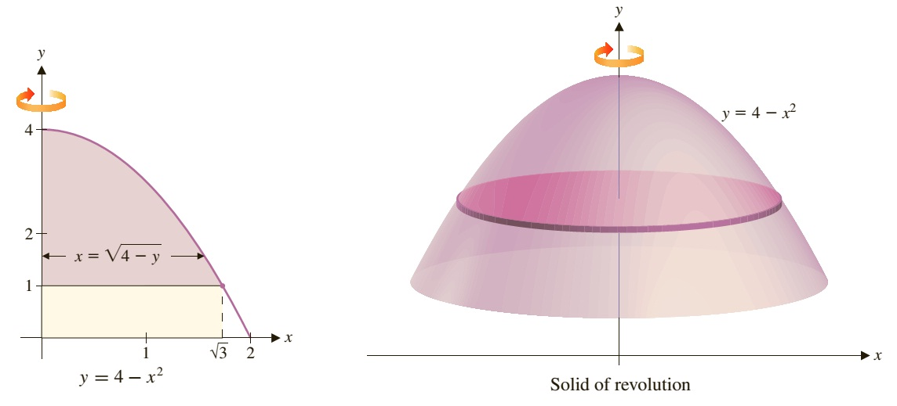

$$
V=\pi\int_1^4(4-y)\,dy=\frac{9\pi}{2}.
$$

Horizontal slicing: <a href="https://activecalculus.org/single/sec-6-2-volume.html">Active Calculus 6.2</a>; <a href="https://openstax.org/books/calculus-volume-1/pages/6-2-determining-volumes-by-slicing">OpenStax Vol 1, 6.2</a>; Stewart 6.2.
Lát cắt ngang: <a href="https://activecalculus.org/single/sec-6-2-volume.html">Active Calculus 6.2</a>; <a href="https://openstax.org/books/calculus-volume-1/pages/6-2-determining-volumes-by-slicing">OpenStax Tập 1, 6.2</a>; Stewart 6.2.

---
class: compact
---

# Cylindrical ShellsPhương pháp vỏ trụ

Thin shellVỏ trụ mỏng

A rectangle at $x$ with height $f(x)$ rotates about the $y$-axis into a shell.
Một hình chữ nhật tại $x$ có chiều cao $f(x)$ quay quanh trục $y$ thành vỏ trụ.

$$
dV\approx 2\pi x f(x)\,dx,
\qquad
V=2\pi\int_a^b x f(x)\,dx.
$$

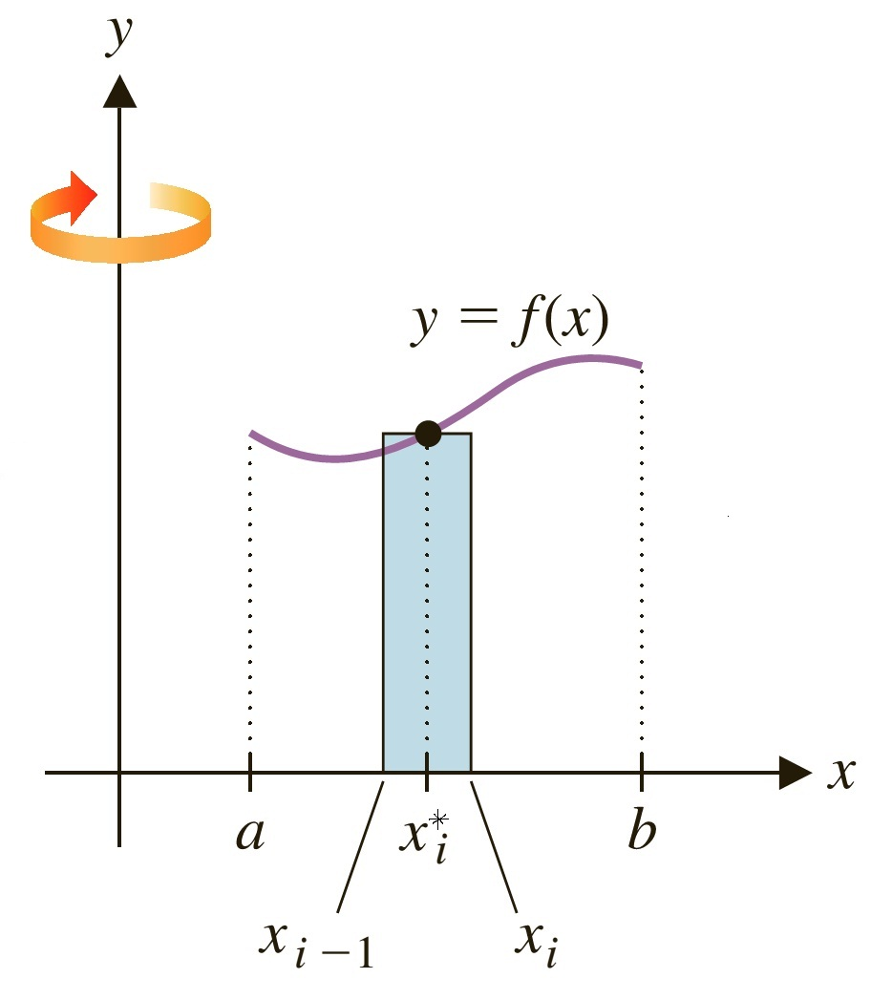
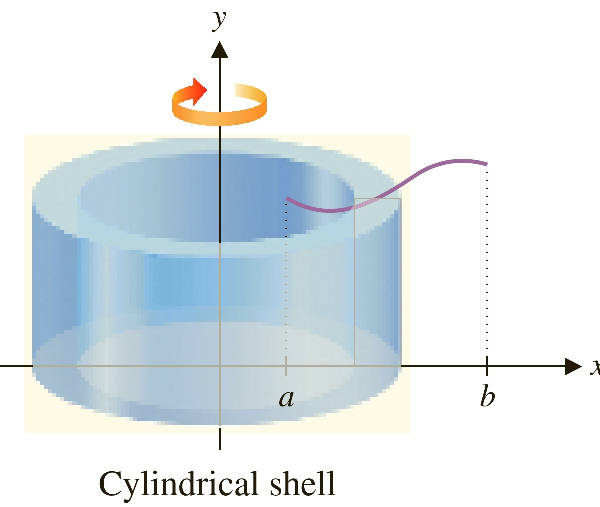
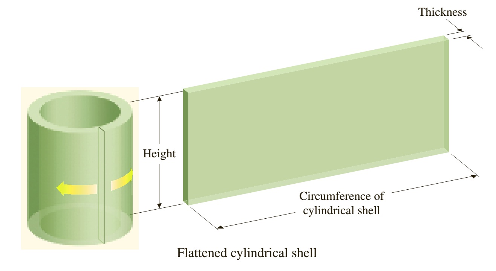

Shell method: <a href="https://activecalculus.org/single/sec-6-2-volume.html">Active Calculus 6.2</a>; <a href="https://openstax.org/books/calculus-volume-1/pages/6-3-volumes-of-revolution-cylindrical-shells">OpenStax Vol 1, 6.3</a>; Stewart 6.3.
Phương pháp vỏ trụ: <a href="https://activecalculus.org/single/sec-6-2-volume.html">Active Calculus 6.2</a>; <a href="https://openstax.org/books/calculus-volume-1/pages/6-3-volumes-of-revolution-cylindrical-shells">OpenStax Tập 1, 6.3</a>; Stewart 6.3.

---

# Example: Shells vs WashersVí dụ: vỏ trụ và vòng đệm

RegionMiền phẳng

Bounded by $y=x^2$, $x=1$, $x=2$, and $y=0$; rotate about the $y$-axis.
Giới hạn bởi $y=x^2$, $x=1$, $x=2$, và $y=0$; quay quanh trục $y$.

$$
V=2\pi\int_1^2 x\cdot x^2\,dx
=2\pi\left[\frac{x^4}{4}\right]_1^2
=\frac{15\pi}{2}.
$$

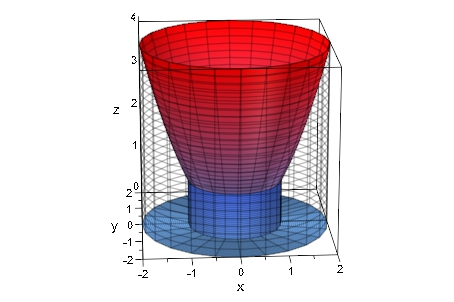

Compare methods: <a href="https://activecalculus.org/single/sec-6-2-volume.html">Active Calculus 6.2</a>; <a href="https://openstax.org/books/calculus-volume-1/pages/6-3-volumes-of-revolution-cylindrical-shells">OpenStax Vol 1, 6.3</a>; Stewart 6.2-6.3.
So sánh phương pháp: <a href="https://activecalculus.org/single/sec-6-2-volume.html">Active Calculus 6.2</a>; <a href="https://openstax.org/books/calculus-volume-1/pages/6-3-volumes-of-revolution-cylindrical-shells">OpenStax Tập 1, 6.3</a>; Stewart 6.2-6.3.

---
class: compact exercise-heavy
---

# Your Turn: VolumesTự luyện: thể tích

V1

Rotate $y^2=(x-1)^3$, $1\le x\le2$, about the $x$-axis.
Quay $y^2=(x-1)^3$, $1\le x\le2$, quanh trục $x$.

V2

Rotate the region bounded by $y=x^2$, $y=0$, $x+y=2$ about the $x$-axis.
Quay miền giới hạn bởi $y=x^2$, $y=0$, $x+y=2$ quanh trục $x$.

V3

Rotate the region under $y=4-x^2$ above $y=1$, $0\le x\le\sqrt3$, about the $y$-axis.
Quay miền dưới $y=4-x^2$ và trên $y=1$, $0\le x\le\sqrt3$, quanh trục $y$.

V4

Use shells for the region under $y=x^2$, $1\le x\le2$, about the $y$-axis.
Dùng vỏ trụ cho miền dưới $y=x^2$, $1\le x\le2$, quanh trục $y$.

AnswersĐáp số

V1: $\pi/4$ &nbsp; 
V2: $8\pi/15$ &nbsp; 
V3: $9\pi/2$ &nbsp; 
V4: $15\pi/2$

Volume practice: <a href="https://activecalculus.org/single/sec-6-2-volume.html">Active Calculus 6.2</a>; <a href="https://openstax.org/books/calculus-volume-1/pages/6-2-determining-volumes-by-slicing">OpenStax 6.2</a>-<a href="https://openstax.org/books/calculus-volume-1/pages/6-3-volumes-of-revolution-cylindrical-shells">6.3</a>; Stewart 6.2-6.3.
Luyện thể tích: <a href="https://activecalculus.org/single/sec-6-2-volume.html">Active Calculus 6.2</a>; <a href="https://openstax.org/books/calculus-volume-1/pages/6-2-determining-volumes-by-slicing">OpenStax 6.2</a>-<a href="https://openstax.org/books/calculus-volume-1/pages/6-3-volumes-of-revolution-cylindrical-shells">6.3</a>; Stewart 6.2-6.3.

---
class: compact
---

# Arc LengthĐộ dài cung

Small line segmentĐoạn thẳng nhỏ

Approximate each tiny piece of the curve by a line segment.
Xấp xỉ mỗi phần nhỏ của đường cong bằng một đoạn thẳng.

$$
ds=\sqrt{dx^2+dy^2}
$$

$$
ds=\sqrt{1+\left(\frac{dy}{dx}\right)^2}\,dx
$$

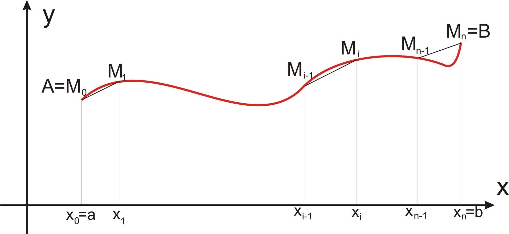

$$
L=\int_a^b\sqrt{1+\big(f'(x)\big)^2}\,dx.
$$

Arc length: <a href="https://openstax.org/books/calculus-volume-1/pages/6-4-arc-length-of-a-curve-and-surface-area">OpenStax Vol 1, 6.4</a>; extra practice: Stewart 8.1-8.4; see the <a href="../../readings/">reading map</a>.
Độ dài cung: <a href="https://openstax.org/books/calculus-volume-1/pages/6-4-arc-length-of-a-curve-and-surface-area">OpenStax Tập 1, 6.4</a>; luyện thêm: Stewart 8.1-8.4; xem <a href="../../readings/">bản đồ đọc</a>.

---

# Example: Arc LengthVí dụ: độ dài cung

Find the lengthTìm độ dài

$$
y=\frac{x^2}{2}-\frac{\ln x}{4},\qquad 1\le x\le3.
$$

DerivativeĐạo hàm

$$
y'=x-\frac{1}{4x}
$$

$$
\sqrt{1+(y')^2}=x+\frac{1}{4x}.
$$

$$
L=\int_1^3\left(x+\frac{1}{4x}\right)\,dx
=4+\frac14\ln3.
$$

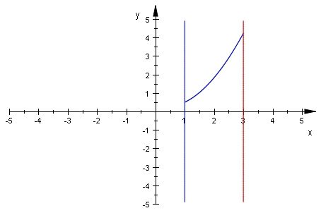

Arc length examples: <a href="https://openstax.org/books/calculus-volume-1/pages/6-4-arc-length-of-a-curve-and-surface-area">OpenStax Vol 1, 6.4</a>; extra practice: Stewart 8.1-8.4.
Ví dụ độ dài cung: <a href="https://openstax.org/books/calculus-volume-1/pages/6-4-arc-length-of-a-curve-and-surface-area">OpenStax Tập 1, 6.4</a>; luyện thêm: Stewart 8.1-8.4.

---
class: compact exercise-heavy
---

# Your Turn: Arc LengthTự luyện: độ dài cung

L1

Find the length of
Tìm độ dài của

$$
y=\frac{x^3}{12}+\frac1x,\qquad 1\le x\le4.
$$

L2

Find the length of
Tìm độ dài của

$$
y=\ln(1-x^2),\qquad -\frac12\le x\le\frac12.
$$

HintGợi ý

Both are chosen so the square root simplifies exactly.
Cả hai bài đều được chọn để căn bậc hai rút gọn đẹp.

AnswersĐáp số

L1: $6$ 
L2: $2\ln3-1$

Arc length practice: <a href="https://openstax.org/books/calculus-volume-1/pages/6-4-arc-length-of-a-curve-and-surface-area">OpenStax Vol 1, 6.4</a>; Stewart 8.1-8.4.
Luyện độ dài cung: <a href="https://openstax.org/books/calculus-volume-1/pages/6-4-arc-length-of-a-curve-and-surface-area">OpenStax Tập 1, 6.4</a>; Stewart 8.1-8.4.

---
class: compact
---

# Surface Area Of RevolutionDiện tích mặt tròn xoay

Unroll the surfaceTrải mặt ra

A small arc segment of length $ds$ rotating with radius $r$ sweeps out area approximately $2\pi r\,ds$.
Một đoạn cung nhỏ dài $ds$ quay với bán kính $r$ quét diện tích xấp xỉ $2\pi r\,ds$.

$$
S=2\pi\int_a^b f(x)\sqrt{1+\big(f'(x)\big)^2}\,dx
$$

for rotation about the $x$-axis.
khi quay quanh trục $x$.

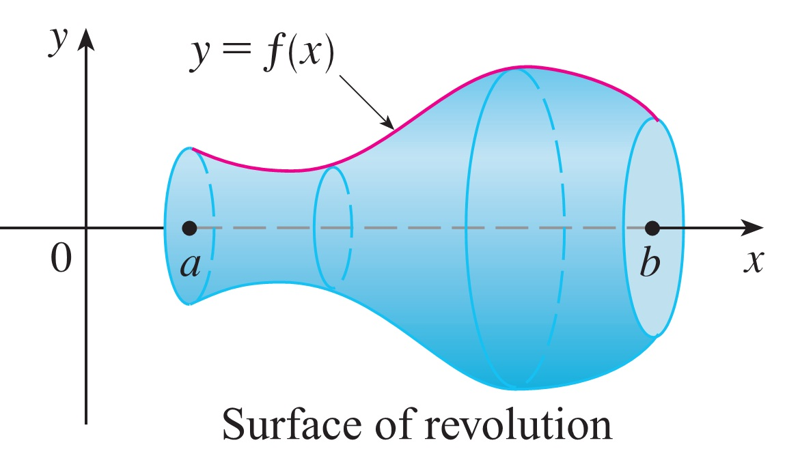

Surface area: <a href="https://openstax.org/books/calculus-volume-1/pages/6-4-arc-length-of-a-curve-and-surface-area">OpenStax Vol 1, 6.4</a>; extra practice: Stewart 8.1-8.4.
Diện tích mặt: <a href="https://openstax.org/books/calculus-volume-1/pages/6-4-arc-length-of-a-curve-and-surface-area">OpenStax Tập 1, 6.4</a>; luyện thêm: Stewart 8.1-8.4.

---

# Example: Surface AreaVí dụ: diện tích mặt

Rotate about the $x$-axisQuay quanh trục $x$

$$
y=\sin 2x,\qquad 0\le x\le\frac{\pi}{2}.
$$

Set upThiết lập

$$
y'=2\cos2x
$$

$$
S=2\pi\int_0^{\pi/2}\sin2x\sqrt{1+4\cos^2 2x}\,dx.
$$

SubstituteĐổi biến

$$
t=2\cos2x,\qquad dt=-4\sin2x\,dx
$$

$$
S=\pi\int_0^2\sqrt{1+t^2}\,dt
=\pi\left(\sqrt5+\frac12\ln(2+\sqrt5)\right).
$$

Surface-area setup: <a href="https://openstax.org/books/calculus-volume-1/pages/6-4-arc-length-of-a-curve-and-surface-area">OpenStax Vol 1, 6.4</a>; Stewart 8.1-8.4.
Thiết lập diện tích mặt: <a href="https://openstax.org/books/calculus-volume-1/pages/6-4-arc-length-of-a-curve-and-surface-area">OpenStax Tập 1, 6.4</a>; Stewart 8.1-8.4.

---
class: compact exercise-heavy
---

# Your Turn: Surface AreaTự luyện: diện tích mặt

6 min

ProblemBài toán

Find the area of the surface obtained by rotating
Tìm diện tích mặt tạo ra khi quay

$$
y=\sqrt{x^2+4},\qquad 0\le x\le1,
$$

about the $x$-axis.
quanh trục $x$.

AnswerĐáp số

$S=\pi\sqrt2\left(\sqrt3+2\ln\dfrac{1+\sqrt3}{\sqrt2}\right)$

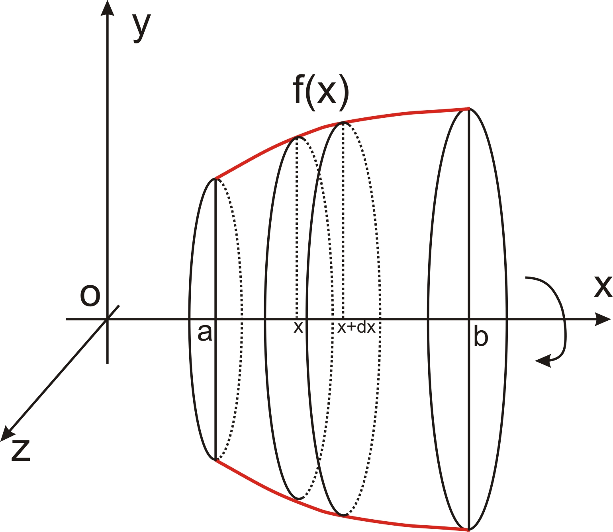

Surface-area practice: <a href="https://openstax.org/books/calculus-volume-1/pages/6-4-arc-length-of-a-curve-and-surface-area">OpenStax Vol 1, 6.4</a>; Stewart 8.1-8.4.
Luyện diện tích mặt: <a href="https://openstax.org/books/calculus-volume-1/pages/6-4-arc-length-of-a-curve-and-surface-area">OpenStax Tập 1, 6.4</a>; Stewart 8.1-8.4.

---
class: compact
---

# Applications: Slice, Add, InterpretỨng dụng: cắt nhỏ, cộng lại, diễn giải

One method for every modelMột phương pháp cho mọi mô hình

In every model we divide the quantity into small pieces, approximate each piece, and take a limit of the sums — a definite integral, read with its units.
Trong mọi mô hình, ta chia đại lượng thành các phần nhỏ, xấp xỉ từng phần, rồi qua giới hạn của các tổng — được một tích phân xác định, đọc kèm đơn vị.

<strong>1 · Spring1 · Lò xo</strong>
Work to stretch it 3 more cm?
Công kéo giãn thêm 3 cm?

<strong>2 · Dam2 · Đập nước</strong>
How hard do 16 m of water push?
16 m nước đẩy mạnh cỡ nào?

<strong>3 · Pricing3 · Định giá</strong>
7 years of income — worth what today?
7 năm thu nhập — hôm nay đáng bao nhiêu?

<strong>4 · Market4 · Thị trường</strong>
Who gains at one price?
Ai lợi khi chỉ có một giá?

<strong>5 · Clinic5 · Phòng khám</strong>
How many patients at month 15?
Tháng 15 còn bao nhiêu bệnh nhân?

Read: <a href="https://openstax.org/books/calculus-volume-1/pages/6-5-physical-applications">OpenStax Vol 1, 6.5</a>; <a href="https://activecalculus.org/single/sec-6-4-physics.html">Active Calculus 6.4</a>; Stewart 6.4, 8.3-8.4.
Đọc: <a href="https://openstax.org/books/calculus-volume-1/pages/6-5-physical-applications">OpenStax Tập 1, 6.5</a>; <a href="https://activecalculus.org/single/sec-6-4-physics.html">Active Calculus 6.4</a>; Stewart 6.4, 8.3-8.4.

---
class: compact
---

# Work: When The Force VariesCông: khi lực biến thiên

Work done by a constant forceCông của lực không đổi

A constant force $F$ acting over a distance $d$ does work $W=Fd$. Lifting a 1.2 kg book 0.7 m against gravity ($F=mg$, $g=9.8$ m/s²): $W=(1.2)(9.8)(0.7)\approx8.2$ J.
Lực không đổi $F$ trên quãng đường $d$ sinh công $W=Fd$. Nâng cuốn sách 1.2 kg lên 0.7 m thắng trọng lực ($F=mg$, $g=9.8$ m/s²): $W=(1.2)(9.8)(0.7)\approx8.2$ J.

A variable forceLực biến thiên

Divide $[a,b]$ into $n$ subintervals of width $\Delta x$, with a point $x_i^*$ in the $i$-th; there the force is nearly constant:
Chia $[a,b]$ thành $n$ đoạn con độ rộng $\Delta x$, chọn điểm $x_i^*$ trong đoạn thứ $i$; tại đó lực gần như không đổi:

$$
W_i\approx F(x_i^*)\,\Delta x
$$

Definition of workĐịnh nghĩa công

$$
W=\lim_{n\to\infty}\sum_{i=1}^{n}F(x_i^*)\,\Delta x=\int_a^b F(x)\,dx.
$$

This limit defines the work done by $F(x)$ from $a$ to $b$.
Giới hạn này định nghĩa công của lực $F(x)$ từ $a$ đến $b$.

Read: <a href="https://openstax.org/books/calculus-volume-1/pages/6-5-physical-applications">OpenStax Vol 1, 6.5</a>; <a href="https://activecalculus.org/single/sec-6-4-physics.html">Active Calculus 6.4</a>; Stewart 6.4 (Work).
Đọc: <a href="https://openstax.org/books/calculus-volume-1/pages/6-5-physical-applications">OpenStax Tập 1, 6.5</a>; <a href="https://activecalculus.org/single/sec-6-4-physics.html">Active Calculus 6.4</a>; Stewart 6.4 (Công).

---
class: compact
---

# Case 1 - Stretching A SpringTình huống 1 - kéo giãn lò xo

The question (Stewart 6.4)Câu hỏi (Stewart 6.4)

A force of 40 N is required to hold a spring that has been stretched from its natural length of 10 cm to a length of 15 cm. How much work is done in stretching the spring from 15 cm to 18 cm?
Cần lực 40 N để giữ lò xo giãn từ chiều dài tự nhiên 10 cm đến 15 cm. Tính công kéo giãn lò xo từ 15 cm đến 18 cm.

Hooke's lawĐịnh luật Hooke

The force needed to hold a spring stretched $x$ beyond its natural length is proportional to $x$: $F(x)=kx$ ($k$ = the spring constant), valid while $x$ is not too large.
Lực cần để giữ lò xo giãn $x$ so với chiều dài tự nhiên tỉ lệ thuận với $x$: $F(x)=kx$ ($k$ = hằng số lò xo), đúng khi $x$ không quá lớn.

1. Find $k$ from the given force1. Tìm $k$ từ lực đã cho

At 15 cm the extension is $0.05$ m, so $F(0.05)=40$:
Ở 15 cm, độ giãn là $0.05$ m, nên $F(0.05)=40$:

$$
40=k(0.05)\ \Rightarrow\ k=800\ \text{N/m},\qquad F(x)=800x.
$$

Read: <a href="https://openstax.org/books/calculus-volume-1/pages/6-5-physical-applications">OpenStax Vol 1, 6.5</a>; <a href="https://activecalculus.org/single/sec-6-4-physics.html">Active Calculus 6.4</a>; Stewart 6.4 (Work).
Đọc: <a href="https://openstax.org/books/calculus-volume-1/pages/6-5-physical-applications">OpenStax Tập 1, 6.5</a>; <a href="https://activecalculus.org/single/sec-6-4-physics.html">Active Calculus 6.4</a>; Stewart 6.4 (Công).

---
class: compact solution-slide
---

# Case 1 - Solve And CheckTình huống 1 - giải và kiểm tra

2. Integrate the force2. Tích phân lực

Stretching from 15 cm to 18 cm means the extension goes from $0.05$ m to $0.08$ m:
Kéo từ 15 cm đến 18 cm nghĩa là độ giãn đi từ $0.05$ m đến $0.08$ m:

$$
W=\int_{0.05}^{0.08}800x\,dx
=400x^2\Big|_{0.05}^{0.08}
=1.56\ \text{J}
$$

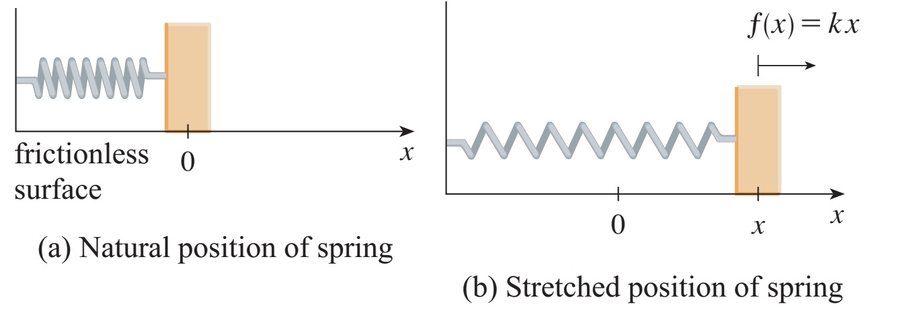

3. Interpret and check3. Diễn giải và kiểm tra
The work done is 1.56 J. As a check: the force grows linearly from 40 N to 64 N here, so its average is 52 N, and $52\times0.03=1.56$ J — the same answer.
Công thực hiện là 1.56 J. Kiểm tra lại: lực tăng tuyến tính từ 40 N đến 64 N trên đoạn này, trung bình là 52 N, và $52\times0.03=1.56$ J — cùng đáp số.

Read: <a href="https://openstax.org/books/calculus-volume-1/pages/6-5-physical-applications">OpenStax Vol 1, 6.5</a>; <a href="https://activecalculus.org/single/sec-6-4-physics.html">Active Calculus 6.4</a>; Stewart 6.4 (Work).
Đọc: <a href="https://openstax.org/books/calculus-volume-1/pages/6-5-physical-applications">OpenStax Tập 1, 6.5</a>; <a href="https://activecalculus.org/single/sec-6-4-physics.html">Active Calculus 6.4</a>; Stewart 6.4 (Công).

---
class: compact
---

# Case 2 - Water Against A DamTình huống 2 - nước đẩy mặt đập

The question (Stewart 8.3)Câu hỏi (Stewart 8.3)

A dam has the shape of a trapezoid: the height is 20 m, and the width is 50 m at the top and 30 m at the bottom. Find the force on the dam due to hydrostatic pressure if the water level is 4 m from the top. Here $\rho=1000$ kg/m³ is the density of water and $g=9.8$ m/s² is the acceleration due to gravity.
Một đập nước có dạng hình thang: cao 20 m, rộng 50 m ở đỉnh và 30 m ở đáy. Tìm áp lực thủy tĩnh lên đập, biết mực nước thấp hơn đỉnh đập 4 m. Ở đây $\rho=1000$ kg/m³ là khối lượng riêng của nước và $g=9.8$ m/s² là gia tốc trọng trường.

Why this is not straightforwardVì sao bài này không đơn giản

The pressure is not constant — it increases as the depth increases. So we first need to know how pressure depends on depth.
Áp suất không phải hằng số — nó tăng khi độ sâu tăng. Vì vậy trước hết ta cần biết áp suất phụ thuộc độ sâu như thế nào.

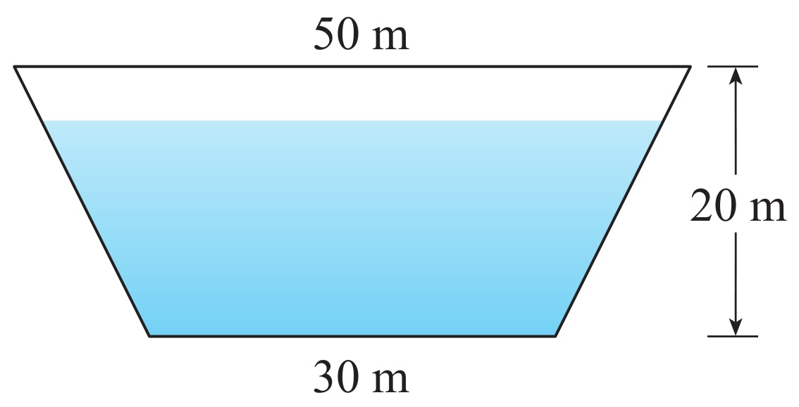

Read: <a href="https://openstax.org/books/calculus-volume-1/pages/6-5-physical-applications">OpenStax Vol 1, 6.5</a>; <a href="https://activecalculus.org/single/sec-6-4-physics.html">Active Calculus 6.4</a>; Stewart 8.3.
Đọc: <a href="https://openstax.org/books/calculus-volume-1/pages/6-5-physical-applications">OpenStax Tập 1, 6.5</a>; <a href="https://activecalculus.org/single/sec-6-4-physics.html">Active Calculus 6.4</a>; Stewart 8.3.

---
class: compact
---

# Pressure Under WaterÁp suất dưới nước

Pressure at depth $d$Áp suất ở độ sâu $d$

A horizontal plate of area $A$ at depth $d$ in a fluid of density $\rho$ carries mass $\rho Ad$, weight $\rho g\,Ad$ ($g$ = gravity's acceleration). Pressure = force per unit area:
Tấm ngang diện tích $A$ ở độ sâu $d$ trong chất lỏng có khối lượng riêng $\rho$ đỡ khối lượng $\rho Ad$, nặng $\rho g\,Ad$ ($g$ = gia tốc trọng trường). Áp suất = lực trên diện tích:

$$
P=\frac{F}{A}=\rho g\,d
$$

The same in all directionsNhư nhau theo mọi hướng

At any point in a liquid, the pressure is the same in all directions. So at depth $d$, a vertical surface also feels the pressure $\rho g\,d$.
Tại mỗi điểm trong chất lỏng, áp suất như nhau theo mọi hướng. Vậy ở độ sâu $d$, mặt thẳng đứng cũng chịu áp suất $\rho g\,d$.

Consequence: slice horizontallyHệ quả: cắt dải ngang

On a vertical face the pressure grows with depth. On a thin horizontal strip, however, the depth — and so the pressure — is essentially constant.
Trên mặt thẳng đứng, áp suất tăng theo độ sâu. Nhưng trên một dải ngang mỏng, độ sâu — và do đó áp suất — hầu như không đổi.

Read: <a href="https://openstax.org/books/calculus-volume-1/pages/6-5-physical-applications">OpenStax Vol 1, 6.5</a>; <a href="https://activecalculus.org/single/sec-6-4-physics.html">Active Calculus 6.4</a>; Stewart 8.3.
Đọc: <a href="https://openstax.org/books/calculus-volume-1/pages/6-5-physical-applications">OpenStax Tập 1, 6.5</a>; <a href="https://activecalculus.org/single/sec-6-4-physics.html">Active Calculus 6.4</a>; Stewart 8.3.

---
class: compact
---

# Force On A Submerged WallLực nước lên thành đứng

Force on one stripLực trên một dải

Let the wall be wet from depth $0$ to $H$, with width $L(x)$ at depth $x$. A strip there has area $L(x)\,dx$ and nearly constant pressure $\rho g\,x$:
Giả sử thành ướt từ độ sâu $0$ đến $H$, bề rộng ở độ sâu $x$ là $L(x)$. Dải tại đó có diện tích $L(x)\,dx$ và áp suất gần như không đổi $\rho g\,x$:

$$
dF=\rho g\,x\,L(x)\,dx
$$

Total hydrostatic forceTổng áp lực thủy tĩnh

Summing the strip forces and taking the limit of the Riemann sums:
Cộng lực trên các dải và qua giới hạn của tổng Riemann:

$$
F=\int_0^{H}\rho g\,x\,L(x)\,dx
$$

StrategyChiến lược

Choose the depth variable $x$, find the wet depth $H$, and find the width $L(x)$ from the geometry of the face.
Chọn biến độ sâu $x$, tìm độ sâu ướt $H$, và tìm bề rộng $L(x)$ từ hình học của mặt.

Read: <a href="https://openstax.org/books/calculus-volume-1/pages/6-5-physical-applications">OpenStax Vol 1, 6.5</a> (problem-solving strategy); <a href="https://activecalculus.org/single/sec-6-4-physics.html">Active Calculus 6.4</a>; Stewart 8.3.
Đọc: <a href="https://openstax.org/books/calculus-volume-1/pages/6-5-physical-applications">OpenStax Tập 1, 6.5</a> (chiến lược giải); <a href="https://activecalculus.org/single/sec-6-4-physics.html">Active Calculus 6.4</a>; Stewart 8.3.

---
class: compact solution-slide
---

# Case 2 - Slice: One Horizontal StripTình huống 2 - cắt: một dải ngang

1. Choose the axis1. Chọn trục

Choose a vertical $x$-axis with origin at the surface of the water, directed downward. The water is $20-4=16$ m deep, so $0\le x\le16$.
Chọn trục $x$ thẳng đứng, gốc tại mặt nước, hướng xuống dưới. Nước sâu $20-4=16$ m, nên $0\le x\le16$.

2. Width from similar triangles2. Bề rộng từ tam giác đồng dạng

Let $a$ be the horizontal overhang of the sloped edge beside the strip (see figure). From similar triangles,
Gọi $a$ là phần nhô ngang của cạnh xiên bên cạnh dải (xem hình). Từ tam giác đồng dạng,

$$
\frac{a}{16-x}=\frac{10}{20}
\ \Rightarrow\ L(x)=2(15+a)=46-x
$$

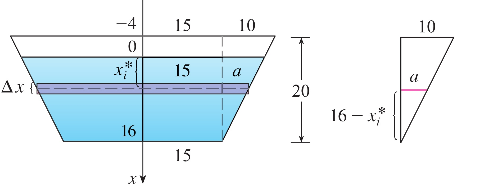

3. Force on the strip at depth $x$3. Lực trên dải ở độ sâu $x$

Here $\rho g=1000\times9.8=9800$:
Ở đây $\rho g=1000\times9.8=9800$:

$$
dF=\underbrace{\rho g\,x}_{P}\,\underbrace{L(x)\,dx}_{dA}=9800\,x(46-x)\,dx
$$

Read: <a href="https://openstax.org/books/calculus-volume-1/pages/6-5-physical-applications">OpenStax Vol 1, 6.5</a>; <a href="https://activecalculus.org/single/sec-6-4-physics.html">Active Calculus 6.4</a>; Stewart 8.3 (this is Example 2).
Đọc: <a href="https://openstax.org/books/calculus-volume-1/pages/6-5-physical-applications">OpenStax Tập 1, 6.5</a>; <a href="https://activecalculus.org/single/sec-6-4-physics.html">Active Calculus 6.4</a>; Stewart 8.3 (đây là Ví dụ 2).

---
class: compact solution-slide
---

# Case 2 - Add And InterpretTình huống 2 - cộng và diễn giải

4. Add the strip forces4. Cộng lực trên các dải

Adding the forces and taking the limit as $n\to\infty$:
Cộng các lực và qua giới hạn khi $n\to\infty$:

$$
F=\int_0^{16}9800\,x(46-x)\,dx
=9800\left[23x^2-\frac{x^3}{3}\right]_0^{16}
$$

$$
=9800\left(5888-\tfrac{4096}{3}\right)
\approx4.43\times10^7\ \text{N}
$$

5. Interpret5. Diễn giải

About $4.4\times10^7$ N — the weight of roughly 4500 tonnes. Since $x(46-x)$ increases up to $x=16$, the deepest strips carry the largest forces, even though the dam is narrower there.
Khoảng $4.4\times10^7$ N — bằng trọng lượng cỡ 4500 tấn. Vì $x(46-x)$ tăng đến tận $x=16$, các dải sâu nhất chịu lực lớn nhất, dù đập ở đó hẹp hơn.

A common errorMột lỗi thường gặp

In $P=\rho g\,x$, depth is measured from the water surface, not from the top of the dam.
Trong $P=\rho g\,x$, độ sâu được đo từ mặt nước, không phải từ đỉnh đập.

Read: <a href="https://openstax.org/books/calculus-volume-1/pages/6-5-physical-applications">OpenStax Vol 1, 6.5</a>; <a href="https://activecalculus.org/single/sec-6-4-physics.html">Active Calculus 6.4</a>; Stewart 8.3 (this is Example 2).
Đọc: <a href="https://openstax.org/books/calculus-volume-1/pages/6-5-physical-applications">OpenStax Tập 1, 6.5</a>; <a href="https://activecalculus.org/single/sec-6-4-physics.html">Active Calculus 6.4</a>; Stewart 8.3 (đây là Ví dụ 2).

---
class: compact
---

# Money Through TimeTiền theo dòng thời gian

Continuous compoundingGhép lãi liên tục

Compounded $n$ times a year at annual interest rate $r$, a deposit $PV$ (present value) grows after $t$ years to the future value $FV$. Letting $n\to\infty$:
Ghép lãi $n$ lần mỗi năm với lãi suất năm $r$, khoản gửi $PV$ (hiện giá) sau $t$ năm tăng thành giá trị tương lai $FV$. Cho $n\to\infty$:

$$
FV=PV\left(1+\frac{r}{n}\right)^{nt}
\ \xrightarrow{\ n\to\infty\ }\ PV\,e^{rt}
$$

Present valueHiện giá

The present value of $K$ dollars payable $t$ years from now is $Ke^{-rt}$ — the deposit today that grows to $K$.
Hiện giá của $K$ đô-la nhận sau $t$ năm là $Ke^{-rt}$ — khoản gửi hôm nay sẽ tăng thành $K$.

SummaryTóm tắt

Multiply by $e^{rt}$ to move money $t$ years forward in time; multiply by $e^{-rt}$ to move it back to today ($e$ enters through the limit above).
Nhân với $e^{rt}$ để chuyển tiền tới $t$ năm sau; nhân với $e^{-rt}$ để chuyển ngược về hôm nay (số $e$ xuất hiện qua giới hạn ở trên).

Continuous money streams: instructor notes — see <a href="../../readings/">course readings</a>; related: Stewart 8.4.
Dòng tiền liên tục: ghi chú môn học — xem <a href="../../readings/">tài liệu đọc của môn</a>; đọc thêm: Stewart 8.4.

---
class: compact
---

# Value Of An Income StreamGiá trị của dòng thu nhập

One small depositMột khoản gửi nhỏ

$f(t)$ = the deposit rate, $r$ = the interest rate. The deposit in $[t,\,t+dt]$ is about $f(t)\,dt$; its present value is
$f(t)$ = tốc độ gửi tiền, $r$ = lãi suất. Khoản gửi trong $[t,\,t+dt]$ xấp xỉ $f(t)\,dt$; hiện giá của nó là

$$
dPV=f(t)\,e^{-rt}\,dt
$$

Present value of the streamHiện giá của dòng tiền

$$
PV=\int_0^{T}f(t)\,e^{-rt}\,dt
$$

Future value of the streamGiá trị tương lai của dòng tiền
Each deposit still earns interest for $T-t$ more years (try X2):
Mỗi khoản gửi còn sinh lãi thêm $T-t$ năm (thử X2):

$$
FV=\int_0^{T}f(t)\,e^{r(T-t)}\,dt
$$

Continuous money streams: instructor notes — see <a href="../../readings/">course readings</a>; related: Stewart 8.4.
Dòng tiền liên tục: ghi chú môn học — xem <a href="../../readings/">tài liệu đọc của môn</a>; đọc thêm: Stewart 8.4.

---
class: compact
---

# Case 3 - Pricing A MachineTình huống 3 - định giá cỗ máy

The questionCâu hỏi

A machine generates income at the rate $f(t)=15-2t$ million dollars per year, $0\le t\le7$. Money can be invested at 8% compounded continuously. Find the machine's fair market price.
Một cỗ máy tạo thu nhập với tốc độ $f(t)=15-2t$ triệu đô-la mỗi năm, $0\le t\le7$. Tiền có thể đầu tư với lãi suất 8% ghép liên tục. Tìm giá thị trường hợp lý của máy.

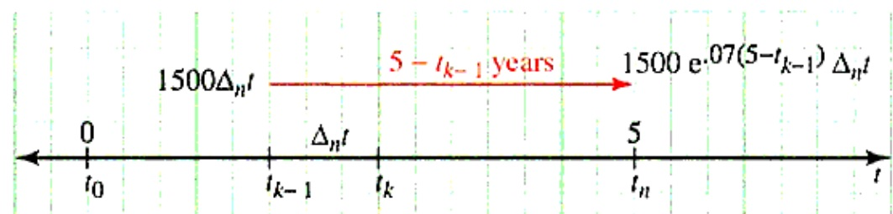

Fair price = present valueGiá hợp lý = hiện giá

The fair price is the present value of the machine's income. Substitute $f(t)=15-2t$, $r=0.08$, $T=7$:
Giá hợp lý là hiện giá của dòng thu nhập của máy. Thế $f(t)=15-2t$, $r=0.08$, $T=7$:

$$
PV=\int_0^7(15-2t)\,e^{-0.08t}\,dt
$$

Continuous money streams: instructor notes — see <a href="../../readings/">course readings</a>; related: Stewart 8.4.
Dòng tiền liên tục: ghi chú môn học — xem <a href="../../readings/">tài liệu đọc của môn</a>; đọc thêm: Stewart 8.4.

---
class: compact solution-slide
---

# Case 3 - Solve: Present ValueTình huống 3 - giải: hiện giá

1. Integrate by parts1. Tích phân từng phần

Take $u=15-2t$, $dv=e^{-0.08t}dt$, so $du=-2\,dt$ and $v=-12.5\,e^{-0.08t}$:
Chọn $u=15-2t$, $dv=e^{-0.08t}dt$, suy ra $du=-2\,dt$ và $v=-12.5\,e^{-0.08t}$:

$$
\int(15-2t)e^{-0.08t}dt
=-12.5(15-2t)e^{-0.08t}-25\!\int e^{-0.08t}dt
$$

$$
=e^{-0.08t}(25t+125)
$$

2. Evaluate and check2. Thế cận và kiểm tra

$$
PV=\Big[e^{-0.08t}(25t+125)\Big]_0^7
=300e^{-0.56}-125\approx46.36
$$

Check: differentiating $e^{-0.08t}(25t+125)$ gives back $(15-2t)e^{-0.08t}$.
Kiểm tra: đạo hàm $e^{-0.08t}(25t+125)$ trả lại đúng $(15-2t)e^{-0.08t}$.

3. Interpret3. Diễn giải
The fair price is about 46.4 million dollars. In total the machine pays $\int_0^7(15-2t)\,dt=56$ million; discounting at 8% reduces its value today to 46.4 million.
Giá hợp lý xấp xỉ 46.4 triệu đô-la. Tổng cộng cỗ máy trả $\int_0^7(15-2t)\,dt=56$ triệu; chiết khấu 8% đưa giá trị hôm nay về 46.4 triệu.

Continuous money streams: instructor notes — see <a href="../../readings/">course readings</a>; related: Stewart 8.4.
Dòng tiền liên tục: ghi chú môn học — xem <a href="../../readings/">tài liệu đọc của môn</a>; đọc thêm: Stewart 8.4.

---
class: compact
---

# Case 4 - A Tire MarketTình huống 4 - thị trường lốp xe

The questionCâu hỏi

Wholesalers will buy $q$ thousand tires when the price is $p=D(q)=90-0.1q^2$ dollars per tire, and producers will supply $q$ thousand tires when the price is $p=S(q)=0.2q^2+q+50$. Find the equilibrium price and the consumer's and producer's surplus there.
Nhà bán sỉ sẽ mua $q$ nghìn lốp khi giá là $p=D(q)=90-0.1q^2$ đô-la/lốp, và nhà sản xuất sẽ cung ứng $q$ nghìn lốp khi giá là $p=S(q)=0.2q^2+q+50$. Tìm giá cân bằng cùng thặng dư tiêu dùng và thặng dư sản xuất tại đó.

Demand and supply curvesĐường cầu và đường cung

The demand curve $p=D(q)$ gives the price per unit at which $q$ units can be sold; it decreases as $q$ increases. The supply curve $p=S(q)$ gives the price at which producers will supply $q$ units; it increases.
Đường cầu $p=D(q)$ cho mức giá mỗi đơn vị mà tại đó bán được $q$ đơn vị; nó giảm khi $q$ tăng. Đường cung $p=S(q)$ cho mức giá mà tại đó nhà sản xuất cung ứng $q$ đơn vị; nó tăng.

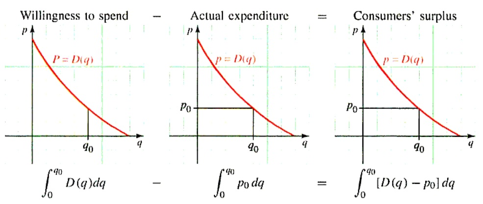

Read: Stewart 8.4 (consumer surplus); notes on <a href="../../readings/">course readings</a>.
Đọc: Stewart 8.4 (thặng dư tiêu dùng); ghi chú trên <a href="../../readings/">tài liệu đọc của môn</a>.

---
class: compact
---

# Why Surplus Is An AreaVì sao thặng dư là diện tích

Consumer surplusThặng dư tiêu dùng

Suppose $q_0$ units sell, all at one price $p_0$. Buyers of the $dq$ units near $q$ would have paid $D(q)$ each — saving $(D(q)-p_0)\,dq$. Total saving = consumer surplus:
Giả sử bán được $q_0$ đơn vị, cùng một giá $p_0$. Người mua $dq$ đơn vị quanh mức $q$ chịu trả tới $D(q)$ — tiết kiệm $(D(q)-p_0)\,dq$. Tổng tiết kiệm = thặng dư tiêu dùng:

$$
CS=\int_0^{q_0}\big(D(q)-p_0\big)\,dq
$$

Producer surplusThặng dư sản xuất

Producers would have supplied unit $q$ at the price $S(q)$ but receive $p_0$. Their total gain is the producer surplus:
Nhà sản xuất sẵn lòng cung ứng đơn vị thứ $q$ với giá $S(q)$ nhưng nhận được $p_0$. Tổng phần lời của họ là thặng dư sản xuất:

$$
PS=\int_0^{q_0}\big(p_0-S(q)\big)\,dq
$$

As areasDưới dạng diện tích
$CS$ is the area between the demand curve and the line $p=p_0$; $PS$ is the area between $p=p_0$ and the supply curve — both from $0$ to $q_0$.
$CS$ là diện tích giữa đường cầu và đường thẳng $p=p_0$; $PS$ là diện tích giữa $p=p_0$ và đường cung — đều tính từ $0$ đến $q_0$.

Read: Stewart 8.4 (consumer surplus); notes on <a href="../../readings/">course readings</a>.
Đọc: Stewart 8.4 (thặng dư tiêu dùng); ghi chú trên <a href="../../readings/">tài liệu đọc của môn</a>.

---
class: compact solution-slide
---

# Case 4 - Equilibrium: One PriceTình huống 4 - cân bằng: một mức giá

1. Supply equals demand1. Cung bằng cầu

$$
D(q)=S(q)\ \Rightarrow\ 0.3q^2+q-40=0
$$

$$
q_0=10,\qquad p_0=D(10)=80
$$

(the negative root $q=-40/3$ is rejected).
(loại nghiệm âm $q=-40/3$).

What the surpluses measureThặng dư đo điều gì

All $q_0$ units sell at the single price $p_0=80$ — yet buyers of earlier units were willing to pay more, and producers of earlier units to accept less. The surpluses measure these gains.
Cả $q_0$ đơn vị đều bán ở một mức giá $p_0=80$ — nhưng người mua các đơn vị đầu sẵn lòng trả cao hơn, và nhà sản xuất các đơn vị đầu chấp nhận thấp hơn. Thặng dư đo các phần lợi này.

Read: Stewart 8.4 (consumer surplus); notes on <a href="../../readings/">course readings</a>.
Đọc: Stewart 8.4 (thặng dư tiêu dùng); ghi chú trên <a href="../../readings/">tài liệu đọc của môn</a>.

---
class: compact solution-slide
---

# Case 4 - Compute The SurplusesTình huống 4 - tính hai thặng dư

2. Consumer surplus2. Thặng dư tiêu dùng

Substitute $D(q)=90-0.1q^2$, $p_0=80$, $q_0=10$ into the boxed formula:
Thế $D(q)=90-0.1q^2$, $p_0=80$, $q_0=10$ vào công thức đã đóng khung:

$$
CS=\int_0^{10}\big(10-0.1q^2\big)\,dq=\frac{200}{3}
$$

3. Producer surplus3. Thặng dư sản xuất

And $S(q)=0.2q^2+q+50$ into the formula for $PS$:
Và $S(q)=0.2q^2+q+50$ vào công thức của $PS$:

$$
PS=\int_0^{10}\big(30-q-0.2q^2\big)\,dq=\frac{550}{3}
$$

4. Interpret4. Diễn giải
Units: thousands of dollars. $CS\approx66.7$, $PS\approx183.3$ — producers gain more, since supply starts 30 below the price and demand only 10 above.
Đơn vị: nghìn đô-la. $CS\approx66.7$, $PS\approx183.3$ — nhà sản xuất lợi hơn, vì đường cung thấp hơn giá 30 còn đường cầu chỉ cao hơn 10.

Read: Stewart 8.4 (consumer surplus); notes on <a href="../../readings/">course readings</a>.
Đọc: Stewart 8.4 (thặng dư tiêu dùng); ghi chú trên <a href="../../readings/">tài liệu đọc của môn</a>.

---
class: compact
---

# Case 5 - A Clinic With ArrivalsTình huống 5 - phòng khám có bệnh nhân mới

The questionCâu hỏi

A new clinic accepts 300 patients when it opens. The fraction of patients still receiving treatment $t$ months after joining is $f(t)=e^{-t/20}$, and new patients arrive at the rate of 10 per month. How many patients will be in treatment 15 months from now?
Một phòng khám mới nhận 300 bệnh nhân khi mở cửa. Tỉ lệ bệnh nhân còn được điều trị $t$ tháng sau khi vào là $f(t)=e^{-t/20}$, và bệnh nhân mới đến với tốc độ 10 người mỗi tháng. Hỏi 15 tháng nữa có bao nhiêu bệnh nhân đang được điều trị?

Two groups of patientsHai nhóm bệnh nhân

At month 15 there are two kinds of patients: the remaining originals, and later arrivals. A patient admitted at time $t$ has then been treated for only $15-t$ months.
Ở tháng 15 có hai nhóm bệnh nhân: những người ban đầu còn lại, và những người vào sau. Bệnh nhân vào ở thời điểm $t$ khi đó mới được điều trị $15-t$ tháng.

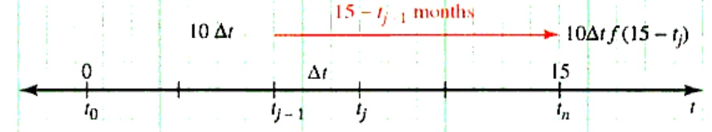

Survival-and-renewal models: instructor notes — see <a href="../../readings/">course readings</a>; related: Stewart 8.4.
Mô hình tồn tại và bổ sung: ghi chú môn học — xem <a href="../../readings/">tài liệu đọc của môn</a>; đọc thêm: Stewart 8.4.

---
class: compact solution-slide
---

# Survival And Renewal: The FormulaTồn tại và bổ sung: công thức

The original groupNhóm ban đầu

A group starts with $P_0$ members, and $f(t)$ is the fraction that remains $t$ months after joining. Of the originals, $P_0\,f(T)$ remain at time $T$.
Một nhóm bắt đầu với $P_0$ thành viên, và $f(t)$ là tỉ lệ còn lại $t$ tháng sau khi vào. Trong nhóm ban đầu, còn $P_0\,f(T)$ ở thời điểm $T$.

The arrivalsNhóm vào sau

Of the $r(t)\,dt$ members arriving during $[t,\,t+dt]$, the fraction $f(T-t)$ remains at time $T$:
Trong $r(t)\,dt$ thành viên vào lúc $[t,\,t+dt]$, tỉ lệ $f(T-t)$ còn lại ở thời điểm $T$:

$$
dP=r(t)\,f(T-t)\,dt
$$

Population at time $T$Số lượng ở thời điểm $T$

$$
P(T)=P_0\,f(T)+\int_0^{T}r(t)\,f(T-t)\,dt
$$

Survival-and-renewal models: instructor notes — see <a href="../../readings/">course readings</a>; related: Stewart 8.4.
Mô hình tồn tại và bổ sung: ghi chú môn học — xem <a href="../../readings/">tài liệu đọc của môn</a>; đọc thêm: Stewart 8.4.

---
class: compact solution-slide
---

# Case 5 - Apply The FormulaTình huống 5 - áp dụng công thức

Identify the ingredientsXác định các thành phần

$P_0=300$, arrival rate $r(t)=10$ patients per month, survival fraction $f(t)=e^{-t/20}$, and $T=15$ months.
$P_0=300$, tốc độ vào $r(t)=10$ bệnh nhân mỗi tháng, tỉ lệ còn lại $f(t)=e^{-t/20}$, và $T=15$ tháng.

Why $f(15-t)$, not $f(t)$Vì sao là $f(15-t)$, không phải $f(t)$

A patient admitted at time $t$ has been in treatment for $15-t$ months at month 15, so the fraction remaining is $f(15-t)$.
Bệnh nhân vào ở thời điểm $t$ thì đến tháng 15 mới điều trị được $15-t$ tháng, nên tỉ lệ còn lại là $f(15-t)$.

The number to evaluateBiểu thức cần tính

$$
P(15)=300\,e^{-15/20}+\int_0^{15}10\,e^{-(15-t)/20}\,dt
$$

Survival-and-renewal models: instructor notes — see <a href="../../readings/">course readings</a>; related: Stewart 8.4.
Mô hình tồn tại và bổ sung: ghi chú môn học — xem <a href="../../readings/">tài liệu đọc của môn</a>; đọc thêm: Stewart 8.4.

---
class: compact solution-slide
---

# Case 5 - Solve And Look AheadTình huống 5 - giải và nhìn xa hơn

1. Evaluate the integral1. Tính tích phân

Substitute $u=15-t$, $du=-dt$; the limits $t:0\to15$ become $u:15\to0$:
Đổi biến $u=15-t$, $du=-dt$; cận $t:0\to15$ thành $u:15\to0$:

$$
\int_0^{15}10\,e^{-(15-t)/20}\,dt
=\int_0^{15}10\,e^{-u/20}\,du
=200\big(1-e^{-0.75}\big)
$$

2. Count both groups2. Đếm cả hai nhóm

$$
P(15)=300e^{-0.75}+200\big(1-e^{-0.75}\big)
$$

$$
\approx141.7+105.5\approx247
$$

About 247 patients will be in treatment.
Khoảng 247 bệnh nhân đang được điều trị.

3. Look ahead3. Nhìn xa hơn
As $T\to\infty$ the originals tend to $0$ and the arrivals term to $200$ = rate × average stay ($\int_0^\infty e^{-t/20}dt=20$ months): the clinic approaches a steady 200 patients.
Khi $T\to\infty$, nhóm cũ tiến về $0$ còn nhóm vào sau tiến về $200$ = tốc độ vào × thời gian ở trung bình ($\int_0^\infty e^{-t/20}dt=20$ tháng): phòng khám tiến về mức ổn định 200 bệnh nhân.

Survival-and-renewal models: instructor notes — see <a href="../../readings/">course readings</a>; related: Stewart 8.4.
Mô hình tồn tại và bổ sung: ghi chú môn học — xem <a href="../../readings/">tài liệu đọc của môn</a>; đọc thêm: Stewart 8.4.

---
class: compact
---

# Five Models, One RecipeNăm mô hình, một công thức chung

<strong>SpringLò xo</strong>
force × small stretch
lực × đoạn giãn nhỏ

$$
dW=kx\,dx
$$

<strong>DamĐập nước</strong>
pressure × strip area
áp suất × diện tích dải

$$
dF=\rho g\,x\,L(x)\,dx
$$

<strong>PricingĐịnh giá</strong>
deposit, discounted
khoản gửi, đã chiết khấu

$$
dPV=f(t)\,e^{-rt}\,dt
$$

<strong>MarketThị trường</strong>
saving on each unit
khoản lời trên từng đơn vị

$$
dCS=\big(D(q)-p_0\big)\,dq
$$

<strong>ClinicPhòng khám</strong>
arrivals × fraction left
người vào × tỉ lệ còn lại

$$
dP=r(t)\,f(T-t)\,dt
$$

Check units firstKiểm tra đơn vị trước

Write the small piece first and check its units; wrong units mean a wrong integral.
Hãy viết phần nhỏ trước và kiểm tra đơn vị của nó; đơn vị sai nghĩa là tích phân sai.

Read: <a href="https://openstax.org/books/calculus-volume-1/pages/6-5-physical-applications">OpenStax Vol 1, 6.5</a>; <a href="https://activecalculus.org/single/sec-6-4-physics.html">Active Calculus 6.4</a>; Stewart 6.4, 8.3-8.4.
Đọc: <a href="https://openstax.org/books/calculus-volume-1/pages/6-5-physical-applications">OpenStax Tập 1, 6.5</a>; <a href="https://activecalculus.org/single/sec-6-4-physics.html">Active Calculus 6.4</a>; Stewart 6.4, 8.3-8.4.

---
class: compact exercise-heavy
---

# Your Turn: Applications ITự luyện: ứng dụng I

X1

When a particle is located a distance $x$ metres from the origin, a force of $x^2+2x$ newtons acts on it. How much work is done in moving it from $x=1$ to $x=3$?
Khi chất điểm cách gốc tọa độ $x$ mét, một lực $x^2+2x$ newton tác dụng lên nó. Hỏi cần bao nhiêu công để di chuyển nó từ $x=1$ đến $x=3$?

X2

You deposit 1200 dollars per year continuously into an account paying 6% per year, compounded continuously. How much is in the account after 10 years?
Bạn gửi liên tục 1200 đô-la mỗi năm vào tài khoản lãi suất 6%/năm, ghép lãi liên tục. Sau 10 năm tài khoản có bao nhiêu?

HintsGợi ý

X1: apply the definition of work. X2: a deposit made at time $t$ grows for $10-t$ years, so $dFV=1200e^{0.06(10-t)}\,dt$.
X1: áp dụng định nghĩa của công. X2: khoản gửi lúc $t$ sinh lãi trong $10-t$ năm, nên $dFV=1200e^{0.06(10-t)}\,dt$.

AnswersĐáp số

X1: $W=\dfrac{50}{3}\approx16.7$ J 
X2: $FV=20000\big(e^{0.6}-1\big)\approx16442$

Practice: <a href="https://openstax.org/books/calculus-volume-1/pages/6-5-physical-applications">OpenStax Vol 1, 6.5</a>; Stewart 6.4 (X1 is Example 1).
Luyện tập: <a href="https://openstax.org/books/calculus-volume-1/pages/6-5-physical-applications">OpenStax Tập 1, 6.5</a>; Stewart 6.4 (X1 là Ví dụ 1).

---
class: compact exercise-heavy
---

# Your Turn: Applications IITự luyện: ứng dụng II

X3

Marginal cost $C'(x)=0.1x^2+4x+10$, marginal revenue $R'(x)=70-x$ (thousand dollars/unit). Find $x_m$ where they are equal, and the net earnings $\int_0^{x_m}\big(R'-C'\big)\,dx$.
Chi phí biên $C'(x)=0.1x^2+4x+10$, doanh thu biên $R'(x)=70-x$ (nghìn đô-la/đơn vị). Tìm $x_m$ tại đó chúng bằng nhau, và lợi nhuận ròng $\int_0^{x_m}\big(R'-C'\big)\,dx$.

X4

Blood at distance $r$ from the axis of an artery of radius $R$ flows at speed $S(r)=k(R^2-r^2)$, where $k$ is a constant. Slicing the cross-section into thin rings, find the volume rate of blood flow.
Máu ở cách trục động mạch (bán kính $R$) một khoảng $r$ chảy với tốc độ $S(r)=k(R^2-r^2)$, với $k$ là hằng số. Cắt tiết diện thành các vành mỏng, tìm lưu lượng máu chảy qua động mạch.

HintsGợi ý

X3: solve $C'(x)=R'(x)$, reject the negative root. X4: a ring at radius $r$ has area $2\pi r\,dr$, and all of it moves at speed $S(r)$.
X3: giải $C'(x)=R'(x)$, loại nghiệm âm. X4: vành ở bán kính $r$ có diện tích $2\pi r\,dr$, và cả vành chuyển động với tốc độ $S(r)$.

AnswersĐáp số

X3: $x_m=10$; $\displaystyle\int_0^{10}\big(R'-C'\big)\,dx=\dfrac{950}{3}\approx316.7$ 
X4: $\dfrac{\pi kR^4}{2}$

Practice: Stewart 8.4 (blood flow); notes on <a href="../../readings/">course readings</a>.
Luyện tập: Stewart 8.4 (dòng máu); ghi chú trên <a href="../../readings/">tài liệu đọc của môn</a>.

---
class: compact exercise-heavy
---

# Mixed Practice I: SetupsLuyện tập tổng hợp I: thiết lập

M1 Area

Set up, but do not evaluate, the area between
Thiết lập, chưa cần tính, diện tích giữa

$$
y=4-x^2,\qquad y=1.
$$

M2 Washer

Set up the volume when the M1 region is rotated about the $x$-axis.
Thiết lập thể tích khi miền M1 quay quanh trục $x$.

M3 Shell

Set up the volume when the M1 region in $x\ge0$ rotates about the $y$-axis.
Thiết lập thể tích khi phần M1 với $x\ge0$ quay quanh trục $y$.

M4 Compare

Which setup uses fewer algebraic pieces: washers or shells?
Thiết lập nào ít phần đại số hơn: vòng đệm hay vỏ trụ?

GoalMục tiêu

Do not rush to integrate. First decide the axis, the slice direction, and the radius/height.
Đừng vội tính. Trước hết xác định trục quay, hướng lát cắt, và bán kính/chiều cao.

Setup practice: <a href="https://activecalculus.org/single/sec-6-1-area.html">Active Calculus 6.1</a>-<a href="https://activecalculus.org/single/sec-6-2-volume.html">6.2</a>; <a href="https://openstax.org/books/calculus-volume-1/pages/6-1-areas-between-curves">OpenStax 6.1</a>-<a href="https://openstax.org/books/calculus-volume-1/pages/6-3-volumes-of-revolution-cylindrical-shells">6.3</a>; Stewart 6.1-6.3.
Luyện thiết lập: <a href="https://activecalculus.org/single/sec-6-1-area.html">Active Calculus 6.1</a>-<a href="https://activecalculus.org/single/sec-6-2-volume.html">6.2</a>; <a href="https://openstax.org/books/calculus-volume-1/pages/6-1-areas-between-curves">OpenStax 6.1</a>-<a href="https://openstax.org/books/calculus-volume-1/pages/6-3-volumes-of-revolution-cylindrical-shells">6.3</a>; Stewart 6.1-6.3.

---
class: compact exercise-heavy
---

# Mixed Practice II: ComputeLuyện tập tổng hợp II: tính toán

C1

Area between $y=x-x^2$ and $y=x\sqrt{1-x}$.
Diện tích giữa $y=x-x^2$ và $y=x\sqrt{1-x}$.

C2

Volume from rotating $y=\sqrt{x}$, $0\le x\le4$, about the $x$-axis.
Thể tích khi quay $y=\sqrt{x}$, $0\le x\le4$, quanh trục $x$.

C3

Arc length of $y=\frac{x^3}{12}+\frac1x$, $1\le x\le4$.
Độ dài cung của $y=\frac{x^3}{12}+\frac1x$, $1\le x\le4$.

C4

Surface area for $y=\sqrt{x^2+4}$, $0\le x\le1$, about the $x$-axis.
Diện tích mặt của $y=\sqrt{x^2+4}$, $0\le x\le1$, quay quanh trục $x$.

Mixed practice: use the <a href="../../readings/">Session 9 reading map</a>; OpenStax 6.1-6.4 and Stewart 6.1-6.5, 8.1-8.4 are the student practice anchors.
Luyện tổng hợp: dùng <a href="../../readings/">bản đồ đọc Buổi 9</a>; OpenStax 6.1-6.4 và Stewart 6.1-6.5, 8.1-8.4 là nguồn bài tập chính.

---

# Decision ChartBảng chọn phương pháp

<strong>AreaDiện tích</strong>
Vertical slice: top minus bottom.
Lát dọc: trên trừ dưới.

$$
\int(\text{top}-\text{bottom})\,dx
$$

<strong>WasherVòng đệm</strong>
Slice perpendicular to rotation axis.
Lát vuông góc với trục quay.

$$
\pi\int(R^2-r^2)
$$

<strong>ShellVỏ trụ</strong>
Slice parallel to rotation axis.
Lát song song với trục quay.

$$
2\pi\int rh
$$

<strong>Length / SurfaceĐộ dài / mặt</strong>
Build from arc length.
Xây từ độ dài cung.

$$
ds=\sqrt{1+(y')^2}\,dx
$$

The most common errorLỗi thường gặp nhất

Using the right formula with the wrong radius or wrong interval.
Dùng đúng công thức nhưng sai bán kính hoặc sai khoảng lấy tích phân.

Review map: <a href="https://activecalculus.org/single/sec-6-1-area.html">Active Calculus 6.1</a>-<a href="https://activecalculus.org/single/sec-6-2-volume.html">6.2</a>; <a href="https://openstax.org/books/calculus-volume-1/pages/6-1-areas-between-curves">OpenStax 6.1</a>-<a href="https://openstax.org/books/calculus-volume-1/pages/6-4-arc-length-of-a-curve-and-surface-area">6.4</a>; Stewart 6.1-6.5, 8.1-8.4.
Bản đồ ôn tập: <a href="https://activecalculus.org/single/sec-6-1-area.html">Active Calculus 6.1</a>-<a href="https://activecalculus.org/single/sec-6-2-volume.html">6.2</a>; <a href="https://openstax.org/books/calculus-volume-1/pages/6-1-areas-between-curves">OpenStax 6.1</a>-<a href="https://openstax.org/books/calculus-volume-1/pages/6-4-arc-length-of-a-curve-and-surface-area">6.4</a>; Stewart 6.1-6.5, 8.1-8.4.

---

# Reading And Practice SourcesNguồn đọc và luyện tập

<strong>Boelkins, M.</strong>&nbsp;
<em>Active Calculus</em> (2nd ed.), Sections 6.1, 6.2, 6.4.
<em>Active Calculus</em> (ấn bản thứ 2), Mục 6.1, 6.2, 6.4.

<strong>Strang, G., & Herman, E. "Jed".</strong>&nbsp;
<em>Calculus Volume 1</em>, OpenStax, Sections 6.1-6.6.
<em>Calculus Volume 1</em>, OpenStax, Mục 6.1-6.6.

<strong>Stewart, J.</strong>&nbsp;
<em>Calculus: Early Transcendentals</em> (8th ed., metric version), Sections 6.1-6.5 and 8.1-8.4.
<em>Calculus: Early Transcendentals</em> (ấn bản thứ 8, bản metric), Mục 6.1-6.5 và 8.1-8.4.

<strong>Lê Xuân Đại.</strong>&nbsp;
HCMUT lecture slides: physical applications; applications to business, economics, and life sciences (source of the five application cases).
Slide bài giảng ĐHBK TP.HCM: ứng dụng vật lý; ứng dụng trong kinh doanh, kinh tế và khoa học sự sống (nguồn của năm tình huống ứng dụng).

<strong>Instructor notes.Ghi chú của giảng viên.</strong>&nbsp;
Local examples and extra exercises adapted for MT1003 Calculus 1.
Ví dụ và bài tập bổ sung được điều chỉnh cho MT1003 Giải tích 1.

Full map: <a href="../../readings/">course readings</a>. Use section titles if a Stewart edition has different numbering.
Bản đồ đầy đủ: <a href="../../readings/">tài liệu đọc của môn</a>. Nếu phiên bản Stewart khác số mục, hãy dùng tên mục.

