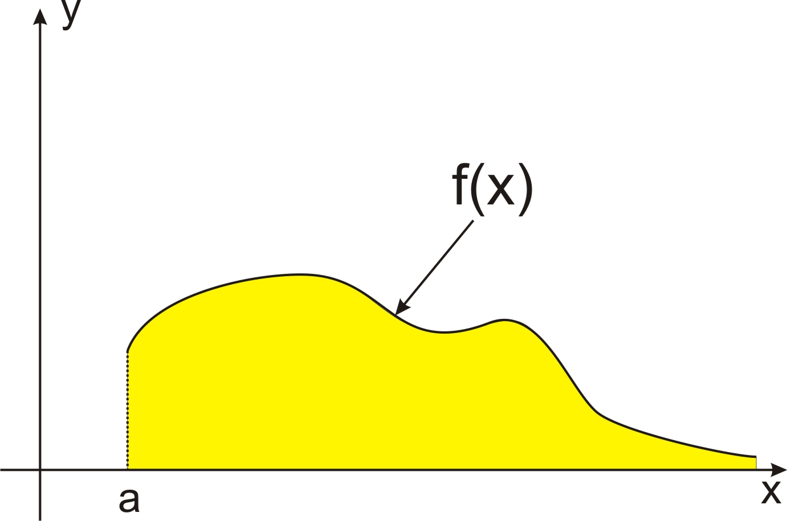
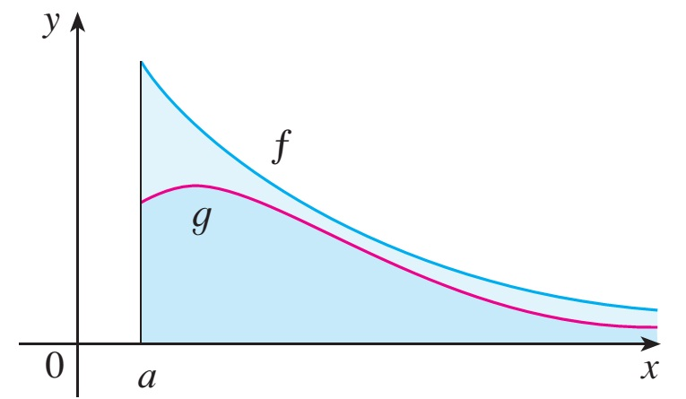
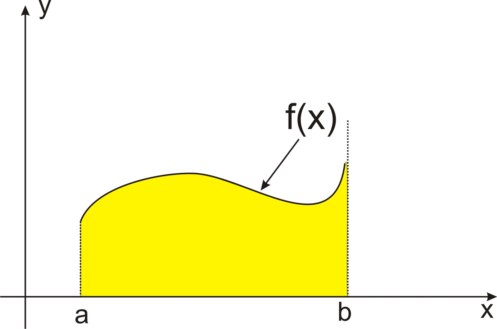

# Improper IntegralsTích phân suy rộng

MT1003 Calculus 1 - Lecture 07
MT1003 Giải tích 1 - Bài giảng 07

Truong-Son Van 
tsvan@hcmut.edu.vn

Reading map: <a href="../../readings/">course readings</a>. Read: <a href="https://activecalculus.org/single/sec-6-5-improper.html">Active Calculus 6.5</a>; <a href="https://openstax.org/books/calculus-volume-2/pages/3-7-improper-integrals">OpenStax Vol 2, 3.7</a>; Stewart 7.8.
Bản đồ đọc: <a href="../../readings/">tài liệu đọc của môn</a>. Đọc: <a href="https://activecalculus.org/single/sec-6-5-improper.html">Active Calculus 6.5</a>; <a href="https://openstax.org/books/calculus-volume-2/pages/3-7-improper-integrals">OpenStax Tập 2, 3.7</a>; Stewart 7.8.

---

# From Finite To InfiniteTừ hữu hạn đến vô hạn

One definition, pushed to its limitsMột định nghĩa, đẩy tới giới hạn

In defining the definite integral $\int_a^b f(x)\,dx$ we worked with a function $f$ defined on a finite interval $[a,b]$, and we assumed $f$ has no infinite discontinuity. In this lecture we extend the definite integral to the case where the interval is infinite and to the case where $f$ has an infinite discontinuity on $[a,b]$. In either case the integral is called an <strong>improper integral</strong>.
Khi định nghĩa tích phân xác định $\int_a^b f(x)\,dx$, ta làm việc với hàm $f$ xác định trên đoạn hữu hạn $[a,b]$ và giả thiết $f$ không có gián đoạn vô cực. Trong bài này ta mở rộng tích phân xác định cho trường hợp khoảng lấy tích phân vô hạn và trường hợp $f$ có gián đoạn vô cực trên $[a,b]$. Trong cả hai trường hợp, tích phân được gọi là <strong>tích phân suy rộng</strong>.

<strong>Type 1: infinite intervalsLoại 1: khoảng vô hạn</strong>

$$
\int_a^{+\infty} f(x)\,dx,\qquad \int_{-\infty}^b f(x)\,dx,\qquad \int_{-\infty}^{+\infty} f(x)\,dx
$$

<strong>Type 2: unbounded integrandsLoại 2: hàm dưới dấu tích phân không bị chặn</strong>
$\int_a^b f(x)\,dx$ where $f$ has a vertical asymptote at $a$, at $b$, or between them.
$\int_a^b f(x)\,dx$ trong đó $f$ có tiệm cận đứng tại $a$, tại $b$, hoặc ở giữa.

Read: <a href="https://activecalculus.org/single/sec-6-5-improper.html">Active Calculus 6.5</a>; <a href="https://openstax.org/books/calculus-volume-2/pages/3-7-improper-integrals">OpenStax Vol 2, 3.7</a>; Stewart 7.8.
Đọc: <a href="https://activecalculus.org/single/sec-6-5-improper.html">Active Calculus 6.5</a>; <a href="https://openstax.org/books/calculus-volume-2/pages/3-7-improper-integrals">OpenStax Tập 2, 3.7</a>; Stewart 7.8.

---

# Today's PlanKế hoạch hôm nay

0-15<strong>Two types</strong> - what makes an integral improper; an infinite region with finite area<strong>Hai loại</strong> - khi nào tích phân là suy rộng; miền vô hạn có diện tích hữu hạn

15-60<strong>Type 1</strong> - definition, Newton-Leibniz formula, worked evaluations, the $p$-integral<strong>Loại 1</strong> - định nghĩa, công thức Newton-Leibniz, ví dụ tính toán, tích phân $p$

60-90<strong>Convergence tests</strong> - comparison, limit comparison, growth scales<strong>Tiêu chuẩn hội tụ</strong> - so sánh, so sánh qua giới hạn, thang bậc tăng trưởng

90-100<strong>Break</strong><strong>Nghỉ giải lao</strong>

100-140<strong>Type 2</strong> - definition, hidden asymptotes, worked evaluations, the reference integral<strong>Loại 2</strong> - định nghĩa, tiệm cận ẩn, ví dụ tính toán, tích phân mẫu

140-160<strong>Tests for Type 2</strong> - equivalent functions and limit comparison<strong>Tiêu chuẩn cho loại 2</strong> - hàm tương đương và so sánh qua giới hạn

160-170<strong>Exercise lab</strong> - mixed practice and the decision chart<strong>Luyện tập</strong> - bài tập tổng hợp và bảng quyết định

Session 10 reading map: <a href="https://activecalculus.org/single/sec-6-5-improper.html">Active Calculus 6.5</a>; <a href="https://openstax.org/books/calculus-volume-2/pages/3-7-improper-integrals">OpenStax Vol 2, 3.7</a>; Stewart 7.8.
Bản đồ đọc Buổi 10: <a href="https://activecalculus.org/single/sec-6-5-improper.html">Active Calculus 6.5</a>; <a href="https://openstax.org/books/calculus-volume-2/pages/3-7-improper-integrals">OpenStax Tập 2, 3.7</a>; Stewart 7.8.

---
class: compact
---

# An Infinite Region With Finite AreaMiền vô hạn có diện tích hữu hạn

A strange questionMột câu hỏi lạ

Let $S$ be the region that lies under the curve $y=1/x^2$, above the $x$-axis, and to the right of the line $x=1$. The region stretches infinitely far. Can it still have a finite area?
Gọi $S$ là miền nằm dưới đường cong $y=1/x^2$, trên trục $x$, và bên phải đường thẳng $x=1$. Miền này trải dài vô hạn. Liệu nó vẫn có thể có diện tích hữu hạn?

Measure up to $x=t$, then let $t\to\infty$Đo đến $x=t$, rồi cho $t\to\infty$

The part of $S$ to the left of the line $x=t$ (with $t>1$) has area
Phần của $S$ nằm bên trái đường thẳng $x=t$ (với $t>1$) có diện tích

$$
A(t)=\int_1^t \frac{dx}{x^2}=\left[-\frac{1}{x}\right]_1^t=1-\frac{1}{t}.
$$

As $t\to\infty$, $A(t)\to 1$. So we say the infinite region $S$ has area $1$, and we write
Khi $t\to\infty$, $A(t)\to 1$. Vì vậy ta nói miền vô hạn $S$ có diện tích bằng $1$, và ta viết

$$
\int_1^{+\infty}\frac{dx}{x^2}=\lim_{t\to\infty}\int_1^t\frac{dx}{x^2}=1.
$$

This is the opening example of Stewart 7.8; see also <a href="https://activecalculus.org/single/sec-6-5-improper.html">Active Calculus 6.5</a>.
Đây là ví dụ mở đầu của Stewart 7.8; xem thêm <a href="https://activecalculus.org/single/sec-6-5-improper.html">Active Calculus 6.5</a>.

---
class: compact
---

# Type 1: DefinitionLoại 1: định nghĩa

Definition - improper integral of Type 1Định nghĩa - tích phân suy rộng loại 1

If $\int_a^t f(x)\,dx$ exists for every number $t\ge a$, then
Nếu $\int_a^t f(x)\,dx$ tồn tại với mọi số $t\ge a$ thì

$$
\int_a^{+\infty} f(x)\,dx=\lim_{t\to\infty}\int_a^t f(x)\,dx,
$$

provided this limit exists (as a finite number). Similarly, if $\int_t^b f(x)\,dx$ exists for every number $t\le b$, then
miễn là giới hạn này tồn tại (là một số hữu hạn). Tương tự, nếu $\int_t^b f(x)\,dx$ tồn tại với mọi số $t\le b$ thì

$$
\int_{-\infty}^{b} f(x)\,dx=\lim_{t\to-\infty}\int_t^b f(x)\,dx.
$$

Convergent and divergentHội tụ và phân kỳ

The improper integral is called <strong>convergent</strong> if the corresponding limit exists as a finite number, and <strong>divergent</strong> if the limit does not exist or is infinite.
Tích phân suy rộng được gọi là <strong>hội tụ</strong> nếu giới hạn tương ứng tồn tại và là một số hữu hạn, và <strong>phân kỳ</strong> nếu giới hạn không tồn tại hoặc bằng vô cực.

Read: <a href="https://activecalculus.org/single/sec-6-5-improper.html">Active Calculus 6.5</a>; <a href="https://openstax.org/books/calculus-volume-2/pages/3-7-improper-integrals">OpenStax Vol 2, 3.7</a>; Stewart 7.8.
Đọc: <a href="https://activecalculus.org/single/sec-6-5-improper.html">Active Calculus 6.5</a>; <a href="https://openstax.org/books/calculus-volume-2/pages/3-7-improper-integrals">OpenStax Tập 2, 3.7</a>; Stewart 7.8.

---
class: compact
---

# Both Endpoints InfiniteCả hai cận vô hạn

Definition - the doubly infinite integralĐịnh nghĩa - tích phân với hai cận vô hạn

If both $\int_c^{+\infty} f(x)\,dx$ and $\int_{-\infty}^{c} f(x)\,dx$ are convergent, then we define
Nếu cả $\int_c^{+\infty} f(x)\,dx$ và $\int_{-\infty}^{c} f(x)\,dx$ đều hội tụ thì ta định nghĩa

$$
\int_{-\infty}^{+\infty} f(x)\,dx=\int_{-\infty}^{c} f(x)\,dx+\int_c^{+\infty} f(x)\,dx,
$$

where $c$ is any real number (the value does not depend on the choice of $c$).
trong đó $c$ là một số thực bất kỳ (giá trị không phụ thuộc vào cách chọn $c$).

Both halves must converge on their ownMỗi nửa phải tự hội tụ

It is not enough that the two halves cancel each other for symmetric cutoffs. If either half diverges, the whole integral diverges - even for an odd function like $\frac{x}{1+x^2}$.
Hai nửa triệt tiêu nhau theo cận đối xứng là chưa đủ. Nếu một nửa phân kỳ thì cả tích phân phân kỳ - kể cả với hàm lẻ như $\frac{x}{1+x^2}$.

Read: <a href="https://activecalculus.org/single/sec-6-5-improper.html">Active Calculus 6.5</a>; <a href="https://openstax.org/books/calculus-volume-2/pages/3-7-improper-integrals">OpenStax Vol 2, 3.7</a>; Stewart 7.8.
Đọc: <a href="https://activecalculus.org/single/sec-6-5-improper.html">Active Calculus 6.5</a>; <a href="https://openstax.org/books/calculus-volume-2/pages/3-7-improper-integrals">OpenStax Tập 2, 3.7</a>; Stewart 7.8.

---
class: compact
---

# Geometric MeaningÝ nghĩa hình học

Area of an unbounded regionDiện tích của miền không bị chặn

If $f(x)\ge 0$ for all $x\ge a$ and $\int_a^{+\infty} f(x)\,dx$ is convergent, then the improper integral is the area of the region
Nếu $f(x)\ge 0$ với mọi $x\ge a$ và $\int_a^{+\infty} f(x)\,dx$ hội tụ thì tích phân suy rộng là diện tích của miền

$$
S=\{(x, y)\ :\ x \ge a,\ 0 \le y \le f(x) \}.
$$

A quick divergence checkKiểm tra phân kỳ nhanh

If $f(x)\to A\neq 0$ as $x\to\infty$, the accumulated areas $\int_a^t f(x)\,dx$ grow without bound, so $\int_a^{+\infty} f(x)\,dx$ diverges. To converge, the integrand must tend to $0$ - but tending to $0$ is not enough, as $\frac{1}{x}$ will show.
Nếu $f(x)\to A\neq 0$ khi $x\to\infty$ thì diện tích tích lũy $\int_a^t f(x)\,dx$ tăng vô hạn, nên $\int_a^{+\infty} f(x)\,dx$ phân kỳ. Muốn hội tụ, hàm dưới dấu tích phân phải dần về $0$ - nhưng dần về $0$ vẫn chưa đủ, như $\frac{1}{x}$ sẽ cho thấy.

Read: <a href="https://activecalculus.org/single/sec-6-5-improper.html">Active Calculus 6.5</a>; <a href="https://openstax.org/books/calculus-volume-2/pages/3-7-improper-integrals">OpenStax Vol 2, 3.7</a>; Stewart 7.8.
Đọc: <a href="https://activecalculus.org/single/sec-6-5-improper.html">Active Calculus 6.5</a>; <a href="https://openstax.org/books/calculus-volume-2/pages/3-7-improper-integrals">OpenStax Tập 2, 3.7</a>; Stewart 7.8.

---
class: compact
---

# Newton-Leibniz For Improper IntegralsNewton-Leibniz cho tích phân suy rộng

Theorem - Newton-Leibniz formula on $[a,+\infty)$Định lý - công thức Newton-Leibniz trên $[a,+\infty)$

Suppose $f$ has an antiderivative $F$ on $[a,+\infty)$ and is integrable on every interval $[a,t]$. Write $F(+\infty)=\lim_{t\to\infty}F(t)$. Then $\int_a^{+\infty} f(x)\,dx$ converges if and only if $F(+\infty)$ exists as a finite number, and in that case
Giả sử $f$ có nguyên hàm $F$ trên $[a,+\infty)$ và khả tích trên mọi đoạn $[a,t]$. Ký hiệu $F(+\infty)=\lim_{t\to\infty}F(t)$. Khi đó $\int_a^{+\infty} f(x)\,dx$ hội tụ khi và chỉ khi $F(+\infty)$ tồn tại hữu hạn, và khi đó

$$
\int_a^{+\infty} f(x)\,dx=F(+\infty)-F(a)=F(x)\Big|_a^{+\infty}.
$$

The other formsCác dạng còn lại

With $F(-\infty)=\lim_{t\to-\infty}F(t)$: $\ \int_{-\infty}^b f(x)\,dx=F(b)-F(-\infty)$ and $\int_{-\infty}^{+\infty} f(x)\,dx=F(+\infty)-F(-\infty)$, where each one-sided limit must be finite on its own.
Với $F(-\infty)=\lim_{t\to-\infty}F(t)$: $\ \int_{-\infty}^b f(x)\,dx=F(b)-F(-\infty)$ và $\int_{-\infty}^{+\infty} f(x)\,dx=F(+\infty)-F(-\infty)$, trong đó mỗi giới hạn một phía phải tự tồn tại hữu hạn.

Read: <a href="https://activecalculus.org/single/sec-6-5-improper.html">Active Calculus 6.5</a>; <a href="https://openstax.org/books/calculus-volume-2/pages/3-7-improper-integrals">OpenStax Vol 2, 3.7</a>; Stewart 7.8.
Đọc: <a href="https://activecalculus.org/single/sec-6-5-improper.html">Active Calculus 6.5</a>; <a href="https://openstax.org/books/calculus-volume-2/pages/3-7-improper-integrals">OpenStax Tập 2, 3.7</a>; Stewart 7.8.

---
class: compact
---

# Example: An Oscillating IntegrandVí dụ: hàm dao động

EvaluateTính

Determine whether $I=\displaystyle\int_0^{+\infty} \cos x \,dx$ is convergent or divergent.
Xét sự hội tụ của $I=\displaystyle\int_0^{+\infty} \cos x \,dx$.

SolutionLời giải

An antiderivative of $\cos x$ is $\sin x$, so
Một nguyên hàm của $\cos x$ là $\sin x$, nên

$$
I=\sin x \Big|_0^{+\infty}=\lim_{t \to \infty} \sin t-\sin 0=\lim_{t \to \infty} \sin t.
$$

As $t\to\infty$ the values of $\sin t$ oscillate between $-1$ and $1$ forever, so $\lim_{t \to \infty} \sin t$ does not exist. The improper integral $I$ is <strong>divergent</strong>.
Khi $t\to\infty$, giá trị của $\sin t$ dao động mãi giữa $-1$ và $1$, nên $\lim_{t \to \infty} \sin t$ không tồn tại. Tích phân suy rộng $I$ <strong>phân kỳ</strong>.

Divergent does not always mean infinitePhân kỳ không phải lúc nào cũng là vô cực

Here the integral diverges because the limit fails to exist, not because it is infinite.
Ở đây tích phân phân kỳ vì giới hạn không tồn tại, chứ không phải vì nó bằng vô cực.

Practice: <a href="https://activecalculus.org/single/sec-6-5-improper.html">Active Calculus 6.5</a>; <a href="https://openstax.org/books/calculus-volume-2/pages/3-7-improper-integrals">OpenStax Vol 2, 3.7</a>; Stewart 7.8.
Luyện tập: <a href="https://activecalculus.org/single/sec-6-5-improper.html">Active Calculus 6.5</a>; <a href="https://openstax.org/books/calculus-volume-2/pages/3-7-improper-integrals">OpenStax Tập 2, 3.7</a>; Stewart 7.8.

---
class: compact
---

# Example: Two Convergent IntegralsVí dụ: hai tích phân hội tụ

Over $(-\infty,-1]$Trên $(-\infty,-1]$

Evaluate $\displaystyle\int_{-\infty}^{-1} \frac{dx}{x^2}$.
Tính $\displaystyle\int_{-\infty}^{-1} \frac{dx}{x^2}$.

$$
\int_{-\infty}^{-1} \frac{dx}{x^2}=-\frac{1}{x} \Big|_{-\infty}^{-1}=1+\lim_{t \to -\infty} \frac{1}{t}=1.
$$

The limit is finite, so the integral <strong>converges</strong> to $1$.
Giới hạn hữu hạn, nên tích phân <strong>hội tụ</strong> về $1$.

Over the whole lineTrên toàn trục số

Evaluate $\displaystyle\int_{-\infty}^{+\infty} \frac{dx}{1+x^2}$.
Tính $\displaystyle\int_{-\infty}^{+\infty} \frac{dx}{1+x^2}$.

$$
\arctan x \Big|_{-\infty}^{+\infty}=\frac{\pi}{2}-\left(-\frac{\pi}{2}\right)=\pi.
$$

Both one-sided limits of $\arctan x$ are finite, so the integral <strong>converges</strong> to $\pi$.
Cả hai giới hạn một phía của $\arctan x$ đều hữu hạn, nên tích phân <strong>hội tụ</strong> về $\pi$.

Reading the pictureĐọc hình ảnh

Both integrands are positive, so each answer is the area of an unbounded region - and both regions happen to have finite area.
Cả hai hàm dưới dấu tích phân đều dương, nên mỗi đáp số là diện tích của một miền không bị chặn - và cả hai miền đều có diện tích hữu hạn.

Practice: <a href="https://activecalculus.org/single/sec-6-5-improper.html">Active Calculus 6.5</a>; <a href="https://openstax.org/books/calculus-volume-2/pages/3-7-improper-integrals">OpenStax Vol 2, 3.7</a>; Stewart 7.8 (Example 3).
Luyện tập: <a href="https://activecalculus.org/single/sec-6-5-improper.html">Active Calculus 6.5</a>; <a href="https://openstax.org/books/calculus-volume-2/pages/3-7-improper-integrals">OpenStax Tập 2, 3.7</a>; Stewart 7.8 (Ví dụ 3).

---
class: compact
---

# Example: A Substitution InsideVí dụ: đổi biến bên trong

EvaluateTính

Determine whether $I=\displaystyle\int_0^{+\infty} xe^{-x^2}\,dx$ is convergent or divergent.
Xét sự hội tụ của $I=\displaystyle\int_0^{+\infty} xe^{-x^2}\,dx$.

Solution: recognize the derivative of $-x^2$Lời giải: nhận ra đạo hàm của $-x^2$

Since $d(-x^2)=-2x\,dx$, the factor $x\,dx$ is $-\frac{1}{2}\,d(-x^2)$:
Vì $d(-x^2)=-2x\,dx$, thừa số $x\,dx$ chính là $-\frac{1}{2}\,d(-x^2)$:

$$
I=-\frac{1}{2}\int_0^{+\infty} e^{-x^2}\,d(-x^2)=-\frac{1}{2}e^{-x^2} \Big|_0^{+\infty}
=\lim_{t \to \infty}\left(-\frac{1}{2}e^{-t^2}\right)+\frac{1}{2}=\frac{1}{2}.
$$

The limit is finite, so the given integral is <strong>convergent</strong>, with value $\frac{1}{2}$.
Giới hạn hữu hạn, nên tích phân đã cho <strong>hội tụ</strong>, với giá trị $\frac{1}{2}$.

Practice: <a href="https://activecalculus.org/single/sec-6-5-improper.html">Active Calculus 6.5</a>; <a href="https://openstax.org/books/calculus-volume-2/pages/3-7-improper-integrals">OpenStax Vol 2, 3.7</a>; Stewart 7.8.
Luyện tập: <a href="https://activecalculus.org/single/sec-6-5-improper.html">Active Calculus 6.5</a>; <a href="https://openstax.org/books/calculus-volume-2/pages/3-7-improper-integrals">OpenStax Tập 2, 3.7</a>; Stewart 7.8.

---
class: compact
---

# The $p$-Integral At InfinityTích phân $p$ tại vô cực

Question (Stewart 7.8, Example 4)Câu hỏi (Stewart 7.8, Ví dụ 4)

For what values of $p$ is the integral $\displaystyle\int_1^{+\infty} \frac{dx}{x^p}$ convergent?
Với những giá trị nào của $p$ thì tích phân $\displaystyle\int_1^{+\infty} \frac{dx}{x^p}$ hội tụ?

Case $p\neq1$Trường hợp $p\neq1$

$$
\int_1^t x^{-p}\,dx=\frac{x^{-p+1}}{-p+1}\Bigg|_1^t=\frac{1}{1-p}\left(\frac{1}{t^{p-1}}-1\right).
$$

If $p>1$, then $p-1>0$, so $\frac{1}{t^{p-1}}\to0$ as $t\to\infty$: the integral converges, with value $\frac{1}{p-1}$.
Nếu $p>1$ thì $p-1>0$, nên $\frac{1}{t^{p-1}}\to0$ khi $t\to\infty$: tích phân hội tụ, với giá trị $\frac{1}{p-1}$.

If $p<1$, then $\frac{1}{t^{p-1}}=t^{1-p}\to\infty$: the integral diverges.
Nếu $p<1$ thì $\frac{1}{t^{p-1}}=t^{1-p}\to\infty$: tích phân phân kỳ.

Read: Stewart 7.8 (Example 4); <a href="https://activecalculus.org/single/sec-6-5-improper.html">Active Calculus 6.5</a>; <a href="https://openstax.org/books/calculus-volume-2/pages/3-7-improper-integrals">OpenStax Vol 2, 3.7</a>.
Đọc: Stewart 7.8 (Ví dụ 4); <a href="https://activecalculus.org/single/sec-6-5-improper.html">Active Calculus 6.5</a>; <a href="https://openstax.org/books/calculus-volume-2/pages/3-7-improper-integrals">OpenStax Tập 2, 3.7</a>.

---
class: compact
---

# The $p$-Integral: SummaryTích phân $p$: tổng kết

Case $p=1$Trường hợp $p=1$

$$
\int_1^t \frac{dx}{x}=\ln t-\ln 1=\ln t\ \longrightarrow\ +\infty
\quad\text{as } t\to\infty,
$$

so the integral diverges - even though $\frac{1}{x}\to0$. Tending to $0$ is not enough; the integrand must tend to $0$ fast enough.
nên tích phân phân kỳ - dù $\frac{1}{x}\to0$. Dần về $0$ là chưa đủ; hàm dưới dấu tích phân phải dần về $0$ đủ nhanh.

The reference integral at infinityTích phân mẫu tại vô cực

$\displaystyle\int_1^{+\infty} \frac{dx}{x^p}$ is <strong>convergent if $p>1$</strong> and <strong>divergent if $p\le1$</strong>.
$\displaystyle\int_1^{+\infty} \frac{dx}{x^p}$ <strong>hội tụ nếu $p>1$</strong> và <strong>phân kỳ nếu $p\le1$</strong>.

Why it mattersVì sao quan trọng

This family is the measuring stick: the comparison tests below decide convergence by comparing a complicated integrand with a power $\frac{1}{x^p}$.
Họ tích phân này là thước đo: các tiêu chuẩn so sánh phía sau xét sự hội tụ bằng cách so hàm phức tạp với một lũy thừa $\frac{1}{x^p}$.

Read: Stewart 7.8 (Example 4); <a href="https://activecalculus.org/single/sec-6-5-improper.html">Active Calculus 6.5</a>; <a href="https://openstax.org/books/calculus-volume-2/pages/3-7-improper-integrals">OpenStax Vol 2, 3.7</a>.
Đọc: Stewart 7.8 (Ví dụ 4); <a href="https://activecalculus.org/single/sec-6-5-improper.html">Active Calculus 6.5</a>; <a href="https://openstax.org/books/calculus-volume-2/pages/3-7-improper-integrals">OpenStax Tập 2, 3.7</a>.

---
class: compact
---

# Worked Problem 1 - Set UpBài giải mẫu 1 - thiết lập

EvaluateTính

Evaluate the improper integral $I=\displaystyle\int_1^{+\infty} \frac{dx}{x \sqrt{x^2+x+1}}$.
Tính tích phân suy rộng $I=\displaystyle\int_1^{+\infty} \frac{dx}{x \sqrt{x^2+x+1}}$.

1. Substitute $t=1/x$1. Đổi biến $t=1/x$

Let $t=\frac{1}{x}$. Then $x=\frac{1}{t}$ and $dx=-\frac{dt}{t^2}$; as $x$ runs from $1$ to $+\infty$, $t$ runs from $1$ down to $0$. So
Đặt $t=\frac{1}{x}$. Khi đó $x=\frac{1}{t}$ và $dx=-\frac{dt}{t^2}$; khi $x$ chạy từ $1$ đến $+\infty$, $t$ chạy từ $1$ về $0$. Vậy

$$
I=\int_1^0 \frac{-\,dt/t^2}{\frac{1}{t}\sqrt{\frac{1}{t^2}+\frac{1}{t}+1}}
=\int_0^1 \frac{dt}{\sqrt{1+t+t^2}}.
$$

NoticeNhận xét

The substitution turned an improper integral into an ordinary (proper) one: the new integrand is continuous on all of $[0,1]$.
Phép đổi biến đã biến tích phân suy rộng thành tích phân thường: hàm mới liên tục trên cả đoạn $[0,1]$.

Practice: <a href="https://activecalculus.org/single/sec-6-5-improper.html">Active Calculus 6.5</a>; <a href="https://openstax.org/books/calculus-volume-2/pages/3-7-improper-integrals">OpenStax Vol 2, 3.7</a>; Stewart 7.8.
Luyện tập: <a href="https://activecalculus.org/single/sec-6-5-improper.html">Active Calculus 6.5</a>; <a href="https://openstax.org/books/calculus-volume-2/pages/3-7-improper-integrals">OpenStax Tập 2, 3.7</a>; Stewart 7.8.

---
class: compact solution-slide
---

# Worked Problem 1 - ComputeBài giải mẫu 1 - tính toán

2. Complete the square and integrate2. Đưa về bình phương đủ rồi tích phân

Write $t^2+t+1=\left(t+\frac{1}{2}\right)^2+\frac{3}{4}$ and use $\int \frac{du}{\sqrt{u^2+k}}=\ln\left|u+\sqrt{u^2+k}\right|+C$:
Viết $t^2+t+1=\left(t+\frac{1}{2}\right)^2+\frac{3}{4}$ và dùng $\int \frac{du}{\sqrt{u^2+k}}=\ln\left|u+\sqrt{u^2+k}\right|+C$:

$$
I=\int_0^1 \frac{d\left(t+\frac{1}{2}\right)}{\sqrt{\left(t+\frac{1}{2}\right)^2+\frac{3}{4}}}
=\ln\left|\,t+\frac{1}{2}+\sqrt{t^2+t+1}\,\right|\ \Bigg|_0^1
$$

$$
=\ln\left(\frac{3}{2}+\sqrt{3}\right)-\ln\frac{3}{2}
=\ln\left(1+\frac{2}{\sqrt{3}}\right).
$$

3. Interpret and check3. Diễn giải và kiểm tra

The integral converges, with value $\ln\left(1+\frac{2}{\sqrt{3}}\right)\approx 0.77$. Check: for large $x$ the integrand behaves like $\frac{1}{x^2}$, whose integral over $[1,\infty)$ converges - consistent.
Tích phân hội tụ, với giá trị $\ln\left(1+\frac{2}{\sqrt{3}}\right)\approx 0{,}77$. Kiểm tra: với $x$ lớn, hàm dưới dấu tích phân cỡ $\frac{1}{x^2}$, mà tích phân của nó trên $[1,\infty)$ hội tụ - nhất quán.

Practice: <a href="https://activecalculus.org/single/sec-6-5-improper.html">Active Calculus 6.5</a>; <a href="https://openstax.org/books/calculus-volume-2/pages/3-7-improper-integrals">OpenStax Vol 2, 3.7</a>; Stewart 7.8.
Luyện tập: <a href="https://activecalculus.org/single/sec-6-5-improper.html">Active Calculus 6.5</a>; <a href="https://openstax.org/books/calculus-volume-2/pages/3-7-improper-integrals">OpenStax Tập 2, 3.7</a>; Stewart 7.8.

---
class: compact
---

# Worked Problem 2 - Set UpBài giải mẫu 2 - thiết lập

EvaluateTính

Evaluate the improper integral $I=\displaystyle\int_1^{+\infty} \frac{\arctan x}{x^2}\,dx$.
Tính tích phân suy rộng $I=\displaystyle\int_1^{+\infty} \frac{\arctan x}{x^2}\,dx$.

1. Integrate by parts1. Tích phân từng phần

Take $u=\arctan x$ and $dv=\frac{dx}{x^2}$, so that $du=\frac{dx}{1+x^2}$ and $v=-\frac{1}{x}$:
Chọn $u=\arctan x$ và $dv=\frac{dx}{x^2}$, khi đó $du=\frac{dx}{1+x^2}$ và $v=-\frac{1}{x}$:

$$
I=\left[-\frac{\arctan x}{x}\right]_1^{+\infty}+\int_1^{+\infty} \frac{dx}{x(1+x^2)}.
$$

The bracket: as $x\to\infty$, $\arctan x\to\frac{\pi}{2}$ while $\frac{1}{x}\to0$, so the product tends to $0$; at $x=1$ it equals $-\frac{\pi}{4}$. The bracket contributes $0-\left(-\frac{\pi}{4}\right)=\frac{\pi}{4}$.
Số hạng trong ngoặc: khi $x\to\infty$, $\arctan x\to\frac{\pi}{2}$ còn $\frac{1}{x}\to0$, nên tích dần về $0$; tại $x=1$ nó bằng $-\frac{\pi}{4}$. Ngoặc đóng góp $0-\left(-\frac{\pi}{4}\right)=\frac{\pi}{4}$.

Practice: <a href="https://activecalculus.org/single/sec-6-5-improper.html">Active Calculus 6.5</a>; <a href="https://openstax.org/books/calculus-volume-2/pages/3-7-improper-integrals">OpenStax Vol 2, 3.7</a>; Stewart 7.8.
Luyện tập: <a href="https://activecalculus.org/single/sec-6-5-improper.html">Active Calculus 6.5</a>; <a href="https://openstax.org/books/calculus-volume-2/pages/3-7-improper-integrals">OpenStax Tập 2, 3.7</a>; Stewart 7.8.

---
class: compact solution-slide
---

# Worked Problem 2 - ComputeBài giải mẫu 2 - tính toán

2. Split by partial fractions2. Tách phân thức

$$
\frac{1}{x(1+x^2)}=\frac{1}{x}-\frac{x}{1+x^2},
$$

$$
\int_1^{+\infty}\left(\frac{1}{x}-\frac{x}{1+x^2}\right)dx
=\left[\ln\frac{x}{\sqrt{1+x^2}}\right]_1^{+\infty}
=\ln 1-\ln\frac{1}{\sqrt{2}}=\frac{\ln 2}{2}.
$$

Combine before taking the limitGộp lại trước khi lấy giới hạn

Neither $\ln x$ nor $\frac{1}{2}\ln(1+x^2)$ has a finite limit on its own. Combine them into one logarithm $\ln\frac{x}{\sqrt{1+x^2}}$ first, then let $x\to\infty$.
Riêng $\ln x$ hay $\frac{1}{2}\ln(1+x^2)$ đều không có giới hạn hữu hạn. Phải gộp thành một logarit $\ln\frac{x}{\sqrt{1+x^2}}$ trước, rồi mới cho $x\to\infty$.

3. Combine3. Kết luận

The integral converges, with value $I=\dfrac{\pi}{4}+\dfrac{\ln 2}{2}$.
Tích phân hội tụ, với giá trị $I=\dfrac{\pi}{4}+\dfrac{\ln 2}{2}$.

Practice: <a href="https://activecalculus.org/single/sec-6-5-improper.html">Active Calculus 6.5</a>; <a href="https://openstax.org/books/calculus-volume-2/pages/3-7-improper-integrals">OpenStax Vol 2, 3.7</a>; Stewart 7.8.
Luyện tập: <a href="https://activecalculus.org/single/sec-6-5-improper.html">Active Calculus 6.5</a>; <a href="https://openstax.org/books/calculus-volume-2/pages/3-7-improper-integrals">OpenStax Tập 2, 3.7</a>; Stewart 7.8.

---
class: compact exercise-heavy
---

# Your Turn: Evaluate (Type 1)Tự luyện: tính (loại 1)

T1

Determine whether the integral converges, and evaluate it if it does:
Xét sự hội tụ và tính (nếu hội tụ):

$$
\int_0^{+\infty} xe^{-x}\,dx.
$$

T2

Determine whether the integral converges, and evaluate it if it does:
Xét sự hội tụ và tính (nếu hội tụ):

$$
\int_e^{+\infty} \frac{dx}{x \ln^2 x}.
$$

HintsGợi ý

T1: integrate by parts with $u=x$, $dv=e^{-x}dx$; note $\frac{t}{e^{t}}\to0$. T2: substitute $u=\ln x$, so $du=\frac{dx}{x}$.
T1: từng phần với $u=x$, $dv=e^{-x}dx$; chú ý $\frac{t}{e^{t}}\to0$. T2: đổi biến $u=\ln x$, khi đó $du=\frac{dx}{x}$.

AnswersĐáp số

T1: converges,hội tụ, $\displaystyle\int_0^{+\infty} xe^{-x}\,dx=1$ 
T2: converges,hội tụ, $\displaystyle\int_e^{+\infty} \frac{dx}{x\ln^2 x}=1$

Practice: <a href="https://activecalculus.org/single/sec-6-5-improper.html">Active Calculus 6.5</a>; <a href="https://openstax.org/books/calculus-volume-2/pages/3-7-improper-integrals">OpenStax Vol 2, 3.7</a>; Stewart 7.8 exercises.
Luyện tập: <a href="https://activecalculus.org/single/sec-6-5-improper.html">Active Calculus 6.5</a>; <a href="https://openstax.org/books/calculus-volume-2/pages/3-7-improper-integrals">OpenStax Tập 2, 3.7</a>; bài tập Stewart 7.8.

---
class: compact
---

# The Comparison TheoremĐịnh lý so sánh

Theorem - comparison (Type 1)Định lý - so sánh (loại 1)

Suppose $f$ and $g$ are continuous functions with $f(x)\ge g(x)\ge0$ for $x\ge a$.
Giả sử $f$ và $g$ là các hàm liên tục với $f(x)\ge g(x)\ge0$ khi $x\ge a$.

1. If $\int_a^{+\infty} f(x)\,dx$ is convergent, then $\int_a^{+\infty} g(x)\,dx$ is convergent.
1. Nếu $\int_a^{+\infty} f(x)\,dx$ hội tụ thì $\int_a^{+\infty} g(x)\,dx$ hội tụ. 
2. If $\int_a^{+\infty} g(x)\,dx$ is divergent, then $\int_a^{+\infty} f(x)\,dx$ is divergent.
2. Nếu $\int_a^{+\infty} g(x)\,dx$ phân kỳ thì $\int_a^{+\infty} f(x)\,dx$ phân kỳ.

Why it is true, in one lookVì sao đúng, nhìn một lần

If the area under the top curve $y=f(x)$ is finite, then so is the area under the bottom curve $y=g(x)$; if the area under $y=g(x)$ is infinite, then so is the area under $y=f(x)$.
Nếu diện tích dưới đường trên $y=f(x)$ hữu hạn thì diện tích dưới đường dưới $y=g(x)$ cũng hữu hạn; nếu diện tích dưới $y=g(x)$ vô hạn thì diện tích dưới $y=f(x)$ cũng vô hạn.

Read: Stewart 7.8 (Comparison Theorem); <a href="https://activecalculus.org/single/sec-6-5-improper.html">Active Calculus 6.5</a>; <a href="https://openstax.org/books/calculus-volume-2/pages/3-7-improper-integrals">OpenStax Vol 2, 3.7</a>.
Đọc: Stewart 7.8 (Định lý so sánh); <a href="https://activecalculus.org/single/sec-6-5-improper.html">Active Calculus 6.5</a>; <a href="https://openstax.org/books/calculus-volume-2/pages/3-7-improper-integrals">OpenStax Tập 2, 3.7</a>.

---
class: compact
---

# Example: Compare, Don't ComputeVí dụ: so sánh, không cần tính

Question (Stewart 7.8, Example 10)Câu hỏi (Stewart 7.8, Ví dụ 10)

Determine whether $\displaystyle\int_1^{+\infty} \frac{1+e^{-x}}{x}\,dx$ is convergent or divergent.
Xét sự hội tụ của $\displaystyle\int_1^{+\infty} \frac{1+e^{-x}}{x}\,dx$.

SolutionLời giải

For $x\ge1$ we have $e^{-x}>0$, so
Với $x\ge1$ ta có $e^{-x}>0$, nên

$$
\frac{1+e^{-x}}{x} > \frac{1}{x} > 0.
$$

Since $\int_1^{+\infty} \frac{dx}{x}$ is divergent (the $p$-integral with $p=1$), the given integral is <strong>divergent</strong> by the Comparison Theorem.
Vì $\int_1^{+\infty} \frac{dx}{x}$ phân kỳ (tích phân $p$ với $p=1$), tích phân đã cho <strong>phân kỳ</strong> theo Định lý so sánh.

What the tests are forTiêu chuẩn dùng để làm gì

Comparison answers only "convergent or divergent" - not the value. Use it when the antiderivative is out of reach, or when you only need convergence.
So sánh chỉ trả lời "hội tụ hay phân kỳ" - không cho giá trị. Dùng khi nguyên hàm ngoài tầm với, hoặc khi chỉ cần biết sự hội tụ.

Read: Stewart 7.8 (Example 10); <a href="https://activecalculus.org/single/sec-6-5-improper.html">Active Calculus 6.5</a>; <a href="https://openstax.org/books/calculus-volume-2/pages/3-7-improper-integrals">OpenStax Vol 2, 3.7</a>.
Đọc: Stewart 7.8 (Ví dụ 10); <a href="https://activecalculus.org/single/sec-6-5-improper.html">Active Calculus 6.5</a>; <a href="https://openstax.org/books/calculus-volume-2/pages/3-7-improper-integrals">OpenStax Tập 2, 3.7</a>.

---
class: compact
---

# Limit ComparisonSo sánh qua giới hạn

Theorem - limit comparison (Type 1)Định lý - so sánh qua giới hạn (loại 1)

Suppose $f(x)\ge0$ and $g(x)\ge0$ are integrable on every interval $[a,t]$, and let $\lambda$ denote the limit of their ratio, $\lambda=\lim_{x \to \infty} \frac{f(x)}{g(x)}$.
Giả sử $f(x)\ge0$ và $g(x)\ge0$ khả tích trên mọi đoạn $[a,t]$, và gọi $\lambda$ là giới hạn của tỉ số, $\lambda=\lim_{x \to \infty} \frac{f(x)}{g(x)}$.

1. If $0<\lambda<+\infty$: the two integrals either both converge or both diverge.
1. Nếu $0<\lambda<+\infty$: hai tích phân cùng hội tụ hoặc cùng phân kỳ. 
2. If $\lambda=0$ and $\int_a^{+\infty} g(x)\,dx$ converges, then $\int_a^{+\infty} f(x)\,dx$ converges.
2. Nếu $\lambda=0$ và $\int_a^{+\infty} g(x)\,dx$ hội tụ thì $\int_a^{+\infty} f(x)\,dx$ hội tụ. 
3. If $\lambda=+\infty$ and $\int_a^{+\infty} g(x)\,dx$ diverges, then $\int_a^{+\infty} f(x)\,dx$ diverges.
3. Nếu $\lambda=+\infty$ và $\int_a^{+\infty} g(x)\,dx$ phân kỳ thì $\int_a^{+\infty} f(x)\,dx$ phân kỳ.

How to use itCách dùng

Pick $g$ to be the <strong>scale</strong> of $f$ for large $x$ - usually a power $\frac{1}{x^p}$ - and compute one limit. Then read the answer off the $p$-integral.
Chọn $g$ là <strong>bậc</strong> của $f$ khi $x$ lớn - thường là một lũy thừa $\frac{1}{x^p}$ - rồi tính một giới hạn. Sau đó đọc kết luận từ tích phân $p$.

Read: <a href="https://activecalculus.org/single/sec-6-5-improper.html">Active Calculus 6.5</a>; <a href="https://openstax.org/books/calculus-volume-2/pages/3-7-improper-integrals">OpenStax Vol 2, 3.7</a>; Stewart 7.8.
Đọc: <a href="https://activecalculus.org/single/sec-6-5-improper.html">Active Calculus 6.5</a>; <a href="https://openstax.org/books/calculus-volume-2/pages/3-7-improper-integrals">OpenStax Tập 2, 3.7</a>; Stewart 7.8.

---
class: compact
---

# Equivalent Functions And Growth ScalesHàm tương đương và thang bậc tăng trưởng

Definition - equivalent functionsĐịnh nghĩa - hàm tương đương

Functions $f$ and $g$ are called <strong>equivalent</strong> as $x\to a$, written $f(x) \sim g(x)$, if $\lim_{x \to a} \frac{f(x)}{g(x)}=1$. This is the case $\lambda=1$ of limit comparison: equivalent integrands converge or diverge together.
Hai hàm $f$ và $g$ gọi là <strong>tương đương</strong> khi $x\to a$, ký hiệu $f(x) \sim g(x)$, nếu $\lim_{x \to a} \frac{f(x)}{g(x)}=1$. Đây chính là trường hợp $\lambda=1$ của so sánh qua giới hạn: hai hàm tương đương cùng hội tụ hoặc cùng phân kỳ.

Growth scale as $x\to+\infty$Thang bậc tăng trưởng khi $x\to+\infty$

For any $\alpha>0$, $\beta>0$ and $a>1$ (here $u \ll v$ means $\frac{u}{v}\to0$):
Với mọi $\alpha>0$, $\beta>0$ và $a>1$ (ký hiệu $u \ll v$ nghĩa là $\frac{u}{v}\to0$):

$$
\ln^{\alpha} x \ \ll\ x^{\beta} \ \ll\ a^x,
\qquad\text{i.e.}\quad
\lim_{x \to +\infty} \frac{\ln^{\alpha} x}{x^{\beta}}=0,
\quad
\lim_{x \to +\infty} \frac{x^{\beta}}{a^x}=0.
$$

Logarithms lose to powers; powers lose to exponentials.
Logarit thua lũy thừa; lũy thừa thua hàm mũ.

Read: <a href="https://activecalculus.org/single/sec-6-5-improper.html">Active Calculus 6.5</a>; <a href="https://openstax.org/books/calculus-volume-2/pages/3-7-improper-integrals">OpenStax Vol 2, 3.7</a>; Stewart 7.8.
Đọc: <a href="https://activecalculus.org/single/sec-6-5-improper.html">Active Calculus 6.5</a>; <a href="https://openstax.org/books/calculus-volume-2/pages/3-7-improper-integrals">OpenStax Tập 2, 3.7</a>; Stewart 7.8.

---
class: compact
---

# Example: Find The Scale (I)Ví dụ: tìm bậc (I)

QuestionCâu hỏi

Determine whether $I=\displaystyle\int_1^{+\infty} \frac{dx}{\sqrt{x^2-2x+3}}$ is convergent or divergent.
Xét sự hội tụ của $I=\displaystyle\int_1^{+\infty} \frac{dx}{\sqrt{x^2-2x+3}}$.

SolutionLời giải

The integrand is positive for $x\ge1$. For large $x$ the term $x^2$ dominates inside the square root, so we compare with $\frac{1}{x}$:
Hàm dưới dấu tích phân dương với $x\ge1$. Khi $x$ lớn, số hạng $x^2$ trội trong căn, nên ta so với $\frac{1}{x}$:

$$
\lim_{x\to\infty}\frac{1/\sqrt{x^2-2x+3}}{1/x}
=\lim_{x\to\infty}\frac{x}{\sqrt{x^2-2x+3}}=1,
\qquad\text{i.e.}\quad
\frac{1}{\sqrt{x^2-2x+3}} \sim \frac{1}{x}.
$$

Since $\int_1^{+\infty} \frac{dx}{x}$ diverges ($p=1$), the integral $I$ is <strong>divergent</strong> by limit comparison.
Vì $\int_1^{+\infty} \frac{dx}{x}$ phân kỳ ($p=1$), tích phân $I$ <strong>phân kỳ</strong> theo so sánh qua giới hạn.

Practice: <a href="https://activecalculus.org/single/sec-6-5-improper.html">Active Calculus 6.5</a>; <a href="https://openstax.org/books/calculus-volume-2/pages/3-7-improper-integrals">OpenStax Vol 2, 3.7</a>; Stewart 7.8.
Luyện tập: <a href="https://activecalculus.org/single/sec-6-5-improper.html">Active Calculus 6.5</a>; <a href="https://openstax.org/books/calculus-volume-2/pages/3-7-improper-integrals">OpenStax Tập 2, 3.7</a>; Stewart 7.8.

---
class: compact
---

# Example: Find The Scale (II)Ví dụ: tìm bậc (II)

QuestionCâu hỏi

Determine whether $I=\displaystyle\int_2^{+\infty} \frac{(x+1)\,dx}{\sqrt[3]{x^7-3x-2}}$ is convergent or divergent.
Xét sự hội tụ của $I=\displaystyle\int_2^{+\infty} \frac{(x+1)\,dx}{\sqrt[3]{x^7-3x-2}}$.

SolutionLời giải

The integrand is positive for $x\ge2$. For large $x$, the numerator behaves like $x$ and the denominator like $\sqrt[3]{x^7}=x^{7/3}$, so
Hàm dưới dấu tích phân dương với $x\ge2$. Khi $x$ lớn, tử số cỡ $x$ và mẫu số cỡ $\sqrt[3]{x^7}=x^{7/3}$, nên

$$
\frac{x+1}{\sqrt[3]{x^7-3x-2}} \sim \frac{x}{x^{7/3}}=\frac{1}{x^{4/3}}
\qquad (x\to+\infty).
$$

Since $p=\frac{4}{3}>1$, the comparison integral converges, so $I$ is <strong>convergent</strong>.
Vì $p=\frac{4}{3}>1$, tích phân so sánh hội tụ, nên $I$ <strong>hội tụ</strong>.

The recipeCông thức chung

Keep the dominant term on top and bottom, cancel, and read off the power $p$.
Giữ số hạng trội ở tử và mẫu, rút gọn, rồi đọc ra lũy thừa $p$.

Practice: <a href="https://activecalculus.org/single/sec-6-5-improper.html">Active Calculus 6.5</a>; <a href="https://openstax.org/books/calculus-volume-2/pages/3-7-improper-integrals">OpenStax Vol 2, 3.7</a>; Stewart 7.8.
Luyện tập: <a href="https://activecalculus.org/single/sec-6-5-improper.html">Active Calculus 6.5</a>; <a href="https://openstax.org/books/calculus-volume-2/pages/3-7-improper-integrals">OpenStax Tập 2, 3.7</a>; Stewart 7.8.

---
class: compact exercise-heavy
---

# Your Turn: Convergence (Type 1)Tự luyện: sự hội tụ (loại 1)

Y1

Convergent or divergent?
Hội tụ hay phân kỳ?

$$
\int_1^{+\infty} \frac{2+\sin x}{\sqrt{x}}\,dx.
$$

Y2

Convergent or divergent?
Hội tụ hay phân kỳ?

$$
\int_1^{+\infty} \frac{\ln x}{x^3}\,dx.
$$

HintsGợi ý

Y1: $2+\sin x\ge1$, so compare with $\frac{1}{\sqrt{x}}$. Y2: $\ln x \le \sqrt{x}$ for large $x$, so compare with $\frac{1}{x^{5/2}}$.
Y1: $2+\sin x\ge1$, nên so với $\frac{1}{\sqrt{x}}$. Y2: $\ln x \le \sqrt{x}$ khi $x$ lớn, nên so với $\frac{1}{x^{5/2}}$.

AnswersĐáp số

Y1: diverges (comparison with $x^{-1/2}$, $p=\frac{1}{2}\le1$)phân kỳ (so sánh với $x^{-1/2}$, $p=\frac{1}{2}\le1$) 
Y2: converges (its value is $\frac{1}{4}$, by parts)hội tụ (giá trị là $\frac{1}{4}$, tính bằng từng phần)

Practice: <a href="https://activecalculus.org/single/sec-6-5-improper.html">Active Calculus 6.5</a>; <a href="https://openstax.org/books/calculus-volume-2/pages/3-7-improper-integrals">OpenStax Vol 2, 3.7</a>; Stewart 7.8 exercises.
Luyện tập: <a href="https://activecalculus.org/single/sec-6-5-improper.html">Active Calculus 6.5</a>; <a href="https://openstax.org/books/calculus-volume-2/pages/3-7-improper-integrals">OpenStax Tập 2, 3.7</a>; bài tập Stewart 7.8.

---
class: compact
---

# Type 2: DefinitionLoại 2: định nghĩa

Definition - improper integral of Type 2Định nghĩa - tích phân suy rộng loại 2

Suppose $f$ is continuous on $[a,b)$ and has a <strong>vertical asymptote</strong> at $b$ (that is, $f(x)\to\infty$ as $x\to b^-$). Then
Giả sử $f$ liên tục trên $[a,b)$ và có <strong>tiệm cận đứng</strong> tại $b$ (nghĩa là $f(x)\to\infty$ khi $x\to b^-$). Khi đó

$$
\int_a^b f(x)\,dx=\lim_{t \to b^-} \int_a^{t} f(x)\,dx,
$$

if this limit exists (as a finite number). The interval is finite, but the integrand is unbounded.
nếu giới hạn này tồn tại (là một số hữu hạn). Khoảng lấy tích phân hữu hạn, nhưng hàm dưới dấu tích phân không bị chặn.

Geometric meaningÝ nghĩa hình học

If $f(x)\ge0$ and the integral converges, it is again the area of an unbounded region - unbounded upward this time, along the asymptote $x=b$.
Nếu $f(x)\ge0$ và tích phân hội tụ thì nó vẫn là diện tích của một miền không bị chặn - lần này không bị chặn theo phương thẳng đứng, dọc theo tiệm cận $x=b$.

Read: <a href="https://activecalculus.org/single/sec-6-5-improper.html">Active Calculus 6.5</a>; <a href="https://openstax.org/books/calculus-volume-2/pages/3-7-improper-integrals">OpenStax Vol 2, 3.7</a>; Stewart 7.8.
Đọc: <a href="https://activecalculus.org/single/sec-6-5-improper.html">Active Calculus 6.5</a>; <a href="https://openstax.org/books/calculus-volume-2/pages/3-7-improper-integrals">OpenStax Tập 2, 3.7</a>; Stewart 7.8.

---
class: compact
---

# Type 2: The Other CasesLoại 2: các trường hợp còn lại

Definition - asymptote at the left end or insideĐịnh nghĩa - tiệm cận ở đầu trái hoặc bên trong

If $f$ is continuous on $(a,b]$ and has a vertical asymptote at $a$, then $\displaystyle\int_a^b f(x)\,dx=\lim_{t \to a^+} \int_t^{b} f(x)\,dx$.
Nếu $f$ liên tục trên $(a,b]$ và có tiệm cận đứng tại $a$ thì $\displaystyle\int_a^b f(x)\,dx=\lim_{t \to a^+} \int_t^{b} f(x)\,dx$.

If $f$ has a vertical asymptote at an interior point $c$ with $a < c < b$, and both $\int_a^c f(x)\,dx$ and $\int_c^b f(x)\,dx$ converge, then we define
Nếu $f$ có tiệm cận đứng tại điểm trong $c$ với $a < c < b$, và cả $\int_a^c f(x)\,dx$ lẫn $\int_c^b f(x)\,dx$ đều hội tụ, thì ta định nghĩa

$$
\int_a^b f(x)\,dx=\int_a^c f(x)\,dx+\int_c^b f(x)\,dx.
$$

Newton-Leibniz for Type 2Newton-Leibniz cho loại 2

If $F$ is an antiderivative of $f$ on $[a,b)$, write $F(b^-)=\lim_{t\to b^-}F(t)$; then $\int_a^b f(x)\,dx=F(b^-)-F(a)$: <strong>convergent</strong> exactly when $F(b^-)$ is finite, <strong>divergent</strong> otherwise.
Nếu $F$ là nguyên hàm của $f$ trên $[a,b)$, ký hiệu $F(b^-)=\lim_{t\to b^-}F(t)$; khi đó $\int_a^b f(x)\,dx=F(b^-)-F(a)$: <strong>hội tụ</strong> đúng khi $F(b^-)$ hữu hạn, ngược lại <strong>phân kỳ</strong>.

Read: <a href="https://activecalculus.org/single/sec-6-5-improper.html">Active Calculus 6.5</a>; <a href="https://openstax.org/books/calculus-volume-2/pages/3-7-improper-integrals">OpenStax Vol 2, 3.7</a>; Stewart 7.8.
Đọc: <a href="https://activecalculus.org/single/sec-6-5-improper.html">Active Calculus 6.5</a>; <a href="https://openstax.org/books/calculus-volume-2/pages/3-7-improper-integrals">OpenStax Tập 2, 3.7</a>; Stewart 7.8.

---
class: compact
---

# Warning: Hidden AsymptotesCảnh báo: tiệm cận ẩn

An erroneous calculationMột phép tính sai

If we had not noticed the asymptote and had treated the integral as an ordinary one, we might have written
Nếu không để ý tiệm cận và xem đây là tích phân thường, ta có thể đã viết

$$
\int_{-1}^{1}\frac{dx}{x^2}\ \overset{?}{=}\ -\frac{1}{x}\Big|_{-1}^{1}=-1-1=-2.
$$

This is wrong twice over: the integrand is positive, so the answer cannot be negative - and in fact $\frac{1}{x^2}$ has a vertical asymptote at $x=0$, and each half $\int_0^1$, $\int_{-1}^0$ diverges. The integral is <strong>divergent</strong>.
Sai hai lần: hàm dưới dấu tích phân dương nên đáp số không thể âm - và thật ra $\frac{1}{x^2}$ có tiệm cận đứng tại $x=0$, mỗi nửa $\int_0^1$, $\int_{-1}^0$ đều phân kỳ. Tích phân <strong>phân kỳ</strong>.

Habit to buildThói quen cần có

From now on, whenever you meet $\int_a^b f(x)\,dx$, look at $f$ on all of $[a,b]$ first and decide whether the integral is proper or improper - check the endpoints and every zero of a denominator.
Từ nay, mỗi khi gặp $\int_a^b f(x)\,dx$, hãy nhìn $f$ trên cả $[a,b]$ trước và xác định tích phân là thường hay suy rộng - kiểm tra hai cận và mọi nghiệm của mẫu số.

Read: Stewart 7.8 (warning after Example 7); <a href="https://openstax.org/books/calculus-volume-2/pages/3-7-improper-integrals">OpenStax Vol 2, 3.7</a>.
Đọc: Stewart 7.8 (cảnh báo sau Ví dụ 7); <a href="https://openstax.org/books/calculus-volume-2/pages/3-7-improper-integrals">OpenStax Tập 2, 3.7</a>.

---
class: compact
---

# Example: The Borderline CaseVí dụ: trường hợp ranh giới

EvaluateTính

Determine whether $I=\displaystyle\int_0^1 \frac{dx}{x}$ is convergent or divergent.
Xét sự hội tụ của $I=\displaystyle\int_0^1 \frac{dx}{x}$.

SolutionLời giải

Since $\lim_{x \to 0^+} \frac{1}{x}=+\infty$, the line $x=0$ is a vertical asymptote: the integral is improper of Type 2 at the left endpoint. Then
Vì $\lim_{x \to 0^+} \frac{1}{x}=+\infty$, đường $x=0$ là tiệm cận đứng: tích phân suy rộng loại 2 tại cận trái. Khi đó

$$
I=\ln x \Big|_{0^+}^1=\ln 1-\lim_{t \to 0^+} \ln t=+\infty,
$$

so the improper integral $I$ is <strong>divergent</strong>.
nên tích phân suy rộng $I$ <strong>phân kỳ</strong>.

Same function, two rolesCùng một hàm, hai vai trò

$\frac{1}{x}$ diverges on $[1,\infty)$ and on $(0,1]$: the borderline of both reference families.
$\frac{1}{x}$ phân kỳ trên $[1,\infty)$ lẫn $(0,1]$: ranh giới của cả hai họ tích phân mẫu.

Practice: <a href="https://activecalculus.org/single/sec-6-5-improper.html">Active Calculus 6.5</a>; <a href="https://openstax.org/books/calculus-volume-2/pages/3-7-improper-integrals">OpenStax Vol 2, 3.7</a>; Stewart 7.8.
Luyện tập: <a href="https://activecalculus.org/single/sec-6-5-improper.html">Active Calculus 6.5</a>; <a href="https://openstax.org/books/calculus-volume-2/pages/3-7-improper-integrals">OpenStax Tập 2, 3.7</a>; Stewart 7.8.

---
class: compact
---

# Example: Which Endpoint Is Bad? - Set UpVí dụ: cận nào có vấn đề? - thiết lập

EvaluateTính

Evaluate $I=\displaystyle\int_{-1}^1 \frac{\arccos x}{\sqrt{1-x^2}}\,dx$.
Tính $I=\displaystyle\int_{-1}^1 \frac{\arccos x}{\sqrt{1-x^2}}\,dx$.

1. Locate the singularities1. Xác định điểm kỳ dị

The denominator vanishes at both $x=-1$ and $x=1$ - but check the limits, not just the denominator. At $x=-1$: the numerator tends to $\arccos(-1)=\pi\neq0$, so
Mẫu số triệt tiêu tại cả $x=-1$ và $x=1$ - nhưng phải kiểm tra giới hạn, chứ không chỉ mẫu số. Tại $x=-1$: tử số dần về $\arccos(-1)=\pi\neq0$, nên

$$
\lim_{x \to -1^+} \frac{\arccos x}{\sqrt{1-x^2}}=+\infty
\quad\Rightarrow\quad x=-1 \text{ is a vertical asymptote.}
$$

At $x=1$: numerator and denominator both tend to $0$, and one can check $\lim_{x \to 1^-} \frac{\arccos x}{\sqrt{1-x^2}}=1$, a finite number - so $x=1$ is <strong>not</strong> an asymptote. The only trouble is at $x=-1$.
Tại $x=1$: tử và mẫu cùng dần về $0$, và có thể kiểm tra $\lim_{x \to 1^-} \frac{\arccos x}{\sqrt{1-x^2}}=1$, hữu hạn - nên $x=1$ <strong>không</strong> phải tiệm cận. Vấn đề chỉ nằm tại $x=-1$.

Practice: <a href="https://activecalculus.org/single/sec-6-5-improper.html">Active Calculus 6.5</a>; <a href="https://openstax.org/books/calculus-volume-2/pages/3-7-improper-integrals">OpenStax Vol 2, 3.7</a>; Stewart 7.8.
Luyện tập: <a href="https://activecalculus.org/single/sec-6-5-improper.html">Active Calculus 6.5</a>; <a href="https://openstax.org/books/calculus-volume-2/pages/3-7-improper-integrals">OpenStax Tập 2, 3.7</a>; Stewart 7.8.

---
class: compact solution-slide
---

# Example: Which Endpoint Is Bad? - ComputeVí dụ: cận nào có vấn đề? - tính toán

2. Integrate: recognize $d(\arccos x)$2. Tích phân: nhận ra $d(\arccos x)$

Since $\frac{d}{dx}\arccos x=-\frac{1}{\sqrt{1-x^2}}$, the integrand is $-\arccos x \, d(\arccos x)$:
Vì $\frac{d}{dx}\arccos x=-\frac{1}{\sqrt{1-x^2}}$, biểu thức dưới dấu tích phân là $-\arccos x \, d(\arccos x)$:

$$
I=-\int_{-1}^1 \arccos x \; d(\arccos x)=-\frac{1}{2} \arccos^2 x \Big|_{-1^+}^{1}
$$

$$
=\frac{1}{2}\lim_{t \to -1^+} \arccos^2 t-\frac{1}{2}\arccos^2 1
=\frac{\pi^2}{2}-0=\frac{\pi^2}{2}.
$$

3. Interpret3. Kết luận

The limit exists as a finite number, so the improper integral <strong>converges</strong>, with value $\frac{\pi^2}{2}$ (about $4.93$). Here $\arccos(-1)=\pi$ and $\arccos 1=0$.
Giới hạn tồn tại hữu hạn, nên tích phân suy rộng <strong>hội tụ</strong>, với giá trị $\frac{\pi^2}{2}$ (khoảng $4{,}93$). Ở đây $\arccos(-1)=\pi$ và $\arccos 1=0$.

Practice: <a href="https://activecalculus.org/single/sec-6-5-improper.html">Active Calculus 6.5</a>; <a href="https://openstax.org/books/calculus-volume-2/pages/3-7-improper-integrals">OpenStax Vol 2, 3.7</a>; Stewart 7.8.
Luyện tập: <a href="https://activecalculus.org/single/sec-6-5-improper.html">Active Calculus 6.5</a>; <a href="https://openstax.org/books/calculus-volume-2/pages/3-7-improper-integrals">OpenStax Tập 2, 3.7</a>; Stewart 7.8.

---
class: compact
---

# The Reference Integral At An EndpointTích phân mẫu tại một cận

QuestionCâu hỏi

For what values of $\alpha$ does $I=\displaystyle\int_a^b \frac{dx}{(b-x)^{\alpha}}$ (with $a < b$) converge? For $\alpha>0$ the integrand blows up at $x=b$.
Với giá trị nào của $\alpha$ thì $I=\displaystyle\int_a^b \frac{dx}{(b-x)^{\alpha}}$ (với $a < b$) hội tụ? Khi $\alpha>0$, hàm dưới dấu tích phân bùng nổ tại $x=b$.

Case $\alpha\neq1$Trường hợp $\alpha\neq1$

$$
\int_a^{t} \frac{dx}{(b-x)^{\alpha}}
=\frac{(b-x)^{1-\alpha}}{\alpha-1}\Bigg|_a^{t}
=\frac{(b-t)^{1-\alpha}-(b-a)^{1-\alpha}}{\alpha-1}.
$$

If $\alpha<1$: $(b-t)^{1-\alpha}\to0$ as $t\to b^-$, so $I$ converges, with value $\frac{(b-a)^{1-\alpha}}{1-\alpha}$.
Nếu $\alpha<1$: $(b-t)^{1-\alpha}\to0$ khi $t\to b^-$, nên $I$ hội tụ, với giá trị $\frac{(b-a)^{1-\alpha}}{1-\alpha}$.

If $\alpha>1$: $(b-t)^{1-\alpha}\to+\infty$ as $t\to b^-$, so $I$ diverges.
Nếu $\alpha>1$: $(b-t)^{1-\alpha}\to+\infty$ khi $t\to b^-$, nên $I$ phân kỳ.

Read: <a href="https://activecalculus.org/single/sec-6-5-improper.html">Active Calculus 6.5</a>; <a href="https://openstax.org/books/calculus-volume-2/pages/3-7-improper-integrals">OpenStax Vol 2, 3.7</a>; Stewart 7.8.
Đọc: <a href="https://activecalculus.org/single/sec-6-5-improper.html">Active Calculus 6.5</a>; <a href="https://openstax.org/books/calculus-volume-2/pages/3-7-improper-integrals">OpenStax Tập 2, 3.7</a>; Stewart 7.8.

---
class: compact
---

# The Reference Integral: SummaryTích phân mẫu: tổng kết

Case $\alpha=1$Trường hợp $\alpha=1$

$$
\int_a^{t} \frac{dx}{b-x}=-\ln (b-x) \Big|_a^{t}
=-\ln (b-t)+\ln (b-a)\ \longrightarrow\ +\infty
\quad\text{as } t\to b^-,
$$

so the integral diverges.
nên tích phân phân kỳ.

The reference integral at a finite endpointTích phân mẫu tại cận hữu hạn

$\displaystyle\int_a^b \frac{dx}{(b-x)^{\alpha}}$ and likewise $\displaystyle\int_a^b \frac{dx}{(x-a)^{\alpha}}$ are <strong>convergent if $\alpha<1$</strong> and <strong>divergent if $\alpha\ge1$</strong>.
$\displaystyle\int_a^b \frac{dx}{(b-x)^{\alpha}}$ và tương tự $\displaystyle\int_a^b \frac{dx}{(x-a)^{\alpha}}$ <strong>hội tụ nếu $\alpha<1$</strong> và <strong>phân kỳ nếu $\alpha\ge1$</strong>.

Mind the flipChú ý quy tắc ngược

At infinity, powers need $p>1$ to converge; at a finite endpoint, they need $\alpha<1$. The two rules point in opposite directions - this is the most common exam error.
Tại vô cực, lũy thừa cần $p>1$ để hội tụ; tại cận hữu hạn lại cần $\alpha<1$. Hai quy tắc ngược chiều nhau - đây là lỗi thi phổ biến nhất.

Read: <a href="https://activecalculus.org/single/sec-6-5-improper.html">Active Calculus 6.5</a>; <a href="https://openstax.org/books/calculus-volume-2/pages/3-7-improper-integrals">OpenStax Vol 2, 3.7</a>; Stewart 7.8.
Đọc: <a href="https://activecalculus.org/single/sec-6-5-improper.html">Active Calculus 6.5</a>; <a href="https://openstax.org/books/calculus-volume-2/pages/3-7-improper-integrals">OpenStax Tập 2, 3.7</a>; Stewart 7.8.

---
class: compact
---

# Worked Problem 3 - Set UpBài giải mẫu 3 - thiết lập

EvaluateTính

Evaluate the improper integral $I=\displaystyle\int_1^3 \frac{dx}{\sqrt{4x-x^2-3}}$.
Tính tích phân suy rộng $I=\displaystyle\int_1^3 \frac{dx}{\sqrt{4x-x^2-3}}$.

1. Find the singularities1. Tìm điểm kỳ dị

Complete the square under the root:
Đưa biểu thức dưới căn về bình phương đủ:

$$
4x-x^2-3=1-(x-2)^2=(x-1)(3-x).
$$

The expression vanishes at $x=1$ and $x=3$, so the integrand has vertical asymptotes at <strong>both endpoints</strong>: the integral is improper of Type 2 at $x=1$ and at $x=3$ (split at an interior point, say $x=2$, and require both halves to converge).
Biểu thức triệt tiêu tại $x=1$ và $x=3$, nên hàm dưới dấu tích phân có tiệm cận đứng tại <strong>cả hai cận</strong>: tích phân suy rộng loại 2 tại $x=1$ và tại $x=3$ (tách tại một điểm trong, chẳng hạn $x=2$, và cả hai nửa phải hội tụ).

Practice: <a href="https://activecalculus.org/single/sec-6-5-improper.html">Active Calculus 6.5</a>; <a href="https://openstax.org/books/calculus-volume-2/pages/3-7-improper-integrals">OpenStax Vol 2, 3.7</a>; Stewart 7.8.
Luyện tập: <a href="https://activecalculus.org/single/sec-6-5-improper.html">Active Calculus 6.5</a>; <a href="https://openstax.org/books/calculus-volume-2/pages/3-7-improper-integrals">OpenStax Tập 2, 3.7</a>; Stewart 7.8.

---
class: compact solution-slide
---

# Worked Problem 3 - ComputeBài giải mẫu 3 - tính toán

2. Integrate: an arcsine appears2. Tích phân: xuất hiện arcsin

Since $\frac{d}{du}\arcsin u=\frac{1}{\sqrt{1-u^2}}$, with $u=x-2$ we get
Vì $\frac{d}{du}\arcsin u=\frac{1}{\sqrt{1-u^2}}$, với $u=x-2$ ta được

$$
I=\int_1^3 \frac{d(x-2)}{\sqrt{1-(x-2)^2}}=\arcsin (x-2) \Big|_{1^+}^{3^-}
$$

$$
=\lim_{t \to 3^-} \arcsin (t-2)-\lim_{s \to 1^+} \arcsin (s-2)
=\arcsin 1-\arcsin (-1)=\frac{\pi}{2}+\frac{\pi}{2}=\pi.
$$

3. Interpret and check3. Kết luận và kiểm tra

Both one-sided limits are finite, so $I$ <strong>converges</strong>, with value $\pi$. Check: near $x=3$ the integrand behaves like $\frac{1}{\sqrt{2(3-x)}}$ - the reference integral with $\alpha=\frac{1}{2}<1$, convergent; same at $x=1$. Consistent.
Cả hai giới hạn một phía đều hữu hạn, nên $I$ <strong>hội tụ</strong>, với giá trị $\pi$. Kiểm tra: gần $x=3$, hàm dưới dấu tích phân cỡ $\frac{1}{\sqrt{2(3-x)}}$ - tích phân mẫu với $\alpha=\frac{1}{2}<1$, hội tụ; tại $x=1$ cũng vậy. Nhất quán.

Practice: <a href="https://activecalculus.org/single/sec-6-5-improper.html">Active Calculus 6.5</a>; <a href="https://openstax.org/books/calculus-volume-2/pages/3-7-improper-integrals">OpenStax Vol 2, 3.7</a>; Stewart 7.8.
Luyện tập: <a href="https://activecalculus.org/single/sec-6-5-improper.html">Active Calculus 6.5</a>; <a href="https://openstax.org/books/calculus-volume-2/pages/3-7-improper-integrals">OpenStax Tập 2, 3.7</a>; Stewart 7.8.

---
class: compact
---

# Worked Problem 4 - A One-LinerBài giải mẫu 4 - một dòng

EvaluateTính

Evaluate $I=\displaystyle\int_0^1 \frac{dx}{\sqrt{1-x}}$.
Tính $I=\displaystyle\int_0^1 \frac{dx}{\sqrt{1-x}}$.

SolutionLời giải

The integrand blows up at $x=1$:
Hàm dưới dấu tích phân bùng nổ tại $x=1$:

$$
I=-\int_0^1 \frac{d(1-x)}{\sqrt{1-x}}=-2 \sqrt{1-x} \Big|_0^{1^-}
$$

$$
=\lim_{t \to 1^-} \left(-2 \sqrt{1-t} \right)+2=0+2=2.
$$

Read it as a reference integralĐọc như một tích phân mẫu

This is exactly $\int_0^1 \frac{dx}{(1-x)^{\alpha}}$ with $\alpha=\frac{1}{2}<1$: convergence was guaranteed before we computed anything. The computation adds the value: $I=2$.
Đây chính là $\int_0^1 \frac{dx}{(1-x)^{\alpha}}$ với $\alpha=\frac{1}{2}<1$: sự hội tụ được bảo đảm trước khi ta tính bất cứ điều gì. Phép tính bổ sung giá trị: $I=2$.

Practice: <a href="https://activecalculus.org/single/sec-6-5-improper.html">Active Calculus 6.5</a>; <a href="https://openstax.org/books/calculus-volume-2/pages/3-7-improper-integrals">OpenStax Vol 2, 3.7</a>; Stewart 7.8.
Luyện tập: <a href="https://activecalculus.org/single/sec-6-5-improper.html">Active Calculus 6.5</a>; <a href="https://openstax.org/books/calculus-volume-2/pages/3-7-improper-integrals">OpenStax Tập 2, 3.7</a>; Stewart 7.8.

---
class: compact exercise-heavy
---

# Your Turn: Evaluate (Type 2)Tự luyện: tính (loại 2)

Z1

Determine whether the integral converges, and evaluate it if it does:
Xét sự hội tụ và tính (nếu hội tụ):

$$
\int_0^1 \ln x \,dx.
$$

Z2

Determine whether the integral converges, and evaluate it if it does:
Xét sự hội tụ và tính (nếu hội tụ):

$$
\int_0^2 \frac{dx}{\sqrt{4-x^2}}.
$$

HintsGợi ý

Z1: the trouble is at $x=0$; integrate by parts with $u=\ln x$, $dv=dx$, and use $t\ln t\to0$ as $t\to0^+$. Z2: the trouble is at $x=2$; an antiderivative is $\arcsin\frac{x}{2}$.
Z1: vấn đề tại $x=0$; từng phần với $u=\ln x$, $dv=dx$, và dùng $t\ln t\to0$ khi $t\to0^+$. Z2: vấn đề tại $x=2$; một nguyên hàm là $\arcsin\frac{x}{2}$.

AnswersĐáp số

Z1: converges,hội tụ, $\displaystyle\int_0^1 \ln x\,dx=-1$ 
Z2: converges,hội tụ, $\displaystyle\int_0^2 \frac{dx}{\sqrt{4-x^2}}=\frac{\pi}{2}$

Practice: <a href="https://activecalculus.org/single/sec-6-5-improper.html">Active Calculus 6.5</a>; <a href="https://openstax.org/books/calculus-volume-2/pages/3-7-improper-integrals">OpenStax Vol 2, 3.7</a>; Stewart 7.8 exercises.
Luyện tập: <a href="https://activecalculus.org/single/sec-6-5-improper.html">Active Calculus 6.5</a>; <a href="https://openstax.org/books/calculus-volume-2/pages/3-7-improper-integrals">OpenStax Tập 2, 3.7</a>; bài tập Stewart 7.8.

---
class: compact
---

# Limit Comparison For Type 2So sánh qua giới hạn cho loại 2

Theorem - limit comparison at $x=b$Định lý - so sánh qua giới hạn tại $x=b$

Suppose $f(x)\ge0$ and $g(x)\ge0$ are integrable on every $[a,t]\subset[a,b)$, unbounded as $x\to b^-$, with $\lambda=\lim_{x \to b^-} \frac{f(x)}{g(x)}$.
Giả sử $f(x)\ge0$ và $g(x)\ge0$ khả tích trên mọi $[a,t]\subset[a,b)$, không bị chặn khi $x\to b^-$, với $\lambda=\lim_{x \to b^-} \frac{f(x)}{g(x)}$.

1. If $0<\lambda<+\infty$: the two integrals either both converge or both diverge.
1. Nếu $0<\lambda<+\infty$: hai tích phân cùng hội tụ hoặc cùng phân kỳ. 
2. If $\lambda=0$ and $\int_a^{b} g(x)\,dx$ converges, then $\int_a^{b} f(x)\,dx$ converges.
2. Nếu $\lambda=0$ và $\int_a^{b} g(x)\,dx$ hội tụ thì $\int_a^{b} f(x)\,dx$ hội tụ. 
3. If $\lambda=+\infty$ and $\int_a^{b} g(x)\,dx$ diverges, then $\int_a^{b} f(x)\,dx$ diverges.
3. Nếu $\lambda=+\infty$ và $\int_a^{b} g(x)\,dx$ phân kỳ thì $\int_a^{b} f(x)\,dx$ phân kỳ.

How to use itCách dùng

Compare with the reference power of the <strong>distance to the bad endpoint</strong>: take $g(x)=\frac{1}{(b-x)^{\alpha}}$, then convergence holds exactly when $\alpha<1$.
So sánh với lũy thừa mẫu của <strong>khoảng cách đến cận xấu</strong>: lấy $g(x)=\frac{1}{(b-x)^{\alpha}}$, khi đó hội tụ đúng khi $\alpha<1$.

Read: <a href="https://activecalculus.org/single/sec-6-5-improper.html">Active Calculus 6.5</a>; <a href="https://openstax.org/books/calculus-volume-2/pages/3-7-improper-integrals">OpenStax Vol 2, 3.7</a>; Stewart 7.8.
Đọc: <a href="https://activecalculus.org/single/sec-6-5-improper.html">Active Calculus 6.5</a>; <a href="https://openstax.org/books/calculus-volume-2/pages/3-7-improper-integrals">OpenStax Tập 2, 3.7</a>; Stewart 7.8.

---
class: compact
---

# Basic Equivalences As $x\to0$Các tương đương cơ bản khi $x\to0$

The standard list (all as $x\to0$)Danh sách chuẩn (đều khi $x\to0$)

$$
\sin x \sim x, \qquad \tan x \sim x
$$

$$
\arcsin x \sim x, \qquad \arctan x \sim x
$$

$$
1-\cos x \sim \frac{x^2}{2}, \qquad \cosh x-1 \sim \frac{x^2}{2}
$$

$$
e^x-1 \sim x, \qquad \ln(1+x) \sim x
$$

$$
a^x-1 \sim x\ln a, \qquad \sinh x \sim x
$$

$$
(1+x)^{\mu}-1 \sim \mu x, \qquad \sqrt[n]{1+x}-1 \sim \frac{x}{n}
$$

Why they matter hereVì sao quan trọng ở đây

Near the bad point, replace each factor by its equivalent and read off the power. Chains are allowed: $e^{\sin x}-1 \sim \sin x \sim x$.
Gần điểm xấu, thay từng thừa số bởi hàm tương đương rồi đọc ra lũy thừa. Được phép nối chuỗi: $e^{\sin x}-1 \sim \sin x \sim x$.

These are the Maclaurin approximations of Lecture 04, reused as convergence tools.
Đây là các xấp xỉ Maclaurin của Bài giảng 04, dùng lại làm công cụ xét hội tụ.

---
class: compact
---

# Example: Equivalents At Work (I)Ví dụ: dùng tương đương (I)

QuestionCâu hỏi

Determine whether $I=\displaystyle\int_0^1 \frac{\cos^2 x}{\sqrt[3]{1-x^2}}\,dx$ is convergent or divergent.
Xét sự hội tụ của $I=\displaystyle\int_0^1 \frac{\cos^2 x}{\sqrt[3]{1-x^2}}\,dx$.

SolutionLời giải

The integrand tends to $+\infty$ as $x\to1^-$ (the numerator tends to $\cos^2 1\neq0$). Factor out the distance to the bad point:
Hàm dưới dấu tích phân dần về $+\infty$ khi $x\to1^-$ (tử số dần về $\cos^2 1\neq0$). Tách thừa số khoảng cách đến điểm xấu:

$$
\frac{\cos^2 x}{\sqrt[3]{1-x^2}}
=\frac{\cos^2 x}{\sqrt[3]{1+x}}\cdot\frac{1}{(1-x)^{1/3}}
\ \sim\ \frac{\cos^2 1}{\sqrt[3]{2}}\cdot\frac{1}{(1-x)^{1/3}}
\qquad (x\to1^-).
$$

This is a constant times the reference integrand with $\alpha=\frac{1}{3}<1$, so $I$ is <strong>convergent</strong>.
Đây là hằng số nhân với hàm mẫu có $\alpha=\frac{1}{3}<1$, nên $I$ <strong>hội tụ</strong>.

Practice: <a href="https://activecalculus.org/single/sec-6-5-improper.html">Active Calculus 6.5</a>; <a href="https://openstax.org/books/calculus-volume-2/pages/3-7-improper-integrals">OpenStax Vol 2, 3.7</a>; Stewart 7.8.
Luyện tập: <a href="https://activecalculus.org/single/sec-6-5-improper.html">Active Calculus 6.5</a>; <a href="https://openstax.org/books/calculus-volume-2/pages/3-7-improper-integrals">OpenStax Tập 2, 3.7</a>; Stewart 7.8.

---
class: compact
---

# Example: Equivalents At Work (II)Ví dụ: dùng tương đương (II)

QuestionCâu hỏi

Determine whether $I=\displaystyle\int_0^1 \frac{\ln (1+\sqrt[3]{x})}{e^{\sin x}-1}\,dx$ is convergent or divergent.
Xét sự hội tụ của $I=\displaystyle\int_0^1 \frac{\ln (1+\sqrt[3]{x})}{e^{\sin x}-1}\,dx$.

SolutionLời giải

The integrand is undefined at $x=0$; both numerator and denominator tend to $0$, so find the scale of each. As $x\to0^+$: $\ \ln(1+\sqrt[3]{x}) \sim \sqrt[3]{x}=x^{1/3}$ and $e^{\sin x}-1 \sim \sin x \sim x$. Hence
Hàm dưới dấu tích phân không xác định tại $x=0$; tử và mẫu cùng dần về $0$, nên tìm bậc của từng phần. Khi $x\to0^+$: $\ \ln(1+\sqrt[3]{x}) \sim \sqrt[3]{x}=x^{1/3}$ và $e^{\sin x}-1 \sim \sin x \sim x$. Do đó

$$
\frac{\ln (1+\sqrt[3]{x})}{e^{\sin x}-1}
\ \sim\ \frac{x^{1/3}}{x}
=\frac{1}{x^{2/3}}
\qquad (x\to0^+).
$$

The reference integral at $x=0$ has $\alpha=\frac{2}{3}<1$, so $I$ is <strong>convergent</strong>.
Tích phân mẫu tại $x=0$ có $\alpha=\frac{2}{3}<1$, nên $I$ <strong>hội tụ</strong>.

NoticeNhận xét

The integrand tends to $+\infty$ like $x^{-2/3}$ - it blows up, yet slowly enough for the area to stay finite.
Hàm dưới dấu tích phân tiến ra $+\infty$ cỡ $x^{-2/3}$ - bùng nổ, nhưng đủ chậm để diện tích vẫn hữu hạn.

Practice: <a href="https://activecalculus.org/single/sec-6-5-improper.html">Active Calculus 6.5</a>; <a href="https://openstax.org/books/calculus-volume-2/pages/3-7-improper-integrals">OpenStax Vol 2, 3.7</a>; Stewart 7.8.
Luyện tập: <a href="https://activecalculus.org/single/sec-6-5-improper.html">Active Calculus 6.5</a>; <a href="https://openstax.org/books/calculus-volume-2/pages/3-7-improper-integrals">OpenStax Tập 2, 3.7</a>; Stewart 7.8.

---
class: compact exercise-heavy
---

# Your Turn: Convergence (Type 2)Tự luyện: sự hội tụ (loại 2)

V1

Convergent or divergent?
Hội tụ hay phân kỳ?

$$
\int_0^1 \frac{dx}{e^x-1}.
$$

V2

Convergent or divergent?
Hội tụ hay phân kỳ?

$$
\int_0^1 \frac{1-\cos x}{x^{5/2}}\,dx.
$$

HintsGợi ý

Both integrals are improper at $x=0$. V1: $e^x-1 \sim x$. V2: $1-\cos x \sim \frac{x^2}{2}$, so the integrand behaves like $\frac{1}{2x^{1/2}}$.
Cả hai tích phân đều suy rộng tại $x=0$. V1: $e^x-1 \sim x$. V2: $1-\cos x \sim \frac{x^2}{2}$, nên hàm dưới dấu tích phân cỡ $\frac{1}{2x^{1/2}}$.

AnswersĐáp số

V1: diverges (behaves like $\frac{1}{x}$, $\alpha=1$)phân kỳ (cỡ $\frac{1}{x}$, $\alpha=1$) 
V2: converges ($\alpha=\frac{1}{2}<1$)hội tụ ($\alpha=\frac{1}{2}<1$)

Practice: <a href="https://activecalculus.org/single/sec-6-5-improper.html">Active Calculus 6.5</a>; <a href="https://openstax.org/books/calculus-volume-2/pages/3-7-improper-integrals">OpenStax Vol 2, 3.7</a>; Stewart 7.8 exercises.
Luyện tập: <a href="https://activecalculus.org/single/sec-6-5-improper.html">Active Calculus 6.5</a>; <a href="https://openstax.org/books/calculus-volume-2/pages/3-7-improper-integrals">OpenStax Tập 2, 3.7</a>; bài tập Stewart 7.8.

---
class: compact exercise-heavy
---

# Mixed Practice ILuyện tập tổng hợp I

M1

Convergent or divergent?
Hội tụ hay phân kỳ?

$$
\int_0^{+\infty} \frac{dx}{\sqrt{x^3+1}}
$$

M2

Convergent or divergent?
Hội tụ hay phân kỳ?

$$
\int_{-\infty}^{+\infty} \frac{x}{1+x^2}\,dx
$$

HintsGợi ý

M1: the scale at $\infty$ is $x^{-3/2}$; nothing bad happens at $0$. M2: check one half first.
M1: bậc tại $\infty$ là $x^{-3/2}$; tại $0$ không có gì xấu. M2: xét một nửa trước.

AnswersĐáp số

M1: converges ($p=\frac{3}{2}>1$)hội tụ ($p=\frac{3}{2}>1$) 
M2: diverges - each half diverges like $\int\frac{dx}{x}$; symmetric cancellation is not allowedphân kỳ - mỗi nửa phân kỳ cỡ $\int\frac{dx}{x}$; không được phép triệt tiêu đối xứng

Practice: <a href="https://activecalculus.org/single/sec-6-5-improper.html">Active Calculus 6.5</a>; <a href="https://openstax.org/books/calculus-volume-2/pages/3-7-improper-integrals">OpenStax Vol 2, 3.7</a>; Stewart 7.8 exercises.
Luyện tập: <a href="https://activecalculus.org/single/sec-6-5-improper.html">Active Calculus 6.5</a>; <a href="https://openstax.org/books/calculus-volume-2/pages/3-7-improper-integrals">OpenStax Tập 2, 3.7</a>; bài tập Stewart 7.8.

---
class: compact exercise-heavy
---

# Mixed Practice IILuyện tập tổng hợp II

M3

Convergent or divergent?
Hội tụ hay phân kỳ?

$$
\int_2^{+\infty} \frac{dx}{x \ln x}
$$

M4

Improper at both ends - convergent?
Suy rộng ở cả hai phía - hội tụ?

$$
\int_0^{+\infty} \frac{dx}{\sqrt{x}\,(1+x)}
$$

HintsGợi ý

M3: substitute $u=\ln x$. M4: split at $1$; check $\alpha=\frac{1}{2}$ at $0$ and $p=\frac{3}{2}$ at $\infty$.
M3: đổi biến $u=\ln x$. M4: tách tại $1$; kiểm tra $\alpha=\frac{1}{2}$ tại $0$ và $p=\frac{3}{2}$ tại $\infty$.

AnswersĐáp số

M3: diverges ($\ln\ln x\to\infty$)phân kỳ ($\ln\ln x\to\infty$) 
M4: converges; its value is $\pi$ (try $u=\sqrt{x}$)hội tụ; giá trị là $\pi$ (thử $u=\sqrt{x}$)

Practice: <a href="https://activecalculus.org/single/sec-6-5-improper.html">Active Calculus 6.5</a>; <a href="https://openstax.org/books/calculus-volume-2/pages/3-7-improper-integrals">OpenStax Vol 2, 3.7</a>; Stewart 7.8 exercises.
Luyện tập: <a href="https://activecalculus.org/single/sec-6-5-improper.html">Active Calculus 6.5</a>; <a href="https://openstax.org/books/calculus-volume-2/pages/3-7-improper-integrals">OpenStax Tập 2, 3.7</a>; bài tập Stewart 7.8.

---

# Decision ChartBảng quyết định

<strong>1. Inspect1. Quan sát</strong>
Find every trouble spot: infinite endpoints, zeros of denominators, logs at $0$. Split so each piece has exactly one.
Tìm mọi điểm có vấn đề: cận vô hạn, nghiệm của mẫu số, logarit tại $0$. Tách sao cho mỗi phần chỉ chứa đúng một điểm.

<strong>2. Evaluate if you can2. Tính nếu được</strong>
Newton-Leibniz, with a limit at each bad endpoint:
Newton-Leibniz, lấy giới hạn tại mỗi cận xấu:

$$
F(x)\Big|_a^{b^-}
$$

<strong>3. Find the scale3. Tìm bậc</strong>
Near each trouble spot, use equivalents to reduce to a power: $\frac{1}{x^p}$ at $\infty$, $\frac{1}{(b-x)^{\alpha}}$ at $b$.
Gần mỗi điểm xấu, dùng tương đương để đưa về lũy thừa: $\frac{1}{x^p}$ tại $\infty$, $\frac{1}{(b-x)^{\alpha}}$ tại $b$.

<strong>4. Compare4. So sánh</strong>
Convergent iff $p>1$ at infinity, $\alpha<1$ at a finite endpoint.
Hội tụ khi và chỉ khi $p>1$ tại vô cực, $\alpha<1$ tại cận hữu hạn.

The most common errorLỗi thường gặp nhất

Applying the $p>1$ rule at a finite endpoint (or $\alpha<1$ at infinity). The two rules point in opposite directions.
Áp dụng quy tắc $p>1$ tại cận hữu hạn (hoặc $\alpha<1$ tại vô cực). Hai quy tắc ngược chiều nhau.

Review: <a href="https://activecalculus.org/single/sec-6-5-improper.html">Active Calculus 6.5</a>; <a href="https://openstax.org/books/calculus-volume-2/pages/3-7-improper-integrals">OpenStax Vol 2, 3.7</a>; Stewart 7.8.
Ôn tập: <a href="https://activecalculus.org/single/sec-6-5-improper.html">Active Calculus 6.5</a>; <a href="https://openstax.org/books/calculus-volume-2/pages/3-7-improper-integrals">OpenStax Tập 2, 3.7</a>; Stewart 7.8.

---

# Reading And Practice SourcesNguồn đọc và luyện tập

<strong>Boelkins, M.</strong>&nbsp;
<em>Active Calculus</em> (2nd ed.), Section 6.5 (Improper Integrals).
<em>Active Calculus</em> (ấn bản thứ 2), Mục 6.5 (Tích phân suy rộng).

<strong>Strang, G., & Herman, E. "Jed".</strong>&nbsp;
<em>Calculus Volume 2</em>, OpenStax, Section 3.7 (Improper Integrals).
<em>Calculus Volume 2</em>, OpenStax, Mục 3.7 (Tích phân suy rộng).

<strong>Stewart, J.</strong>&nbsp;
<em>Calculus: Early Transcendentals</em> (8th ed., metric version), Section 7.8.
<em>Calculus: Early Transcendentals</em> (ấn bản thứ 8, bản metric), Mục 7.8.

<strong>Lê Xuân Đại.</strong>&nbsp;
HCMUT lecture slides: improper integrals (source of the worked examples, the limit-comparison machinery, and several practice problems).
Slide bài giảng ĐHBK TP.HCM: tích phân suy rộng (nguồn của các bài giải mẫu, bộ công cụ so sánh qua giới hạn, và một số bài luyện tập).

<strong>Instructor notes.Ghi chú của giảng viên.</strong>&nbsp;
Local examples and extra exercises adapted for MT1003 Calculus 1.
Ví dụ và bài tập bổ sung được điều chỉnh cho MT1003 Giải tích 1.

Full map: <a href="../../readings/">course readings</a>. Use section titles if a Stewart edition has different numbering.
Bản đồ đầy đủ: <a href="../../readings/">tài liệu đọc của môn</a>. Nếu phiên bản Stewart khác số mục, hãy dùng tên mục.

