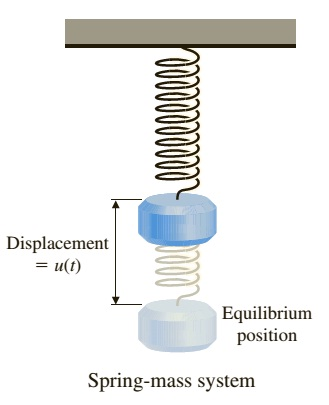
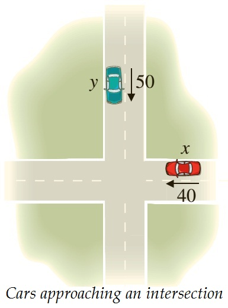
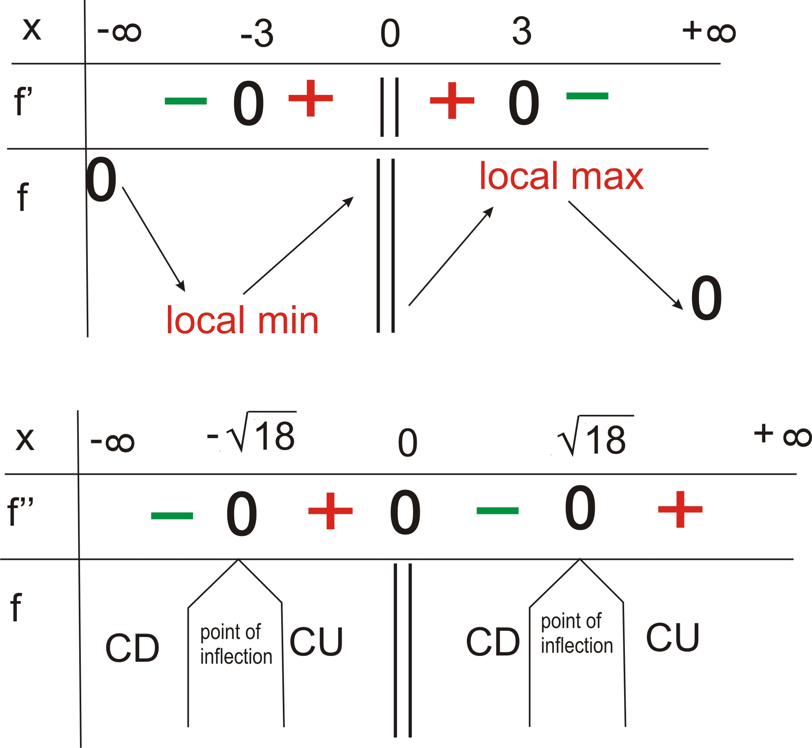
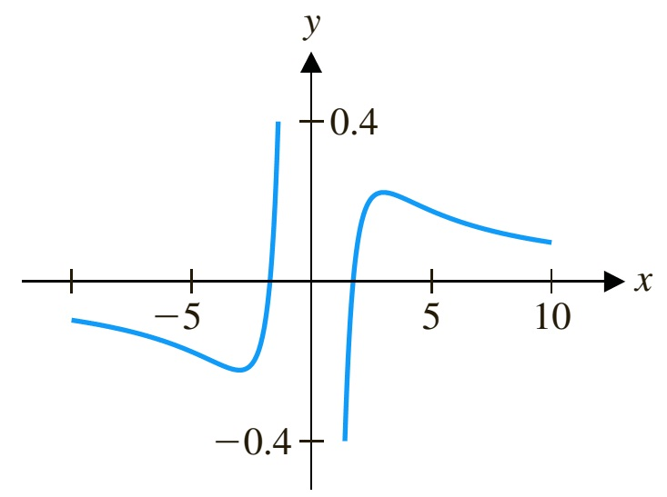

# Midterm ReviewÔn tập giữa kỳ

MT1003 Calculus 1 - Midterm Review
MT1003 Giải tích 1 - Ôn tập giữa kỳ

Truong-Son Van 
tsvan@hcmut.edu.vn

Nine worked problems spanning functions, limits, continuity, derivatives and their applications, and curve sketching. Problem set adapted from a midterm review by Dr. Lê Xuân Đại. Read alongside Stewart, Chapters 1-4; OpenStax Calculus Volume 1.
Chín bài tập mẫu bao quát hàm số, giới hạn, tính liên tục, đạo hàm và ứng dụng, và khảo sát hàm số. Bộ bài phỏng theo tài liệu ôn tập giữa kỳ của TS. Lê Xuân Đại. Đọc kèm Stewart, Chương 1-4; OpenStax Calculus Tập 1.

---

# What This Review CoversNội dung ôn tập

Try first, then revealThử trước, rồi xem lời giải

Every solution in this deck is <strong>blurred</strong>. Work each problem yourself first, then click to reveal the solution one step at a time. The nine problems are grouped by topic, and each group opens with a short recap of the key facts.
Mọi lời giải trong bộ slide này đều được <strong>làm mờ</strong>. Hãy tự làm từng bài trước, rồi bấm để hiện lời giải theo từng bước. Chín bài được nhóm theo chủ đề, và mỗi nhóm bắt đầu bằng phần ôn nhanh các ý chính.

<strong>Functions, limits, continuityHàm số, giới hạn, liên tục</strong>
Composition and domain; an indeterminate limit via L'Hôpital; continuity of a piecewise function.
Hợp hàm và miền xác định; giới hạn dạng vô định qua L'Hôpital; tính liên tục của hàm cho theo từng khúc.

<strong>Derivatives and their usesĐạo hàm và ứng dụng</strong>
Horizontal tangents; non-differentiable points; linear approximation; velocity; related rates; curve sketching.
Tiếp tuyến nằm ngang; điểm không khả vi; xấp xỉ tuyến tính; vận tốc; tốc độ liên hệ; khảo sát hàm số.

---
class: compact
---

# Recap: Composition and DomainÔn nhanh: Hợp hàm và miền xác định

CompositionHợp hàm

The composition of $f$ and $g$ is
Hợp của $f$ và $g$ là

$$
(f\circ g)(x)=f\big(g(x)\big).
$$

Apply $g$ first, then $f$. In general $f\circ g\ne g\circ f$.
Áp dụng $g$ trước, rồi đến $f$. Nói chung $f\circ g\ne g\circ f$.

Domain ruleQuy tắc miền xác định

$x$ lies in the domain of $f\circ g$ when $x$ is in the domain of $g$ <em>and</em> $g(x)$ is in the domain of $f$. Recall $\sqrt{\,\cdot\,}$ needs its argument $\ge 0$, and a fraction needs a nonzero denominator.
$x$ thuộc miền xác định của $f\circ g$ khi $x$ thuộc miền của $g$ <em>và</em> $g(x)$ thuộc miền của $f$. Nhớ rằng $\sqrt{\,\cdot\,}$ cần biểu thức $\ge 0$, và phân thức cần mẫu khác $0$.

Read: Stewart §1.3 (new functions from old); OpenStax Calculus Vol 1, §1.1.
Đọc: Stewart §1.3 (hàm mới từ hàm cũ); OpenStax Calculus Tập 1, §1.1.

---
class: compact
---

# Problem 1 - Composition and DomainBài 1 - Hợp hàm và miền xác định

ProblemĐề bài

For $f(x)=x^2+1$ and $g(x)=\sqrt{x-2}$, find the compositions $f\circ g$ and $g\circ f$, and identify the domain of each.
Cho $f(x)=x^2+1$ và $g(x)=\sqrt{x-2}$, tìm các hợp hàm $f\circ g$ và $g\circ f$, và xác định miền xác định của mỗi hàm.

$f\circ g$

$(f\circ g)(x)=f\big(\sqrt{x-2}\big)=(\sqrt{x-2})^2+1=x-1.$ The inner $\sqrt{x-2}$ requires $x\ge 2$, so the domain is $[2,+\infty)$.
$(f\circ g)(x)=f\big(\sqrt{x-2}\big)=(\sqrt{x-2})^2+1=x-1.$ Vì $\sqrt{x-2}$ cần $x\ge 2$ nên miền xác định là $[2,+\infty)$.

$g\circ f$

$(g\circ f)(x)=\sqrt{(x^2+1)-2}=\sqrt{x^2-1}.$ We need $x^2-1\ge 0$, so the domain is $(-\infty,-1]\cup[1,+\infty)$.
$(g\circ f)(x)=\sqrt{(x^2+1)-2}=\sqrt{x^2-1}.$ Cần $x^2-1\ge 0$, nên miền xác định là $(-\infty,-1]\cup[1,+\infty)$.

Note the domain of $f\circ g$ is <em>not</em> all of $\mathbb{R}$: although $x-1$ is defined everywhere, the composition inherits the restriction $x\ge2$ from $g$.
Chú ý miền của $f\circ g$ <em>không</em> phải toàn $\mathbb{R}$: dù $x-1$ xác định khắp nơi, hợp hàm vẫn mang ràng buộc $x\ge2$ từ $g$.

---
class: compact
---

# Recap: Indeterminate Limits and L'HôpitalÔn nhanh: Giới hạn vô định và L'Hôpital

L'Hôpital's RuleQuy tắc L'Hôpital

If $\lim \dfrac{f(x)}{g(x)}$ has the indeterminate form $\dfrac{0}{0}$ or $\dfrac{\infty}{\infty}$, then
Nếu $\lim \dfrac{f(x)}{g(x)}$ có dạng vô định $\dfrac{0}{0}$ hoặc $\dfrac{\infty}{\infty}$ thì

$$
\lim \frac{f(x)}{g(x)}=\lim \frac{f'(x)}{g'(x)},
$$

provided the right-hand limit exists.
với điều kiện giới hạn ở vế phải tồn tại.

Two limits worth memorizingHai giới hạn nên nhớ

$$
\lim_{x\to0}\frac{\sin x}{x}=1,\qquad \lim_{x\to0}\frac{1-\cos x}{x^2}=\frac12.
$$

Combine algebra with these before reaching for L'Hôpital; they often finish faster.
Kết hợp biến đổi đại số với chúng trước khi dùng L'Hôpital; thường sẽ nhanh hơn.

Read: Stewart §4.4 (indeterminate forms and L'Hôpital); OpenStax Vol 1, §4.8.
Đọc: Stewart §4.4 (dạng vô định và L'Hôpital); OpenStax Tập 1, §4.8.

---
class: compact
---

# Problem 2 - An Indeterminate LimitBài 2 - Một giới hạn vô định

ProblemĐề bài

Evaluate
Tính

$$
\lim_{x\to0}\left(\cot^2 x-\frac{1}{x^2}\right).
$$

Step 1 - combine into one fractionBước 1 - gộp thành một phân thức

$$
\cot^2 x-\frac{1}{x^2}=\frac{\cos^2 x}{\sin^2 x}-\frac{1}{x^2}=\frac{x^2\cos^2 x-\sin^2 x}{x^2\sin^2 x}.
$$

As $x\to0$ both numerator and denominator tend to $0$: an indeterminate $\tfrac{0}{0}$.
Khi $x\to0$, cả tử và mẫu đều tiến tới $0$: dạng vô định $\tfrac{0}{0}$.

Rewriting to a single fraction exposes the $\frac{0}{0}$ form; the denominator behaves like $x^4$ near $0$.
Viết về một phân thức làm lộ dạng $\frac{0}{0}$; gần $0$ mẫu số có dáng điệu như $x^4$.

---
class: compact
---

# Problem 2 - Finishing With L'HôpitalBài 2 - Hoàn tất bằng L'Hôpital

Step 2 - factor and splitBước 2 - phân tích và tách

Since $x^2\cos^2 x-\sin^2 x=(x\cos x-\sin x)(x\cos x+\sin x)$,
Vì $x^2\cos^2 x-\sin^2 x=(x\cos x-\sin x)(x\cos x+\sin x)$,

$$
\cot^2 x-\frac{1}{x^2}=\underbrace{\frac{x\cos x-\sin x}{x^3}}_{\to\,?}\cdot\underbrace{\frac{x\cos x+\sin x}{x}}_{\to\,2}\cdot\underbrace{\frac{x^2}{\sin^2 x}}_{\to\,1}.
$$

Step 3 - the remaining factorBước 3 - thừa số còn lại

The first factor is still $\tfrac{0}{0}$; apply L'Hôpital:
Thừa số đầu vẫn là $\tfrac{0}{0}$; dùng L'Hôpital:

$$
\lim_{x\to0}\frac{x\cos x-\sin x}{x^3}\overset{\text{L'H}}{=}\lim_{x\to0}\frac{-x\sin x}{3x^2}=\lim_{x\to0}\frac{-\sin x}{3x}=-\frac13.
$$

Hence the limit is $\left(-\tfrac13\right)\cdot 2\cdot 1=-\dfrac{2}{3}.$
Do đó giới hạn bằng $\left(-\tfrac13\right)\cdot 2\cdot 1=-\dfrac{2}{3}.$

---
class: compact
---

# Recap: ContinuityÔn nhanh: Tính liên tục

Continuity at a pointLiên tục tại một điểm

$f$ is continuous at $a$ if
$f$ liên tục tại $a$ nếu

$$
\lim_{x\to a} f(x)=f(a),
$$

that is, the limit exists and equals the value.
nghĩa là giới hạn tồn tại và bằng giá trị của hàm.

Piecewise functionsHàm cho theo từng khúc

A piecewise function is continuous wherever each piece is. At a breakpoint $a$, continuity requires the one-sided limits and the value to agree: $\lim_{x\to a^-}f=\lim_{x\to a^+}f=f(a)$.
Hàm cho theo từng khúc liên tục ở mọi nơi mà từng khúc liên tục. Tại điểm nối $a$, tính liên tục đòi hỏi các giới hạn một phía và giá trị phải bằng nhau: $\lim_{x\to a^-}f=\lim_{x\to a^+}f=f(a)$.

Read: Stewart §2.5 (continuity); OpenStax Vol 1, §2.4.
Đọc: Stewart §2.5 (tính liên tục); OpenStax Tập 1, §2.4.

---
class: compact
---

# Problem 3 - Continuity of a Piecewise FunctionBài 3 - Tính liên tục của hàm từng khúc

ProblemĐề bài

A tax code charges $12\%$ on the first $20$ (million VND) of taxable income and $16\%$ on the remainder. Find constants $a$ and $b$ so that the tax liability
Một biểu thuế tính $12\%$ trên $20$ (triệu VND) thu nhập chịu thuế đầu tiên và $16\%$ trên phần còn lại. Tìm hằng số $a$ và $b$ để số thuế phải nộp

$$
T(x)=\begin{cases}0, & x\le 0\\ a+0.12x, & 0<x\le 20\\ b+0.16(x-20), & x>20\end{cases}
$$

is continuous for all $x$.
liên tục với mọi $x$.

At $x=0$Tại $x=0$

Match the value $T(0)=0$: $\;a+0.12(0)=0$, so $a=0$.
Khớp với giá trị $T(0)=0$: $\;a+0.12(0)=0$, nên $a=0$.

At $x=20$Tại $x=20$

Match the two formulas: $a+0.12(20)=b+0.16(0)$, giving $b=2.4$.
Khớp hai công thức: $a+0.12(20)=b+0.16(0)$, suy ra $b=2.4$.

Each piece is a polynomial, so it is continuous on its interval; only the breakpoints $x=0$ and $x=20$ can fail, which fixes $a$ and $b$.
Mỗi khúc là đa thức nên liên tục trên khoảng của nó; chỉ các điểm nối $x=0$ và $x=20$ có thể hỏng, và điều đó xác định $a$ và $b$.

---
class: compact
---

# Recap: Derivatives and DifferentiabilityÔn nhanh: Đạo hàm và tính khả vi

Rules you will needCác quy tắc cần dùng

Product: $(uv)'=u'v+uv'$. Quotient: $\left(\dfrac{u}{v}\right)'=\dfrac{u'v-uv'}{v^2}$. Chain: $\big(f(g(x))\big)'=f'\big(g(x)\big)\,g'(x)$.
Tích: $(uv)'=u'v+uv'$. Thương: $\left(\dfrac{u}{v}\right)'=\dfrac{u'v-uv'}{v^2}$. Hàm hợp: $\big(f(g(x))\big)'=f'\big(g(x)\big)\,g'(x)$.

Two facts to reuseHai điều nên nhớ

A tangent line is <strong>horizontal</strong> exactly where $f'(x)=0$. And $f$ fails to be <strong>differentiable</strong> where its graph has a corner, a cusp, a vertical tangent, or a break.
Tiếp tuyến <strong>nằm ngang</strong> đúng tại nơi $f'(x)=0$. Và $f$ <strong>không khả vi</strong> ở nơi đồ thị có điểm gãy, điểm nhọn, tiếp tuyến thẳng đứng, hoặc điểm gián đoạn.

Read: Stewart §2.8, §3.1-3.4; OpenStax Vol 1, §3.2-3.6.
Đọc: Stewart §2.8, §3.1-3.4; OpenStax Tập 1, §3.2-3.6.

---
class: compact
---

# Problem 4 - Where Is the Tangent Horizontal?Bài 4 - Tiếp tuyến nằm ngang ở đâu?

ProblemĐề bài

Find all points on the graph of $f(x)=2\sin x+\sin^2 x$ at which the tangent line is horizontal.
Tìm tất cả các điểm trên đồ thị của $f(x)=2\sin x+\sin^2 x$ mà tại đó tiếp tuyến nằm ngang.

Step 1 - set $f'(x)=0$Bước 1 - đặt $f'(x)=0$

$$
f'(x)=2\cos x+2\sin x\cos x=2\cos x\,(1+\sin x)=0
\ \Rightarrow\ \cos x=0 \ \text{or}\ \sin x=-1.
$$

Step 2 - solve and locate the pointsBước 2 - giải và xác định các điểm

$\cos x=0\Rightarrow x=\tfrac{\pi}{2}+k\pi$; the case $\sin x=-1$ is already contained in this. The heights are $f=3$ at $x=\tfrac{\pi}{2}+2k\pi$ and $f=-1$ at $x=\tfrac{3\pi}{2}+2k\pi$ $(k\in\mathbb{Z})$.
$\cos x=0\Rightarrow x=\tfrac{\pi}{2}+k\pi$; trường hợp $\sin x=-1$ đã nằm trong đó. Tung độ là $f=3$ tại $x=\tfrac{\pi}{2}+2k\pi$ và $f=-1$ tại $x=\tfrac{3\pi}{2}+2k\pi$ $(k\in\mathbb{Z})$.

Read: Stewart §3.1, §3.3; OpenStax Vol 1, §3.3, §3.5.
Đọc: Stewart §3.1, §3.3; OpenStax Tập 1, §3.3, §3.5.

---
class: compact
---

# Problem 5 - Points of Non-DifferentiabilityBài 5 - Các điểm không khả vi

ProblemĐề bài

Determine all values of $x$ at which $f(x)=\sqrt[3]{x^3-3x^2+2x}$ is not differentiable.
Xác định tất cả giá trị $x$ mà tại đó $f(x)=\sqrt[3]{x^3-3x^2+2x}$ không khả vi.

Differentiate with the chain ruleLấy đạo hàm bằng quy tắc hàm hợp

$$
f(x)=(x^3-3x^2+2x)^{1/3}\ \Rightarrow\
f'(x)=\frac{1}{3}\cdot\frac{3x^2-6x+2}{\big(x(x-1)(x-2)\big)^{2/3}}.
$$

Read off the bad pointsĐọc ra các điểm hỏng

The numerator is finite everywhere. The denominator vanishes at the roots of $x(x-1)(x-2)$, where $f'$ becomes infinite (vertical tangents). So $f$ is <strong>not differentiable</strong> at $x=0,\ 1,\ 2$.
Tử số hữu hạn khắp nơi. Mẫu số triệt tiêu tại các nghiệm của $x(x-1)(x-2)$, nơi $f'$ trở nên vô hạn (tiếp tuyến thẳng đứng). Vậy $f$ <strong>không khả vi</strong> tại $x=0,\ 1,\ 2$.

Read: Stewart §2.8 (where a function is not differentiable); OpenStax Vol 1, §3.2.
Đọc: Stewart §2.8 (khi nào hàm không khả vi); OpenStax Tập 1, §3.2.

---
class: compact
---

# Recap: Linear ApproximationÔn nhanh: Xấp xỉ tuyến tính

Tangent-line approximationXấp xỉ bằng tiếp tuyến

Near $x=a$, a differentiable $f$ is well approximated by its tangent line:
Gần $x=a$, hàm khả vi $f$ được xấp xỉ tốt bởi tiếp tuyến của nó:

$$
L(x)=f(a)+f'(a)(x-a),\qquad f(x)\approx L(x).
$$

Choosing the base pointChọn điểm gốc

Pick $a$ close to the target value and easy to evaluate (a point where $f$ and $f'$ are known exactly).
Chọn $a$ gần giá trị cần tính và dễ tính (điểm mà $f$ và $f'$ đã biết chính xác).

Read: Stewart §3.10 (linear approximations); OpenStax Vol 1, §4.2.
Đọc: Stewart §3.10 (xấp xỉ tuyến tính); OpenStax Tập 1, §4.2.

---
class: compact
---

# Problem 6 - Linear ApproximationBài 6 - Xấp xỉ tuyến tính

ProblemĐề bài

Find the linear approximation to $f(x)=\cos x$ at $a=\tfrac{\pi}{3}$ and use it to estimate $\cos(1)$ (with $1$ in radians).
Tìm xấp xỉ tuyến tính của $f(x)=\cos x$ tại $a=\tfrac{\pi}{3}$ và dùng nó để ước lượng $\cos(1)$ (với $1$ tính bằng radian).

Build $L$Lập $L$

With $f(a)=\cos\tfrac{\pi}{3}=\tfrac12$ and $f'(a)=-\sin\tfrac{\pi}{3}=-\tfrac{\sqrt3}{2}$,
Với $f(a)=\cos\tfrac{\pi}{3}=\tfrac12$ và $f'(a)=-\sin\tfrac{\pi}{3}=-\tfrac{\sqrt3}{2}$,

$$
L(x)=\frac12-\frac{\sqrt3}{2}\left(x-\frac{\pi}{3}\right).
$$

Estimate $\cos(1)$Ước lượng $\cos(1)$

Since $\tfrac{\pi}{3}\approx1.047$ is close to $1$,
Vì $\tfrac{\pi}{3}\approx1.047$ gần $1$,

$$
\cos(1)\approx L(1)=\frac12-\frac{\sqrt3}{2}\left(1-\frac{\pi}{3}\right)\approx 0.5409.
$$

(True value $\cos 1\approx0.5403$.)
(Giá trị đúng $\cos 1\approx0.5403$.)

Read: Stewart §3.10; OpenStax Vol 1, §4.2.
Đọc: Stewart §3.10; OpenStax Tập 1, §4.2.

---
class: compact
---

# Recap: Rates of Change and Related RatesÔn nhanh: Tốc độ biến thiên và tốc độ liên hệ

Derivative as a rateĐạo hàm là tốc độ

If $s(t)$ is position, then velocity is $s'(t)$ and speed is $|s'(t)|$.
Nếu $s(t)$ là vị trí thì vận tốc là $s'(t)$ và tốc độ là $|s'(t)|$.

Related-rates recipeQuy trình tốc độ liên hệ

(1) Name the quantities and their rates. (2) Find an equation relating them. (3) Differentiate both sides with respect to $t$. (4) Substitute the instant's values and solve for the unknown rate.
(1) Đặt tên các đại lượng và tốc độ của chúng. (2) Tìm phương trình liên hệ. (3) Lấy đạo hàm hai vế theo $t$. (4) Thay giá trị tại thời điểm đó và giải ra tốc độ cần tìm.

Read: Stewart §3.7, §3.9; OpenStax Vol 1, §3.4, §4.1.
Đọc: Stewart §3.7, §3.9; OpenStax Tập 1, §3.4, §4.1.

---
class: compact
---

# Problem 7 - Velocity of a Weight on a SpringBài 7 - Vận tốc của vật treo trên lò xo

ProblemĐề bài

A weight hangs from a spring. Its displacement (in cm) at time $t$ (in s) after release is $u(t)=4\cos t$. Find the velocity at time $t$, and determine when the weight is moving fastest.
Một vật treo trên lò xo. Độ dịch chuyển (cm) tại thời điểm $t$ (s) sau khi thả là $u(t)=4\cos t$. Tìm vận tốc tại thời điểm $t$, và xác định khi nào vật chuyển động nhanh nhất.

SolutionLời giải

Velocity is the derivative of displacement: $u'(t)=-4\sin t$. Since $\sin t$ ranges over $[-1,1]$, the speed $|u'(t)|=4|\sin t|$ is largest, equal to $4$ cm/s, when $\sin t=\pm1$, i.e. $t=\tfrac{\pi}{2}+k\pi$. At those times $u(t)=0$: the weight moves fastest as it passes through its resting position.
Vận tốc là đạo hàm của độ dịch chuyển: $u'(t)=-4\sin t$. Vì $\sin t$ nằm trong $[-1,1]$, tốc độ $|u'(t)|=4|\sin t|$ lớn nhất, bằng $4$ cm/s, khi $\sin t=\pm1$, tức $t=\tfrac{\pi}{2}+k\pi$. Tại các thời điểm đó $u(t)=0$: vật chuyển động nhanh nhất khi đi qua vị trí cân bằng.

Read: Stewart §3.7 (rates of change in the natural sciences); OpenStax Vol 1, §3.4.
Đọc: Stewart §3.7 (tốc độ biến thiên trong khoa học tự nhiên); OpenStax Tập 1, §3.4.

---
class: compact
---

# Problem 8 - Related Rates: The Radar GunBài 8 - Tốc độ liên hệ: Súng radar

ProblemĐề bài

A car travels south at $50$ km/h, at a point $100$ km north of an intersection. A police car travels west at $40$ km/h, at a point $50$ km east of the same intersection. At that instant, what rate of change of the distance between the two cars does the police radar register?
Một ô tô chạy về hướng nam với vận tốc $50$ km/h, tại điểm cách giao lộ $100$ km về phía bắc. Một xe cảnh sát chạy về hướng tây với vận tốc $40$ km/h, tại điểm cách giao lộ đó $50$ km về phía đông. Tại thời điểm ấy, radar của cảnh sát ghi nhận tốc độ biến thiên của khoảng cách giữa hai xe bằng bao nhiêu?

Read: Stewart §3.9 (related rates); OpenStax Vol 1, §4.1.
Đọc: Stewart §3.9 (tốc độ liên hệ); OpenStax Tập 1, §4.1.

---
class: compact
---

# Problem 8 - Setting It UpBài 8 - Thiết lập bài toán

Name the quantitiesĐặt tên các đại lượng

Let $x$ be the police car's distance to the intersection, $y$ the other car's distance, and $z$ the distance between the two cars. Both cars approach the intersection, so their distances shrink:
Gọi $x$ là khoảng cách từ xe cảnh sát đến giao lộ, $y$ khoảng cách của xe kia, và $z$ khoảng cách giữa hai xe. Cả hai xe đang tiến về giao lộ nên các khoảng cách giảm dần:

$$
\frac{dx}{dt}=-40,\qquad \frac{dy}{dt}=-50\ \ (\text{km/h}).
$$

We want $\dfrac{dz}{dt}$ at the instant $x=50,\ y=100$.
Ta cần $\dfrac{dz}{dt}$ tại thời điểm $x=50,\ y=100$.

Relate themLiên hệ chúng

The two roads meet at a right angle, so by the Pythagorean theorem $\ z^2=x^2+y^2.$
Hai con đường vuông góc, nên theo định lý Pythagoras $\ z^2=x^2+y^2.$

Read: Stewart §3.9; OpenStax Vol 1, §4.1.
Đọc: Stewart §3.9; OpenStax Tập 1, §4.1.

---
class: compact
---

# Problem 8 - Differentiate and SubstituteBài 8 - Lấy đạo hàm và thay số

Differentiate with respect to $t$Lấy đạo hàm theo $t$

$$
2z\frac{dz}{dt}=2x\frac{dx}{dt}+2y\frac{dy}{dt}
\ \Rightarrow\
\frac{dz}{dt}=\frac{1}{z}\left(x\frac{dx}{dt}+y\frac{dy}{dt}\right).
$$

Plug in the instantThay giá trị tại thời điểm đó

At $x=50,\ y=100$, $\ z=\sqrt{50^2+100^2}=50\sqrt5$, so
Tại $x=50,\ y=100$, $\ z=\sqrt{50^2+100^2}=50\sqrt5$, nên

$$
\frac{dz}{dt}=\frac{50(-40)+100(-50)}{50\sqrt5}=\frac{-7000}{50\sqrt5}=-\frac{140}{\sqrt5}\approx-62.6\ \text{km/h}.
$$

The distance is decreasing; the radar registers about $62.6$ km/h.
Khoảng cách đang giảm; radar ghi nhận khoảng $62.6$ km/h.

Read: Stewart §3.9; OpenStax Vol 1, §4.1.
Đọc: Stewart §3.9; OpenStax Tập 1, §4.1.

---
class: compact
---

# Recap: Analyzing a CurveÔn nhanh: Khảo sát một đường cong

The checklistCác bước

Domain; then $f'$ for increase/decrease and local extrema; then $f''$ for concavity and inflection points; then asymptotes (vertical, horizontal, slant); finally, sketch.
Miền xác định; rồi $f'$ để xét tăng/giảm và cực trị; rồi $f''$ để xét lồi/lõm và điểm uốn; rồi tiệm cận (đứng, ngang, xiên); cuối cùng, vẽ đồ thị.

Asymptotes at a glanceTiệm cận nhìn nhanh

Vertical: where $f\to\pm\infty$ (often a zero of the denominator). Horizontal: $\lim_{x\to\pm\infty}f=L$. Slant: when the numerator's degree is one more than the denominator's.
Đứng: nơi $f\to\pm\infty$ (thường là nghiệm của mẫu). Ngang: $\lim_{x\to\pm\infty}f=L$. Xiên: khi bậc tử lớn hơn bậc mẫu đúng một đơn vị.

Read: Stewart §4.3, §4.5 (curve sketching); OpenStax Vol 1, §4.5-4.6.
Đọc: Stewart §4.3, §4.5 (khảo sát hàm số); OpenStax Tập 1, §4.5-4.6.

---
class: compact
---

# Problem 9 - Curve SketchingBài 9 - Khảo sát hàm số

ProblemĐề bài

Discuss $y=\dfrac{x^2-3}{x^3}$ with respect to increase/decrease, concavity, inflection points, local extrema, and asymptotes, and use this to sketch the curve.
Khảo sát $y=\dfrac{x^2-3}{x^3}$ về tính tăng/giảm, lồi/lõm, điểm uốn, cực trị, và tiệm cận, rồi dùng kết quả để vẽ đồ thị.

Domain and first derivativeMiền xác định và đạo hàm cấp một

Domain: $x\ne0$. Writing $y=\dfrac1x-\dfrac{3}{x^3}$,
Miền xác định: $x\ne0$. Viết $y=\dfrac1x-\dfrac{3}{x^3}$,

$$
f'(x)=-\frac{1}{x^2}+\frac{9}{x^4}=\frac{9-x^2}{x^4}\ \Rightarrow\ f'(x)=0 \text{ at } x=\pm3.
$$

Read: Stewart §4.5; OpenStax Vol 1, §4.6.
Đọc: Stewart §4.5; OpenStax Tập 1, §4.6.

---
class: compact
---

# Problem 9 - Second Derivative and SignsBài 9 - Đạo hàm cấp hai và dấu

Second derivativeĐạo hàm cấp hai

$$
f''(x)=\frac{2}{x^3}-\frac{36}{x^5}=\frac{2(x^2-18)}{x^5}\ \Rightarrow\ f''(x)=0 \text{ at } x=\pm\sqrt{18}=\pm3\sqrt2.
$$

Reading the sign of $f'$Đọc dấu của $f'$

Since $x^4>0$, $f'$ has the sign of $9-x^2$. So $f$ decreases on $(-\infty,-3)$, increases on $(-3,0)$ and $(0,3)$, and decreases on $(3,\infty)$: a local min at $x=-3$ and a local max at $x=3$.
Vì $x^4>0$, dấu của $f'$ là dấu của $9-x^2$. Vậy $f$ giảm trên $(-\infty,-3)$, tăng trên $(-3,0)$ và $(0,3)$, và giảm trên $(3,\infty)$: cực tiểu tại $x=-3$ và cực đại tại $x=3$.

Read: Stewart §4.3 (what derivatives tell us); OpenStax Vol 1, §4.5.
Đọc: Stewart §4.3 (đạo hàm cho ta biết gì); OpenStax Tập 1, §4.5.

---
class: compact
---

# Problem 9 - Sign ChartBài 9 - Bảng biến thiên

What the chart showsBảng cho thấy điều gì

The signs of $f'$ (top) and $f''$ (bottom) organize the behavior: local min $\left(-3,-\tfrac29\right)$, local max $\left(3,\tfrac29\right)$, and inflection points at $x=\pm3\sqrt2$.
Dấu của $f'$ (trên) và $f''$ (dưới) sắp xếp toàn bộ dáng điệu: cực tiểu $\left(-3,-\tfrac29\right)$, cực đại $\left(3,\tfrac29\right)$, và điểm uốn tại $x=\pm3\sqrt2$.

CD = concave down, CU = concave up; the double bar marks the vertical asymptote $x=0$.
CD = lõm xuống, CU = lồi lên; vạch đôi đánh dấu tiệm cận đứng $x=0$.

---
class: compact
---

# Problem 9 - AsymptotesBài 9 - Tiệm cận

VerticalTiệm cận đứng

As $x\to0^{+}$, $\ f=\dfrac{x^2-3}{x^3}\to\dfrac{-3}{0^{+}}=-\infty$; as $x\to0^{-}$, $\ f\to+\infty$. So $x=0$ is a vertical asymptote.
Khi $x\to0^{+}$, $\ f=\dfrac{x^2-3}{x^3}\to\dfrac{-3}{0^{+}}=-\infty$; khi $x\to0^{-}$, $\ f\to+\infty$. Vậy $x=0$ là tiệm cận đứng.

Horizontal (and slant)Tiệm cận ngang (và xiên)

$\displaystyle\lim_{x\to\pm\infty}\frac{x^2-3}{x^3}=\lim_{x\to\pm\infty}\left(\frac1x-\frac{3}{x^3}\right)=0$, so $y=0$ is a horizontal asymptote. There is no slant asymptote.
$\displaystyle\lim_{x\to\pm\infty}\frac{x^2-3}{x^3}=\lim_{x\to\pm\infty}\left(\frac1x-\frac{3}{x^3}\right)=0$, nên $y=0$ là tiệm cận ngang. Không có tiệm cận xiên.

Read: Stewart §4.5 (summary of curve sketching); OpenStax Vol 1, §4.6.
Đọc: Stewart §4.5 (tóm tắt khảo sát hàm số); OpenStax Tập 1, §4.6.

---
class: compact
---

# Problem 9 - The SketchBài 9 - Đồ thị

Putting it togetherGhép lại

The curve falls to the local min $\left(-3,-\tfrac29\right)$, rises toward $+\infty$ at the asymptote $x=0$, re-emerges from $-\infty$, rises to the local max $\left(3,\tfrac29\right)$, then decays to $y=0$. Note $f$ is odd, so the graph is symmetric about the origin.
Đường cong hạ xuống cực tiểu $\left(-3,-\tfrac29\right)$, đi lên $+\infty$ tại tiệm cận $x=0$, xuất hiện lại từ $-\infty$, lên cực đại $\left(3,\tfrac29\right)$, rồi giảm về $y=0$. Chú ý $f$ là hàm lẻ, nên đồ thị đối xứng qua gốc tọa độ.

Read: Stewart §4.5; OpenStax Vol 1, §4.6.
Đọc: Stewart §4.5; OpenStax Tập 1, §4.6.

---
class: compact
---

# Before the Exam - Quick ChecklistTrước kỳ thi - Danh mục kiểm tra nhanh

Skills reviewedCác kỹ năng đã ôn

Composition and domains; indeterminate limits with L'Hôpital; continuity of piecewise functions; horizontal tangents and non-differentiable points; linear approximation; velocity and related rates; and a full curve analysis.
Hợp hàm và miền xác định; giới hạn vô định với L'Hôpital; tính liên tục của hàm từng khúc; tiếp tuyến nằm ngang và điểm không khả vi; xấp xỉ tuyến tính; vận tốc và tốc độ liên hệ; và một bài khảo sát hàm số đầy đủ.

<strong>Common slipsLỗi thường gặp</strong>
Forgetting the domain a composition inherits; dropping the chain-rule factor; mixing up which distance is shrinking in related rates; ignoring one-sided limits at a breakpoint.
Quên miền xác định mà hợp hàm thừa hưởng; bỏ sót thừa số của quy tắc hàm hợp; nhầm khoảng cách nào đang giảm trong tốc độ liên hệ; bỏ qua giới hạn một phía tại điểm nối.

<strong>Self-checkTự kiểm tra</strong>
Can you state each answer with its units and reasoning, and redo every derivative from scratch? Before using L'Hôpital, confirm the form really is $\tfrac00$ or $\tfrac{\infty}{\infty}$.
Bạn có thể nêu mỗi đáp án kèm đơn vị và lập luận, và làm lại mọi đạo hàm từ đầu không? Trước khi dùng L'Hôpital, hãy chắc chắn dạng thực sự là $\tfrac00$ hoặc $\tfrac{\infty}{\infty}$.

---

# Sources and Further ReadingNguồn và tài liệu đọc thêm

AcknowledgmentLời cảm ơn

The nine problems in this review are adapted from a midterm review set by Dr. Lê Xuân Đại (HCMUT, Faculty of Applied Science, Department of Applied Mathematics). Explanations and section references follow Stewart, <em>Calculus</em>, and OpenStax, <em>Calculus Volume 1</em>.
Chín bài tập trong phần ôn tập này được phỏng theo bộ ôn tập giữa kỳ của TS. Lê Xuân Đại (ĐHBK TP.HCM, Khoa Khoa học Ứng dụng, Bộ môn Toán Ứng dụng). Phần giải thích và tham chiếu mục theo Stewart, <em>Calculus</em>, và OpenStax, <em>Calculus Volume 1</em>.

Textbooks: Stewart, <em>Calculus</em>, Chapters 1-4; <a href="https://openstax.org/details/books/calculus-volume-1">OpenStax Calculus Volume 1</a>.
Giáo trình: Stewart, <em>Calculus</em>, Chương 1-4; <a href="https://openstax.org/details/books/calculus-volume-1">OpenStax Calculus Tập 1</a>.

