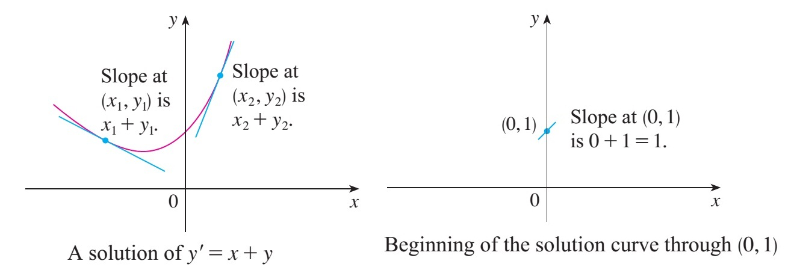
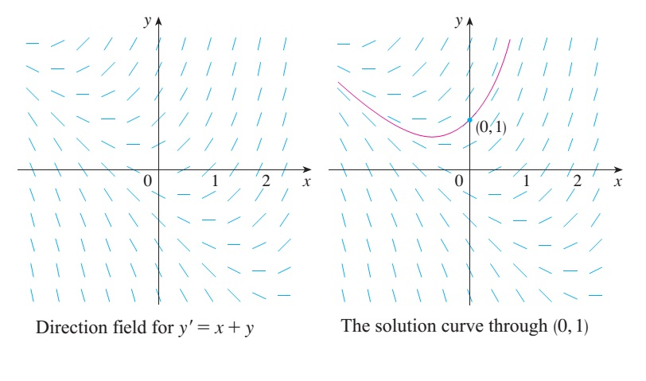
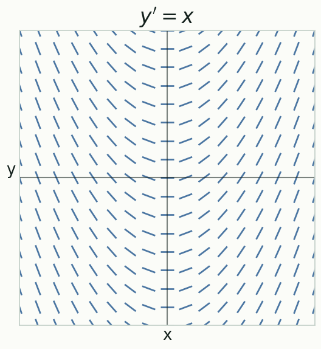
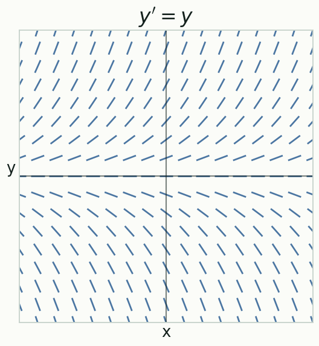
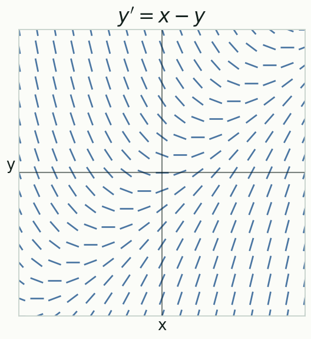
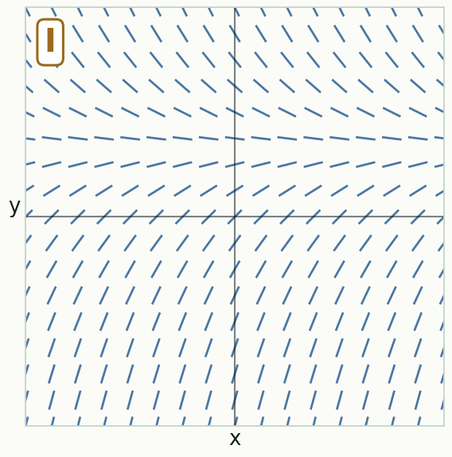
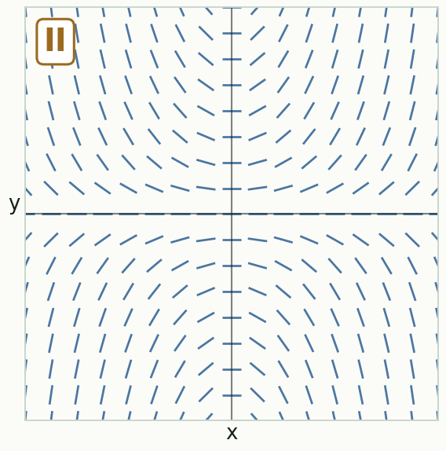
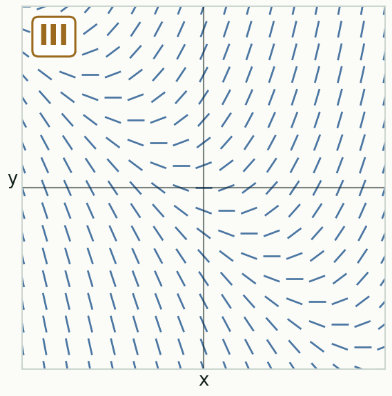
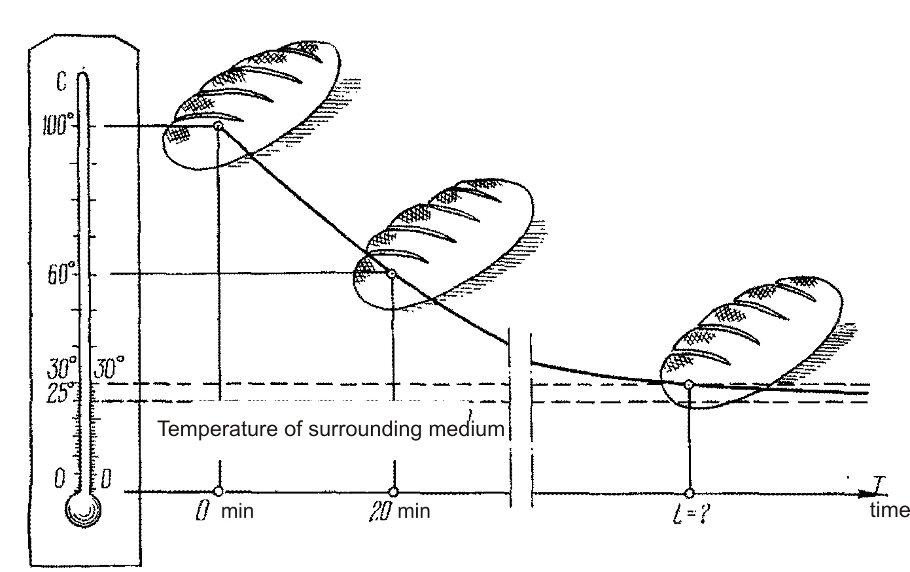

# First-Order Differential EquationsPhương trình vi phân cấp một

MT1003 Calculus 1 - Lecture 09
MT1003 Giải tích 1 - Bài giảng 09

Truong-Son Van 
tsvan@hcmut.edu.vn

Reading map: <a href="../../readings/">course readings</a>. Read: <a href="https://activecalculus.org/single/sec-7-2-qualitative.html">Active Calculus 7.2</a>, <a href="https://activecalculus.org/single/sec-7-4-separable.html">7.4</a>; <a href="https://openstax.org/books/calculus-volume-2/pages/4-1-basics-of-differential-equations">OpenStax Vol 2, 4.1-4.3</a>, <a href="https://openstax.org/books/calculus-volume-2/pages/4-5-first-order-linear-equations">4.5</a>; Stewart 9.1-9.3, 9.5.
Bản đồ đọc: <a href="../../readings/">tài liệu đọc của môn</a>. Đọc: <a href="https://activecalculus.org/single/sec-7-2-qualitative.html">Active Calculus 7.2</a>, <a href="https://activecalculus.org/single/sec-7-4-separable.html">7.4</a>; <a href="https://openstax.org/books/calculus-volume-2/pages/4-1-basics-of-differential-equations">OpenStax Tập 2, 4.1-4.3</a>, <a href="https://openstax.org/books/calculus-volume-2/pages/4-5-first-order-linear-equations">4.5</a>; Stewart 9.1-9.3, 9.5.

---

# Why Differential Equations?Vì sao học phương trình vi phân?

Calculus, put to workGiải tích khi được đưa vào thực tế

Perhaps the most important of all the applications of calculus is to differential equations. Many of the laws that govern the natural world are statements about the <strong>rates</strong> at which things change. When we write those laws in mathematical form, the rates become derivatives, and the resulting equations - equations that contain derivatives - are <strong>differential equations</strong>.
Có lẽ ứng dụng quan trọng nhất của giải tích chính là phương trình vi phân. Nhiều định luật chi phối thế giới tự nhiên là những phát biểu về <strong>tốc độ</strong> thay đổi của các đại lượng. Khi viết các định luật ấy dưới dạng toán học, tốc độ trở thành đạo hàm, và các phương trình thu được - những phương trình chứa đạo hàm - là <strong>phương trình vi phân</strong>.

<strong>Motion</strong> Newton's second law relates acceleration to force.<strong>Chuyển động</strong> Định luật II Newton liên hệ gia tốc với lực.

<strong>Cooling</strong> a hot object loses heat at a rate set by its surroundings.<strong>Làm nguội</strong> vật nóng tỏa nhiệt với tốc độ do môi trường quyết định.

<strong>Circuits</strong> current and charge evolve through a differential equation.<strong>Mạch điện</strong> dòng điện và điện tích biến thiên theo phương trình vi phân.

<strong>Populations</strong> growth and decay are governed by rates of change.<strong>Dân số</strong> tăng và giảm được điều khiển bởi tốc độ thay đổi.

Read: <a href="https://openstax.org/books/calculus-volume-2/pages/4-1-basics-of-differential-equations">OpenStax Vol 2, 4.1</a>; Stewart 9.1.
Đọc: <a href="https://openstax.org/books/calculus-volume-2/pages/4-1-basics-of-differential-equations">OpenStax Tập 2, 4.1</a>; Stewart 9.1.

---

# Today's PlanKế hoạch hôm nay

0-15<strong>Language</strong> - what a differential equation is, its order, and what a solution means<strong>Ngôn ngữ</strong> - phương trình vi phân là gì, cấp của nó, và nghiệm nghĩa là gì

15-45<strong>Direction fields</strong> - seeing solutions before solving<strong>Trường hướng</strong> - nhìn thấy nghiệm trước khi giải

45-90<strong>Separable equations</strong> - separate the variables, then integrate<strong>Phương trình tách biến</strong> - tách biến rồi lấy tích phân

90-100<strong>Break</strong><strong>Nghỉ giải lao</strong>

100-130<strong>Application</strong> - Newton's law of cooling<strong>Ứng dụng</strong> - định luật làm nguội Newton

130-160<strong>Linear equations</strong> - the integrating factor<strong>Phương trình tuyến tính</strong> - thừa số tích phân

160-170<strong>Exercise lab</strong> - mixed practice and a decision chart<strong>Luyện tập</strong> - bài tập tổng hợp và bảng quyết định

Session 11-12 reading map: <a href="https://activecalculus.org/single/sec-7-4-separable.html">Active Calculus 7.4</a>; <a href="https://openstax.org/books/calculus-volume-2/pages/4-1-basics-of-differential-equations">OpenStax Vol 2, 4.1-4.5</a>; Stewart 9.1-9.5.
Bản đồ đọc Buổi 11-12: <a href="https://activecalculus.org/single/sec-7-4-separable.html">Active Calculus 7.4</a>; <a href="https://openstax.org/books/calculus-volume-2/pages/4-1-basics-of-differential-equations">OpenStax Tập 2, 4.1-4.5</a>; Stewart 9.1-9.5.

---
class: compact
---

# What Is A Differential Equation?Phương trình vi phân là gì?

Definition - differential equation and orderĐịnh nghĩa - phương trình vi phân và cấp

A <strong>differential equation</strong> is an equation that contains an unknown function and one or more of its derivatives. The <strong>order</strong> of a differential equation is the order of the highest derivative that appears. An equation of the form $F\left(x, y, y', \ldots, y^{(n)}\right)=0$ is an <strong>ordinary differential equation of order $n$</strong>.
Một <strong>phương trình vi phân</strong> là phương trình chứa một hàm chưa biết và một hay nhiều đạo hàm của nó. <strong>Cấp</strong> của phương trình vi phân là cấp của đạo hàm cao nhất xuất hiện trong đó. Phương trình dạng $F\left(x, y, y', \ldots, y^{(n)}\right)=0$ là <strong>phương trình vi phân thường cấp $n$</strong>.

First order - our whole lectureCấp một - trọng tâm bài giảng

Only $y$ and $y'$ appear. We usually solve for the derivative and write
Chỉ có $y$ và $y'$ xuất hiện. Ta thường giải theo đạo hàm và viết

$$
y'=F(x, y).
$$

Reading the orderNhận biết cấp

$y'=x+y$ is first order; $\ y''+4y=0$ is second order; $\ (y')^3-x=0$ is still first order - order counts the <em>highest derivative</em>, not the power.
$y'=x+y$ là cấp một; $\ y''+4y=0$ là cấp hai; $\ (y')^3-x=0$ vẫn là cấp một - cấp đếm theo <em>đạo hàm cao nhất</em>, không phải lũy thừa.

Read: <a href="https://openstax.org/books/calculus-volume-2/pages/4-1-basics-of-differential-equations">OpenStax Vol 2, 4.1</a>; Stewart 9.1.
Đọc: <a href="https://openstax.org/books/calculus-volume-2/pages/4-1-basics-of-differential-equations">OpenStax Tập 2, 4.1</a>; Stewart 9.1.

---
class: compact
---

# What Is A Solution?Nghiệm là gì?

Definition - solution, general and particularĐịnh nghĩa - nghiệm, tổng quát và riêng

A function $y=f(x)$ is a <strong>solution</strong> of a differential equation on an interval $I$ if the equation holds for every $x$ in $I$ when $y$ and its derivatives are replaced by $f$ and its derivatives. A first-order equation usually has a <strong>general solution</strong>: a family of solutions containing one arbitrary constant $C$. Fixing $C$ gives a <strong>particular solution</strong>.
Hàm $y=f(x)$ là một <strong>nghiệm</strong> của phương trình vi phân trên khoảng $I$ nếu phương trình đúng với mọi $x$ trong $I$ khi thay $y$ và các đạo hàm của nó bởi $f$ và các đạo hàm của $f$. Phương trình cấp một thường có <strong>nghiệm tổng quát</strong>: một họ nghiệm chứa một hằng số tùy ý $C$. Cố định $C$ cho một <strong>nghiệm riêng</strong>.

Check a solution by substitutingKiểm tra nghiệm bằng cách thế vào

Verify that $y=Ce^{x}-x-1$ solves $y'=x+y$. Differentiate: $y'=Ce^{x}-1$. The right side is $x+y=x+\left(Ce^{x}-x-1\right)=Ce^{x}-1$. Both sides agree, so the whole family is a solution.
Kiểm tra rằng $y=Ce^{x}-x-1$ là nghiệm của $y'=x+y$. Lấy đạo hàm: $y'=Ce^{x}-1$. Vế phải là $x+y=x+\left(Ce^{x}-x-1\right)=Ce^{x}-1$. Hai vế bằng nhau, nên cả họ hàm là nghiệm.

Read: <a href="https://openstax.org/books/calculus-volume-2/pages/4-1-basics-of-differential-equations">OpenStax Vol 2, 4.1</a>; Stewart 9.1.
Đọc: <a href="https://openstax.org/books/calculus-volume-2/pages/4-1-basics-of-differential-equations">OpenStax Tập 2, 4.1</a>; Stewart 9.1.

---
class: compact
---

# Initial-Value ProblemsBài toán giá trị ban đầu

Definition - initial-value problemĐịnh nghĩa - bài toán giá trị ban đầu

An <strong>initial-value problem</strong> (IVP) is a differential equation together with an <strong>initial condition</strong> $y(x_0)=y_0$. The condition selects one particular solution from the general family by fixing the constant $C$.
Một <strong>bài toán giá trị ban đầu</strong> (BTGTBĐ) gồm một phương trình vi phân kèm theo một <strong>điều kiện ban đầu</strong> $y(x_0)=y_0$. Điều kiện này chọn ra một nghiệm riêng từ họ nghiệm tổng quát bằng cách cố định hằng số $C$.

Example - one curve through one pointVí dụ - một đường cong qua một điểm

The family $y=Ce^{x}-x-1$ solves $y'=x+y$. Impose $y(0)=1$:
Họ $y=Ce^{x}-x-1$ là nghiệm của $y'=x+y$. Áp điều kiện $y(0)=1$:

$$
1=Ce^{0}-0-1=C-1 \;\Rightarrow\; C=2,\qquad y=2e^{x}-x-1.
$$

We will learn to <em>derive</em> this family later; for now, notice how the initial condition pins down a single curve.
Ta sẽ học cách <em>tìm ra</em> họ nghiệm này ở phần sau; hiện tại, hãy chú ý điều kiện ban đầu ghim lại một đường cong duy nhất.

Read: <a href="https://openstax.org/books/calculus-volume-2/pages/4-1-basics-of-differential-equations">OpenStax Vol 2, 4.1</a>; Stewart 9.1.
Đọc: <a href="https://openstax.org/books/calculus-volume-2/pages/4-1-basics-of-differential-equations">OpenStax Tập 2, 4.1</a>; Stewart 9.1.

---
class: compact
---

# Direction Fields: The IdeaTrường hướng: ý tưởng

Slope is handed to usHệ số góc được cho sẵn

A first-order equation $y'=F(x, y)$ tells us the slope of the solution curve at <em>every</em> point $(x, y)$ - without solving anything. For $y'=x+y$, the slope at $(0, 1)$ is
Phương trình cấp một $y'=F(x, y)$ cho ta hệ số góc của đường cong nghiệm tại <em>mọi</em> điểm $(x, y)$ - mà không cần giải. Với $y'=x+y$, hệ số góc tại $(0, 1)$ là

$$
y'=0+1=1.
$$

Draw a short segment of that slope at many points and a picture of the solutions appears.
Vẽ một đoạn thẳng ngắn có hệ số góc đó tại nhiều điểm, ta sẽ thấy hình ảnh của các nghiệm.

Read: <a href="https://openstax.org/books/calculus-volume-2/pages/4-2-direction-fields-and-numerical-methods">OpenStax Vol 2, 4.2</a>; <a href="https://activecalculus.org/single/sec-7-2-qualitative.html">Active Calculus 7.2</a>; Stewart 9.2.
Đọc: <a href="https://openstax.org/books/calculus-volume-2/pages/4-2-direction-fields-and-numerical-methods">OpenStax Tập 2, 4.2</a>; <a href="https://activecalculus.org/single/sec-7-2-qualitative.html">Active Calculus 7.2</a>; Stewart 9.2.

---
class: compact
---

# Direction Fields: Reading The FieldTrường hướng: đọc trường

Follow the flowĐi theo dòng

The short segments form the <strong>direction field</strong>. A solution curve is one that stays tangent to the field everywhere. Starting at $(0, 1)$ and following the arrows traces the particular solution $y=2e^{x}-x-1$ - the same curve the initial condition selected.
Các đoạn thẳng ngắn tạo thành <strong>trường hướng</strong>. Đường cong nghiệm là đường luôn tiếp xúc với trường tại mọi nơi. Bắt đầu tại $(0, 1)$ và đi theo các mũi tên vạch ra nghiệm riêng $y=2e^{x}-x-1$ - đúng đường cong mà điều kiện ban đầu đã chọn.

Qualitative firstĐịnh tính trước

A direction field shows the <strong>shape</strong> of solutions - where they rise, fall, or level off - even when a formula is hard to find. It is a picture, not a substitute for solving.
Trường hướng cho thấy <strong>dáng điệu</strong> của nghiệm - nơi chúng tăng, giảm hay đi ngang - ngay cả khi khó tìm được công thức. Đó là một bức tranh, không thay thế cho việc giải.

Read: <a href="https://openstax.org/books/calculus-volume-2/pages/4-2-direction-fields-and-numerical-methods">OpenStax Vol 2, 4.2</a>; <a href="https://activecalculus.org/single/sec-7-2-qualitative.html">Active Calculus 7.2</a>; Stewart 9.2.
Đọc: <a href="https://openstax.org/books/calculus-volume-2/pages/4-2-direction-fields-and-numerical-methods">OpenStax Tập 2, 4.2</a>; <a href="https://activecalculus.org/single/sec-7-2-qualitative.html">Active Calculus 7.2</a>; Stewart 9.2.

---
class: compact
---

# The Field Depends On $F(x, y)$Trường phụ thuộc vào $F(x, y)$

One equation, one fieldMột phương trình, một trường

The slope at each point is $F(x, y)$, so the right-hand side alone decides the whole picture. Three equations, three unmistakable fields - look for where the segments lie flat (slope $0$).
Hệ số góc tại mỗi điểm là $F(x, y)$, nên chỉ riêng vế phải quyết định toàn bộ bức tranh. Ba phương trình, ba trường khác biệt rõ rệt - hãy tìm nơi các đoạn nằm ngang (hệ số góc $0$).

$y'=x$: slopes depend only on $x$; flat on the $y$-axis.$y'=x$: hệ số góc chỉ phụ thuộc $x$; nằm ngang trên trục $y$.

$y'=y$: autonomous; flat on the $x$-axis.$y'=y$: tự trị; nằm ngang trên trục $x$.

$y'=x-y$: flat along the line $y=x$.$y'=x-y$: nằm ngang dọc đường $y=x$.

Read: <a href="https://openstax.org/books/calculus-volume-2/pages/4-2-direction-fields-and-numerical-methods">OpenStax Vol 2, 4.2</a>; <a href="https://activecalculus.org/single/sec-7-2-qualitative.html">Active Calculus 7.2</a>; Stewart 9.2. Fields generated for this course.
Đọc: <a href="https://openstax.org/books/calculus-volume-2/pages/4-2-direction-fields-and-numerical-methods">OpenStax Tập 2, 4.2</a>; <a href="https://activecalculus.org/single/sec-7-2-qualitative.html">Active Calculus 7.2</a>; Stewart 9.2. Trường được tạo cho môn học.

---
class: compact
---

# Your Turn: Match The Slope FieldTự luyện: ghép trường hướng

Match each field to its equationGhép mỗi trường với phương trình

Pair I, II, III with $\ y'=xy,\quad y'=x+y,\quad y'=1-y.$ The trick: find where the segments are horizontal (slope $0$).
Ghép I, II, III với $\ y'=xy,\quad y'=x+y,\quad y'=1-y.$ Mẹo: tìm nơi các đoạn nằm ngang (hệ số góc $0$).

AnswerĐáp án

I $\to y'=1-y$ (flat along $y=1$); II $\to y'=xy$ (flat on both axes); III $\to y'=x+y$ (flat along $y=-x$).I $\to y'=1-y$ (ngang dọc $y=1$); II $\to y'=xy$ (ngang trên hai trục); III $\to y'=x+y$ (ngang dọc $y=-x$).

Practice: <a href="https://activecalculus.org/single/sec-7-2-qualitative.html">Active Calculus 7.2</a>; <a href="https://openstax.org/books/calculus-volume-2/pages/4-2-direction-fields-and-numerical-methods">OpenStax Vol 2, 4.2</a>; Stewart 9.2.
Luyện tập: <a href="https://activecalculus.org/single/sec-7-2-qualitative.html">Active Calculus 7.2</a>; <a href="https://openstax.org/books/calculus-volume-2/pages/4-2-direction-fields-and-numerical-methods">OpenStax Tập 2, 4.2</a>; Stewart 9.2.

---
class: compact
---

# Separable Equations: DefinitionPhương trình tách biến: định nghĩa

Definition - separable equationĐịnh nghĩa - phương trình tách biến

A <strong>separable equation</strong> is a first-order differential equation in which the variables can be placed on opposite sides, one form being
Một <strong>phương trình tách biến</strong> là phương trình vi phân cấp một trong đó các biến có thể được đưa về hai vế riêng biệt, một dạng là

$$
P(x)\,dx+Q(y)\,dy=0.
$$

Method - integrate both sidesPhương pháp - lấy tích phân hai vế

Integrate each side in its own variable:
Lấy tích phân mỗi vế theo biến của nó:

$$
\int P(x)\,dx+\int Q(y)\,dy=C.
$$

This equation defines $y$ <strong>implicitly</strong> as a function of $x$.
Phương trình này xác định $y$ một cách <strong>ẩn</strong> theo $x$.

Read: <a href="https://activecalculus.org/single/sec-7-4-separable.html">Active Calculus 7.4</a>; <a href="https://openstax.org/books/calculus-volume-2/pages/4-3-separable-equations">OpenStax Vol 2, 4.3</a>; Stewart 9.3.
Đọc: <a href="https://activecalculus.org/single/sec-7-4-separable.html">Active Calculus 7.4</a>; <a href="https://openstax.org/books/calculus-volume-2/pages/4-3-separable-equations">OpenStax Tập 2, 4.3</a>; Stewart 9.3.

---
class: compact solution-slide
---

# Separable: Worked Example 1Tách biến: ví dụ mẫu 1

SolveGiải

Solve the differential equation $x\,dx+(y+1)\,dy=0$.
Giải phương trình vi phân $x\,dx+(y+1)\,dy=0$.

Integrate each termLấy tích phân từng số hạng

The variables are already separated, so integrate both sides:
Các biến đã tách sẵn, nên lấy tích phân hai vế:

$$
\int x\,dx+\int (y+1)\,dy=C \;\Rightarrow\; \frac{x^2}{2}+\frac{y^2}{2}+y=C.
$$

InterpretDiễn giải

This is the general solution, given implicitly. Completing the square, $x^2+(y+1)^2=2C+1$, shows the solution curves are concentric circles centered at $(0, -1)$.
Đây là nghiệm tổng quát, cho dưới dạng ẩn. Bằng cách hoàn thành bình phương, $x^2+(y+1)^2=2C+1$, ta thấy các đường cong nghiệm là những đường tròn đồng tâm tại $(0, -1)$.

Read: <a href="https://activecalculus.org/single/sec-7-4-separable.html">Active Calculus 7.4</a>; <a href="https://openstax.org/books/calculus-volume-2/pages/4-3-separable-equations">OpenStax Vol 2, 4.3</a>; Stewart 9.3. Example from instructor notes (Lê Xuân Đại).
Đọc: <a href="https://activecalculus.org/single/sec-7-4-separable.html">Active Calculus 7.4</a>; <a href="https://openstax.org/books/calculus-volume-2/pages/4-3-separable-equations">OpenStax Tập 2, 4.3</a>; Stewart 9.3. Ví dụ từ ghi chú giảng viên (Lê Xuân Đại).

---
class: compact
---

# Separable: A More General FormTách biến: một dạng tổng quát hơn

Products of an $x$-part and a $y$-partTích của phần theo $x$ và phần theo $y$

Any equation of the form
Mọi phương trình dạng

$$
f_1(x)\,g_1(y)\,dx+f_2(x)\,g_2(y)\,dy=0
$$

reduces to a separable one. Where $f_2(x)\,g_1(y)\neq 0$, divide both sides by it:
đều đưa được về dạng tách biến. Ở nơi $f_2(x)\,g_1(y)\neq 0$, chia hai vế cho nó:

$$
\frac{f_1(x)}{f_2(x)}\,dx+\frac{g_2(y)}{g_1(y)}\,dy=0 \;\Rightarrow\; \int\frac{f_1(x)}{f_2(x)}\,dx+\int\frac{g_2(y)}{g_1(y)}\,dy=C.
$$

Do not lose the constant solutionsĐừng đánh mất các nghiệm hằng

Dividing by $g_1(y)$ is only valid where $g_1(y)\neq 0$. Each root $g_1(y)=0$ gives a constant solution $y=\text{const}$ that must be checked separately.
Việc chia cho $g_1(y)$ chỉ hợp lệ ở nơi $g_1(y)\neq 0$. Mỗi nghiệm $g_1(y)=0$ cho một nghiệm hằng ($y$ không đổi) cần được kiểm tra riêng.

Read: <a href="https://activecalculus.org/single/sec-7-4-separable.html">Active Calculus 7.4</a>; <a href="https://openstax.org/books/calculus-volume-2/pages/4-3-separable-equations">OpenStax Vol 2, 4.3</a>; Stewart 9.3.
Đọc: <a href="https://activecalculus.org/single/sec-7-4-separable.html">Active Calculus 7.4</a>; <a href="https://openstax.org/books/calculus-volume-2/pages/4-3-separable-equations">OpenStax Tập 2, 4.3</a>; Stewart 9.3.

---
class: compact solution-slide
---

# Separable: Worked Example 2 - Set UpTách biến: ví dụ mẫu 2 - thiết lập

SolveGiải

Solve $x\left(y^2-4\right)dx+y\,dy=0$.
Giải $x\left(y^2-4\right)dx+y\,dy=0$.

Separate, then integrateTách biến rồi lấy tích phân

Divide by $y^2-4\neq 0$ (valid where $y\neq\pm 2$) to separate the variables, then integrate each side:
Chia cho $y^2-4\neq 0$ (đúng khi $y\neq\pm 2$) để tách biến, rồi lấy tích phân từng vế:

$$
x\,dx+\frac{y\,dy}{y^2-4}=0 \;\Rightarrow\; \frac{x^2}{2}+\frac{1}{2}\ln\left|y^2-4\right|=C_1.
$$

Read: <a href="https://activecalculus.org/single/sec-7-4-separable.html">Active Calculus 7.4</a>; <a href="https://openstax.org/books/calculus-volume-2/pages/4-3-separable-equations">OpenStax Vol 2, 4.3</a>; Stewart 9.3. Example from instructor notes (Lê Xuân Đại).
Đọc: <a href="https://activecalculus.org/single/sec-7-4-separable.html">Active Calculus 7.4</a>; <a href="https://openstax.org/books/calculus-volume-2/pages/4-3-separable-equations">OpenStax Tập 2, 4.3</a>; Stewart 9.3. Ví dụ từ ghi chú giảng viên (Lê Xuân Đại).

---
class: compact solution-slide
---

# Separable: Worked Example 2 - SolveTách biến: ví dụ mẫu 2 - giải

Combine and simplifyGộp lại và rút gọn

Multiply by $2$ and rename the constant: $\ x^2+\ln\left|y^2-4\right|=\ln|C|$, hence
Nhân với $2$ và đổi tên hằng số: $\ x^2+\ln\left|y^2-4\right|=\ln|C|$, do đó

$$
y^2-4=Ce^{-x^2}.
$$

Check and note the constantsKiểm tra và lưu ý nghiệm hằng

Differentiating $y^2-4=Ce^{-x^2}$ gives $2y\,y'=-2x\,Ce^{-x^2}=-2x\left(y^2-4\right)$, i.e. $x\left(y^2-4\right)+y\,y'=0$. The constant solutions $y=\pm 2$ are recovered by $C=0$.
Lấy đạo hàm $y^2-4=Ce^{-x^2}$ cho $2y\,y'=-2x\,Ce^{-x^2}=-2x\left(y^2-4\right)$, tức $x\left(y^2-4\right)+y\,y'=0$. Các nghiệm hằng $y=\pm 2$ ứng với $C=0$.

Read: <a href="https://activecalculus.org/single/sec-7-4-separable.html">Active Calculus 7.4</a>; <a href="https://openstax.org/books/calculus-volume-2/pages/4-3-separable-equations">OpenStax Vol 2, 4.3</a>; Stewart 9.3. Example from instructor notes (Lê Xuân Đại).
Đọc: <a href="https://activecalculus.org/single/sec-7-4-separable.html">Active Calculus 7.4</a>; <a href="https://openstax.org/books/calculus-volume-2/pages/4-3-separable-equations">OpenStax Tập 2, 4.3</a>; Stewart 9.3. Ví dụ từ ghi chú giảng viên (Lê Xuân Đại).

---
class: compact
---

# Your Turn: SeparableTự luyện: tách biến

S1

Solve the initial-value problem
Giải bài toán giá trị ban đầu

$$
y'=xy,\qquad y(0)=1.
$$

S2

Solve the initial-value problem
Giải bài toán giá trị ban đầu

$$
y'=y\cos x,\qquad y(0)=1.
$$

HintsGợi ý

Both are separable: write $\frac{dy}{y}=\,\cdots\,dx$ and integrate. Then use $y(0)=1$ to fix the constant.
Cả hai đều tách biến: viết $\frac{dy}{y}=\,\cdots\,dx$ rồi lấy tích phân. Sau đó dùng $y(0)=1$ để tìm hằng số.

AnswersĐáp số

S1: $\displaystyle \frac{dy}{y}=x\,dx \Rightarrow \ln|y|=\frac{x^2}{2}+C \Rightarrow y=e^{x^2/2}.$ 
S2: $\displaystyle \frac{dy}{y}=\cos x\,dx \Rightarrow \ln|y|=\sin x+C \Rightarrow y=e^{\sin x}.$

Practice: <a href="https://activecalculus.org/single/sec-7-4-separable.html">Active Calculus 7.4</a>; <a href="https://openstax.org/books/calculus-volume-2/pages/4-3-separable-equations">OpenStax Vol 2, 4.3</a>; Stewart 9.3 exercises.
Luyện tập: <a href="https://activecalculus.org/single/sec-7-4-separable.html">Active Calculus 7.4</a>; <a href="https://openstax.org/books/calculus-volume-2/pages/4-3-separable-equations">OpenStax Tập 2, 4.3</a>; bài tập Stewart 9.3.

---
class: compact
---

# Application: A Loaf Of BreadỨng dụng: một ổ bánh mì

The questionBài toán

A loaf of bread is taken from a $100^\circ\text{C}$ oven into a room kept at $25^\circ\text{C}$. After $20$ minutes the bread has cooled to $60^\circ\text{C}$. How long until it reaches $30^\circ\text{C}$, when it is finally cool enough to enjoy?
Một ổ bánh mì được lấy ra từ lò $100^\circ\text{C}$ đưa vào phòng giữ ở $25^\circ\text{C}$. Sau $20$ phút bánh nguội còn $60^\circ\text{C}$. Bao lâu nữa thì bánh đạt $30^\circ\text{C}$, đủ nguội để thưởng thức?

Read: <a href="https://openstax.org/books/calculus-volume-2/pages/4-3-separable-equations">OpenStax Vol 2, 4.3</a> (Newton's law of cooling); Stewart 9.3. Problem from instructor notes (Lê Xuân Đại).
Đọc: <a href="https://openstax.org/books/calculus-volume-2/pages/4-3-separable-equations">OpenStax Tập 2, 4.3</a> (định luật làm nguội Newton); Stewart 9.3. Bài toán từ ghi chú giảng viên (Lê Xuân Đại).

---
class: compact
---

# Cooling: The ModelLàm nguội: mô hình

Newton's law of coolingĐịnh luật làm nguội Newton

Let $T(t)$ be the temperature of the body at time $t$, and let $T_s$ be the constant temperature of the surroundings. The rate of cooling is <strong>proportional</strong> to the temperature difference:
Gọi $T(t)$ là nhiệt độ của vật tại thời điểm $t$, và $T_s$ là nhiệt độ không đổi của môi trường. Tốc độ làm nguội <strong>tỉ lệ</strong> với hiệu nhiệt độ:

$$
\frac{dT}{dt}=k\,(T-T_s),
$$

where $k$ is a constant of proportionality (here $k<0$, since a hot body cools).
trong đó $k$ là hằng số tỉ lệ (ở đây $k<0$, vì vật nóng thì nguội đi).

For our breadVới ổ bánh của ta

The surroundings are the room, so $T_s=25$ and the model is $\dfrac{dT}{dt}=k\,(T-25)$ - a separable equation.
Môi trường là căn phòng, nên $T_s=25$ và mô hình là $\dfrac{dT}{dt}=k\,(T-25)$ - một phương trình tách biến.

Read: <a href="https://openstax.org/books/calculus-volume-2/pages/4-3-separable-equations">OpenStax Vol 2, 4.3</a>; Stewart 9.3.
Đọc: <a href="https://openstax.org/books/calculus-volume-2/pages/4-3-separable-equations">OpenStax Tập 2, 4.3</a>; Stewart 9.3.

---
class: compact solution-slide
---

# Cooling: Solve The EquationLàm nguội: giải phương trình

Separate the variables and integrateTách biến và lấy tích phân

With $T_s=25$,
Với $T_s=25$,

$$
\frac{dT}{T-25}=k\,dt \;\Rightarrow\; \int\frac{dT}{T-25}=k\int dt \;\Rightarrow\; \ln|T-25|=kt+\ln C.
$$

Exponentiating, $\ T-25=Ce^{kt}$, so $\ T=25+Ce^{kt}$.
Lấy lũy thừa, $\ T-25=Ce^{kt}$, nên $\ T=25+Ce^{kt}$.

Use the first conditionDùng điều kiện thứ nhất

At $t=0$ the bread is at $100^\circ\text{C}$: $\ 100=25+Ce^{0}\Rightarrow C=75$. Therefore
Tại $t=0$ bánh ở $100^\circ\text{C}$: $\ 100=25+Ce^{0}\Rightarrow C=75$. Do đó

$$
T=25+75\,e^{kt}.
$$

Read: <a href="https://openstax.org/books/calculus-volume-2/pages/4-3-separable-equations">OpenStax Vol 2, 4.3</a>; Stewart 9.3.
Đọc: <a href="https://openstax.org/books/calculus-volume-2/pages/4-3-separable-equations">OpenStax Tập 2, 4.3</a>; Stewart 9.3.

---
class: compact solution-slide
---

# Cooling: Find $k$ And The TimeLàm nguội: tìm $k$ và thời gian

Use the second conditionDùng điều kiện thứ hai

At $t=20$, $T=60$: $\ 60=25+75\,e^{20k}\Rightarrow e^{20k}=\frac{35}{75}=\frac{7}{15}$. Hence $e^{k}=\left(\frac{7}{15}\right)^{1/20}$ and
Tại $t=20$, $T=60$: $\ 60=25+75\,e^{20k}\Rightarrow e^{20k}=\frac{35}{75}=\frac{7}{15}$. Suy ra $e^{k}=\left(\frac{7}{15}\right)^{1/20}$ và

$$
T=25+75\left(\frac{7}{15}\right)^{t/20}.
$$

AnswerĐáp số

Set $T=30$: $\ 75\left(\frac{7}{15}\right)^{t/20}=5\Rightarrow\left(\frac{7}{15}\right)^{t/20}=\frac{1}{15}$, so
Cho $T=30$: $\ 75\left(\frac{7}{15}\right)^{t/20}=5\Rightarrow\left(\frac{7}{15}\right)^{t/20}=\frac{1}{15}$, nên

$$
t=\frac{20\ln 15}{\ln 15-\ln 7}\approx 71\ \text{min}.
$$

The bread is ready to eat after about $71$ minutes - a sensible wait.
Bánh sẵn sàng để ăn sau khoảng $71$ phút - một khoảng chờ hợp lý.

Read: <a href="https://openstax.org/books/calculus-volume-2/pages/4-3-separable-equations">OpenStax Vol 2, 4.3</a>; Stewart 9.3.
Đọc: <a href="https://openstax.org/books/calculus-volume-2/pages/4-3-separable-equations">OpenStax Tập 2, 4.3</a>; Stewart 9.3.

---
class: compact
---

# Linear Equations: DefinitionPhương trình tuyến tính: định nghĩa

Definition - first-order linear equationĐịnh nghĩa - phương trình tuyến tính cấp một

A first-order <strong>linear</strong> differential equation is one that can be written in the form
Một phương trình vi phân <strong>tuyến tính</strong> cấp một là phương trình có thể viết dưới dạng

$$
\frac{dy}{dx}+P(x)\,y=Q(x),
$$

where $P$ and $Q$ are continuous on a given interval. The unknown $y$ and its derivative $y'$ appear only to the first power.
trong đó $P$ và $Q$ liên tục trên một khoảng cho trước. Hàm chưa biết $y$ và đạo hàm $y'$ chỉ xuất hiện ở lũy thừa bậc một.

Separable or linear?Tách biến hay tuyến tính?

Some equations are both, but many linear equations - like $y'+P(x)y=Q(x)$ with $Q\neq 0$ - cannot be separated. They need their own method.
Một số phương trình là cả hai, nhưng nhiều phương trình tuyến tính - như $y'+P(x)y=Q(x)$ với $Q\neq 0$ - không tách biến được. Chúng cần một phương pháp riêng.

Read: <a href="https://openstax.org/books/calculus-volume-2/pages/4-5-first-order-linear-equations">OpenStax Vol 2, 4.5</a>; Stewart 9.5.
Đọc: <a href="https://openstax.org/books/calculus-volume-2/pages/4-5-first-order-linear-equations">OpenStax Tập 2, 4.5</a>; Stewart 9.5.

---
class: compact
---

# Linear Equations: The Integrating FactorPhương trình tuyến tính: thừa số tích phân

Multiply by a well-chosen factorNhân với một thừa số khéo chọn

Multiply $y'+P(x)y=Q(x)$ by the <strong>integrating factor</strong> $\mu(x)=e^{\int P(x)\,dx}$. The left side collapses to a single derivative:
Nhân $y'+P(x)y=Q(x)$ với <strong>thừa số tích phân</strong> $\mu(x)=e^{\int P(x)\,dx}$. Vế trái gộp lại thành một đạo hàm:

$$
\left(y\,e^{\int P(x)\,dx}\right)'=Q(x)\,e^{\int P(x)\,dx}.
$$

General solutionNghiệm tổng quát

Integrate both sides and solve for $y$:
Lấy tích phân hai vế và giải theo $y$:

$$
y=e^{-\int P(x)\,dx}\left[\int Q(x)\,e^{\int P(x)\,dx}\,dx+C\right].
$$

Read: <a href="https://openstax.org/books/calculus-volume-2/pages/4-5-first-order-linear-equations">OpenStax Vol 2, 4.5</a>; Stewart 9.5.
Đọc: <a href="https://openstax.org/books/calculus-volume-2/pages/4-5-first-order-linear-equations">OpenStax Tập 2, 4.5</a>; Stewart 9.5.

---
class: compact solution-slide
---

# Linear: Worked Example - Set UpTuyến tính: ví dụ mẫu - thiết lập

SolveGiải

Solve the initial-value problem $\ y'+\dfrac{1}{x}\,y=3x,\quad y(1)=1.$
Giải bài toán giá trị ban đầu $\ y'+\dfrac{1}{x}\,y=3x,\quad y(1)=1.$

Build the integrating factorLập thừa số tích phân

Here $P(x)=\frac{1}{x}$ and $Q(x)=3x$, so $\mu=e^{\int dx/x}=e^{\ln x}=x$. Multiplying both sides by $\mu=x$ collapses the left side to a single derivative:
Ở đây $P(x)=\frac{1}{x}$ và $Q(x)=3x$, nên $\mu=e^{\int dx/x}=e^{\ln x}=x$. Nhân hai vế với $\mu=x$ làm vế trái gộp thành một đạo hàm:

$$
(xy)'=3x^2.
$$

Read: <a href="https://openstax.org/books/calculus-volume-2/pages/4-5-first-order-linear-equations">OpenStax Vol 2, 4.5</a>; Stewart 9.5. Example from instructor notes (Lê Xuân Đại).
Đọc: <a href="https://openstax.org/books/calculus-volume-2/pages/4-5-first-order-linear-equations">OpenStax Tập 2, 4.5</a>; Stewart 9.5. Ví dụ từ ghi chú giảng viên (Lê Xuân Đại).

---
class: compact solution-slide
---

# Linear: Worked Example - SolveTuyến tính: ví dụ mẫu - giải

Integrate and solve for $y$Lấy tích phân và giải theo $y$

Integrate both sides, then divide by $x$:
Lấy tích phân hai vế, rồi chia cho $x$:

$$
xy=x^3+C \;\Rightarrow\; y=x^2+\frac{C}{x}.
$$

Apply the condition and checkÁp điều kiện và kiểm tra

From $y(1)=1$: $\ 1=1+C\Rightarrow C=0$, so $y=x^2$. Check: $y'=2x$ and $2x+\frac{1}{x}\cdot x^2=2x+x=3x.$ &check;
Từ $y(1)=1$: $\ 1=1+C\Rightarrow C=0$, nên $y=x^2$. Kiểm tra: $y'=2x$ và $2x+\frac{1}{x}\cdot x^2=2x+x=3x.$ &check;

Read: <a href="https://openstax.org/books/calculus-volume-2/pages/4-5-first-order-linear-equations">OpenStax Vol 2, 4.5</a>; Stewart 9.5. Example from instructor notes (Lê Xuân Đại).
Đọc: <a href="https://openstax.org/books/calculus-volume-2/pages/4-5-first-order-linear-equations">OpenStax Tập 2, 4.5</a>; Stewart 9.5. Ví dụ từ ghi chú giảng viên (Lê Xuân Đại).

---
class: compact
---

# Your Turn: LinearTự luyện: tuyến tính

L1

Solve the initial-value problem
Giải bài toán giá trị ban đầu

$$
y'-y=x,\qquad y(0)=1.
$$

L2

Find the general solution of
Tìm nghiệm tổng quát của

$$
y'-2y=e^{3x}.
$$

HintsGợi ý

L1: $P=-1$, so $\mu=e^{-x}$. L2: $P=-2$, so $\mu=e^{-2x}$. Multiply, recognize $(\mu y)'$, integrate.
L1: $P=-1$, nên $\mu=e^{-x}$. L2: $P=-2$, nên $\mu=e^{-2x}$. Nhân vào, nhận ra $(\mu y)'$, rồi lấy tích phân.

AnswersĐáp số

L1: $y=2e^{x}-x-1$ - the very curve from the direction field.- đúng đường cong từ trường hướng. 
L2: $y=e^{3x}+Ce^{2x}.$

Practice: <a href="https://openstax.org/books/calculus-volume-2/pages/4-5-first-order-linear-equations">OpenStax Vol 2, 4.5</a>; Stewart 9.5 exercises.
Luyện tập: <a href="https://openstax.org/books/calculus-volume-2/pages/4-5-first-order-linear-equations">OpenStax Tập 2, 4.5</a>; bài tập Stewart 9.5.

---
class: compact
---

# Mixed Practice: Which Method?Luyện tập tổng hợp: phương pháp nào?

M1

Identify the type, then solve:
Nhận dạng loại, rồi giải:

$$
x\,y'+y=\cos x.
$$

M2

Identify the type, then solve:
Nhận dạng loại, rồi giải:

$$
y'=\frac{x}{y}.
$$

HintsGợi ý

M1: the left side is already $(xy)'$ - linear. M2: cross-multiply to $y\,dy=x\,dx$ - separable.
M1: vế trái đã là $(xy)'$ - tuyến tính. M2: nhân chéo thành $y\,dy=x\,dx$ - tách biến.

AnswersĐáp số

M1: linear;tuyến tính; $(xy)'=\cos x\Rightarrow y=\dfrac{\sin x+C}{x}.$ 
M2: separable;tách biến; $y\,dy=x\,dx\Rightarrow y^2-x^2=C.$

Practice: <a href="https://openstax.org/books/calculus-volume-2/pages/4-3-separable-equations">OpenStax Vol 2, 4.3</a>, <a href="https://openstax.org/books/calculus-volume-2/pages/4-5-first-order-linear-equations">4.5</a>; Stewart 9.3, 9.5.
Luyện tập: <a href="https://openstax.org/books/calculus-volume-2/pages/4-3-separable-equations">OpenStax Tập 2, 4.3</a>, <a href="https://openstax.org/books/calculus-volume-2/pages/4-5-first-order-linear-equations">4.5</a>; Stewart 9.3, 9.5.

---
class: compact
---

# Decision ChartBảng quyết định

LookNhìnWrite the equation as $y'=F(x, y)$ or in differential form $M\,dx+N\,dy=0$.Viết phương trình dạng $y'=F(x, y)$ hoặc dạng vi phân $M\,dx+N\,dy=0$.

Separable?Tách biến?If the $x$'s and $y$'s split apart, integrate both sides: $\int P(x)\,dx+\int Q(y)\,dy=C$.Nếu tách được $x$ và $y$, lấy tích phân hai vế: $\int P(x)\,dx+\int Q(y)\,dy=C$.

Linear?Tuyến tính?If it fits $y'+P(x)y=Q(x)$, multiply by $\mu=e^{\int P\,dx}$ and integrate $(\mu y)'=\mu Q$.Nếu có dạng $y'+P(x)y=Q(x)$, nhân với $\mu=e^{\int P\,dx}$ rồi lấy tích phân $(\mu y)'=\mu Q$.

ThenRồiApply any initial condition to fix $C$, and check by substituting back.Áp điều kiện ban đầu để tìm $C$, và kiểm tra bằng cách thế lại.

Coming nextBuổi tới

Homogeneous and Bernoulli equations extend these same two moves with a clever substitution.
Phương trình thuần nhất và Bernoulli mở rộng đúng hai bước này bằng một phép đổi biến khéo léo.

Read: <a href="https://activecalculus.org/single/sec-7-4-separable.html">Active Calculus 7.4</a>; <a href="https://openstax.org/books/calculus-volume-2/pages/4-3-separable-equations">OpenStax Vol 2, 4.3</a>, <a href="https://openstax.org/books/calculus-volume-2/pages/4-5-first-order-linear-equations">4.5</a>; Stewart 9.3, 9.5.
Đọc: <a href="https://activecalculus.org/single/sec-7-4-separable.html">Active Calculus 7.4</a>; <a href="https://openstax.org/books/calculus-volume-2/pages/4-3-separable-equations">OpenStax Tập 2, 4.3</a>, <a href="https://openstax.org/books/calculus-volume-2/pages/4-5-first-order-linear-equations">4.5</a>; Stewart 9.3, 9.5.

---
class: compact
---

# Reading And Practice SourcesNguồn đọc và luyện tập

<strong>Boelkins, M.</strong>&nbsp;
<em>Active Calculus</em> (2nd ed.), Sections 7.2 (Qualitative behavior) and 7.4 (Separable equations).
<em>Active Calculus</em> (ấn bản thứ 2), Mục 7.2 (Dáng điệu định tính) và 7.4 (Phương trình tách biến).

<strong>Strang, G., & Herman, E. "Jed".</strong>&nbsp;
<em>Calculus Volume 2</em>, OpenStax, Sections 4.1-4.3 and 4.5.
<em>Calculus Volume 2</em>, OpenStax, Mục 4.1-4.3 và 4.5.

<strong>Stewart, J.</strong>&nbsp;
<em>Calculus: Early Transcendentals</em> (8th ed., metric version), Sections 9.1-9.3 and 9.5.
<em>Calculus: Early Transcendentals</em> (ấn bản thứ 8, bản metric), Mục 9.1-9.3 và 9.5.

<strong>Lê Xuân Đại.</strong>&nbsp;
HCMUT lecture slides: ordinary differential equations (source of the worked separable and linear examples and the Newton's-law-of-cooling problem).
Slide bài giảng ĐHBK TP.HCM: phương trình vi phân thường (nguồn của các ví dụ tách biến, tuyến tính và bài toán làm nguội Newton).

<strong>Instructor notes.Ghi chú của giảng viên.</strong>&nbsp;
Local examples and extra exercises adapted for MT1003 Calculus 1.
Ví dụ và bài tập bổ sung được điều chỉnh cho MT1003 Giải tích 1.

Full map: <a href="../../readings/">course readings</a>. Use section titles if a Stewart edition has different numbering.
Bản đồ đầy đủ: <a href="../../readings/">tài liệu đọc của môn</a>. Nếu phiên bản Stewart khác số mục, hãy dùng tên mục.

