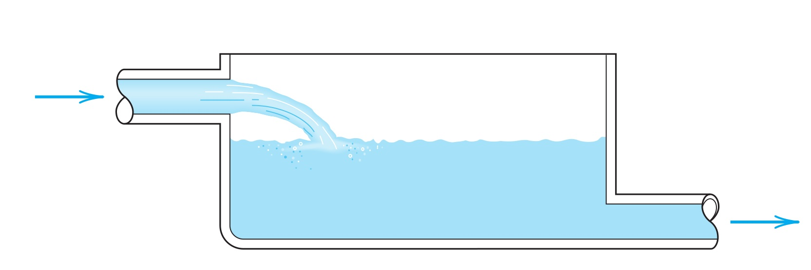
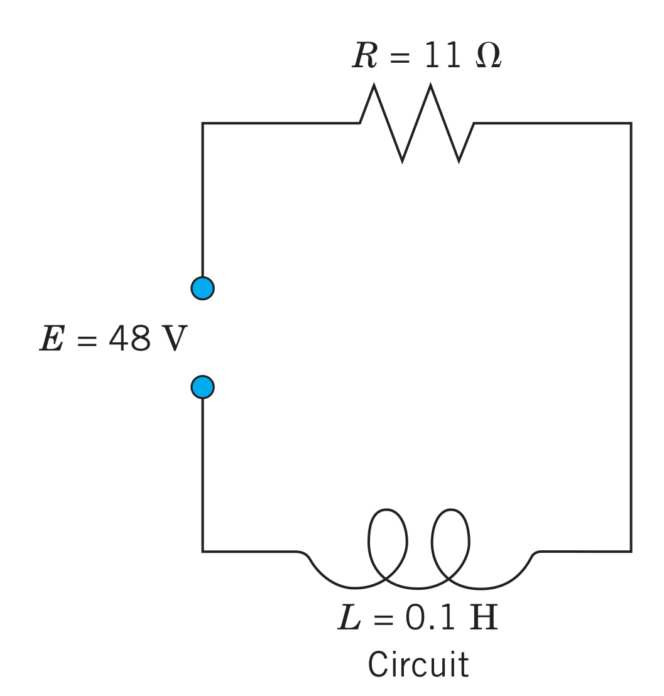

# First-Order Differential Equations ContinuedPhương trình vi phân cấp một: tiếp theo

MT1003 Calculus 1 - Lecture 10
MT1003 Giải tích 1 - Bài giảng 10

Truong-Son Van 
tsvan@hcmut.edu.vn

Reading map: <a href="../../readings/">course readings</a>. Read: <a href="https://activecalculus.org/single/sec-7-2-qualitative.html">Active Calculus 7.2</a>; <a href="https://openstax.org/books/calculus-volume-2/pages/4-5-first-order-linear-equations">OpenStax Vol 2, 4.5</a>; Stewart 9.5; instructor notes for homogeneous and Bernoulli equations.
Bản đồ đọc: <a href="../../readings/">tài liệu đọc của môn</a>. Đọc: <a href="https://activecalculus.org/single/sec-7-2-qualitative.html">Active Calculus 7.2</a>; <a href="https://openstax.org/books/calculus-volume-2/pages/4-5-first-order-linear-equations">OpenStax Tập 2, 4.5</a>; Stewart 9.5; ghi chú giảng viên cho phương trình đẳng cấp và Bernoulli.

---

# Today's WorkNội dung hôm nay

1<strong>Recognize the type</strong> - separable, linear, homogeneous, Bernoulli.<strong>Nhận dạng dạng</strong> - tách biến, tuyến tính, đẳng cấp, Bernoulli.

2<strong>Linear equations</strong> - review the integrating factor and solve a new example.<strong>Phương trình tuyến tính</strong> - ôn thừa số tích phân và giải ví dụ mới.

3<strong>Homogeneous equations</strong> - use the ratio $u=y/x$.<strong>Phương trình đẳng cấp</strong> - dùng tỉ số $u=y/x$.

4<strong>Bernoulli equations</strong> - turn nonlinear into linear.<strong>Phương trình Bernoulli</strong> - biến phi tuyến thành tuyến tính.

5<strong>Applications</strong> - salt mixing, RL circuits, and variable-mass motion.<strong>Ứng dụng</strong> - pha trộn muối, mạch RL, và chuyển động với khối lượng biến đổi.

Read: <a href="https://activecalculus.org/single/sec-7-2-qualitative.html">Active Calculus 7.2</a>; <a href="https://openstax.org/books/calculus-volume-2/pages/4-5-first-order-linear-equations">OpenStax Vol 2, 4.5</a>; Stewart 9.5; instructor notes and local exercises.
Đọc: <a href="https://activecalculus.org/single/sec-7-2-qualitative.html">Active Calculus 7.2</a>; <a href="https://openstax.org/books/calculus-volume-2/pages/4-5-first-order-linear-equations">OpenStax Tập 2, 4.5</a>; Stewart 9.5; ghi chú và bài tập địa phương.

---
class: compact
---

# A Method Recognition ChartBảng nhận dạng phương pháp

SeparableTách biến

Can be rearranged so each variable has its own side.
Có thể biến đổi để mỗi biến nằm ở một vế riêng.

$$
g(y)\,dy=f(x)\,dx
$$

LinearTuyến tính

$y$ and $y'$ appear to the first power; coefficients depend only on $x$.
$y$ và $y'$ xuất hiện bậc nhất; hệ số chỉ phụ thuộc vào $x$.

$$
y'+P(x)y=Q(x)
$$

Homogeneous typeDạng đẳng cấp

The right side depends only on the ratio $y/x$.
Vế phải chỉ phụ thuộc vào tỉ số $y/x$.

$$
y'=f\left(\frac{y}{x}\right)
$$

BernoulliBernoulli

Almost linear, except the right side contains a power of $y$.
Gần tuyến tính, trừ việc vế phải chứa một lũy thừa của $y$.

$$
y'+P(x)y=Q(x)y^\alpha
$$

Read: Active Calculus 7.2 for qualitative context; OpenStax Vol 2, 4.5; Stewart 9.5; instructor notes for homogeneous and Bernoulli equations.
Đọc: Active Calculus 7.2 cho bối cảnh định tính; OpenStax Tập 2, 4.5; Stewart 9.5; ghi chú giảng viên cho phương trình đẳng cấp và Bernoulli.

---
class: compact
---

# Linear Equations: Why The Factor WorksTuyến tính: vì sao thừa số tích phân hiệu quả?

First-order linear equationPhương trình tuyến tính cấp một

A first-order linear equation has the form
Phương trình tuyến tính cấp một có dạng

$$
y'+P(x)y=Q(x).
$$

The hidden product ruleQuy tắc tích ẩn bên trong

Choose $\mu(x)=e^{\int P(x)\,dx}$. Then $\mu'=P\mu$, so
Chọn $\mu(x)=e^{\int P(x)\,dx}$. Khi đó $\mu'=P\mu$, nên

$$
\mu y'+\mu P y=\mu y'+\mu' y=(\mu y)'.
$$

After multiplying by $\mu$, the equation becomes one integration:
Sau khi nhân với $\mu$, phương trình trở thành một phép lấy tích phân:

$$
(\mu y)'=\mu Q.
$$

Read: <a href="https://openstax.org/books/calculus-volume-2/pages/4-5-first-order-linear-equations">OpenStax Vol 2, 4.5</a>; Stewart 9.5; instructor notes.
Đọc: <a href="https://openstax.org/books/calculus-volume-2/pages/4-5-first-order-linear-equations">OpenStax Tập 2, 4.5</a>; Stewart 9.5; ghi chú giảng viên.

---
class: compact solution-slide
---

# Linear Example: Try The SetupVí dụ tuyến tính: thử thiết lập

3 min

Before we solveTrước khi giải

Solve the equation from the local exercise sheet:
Giải phương trình từ bộ bài tập địa phương:

$$
y'=y\cot x+\sin x.
$$

Put it into linear standard form, then find $\mu(x)$.
Đưa về dạng tuyến tính chuẩn, rồi tìm $\mu(x)$.

Standard formDạng chuẩn

$$
y'-y\cot x=\sin x,\qquad P(x)=-\cot x.
$$

Integrating factorThừa số tích phân

$$
\mu=e^{\int-\cot x\,dx}=e^{-\ln|\sin x|}=\csc x.
$$

Practice: OpenStax Vol 2, 4.5; Stewart 9.5. Example adapted from instructor notes and local exercises.
Luyện tập: OpenStax Tập 2, 4.5; Stewart 9.5. Ví dụ phỏng theo ghi chú giảng viên và bài tập địa phương.

---
class: compact solution-slide
---

# Linear Example: SolveVí dụ tuyến tính: giải

Multiply by $\csc x$Nhân với $\csc x$

On any interval where $\sin x\ne 0$, multiply the equation by $\mu=\csc x$:
Trên khoảng mà $\sin x\ne 0$, nhân phương trình với $\mu=\csc x$:

$$
\csc x\,y'-y\csc x\cot x=1.
$$

The left side is exactly $\left(y\csc x\right)'$.
Vế trái chính là $\left(y\csc x\right)'$.

IntegrateLấy tích phân

$$
\left(y\csc x\right)'=1
\quad\Rightarrow\quad
y\csc x=x+C
\quad\Rightarrow\quad
y=\sin x\,(x+C).
$$

A quick substitution check catches sign mistakes in $\mu$.
Thế lại kiểm tra nhanh giúp phát hiện lỗi dấu trong $\mu$.

Practice: OpenStax Vol 2, 4.5; Stewart 9.5. Example adapted from instructor notes and local exercises.
Luyện tập: OpenStax Tập 2, 4.5; Stewart 9.5. Ví dụ phỏng theo ghi chú giảng viên và bài tập địa phương.

---
class: compact
---

# Linear IVP: Student TryBTGTBĐ tuyến tính: sinh viên thử

L1

Solve the initial-value problem.
Giải bài toán giá trị ban đầu.

$$
y'+\frac{3}{x}y=\frac{2}{x^3},\qquad y(1)=0.
$$

L2

Find the general solution.
Tìm nghiệm tổng quát.

$$
y'-3y=4e^{3x}\cos 5x.
$$

HintsGợi ý

L1: $\mu=x^3$. L2: $\mu=e^{-3x}$, so the trigonometric integral is left behind.
L1: $\mu=x^3$. L2: $\mu=e^{-3x}$, nên phần tích phân lượng giác còn lại.

AnswersĐáp số

L1: $y=\dfrac{2x-2}{x^3}$. 
L2: $y=e^{3x}\left(\dfrac45\sin 5x+C\right)$.

Practice: OpenStax Vol 2, 4.5; Stewart 9.5; local exercise set.
Luyện tập: OpenStax Tập 2, 4.5; Stewart 9.5; bộ bài tập địa phương.

---
class: compact
---

# Homogeneous Equations: The Ratio MattersPhương trình đẳng cấp: tỉ số mới quan trọng

Homogeneous typeDạng đẳng cấp

A first-order equation is of homogeneous type if it can be written
Phương trình vi phân cấp một có dạng đẳng cấp nếu có thể viết

$$
\frac{dy}{dx}=f\left(\frac{y}{x}\right).
$$

Geometric ideaÝ tưởng hình học

The slope at $(x,y)$ depends on the direction from the origin, not on the distance from the origin. Points on the same ray $y/x=\text{constant}$ have the same slope rule. That is why the ratio $y/x$ is the natural variable.
Hệ số góc tại $(x,y)$ phụ thuộc vào hướng nhìn từ gốc tọa độ, không phụ thuộc vào khoảng cách đến gốc. Các điểm trên cùng một tia $y/x=\text{hằng số}$ có cùng quy luật hệ số góc. Vì vậy tỉ số $y/x$ là biến tự nhiên.

Read: Active Calculus 7.2 for solution behavior; Stewart 9.5 and instructor notes for substitution methods.
Đọc: Active Calculus 7.2 cho dáng điệu nghiệm; Stewart 9.5 và ghi chú giảng viên cho phương pháp đổi biến.

---
class: compact
---

# Homogeneous Method: Substitute $u=y/x$Phương pháp đẳng cấp: đặt $u=y/x$

The substitutionPhép đổi biến

Let $u=\dfrac{y}{x}$, so $y=ux$. Differentiate with respect to $x$:
Đặt $u=\dfrac{y}{x}$, nên $y=ux$. Lấy đạo hàm theo $x$:

$$
y'=u+xu'.
$$

The equation becomes separablePhương trình trở thành tách biến

$$
u+x\frac{du}{dx}=f(u)
\quad\Rightarrow\quad
\frac{du}{f(u)-u}=\frac{dx}{x}.
$$

So homogeneous equations are another door back to separable equations.
Vì vậy phương trình đẳng cấp là một cánh cửa khác quay về phương trình tách biến.

Read: Stewart 9.5; instructor notes for homogeneous first-order equations.
Đọc: Stewart 9.5; ghi chú giảng viên cho phương trình vi phân đẳng cấp cấp một.

---
class: compact solution-slide
---

# Homogeneous Example: Try The SubstitutionVí dụ đẳng cấp: thử đổi biến

4 min

Before we solveTrước khi giải

Solve the initial-value problem
Giải bài toán giá trị ban đầu

$$
y'=\frac{y}{x}+\sin\frac{y}{x},\qquad y(1)=\frac{\pi}{2}.
$$

Let $u=y/x$ and rewrite the differential equation in $u$.
Đặt $u=y/x$ và viết lại phương trình theo $u$.

After substitutionSau đổi biến

$$
u+xu'=u+\sin u
\quad\Rightarrow\quad
x\frac{du}{dx}=\sin u
\quad\Rightarrow\quad
\frac{du}{\sin u}=\frac{dx}{x}.
$$

Practice: Stewart 9.5; example adapted from instructor notes and local exercises.
Luyện tập: Stewart 9.5; ví dụ phỏng theo ghi chú giảng viên và bài tập địa phương.

---
class: compact solution-slide
---

# Homogeneous Example: SolveVí dụ đẳng cấp: giải

IntegrateLấy tích phân

$$
\int \csc u\,du=\int \frac{dx}{x}
\quad\Rightarrow\quad
\ln\left|\tan\frac{u}{2}\right|=\ln|x|+\ln C.
$$

Exponentiate and return to $u=y/x$:
Mũ hóa và thay lại $u=y/x$:

$$
\tan\frac{u}{2}=Cx
\quad\Rightarrow\quad
\tan\frac{y}{2x}=Cx.
$$

Apply $y(1)=\pi/2$Áp điều kiện $y(1)=\pi/2$

$$
\tan\frac{\pi}{4}=C\quad\Rightarrow\quad C=1.
$$

The solution is $\tan\dfrac{y}{2x}=x$.
Nghiệm là $\tan\dfrac{y}{2x}=x$.

Practice: Stewart 9.5; example adapted from instructor notes and local exercises.
Luyện tập: Stewart 9.5; ví dụ phỏng theo ghi chú giảng viên và bài tập địa phương.

---
class: compact solution-slide
---

# Homogeneous In Differential FormĐẳng cấp ở dạng vi phân

4 min

Try recognizing the typeThử nhận dạng

SolveGiải

$$
(x^2+2xy)\,dx+xy\,dy=0.
$$

Convert to $y'=f(x,y)$Đưa về $y'=f(x,y)$

$$
xy\,y'=-(x^2+2xy)
\quad\Rightarrow\quad
y'=-\frac{x}{y}-2.
$$

Since $-\dfrac{x}{y}-2=-\dfrac{1}{y/x}-2$, this depends only on $u=y/x$.

Practice: Stewart 9.5; local exercise set. Homogeneous form from instructor notes.
Luyện tập: Stewart 9.5; bộ bài tập địa phương. Dạng đẳng cấp từ ghi chú giảng viên.

---
class: compact solution-slide
---

# Homogeneous Differential Form: SolveDạng vi phân đẳng cấp: giải

Use $u=y/x$Dùng $u=y/x$

$$
u+xu'=-\frac{1}{u}-2
\quad\Rightarrow\quad
x\frac{du}{dx}=-\frac{(u+1)^2}{u}.
$$

Separate the variables:
Tách biến:

$$
\frac{u\,du}{(u+1)^2}=-\frac{dx}{x}.
$$

Integrate and return to $x,y$Lấy tích phân và thay lại $x,y$

$$
\ln|u+1|+\frac{1}{u+1}=-\ln|x|+C.
$$

$$
\ln|x+y|+\frac{x}{x+y}=C.
$$

Practice: Stewart 9.5; local exercise set. Example adapted from instructor notes.
Luyện tập: Stewart 9.5; bộ bài tập địa phương. Ví dụ phỏng theo ghi chú giảng viên.

---
class: compact
---

# Bernoulli EquationsPhương trình Bernoulli

Bernoulli formDạng Bernoulli

A Bernoulli equation has the form
Phương trình Bernoulli có dạng

$$
y'+P(x)y=Q(x)y^\alpha,\qquad \alpha\ne 0,\quad \alpha\ne 1.
$$

The ideaÝ tưởng

It looks nonlinear because of $y^\alpha$, but one power substitution changes it into a linear equation. This is the same philosophy as before: recognize the structure, then use the substitution that exposes a familiar type.
Nó có vẻ phi tuyến vì có $y^\alpha$, nhưng một phép đổi biến theo lũy thừa sẽ biến nó thành phương trình tuyến tính. Vẫn là triết lý cũ: nhận ra cấu trúc, rồi dùng đổi biến để lộ ra dạng quen thuộc.

Read: OpenStax Vol 2, 4.5 for linear equations; Stewart 9.5 and instructor notes for Bernoulli equations.
Đọc: OpenStax Tập 2, 4.5 cho phương trình tuyến tính; Stewart 9.5 và ghi chú giảng viên cho Bernoulli.

---
class: compact
---

# Bernoulli Method: Turn It LinearPhương pháp Bernoulli: biến thành tuyến tính

Divide by $y^\alpha$Chia cho $y^\alpha$

$$
y^{-\alpha}y'+P(x)y^{1-\alpha}=Q(x).
$$

Now setĐặt

$$
z=y^{1-\alpha}.
$$

Derivative of the new variableĐạo hàm của biến mới

$$
z'=(1-\alpha)y^{-\alpha}y'.
$$

Multiply the divided equation by $1-\alpha$:
Nhân phương trình đã chia với $1-\alpha$:

$$
z'+(1-\alpha)P(x)z=(1-\alpha)Q(x).
$$

Read: OpenStax Vol 2, 4.5; Stewart 9.5; instructor notes.
Đọc: OpenStax Tập 2, 4.5; Stewart 9.5; ghi chú giảng viên.

---
class: compact solution-slide
---

# Bernoulli Example: Set UpVí dụ Bernoulli: thiết lập

3 min

Before we solveTrước khi giải

SolveGiải

$$
y'+\frac{y}{x}=x^2y^4.
$$

Identify $\alpha$ and choose $z=y^{1-\alpha}$.
Xác định $\alpha$ và chọn $z=y^{1-\alpha}$.

TypeDạng

$P(x)=\dfrac1x,\quad Q(x)=x^2,\quad \alpha=4.$

SubstitutionĐổi biến

$z=y^{1-4}=y^{-3}$.

Practice: Stewart 9.5; example adapted from instructor notes and local exercises.
Luyện tập: Stewart 9.5; ví dụ phỏng theo ghi chú giảng viên và bài tập địa phương.

---
class: compact solution-slide
---

# Bernoulli Example: SolveVí dụ Bernoulli: giải

Linear equation in $z$Phương trình tuyến tính theo $z$

Using $z=y^{-3}$ gives
Dùng $z=y^{-3}$ ta được

$$
z'-\frac{3}{x}z=-3x^2.
$$

The integrating factor is $\mu=e^{\int -3/x\,dx}=x^{-3}$.
Thừa số tích phân là $\mu=e^{\int -3/x\,dx}=x^{-3}$.

Back substituteThay ngược lại

$$
(x^{-3}z)'=-\frac{3}{x}
\quad\Rightarrow\quad
x^{-3}z=-3\ln|x|+C.
$$

$$
y^{-3}=x^3\left(-3\ln|x|+C\right)
\quad\Rightarrow\quad
y=\frac{1}{x\sqrt[3]{-3\ln|x|+C}}.
$$

Practice: Stewart 9.5; example adapted from instructor notes and local exercises.
Luyện tập: Stewart 9.5; ví dụ phỏng theo ghi chú giảng viên và bài tập địa phương.

---
class: compact
---

# Bernoulli: Student TryBernoulli: sinh viên thử

B1

Solve the Bernoulli equation.
Giải phương trình Bernoulli.

$$
y'-\frac{2xy}{1+x^2}
=4\frac{\sqrt{y}}{\sqrt{1+x^2}}\arctan x.
$$

HintsGợi ý

Here $\alpha=\frac12$, so set $z=\sqrt{y}$. Then solve a linear equation in $z$.
Ở đây $\alpha=\frac12$, nên đặt $z=\sqrt{y}$. Sau đó giải phương trình tuyến tính theo $z$.

AnswerĐáp số

$$
\sqrt{y}=\sqrt{1+x^2}\left((\arctan x)^2+C\right).
$$

Practice: Stewart 9.5; local exercise set.
Luyện tập: Stewart 9.5; bộ bài tập địa phương.

---
class: compact exercise-heavy
---

# Quick Lab: Name The MethodLuyện nhanh: gọi tên phương pháp

Q1

$$
(x^2+1)y'+4xy=3
$$
LinearTuyến tính; $P=\dfrac{4x}{x^2+1}$.

Q2

$$
y'=\frac{y}{x}+\sin\frac{y}{x}
$$
Homogeneous typeDạng đẳng cấp; use $u=y/x$.

Q3

$$
y'+\frac{y}{x}=x^2y^4
$$
Bernoulli; $\alpha=4$, use $z=y^{-3}$.

Q4

$$
y'=\frac{x}{y}
$$
SeparableTách biến; $y\,dy=x\,dx$.

Practice: Active Calculus 7.4; OpenStax Vol 2, 4.3 and 4.5; Stewart 9.3, 9.5; local exercises.
Luyện tập: Active Calculus 7.4; OpenStax Tập 2, 4.3 và 4.5; Stewart 9.3, 9.5; bài tập địa phương.

---

# Applications: Model First, Then SolveỨng dụng: lập mô hình trước, rồi giải

The habitThói quen

For applications, the hardest step is often not the integral or algebra. It is deciding what quantity changes, what physical law controls the change, and why the units on each term match.
Với bài toán ứng dụng, bước khó nhất thường không phải là tích phân hay đại số. Đó là quyết định đại lượng nào thay đổi, định luật vật lý nào điều khiển sự thay đổi, và vì sao đơn vị của các hạng tử khớp nhau.

<strong>QuantityĐại lượng</strong>Name the unknown function and its units.Đặt tên hàm chưa biết và đơn vị của nó.

<strong>LawĐịnh luật</strong>Translate the physical principle into a rate equation.Dịch nguyên lý vật lý thành phương trình tốc độ.

<strong>SolveGiải</strong>Use the ODE method, then interpret the constant and the limiting behavior.Dùng phương pháp ODE, rồi diễn giải hằng số và dáng điệu giới hạn.

Read: Active Calculus 7.2, 7.4; OpenStax Vol 2, 4.5; Stewart 9.5; application examples from instructor notes.
Đọc: Active Calculus 7.2, 7.4; OpenStax Tập 2, 4.5; Stewart 9.5; ví dụ ứng dụng từ ghi chú giảng viên.

---
class: compact
---

# Mixing Tank: The Physical PictureBồn pha trộn: bức tranh vật lý

ProblemBài toán

A tank contains $1000$ gal of water with $100$ lb of salt. Brine enters at $10$ gal/min, with $5$ lb of salt per gallon. The well-stirred mixture leaves at $10$ gal/min. Find the salt amount $y(t)$.
Một bồn chứa $1000$ gal nước với $100$ lb muối. Nước muối chảy vào với tốc độ $10$ gal/phút, mỗi gal chứa $5$ lb muối. Hỗn hợp được khuấy đều và chảy ra với tốc độ $10$ gal/phút. Tìm lượng muối $y(t)$.

Balance lawĐịnh luật cân bằng

Amount changes by what comes in minus what leaves:
Lượng muối thay đổi bằng phần đi vào trừ phần đi ra:

$$
y'(t)=\text{salt inflow rate}-\text{salt outflow rate}.
$$

Read: OpenStax Vol 2, 4.5; Stewart 9.5; application adapted from instructor notes.
Đọc: OpenStax Tập 2, 4.5; Stewart 9.5; ứng dụng phỏng theo ghi chú giảng viên.

---
class: compact solution-slide
---

# Mixing Tank: Build The ODEBồn pha trộn: lập phương trình

InflowDòng vào

Each minute, $10$ gal enters. Each gallon brings $5$ lb of salt.
Mỗi phút có $10$ gal đi vào. Mỗi gal mang $5$ lb muối.

$$
\text{in}=10\cdot 5=50\ \text{lb/min}.
$$

OutflowDòng ra

The tank volume stays $1000$ gal. The salt concentration is $y(t)/1000$ lb/gal.
Thể tích bồn giữ ở $1000$ gal. Nồng độ muối là $y(t)/1000$ lb/gal.

$$
\text{out}=10\cdot \frac{y}{1000}=0.01y\ \text{lb/min}.
$$

ModelMô hình

$$
y'=50-0.01y,\qquad y(0)=100.
$$

This is first-order linear, and also separable.
Đây là phương trình tuyến tính cấp một, đồng thời cũng tách biến được.

Read: OpenStax Vol 2, 4.5; Stewart 9.5; application adapted from instructor notes.
Đọc: OpenStax Tập 2, 4.5; Stewart 9.5; ứng dụng phỏng theo ghi chú giảng viên.

---
class: compact solution-slide
---

# Mixing Tank: Solve And InterpretBồn pha trộn: giải và diễn giải

Solve by separationGiải bằng tách biến

$$
\frac{dy}{50-0.01y}=dt
\quad\Rightarrow\quad
\ln|y-5000|=-0.01t+\ln C.
$$

$$
y-5000=Ce^{-0.01t}.
$$

Initial condition and meaningĐiều kiện ban đầu và ý nghĩa

$$
100-5000=C\quad\Rightarrow\quad C=-4900.
$$

$$
y(t)=5000-4900e^{-0.01t}.
$$

As $t\to\infty$, $y(t)\to 5000$ lb, the amount matching concentration $5$ lb/gal in a $1000$ gal tank.
Khi $t\to\infty$, $y(t)\to 5000$ lb, đúng lượng muối ứng với nồng độ $5$ lb/gal trong bồn $1000$ gal.

Read: OpenStax Vol 2, 4.5; Stewart 9.5; application adapted from instructor notes.
Đọc: OpenStax Tập 2, 4.5; Stewart 9.5; ứng dụng phỏng theo ghi chú giảng viên.

---
class: compact
---

# RL Circuit: The Physical PictureMạch RL: bức tranh vật lý

PhysicsVật lý

A current $I(t)$ causes a voltage drop $RI$ across the resistor and a voltage drop $L\dfrac{dI}{dt}$ across the inductor. Kirchhoff's voltage law says the sum equals the supplied voltage $E(t)$.
Dòng điện $I(t)$ gây sụt áp $RI$ qua điện trở và sụt áp $L\dfrac{dI}{dt}$ qua cuộn cảm. Định luật điện áp Kirchhoff nói tổng hai sụt áp bằng suất điện động $E(t)$.

ModelMô hình

$$
L I'(t)+RI(t)=E(t).
$$

This is linear in the unknown current $I(t)$.
Đây là phương trình tuyến tính theo dòng điện chưa biết $I(t)$.

Read: OpenStax Vol 2, 4.5; Stewart 9.5; application adapted from instructor notes.
Đọc: OpenStax Tập 2, 4.5; Stewart 9.5; ứng dụng phỏng theo ghi chú giảng viên.

---
class: compact solution-slide
---

# RL Circuit: SolveMạch RL: giải

Data and standard formDữ kiện và dạng chuẩn

Let $E=48$ V, $R=11\,\Omega$, $L=0.1$ H, and $I(0)=0$.
Cho $E=48$ V, $R=11\,\Omega$, $L=0.1$ H, và $I(0)=0$.

$$
I'+\frac{R}{L}I=\frac{E}{L}
\quad\Rightarrow\quad
I'+110I=480.
$$

A constant particular solution is $I_\infty=\dfrac{480}{110}=\dfrac{48}{11}$.
Một nghiệm riêng hằng là $I_\infty=\dfrac{480}{110}=\dfrac{48}{11}$.

Initial currentDòng điện ban đầu

$$
I(t)=\frac{48}{11}+Ce^{-110t},\qquad I(0)=0
\quad\Rightarrow\quad
C=-\frac{48}{11}.
$$

$$
I(t)=\frac{48}{11}\left(1-e^{-110t}\right).
$$

Read: OpenStax Vol 2, 4.5; Stewart 9.5; application adapted from instructor notes.
Đọc: OpenStax Tập 2, 4.5; Stewart 9.5; ứng dụng phỏng theo ghi chú giảng viên.

---
class: compact
---

# Variable-Mass Motion: The Physical PictureChuyển động khối lượng biến đổi: bức tranh vật lý

A falling hailstoneHạt mưa đá đang rơi

A hailstone has initial mass $M$ and evaporates steadily, losing $m$ units of mass per second. Air resistance is proportional to velocity. Take downward direction as positive and let $v(t)$ be the velocity.
Một hạt mưa đá có khối lượng ban đầu $M$ và bốc hơi đều, mỗi giây mất $m$ đơn vị khối lượng. Lực cản không khí tỉ lệ với vận tốc. Chọn chiều xuống là chiều dương và gọi $v(t)$ là vận tốc.

<strong>MassKhối lượng</strong>$M-mt$

<strong>WeightTrọng lực</strong>$(M-mt)g$

<strong>DragLực cản</strong>$-kv$

Read: OpenStax Vol 2, 4.5; Stewart 9.5; variable-mass example adapted from instructor notes.
Đọc: OpenStax Tập 2, 4.5; Stewart 9.5; ví dụ khối lượng biến đổi phỏng theo ghi chú giảng viên.

---
class: compact solution-slide
---

# Variable-Mass Motion: Build The ODEKhối lượng biến đổi: lập phương trình

Newton's second lawĐịnh luật II Newton

The total force is weight plus drag:
Tổng lực là trọng lực cộng lực cản:

$$
F=(M-mt)g-kv.
$$

Also $F=(M-mt)\dfrac{dv}{dt}$, so
Mặt khác $F=(M-mt)\dfrac{dv}{dt}$, nên

$$
(M-mt)\frac{dv}{dt}=(M-mt)g-kv.
$$

Linear modelMô hình tuyến tính

$$
\frac{dv}{dt}+\frac{k}{M-mt}v=g,\qquad v(0)=0.
$$

We solve only while $M-mt>0$.
Ta chỉ giải trong khoảng $M-mt>0$.

Read: OpenStax Vol 2, 4.5; Stewart 9.5; variable-mass example adapted from instructor notes.
Đọc: OpenStax Tập 2, 4.5; Stewart 9.5; ví dụ khối lượng biến đổi phỏng theo ghi chú giảng viên.

---
class: compact solution-slide
---

# Variable-Mass Motion: SolveKhối lượng biến đổi: giải

Integrating factorThừa số tích phân

$$
P(t)=\frac{k}{M-mt},\qquad
\mu(t)=e^{\int P(t)\,dt}=(M-mt)^{-k/m}.
$$

Then $(\mu v)'=g\mu$.
Khi đó $(\mu v)'=g\mu$.

General and particular solutionNghiệm tổng quát và nghiệm riêng

$$
v(t)=\frac{g(M-mt)}{k-m}+C(M-mt)^{k/m}.
$$

Using $v(0)=0$ gives $C=\dfrac{gM^{1-k/m}}{m-k}$, hence
Dùng $v(0)=0$ ta được $C=\dfrac{gM^{1-k/m}}{m-k}$, do đó

$$
v(t)=\frac{g}{m-k}\left[-M+mt+M\left(1-\frac{m}{M}t\right)^{k/m}\right].
$$

Read: OpenStax Vol 2, 4.5; Stewart 9.5; variable-mass example adapted from instructor notes.
Đọc: OpenStax Tập 2, 4.5; Stewart 9.5; ví dụ khối lượng biến đổi phỏng theo ghi chú giảng viên.

---
class: compact exercise-heavy
---

# Application Lab: Build The ModelLuyện ứng dụng: lập mô hình

A1

A tank holds $100$ L with $10$ kg of salt. Brine with $0.5$ kg/L enters at $5$ L/min and leaves at $5$ L/min. Let $S(t)$ be kg of salt. Write the ODE.
Bồn chứa $100$ L với $10$ kg muối. Nước muối $0.5$ kg/L vào $5$ L/phút và ra $5$ L/phút. Gọi $S(t)$ là kg muối. Lập ODE.

A2

For an RL circuit, identify the ODE when $R=6\,\Omega$, $L=2$ H, and $E(t)=12$ V.
Với mạch RL, xác định ODE khi $R=6\,\Omega$, $L=2$ H, và $E(t)=12$ V.

Model answersĐáp án mô hình

A1: $S'=2.5-\dfrac{S}{20}$, $S(0)=10$. 
A2: $2I'+6I=12$, or $I'+3I=6$.

Question to ask every timeCâu hỏi cần hỏi mỗi lần

Do the units of each term match the units of the derivative?
Đơn vị của từng hạng tử có khớp với đơn vị của đạo hàm không?

Practice: Active Calculus 7.4; OpenStax Vol 2, 4.5; Stewart 9.5; local exercises.
Luyện tập: Active Calculus 7.4; OpenStax Tập 2, 4.5; Stewart 9.5; bài tập địa phương.

---
class: compact exercise-heavy
---

# Mixed Exercise LabLuyện tập tổng hợp

E1

$$
(1-x)(y'+y)=e^{-x},\qquad y(2)=1.
$$
$y=e^{-x}\left[-\ln|1-x|+e^2\right]$.

E2

$$
y'=\frac{3y}{x}+2e^{2x}x^3.
$$
$y=x^3(e^{2x}+C)$.

E3

$$
2(x+y)\,dy+(3x+3y-1)\,dx=0,\qquad y(0)=2.
$$
$3x+2y+2\ln|1-x-y|=4$.

E4

$$
2y'-\frac{y}{x}=\frac{4x^2}{y}.
$$
Bernoulli in $y$ or linear in $y^2$: $y^2=x(2x^2+C)$.

Practice: OpenStax Vol 2, 4.5; Stewart 9.5; local exercise set. Solve after naming the method.
Luyện tập: OpenStax Tập 2, 4.5; Stewart 9.5; bộ bài tập địa phương. Giải sau khi gọi tên phương pháp.

---
class: compact
---

# Closing Decision ChartBảng quyết định cuối bài

1. Split?1. Tách?If variables separate, integrate both sides and check constant solutions.Nếu tách biến được, lấy tích phân hai vế và kiểm tra nghiệm hằng.

2. Linear?2. Tuyến tính?If $y'+P(x)y=Q(x)$, use $\mu=e^{\int P\,dx}$.Nếu $y'+P(x)y=Q(x)$, dùng $\mu=e^{\int P\,dx}$.

3. Ratio?3. Tỉ số?If the equation depends on $y/x$, set $u=y/x$.Nếu phương trình phụ thuộc vào $y/x$, đặt $u=y/x$.

4. Power?4. Lũy thừa?If $y'+Py=Qy^\alpha$, set $z=y^{1-\alpha}$ and solve a linear equation.Nếu $y'+Py=Qy^\alpha$, đặt $z=y^{1-\alpha}$ rồi giải phương trình tuyến tính.

5. Model?5. Mô hình?For applications, write the physical law before solving the ODE.Với ứng dụng, viết định luật vật lý trước khi giải ODE.

Read: Active Calculus 7.2, 7.4; OpenStax Vol 2, 4.3 and 4.5; Stewart 9.3, 9.5; instructor notes.
Đọc: Active Calculus 7.2, 7.4; OpenStax Tập 2, 4.3 và 4.5; Stewart 9.3, 9.5; ghi chú giảng viên.

---
class: compact
---

# Reading And Practice SourcesNguồn đọc và luyện tập

<strong>Boelkins, M.</strong>&nbsp;
<em>Active Calculus</em> (2nd ed.), Sections 7.2 (Qualitative behavior) and 7.4 (Separable equations).
<em>Active Calculus</em> (ấn bản thứ 2), Mục 7.2 (Dáng điệu định tính) và 7.4 (Phương trình tách biến).

<strong>Strang, G., & Herman, E. "Jed".</strong>&nbsp;
<em>Calculus Volume 2</em>, OpenStax, Sections 4.3 and 4.5.
<em>Calculus Volume 2</em>, OpenStax, Mục 4.3 và 4.5.

<strong>Stewart, J.</strong>&nbsp;
<em>Calculus: Early Transcendentals</em> (8th ed., metric version), Sections 9.3 and 9.5.
<em>Calculus: Early Transcendentals</em> (ấn bản thứ 8, bản metric), Mục 9.3 và 9.5.

<strong>Lê Xuân Đại.</strong>&nbsp;
HCMUT lecture slides and local exercise sets on first-order ordinary differential equations, used for worked examples and application models.
Slide bài giảng ĐHBK TP.HCM và bộ bài tập địa phương về phương trình vi phân thường cấp một, dùng cho ví dụ mẫu và mô hình ứng dụng.

<strong>Instructor notes.Ghi chú của giảng viên.</strong>&nbsp;
Additional homogeneous and Bernoulli methods adapted for MT1003 Calculus 1.
Bổ sung phương pháp đẳng cấp và Bernoulli được điều chỉnh cho MT1003 Giải tích 1.

Full map: <a href="../../readings/">course readings</a>. Use section titles if a Stewart edition has different numbering.
Bản đồ đầy đủ: <a href="../../readings/">tài liệu đọc của môn</a>. Nếu phiên bản Stewart khác số mục, hãy dùng tên mục.

