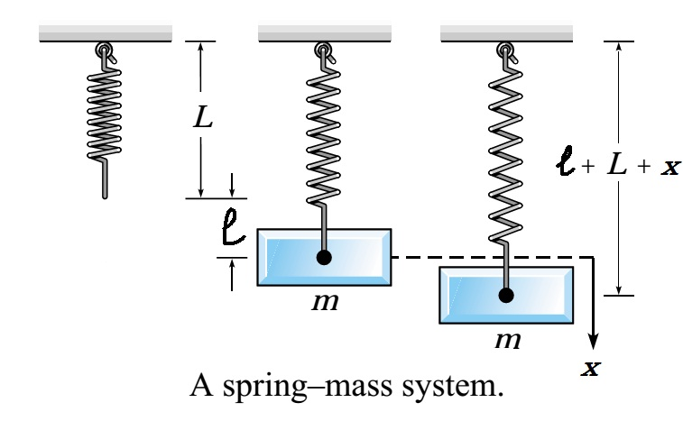

# Second-Order Linear Differential EquationsPhương trình vi phân tuyến tính cấp hai

MT1003 Calculus 1 - Lecture 11
MT1003 Giải tích 1 - Bài giảng 11

Truong-Son Van 
tsvan@hcmut.edu.vn

Reading map: <a href="../../readings/">course readings</a>. Short notes: <a href="../../sessions/11-second-order-differential-equations/">Session 11 notes</a>. Read: Stewart 17.1; instructor notes adapted from Dr. Lê Xuân Đại. Background ODE language: <a href="https://openstax.org/books/calculus-volume-2/pages/4-1-basics-of-differential-equations">OpenStax Vol 2, 4.1</a>.
Bản đồ đọc: <a href="../../readings/">tài liệu đọc của môn</a>. Ghi chú ngắn: <a href="../../sessions/11-second-order-differential-equations/">Buổi 11</a>. Đọc: Stewart 17.1; ghi chú giảng viên phỏng theo TS. Lê Xuân Đại. Ngôn ngữ ODE nền tảng: <a href="https://openstax.org/books/calculus-volume-2/pages/4-1-basics-of-differential-equations">OpenStax Tập 2, 4.1</a>.

---

# Today's WorkNội dung hôm nay

1<strong>Language</strong> - second-order linear ODEs, IVPs, BVPs, and uniqueness.<strong>Ngôn ngữ</strong> - ODE tuyến tính cấp hai, BTGTBĐ, BT biên, và tính duy nhất.

2<strong>Structure</strong> - homogeneous/nonhomogeneous solutions and superposition.<strong>Cấu trúc</strong> - nghiệm thuần nhất/không thuần nhất và chồng chất.

3<strong>Wronskian</strong> - when two solutions form a fundamental set.<strong>Wronski</strong> - khi nào hai nghiệm tạo thành hệ nghiệm cơ bản.

4<strong>Constant coefficients</strong> - characteristic equation and three root cases.<strong>Hệ số hằng</strong> - phương trình đặc trưng và ba trường hợp nghiệm.

5<strong>Practice as we go</strong> - short exercise stops after each main method, then spring-mass models.<strong>Luyện tập từng phần</strong> - bài tập ngắn sau mỗi phương pháp chính, rồi mô hình lò xo-vật nặng.

Read: Stewart 17.1; instructor notes for second-order ODEs. Review basic ODE vocabulary in <a href="https://openstax.org/books/calculus-volume-2/pages/4-1-basics-of-differential-equations">OpenStax Vol 2, 4.1</a>.
Đọc: Stewart 17.1; ghi chú giảng viên cho ODE cấp hai. Ôn từ vựng ODE trong <a href="https://openstax.org/books/calculus-volume-2/pages/4-1-basics-of-differential-equations">OpenStax Tập 2, 4.1</a>.

---
class: compact
---

# Second-Order Linear FormDạng tuyến tính cấp hai

Definition - variable coefficientsĐịnh nghĩa - hệ số hàm

A second-order linear differential equation has the form
Một phương trình vi phân tuyến tính cấp hai có dạng

$$
L(y)=a_0(x)y''+a_1(x)y'+a_2(x)y=F(x),
$$

where $a_0,a_1,a_2,F$ are continuous on an interval $I$ and $a_0(x)\ne0$ on $I$.
trong đó $a_0,a_1,a_2,F$ liên tục trên khoảng $I$ và $a_0(x)\ne0$ trên $I$.

Constant-coefficient formDạng hệ số hằng

$$
Ay''+By'+Cy=f(x),\qquad A,B,C\in\mathbb R,\ A\ne0.
$$

Read: Stewart 17.1; instructor notes adapted from Dr. Lê Xuân Đại.
Đọc: Stewart 17.1; ghi chú giảng viên phỏng theo TS. Lê Xuân Đại.

---
class: compact
---

# Homogeneous And NonhomogeneousThuần nhất và không thuần nhất

HomogeneousThuần nhất

The forcing term is zero:
Vế phải bằng không:

$$
Ay''+By'+Cy=0.
$$

We often write its general solution as $y_h$.
Ta thường ký hiệu nghiệm tổng quát là $y_h$.

NonhomogeneousKhông thuần nhất

The forcing term is present:
Có vế phải tác động:

$$
Ay''+By'+Cy=f(x).
$$

A single particular solution is denoted $y_p$.
Một nghiệm riêng được ký hiệu là $y_p$.

Solution structureCấu trúc nghiệm

$$
y_{\mathrm{gen}}=y_h+y_p.
$$

This is the organizing idea for the whole lecture.
Đây là ý tưởng tổ chức cho toàn bộ bài học.

Read: Stewart 17.1; instructor notes. Background: <a href="https://openstax.org/books/calculus-volume-2/pages/4-1-basics-of-differential-equations">OpenStax Vol 2, 4.1</a>.
Đọc: Stewart 17.1; ghi chú giảng viên. Nền tảng: <a href="https://openstax.org/books/calculus-volume-2/pages/4-1-basics-of-differential-equations">OpenStax Tập 2, 4.1</a>.

---
class: compact
---

# Initial And Boundary Value ProblemsBT giá trị ban đầu và bài toán biên

Initial-value problemBài toán giá trị ban đầu

A second-order IVP gives two values at the same point:
BTGTBĐ cấp hai cho hai điều kiện tại cùng một điểm:

$$
y(x_0)=\alpha,\qquad y'(x_0)=\beta.
$$

Boundary value problemBài toán biên

A BVP gives conditions at different points, for example
Bài toán biên cho điều kiện tại các điểm khác nhau, ví dụ

$$
y(x_0)=\alpha,\qquad y(x_1)=\beta.
$$

Existence and uniqueness theoremĐịnh lý tồn tại và duy nhất

If $p,q,g$ are continuous on an interval $I$ containing $x_0$, then the IVP $y''+p(x)y'+q(x)y=g(x)$, $y(x_0)=\alpha$, $y'(x_0)=\beta$ has exactly one solution on $I$.
Nếu $p,q,g$ liên tục trên khoảng $I$ chứa $x_0$, thì BTGTBĐ $y''+p(x)y'+q(x)y=g(x)$, $y(x_0)=\alpha$, $y'(x_0)=\beta$ có đúng một nghiệm trên $I$.

Read: Stewart 17.1; instructor notes for IVP/BVP language.
Đọc: Stewart 17.1; ghi chú giảng viên cho ngôn ngữ BTGTBĐ/BT biên.

---
class: compact
---

# Superposition For Homogeneous EquationsChồng chất cho phương trình thuần nhất

TheoremĐịnh lý

If $y_1$ and $y_2$ are solutions of
Nếu $y_1$ và $y_2$ là nghiệm của

$$
Ay''+By'+Cy=0,
$$

then for any constants $C_1,C_2$,
thì với mọi hằng số $C_1,C_2$,

$$
C_1y_1+C_2y_2
$$

is also a solution.
cũng là một nghiệm.

ExampleVí dụ

For $y''+y=0$, $y_1=\sin x$ and $y_2=\cos x$; hence $y=C_1\sin x+C_2\cos x$ is also a solution.
Với $y''+y=0$, $y_1=\sin x$ và $y_2=\cos x$; do đó $y=C_1\sin x+C_2\cos x$ cũng là một nghiệm.

Read: Stewart 17.1; instructor notes, superposition principle.
Đọc: Stewart 17.1; ghi chú giảng viên, nguyên lý chồng chất.

---
class: compact
---

# Linear IndependenceĐộc lập tuyến tính

DefinitionĐịnh nghĩa

The functions $y_1,y_2$ are <strong>linearly dependent</strong> on $I$ if there are constants $C_1,C_2$, not both zero, such that
Hai hàm $y_1,y_2$ <strong>phụ thuộc tuyến tính</strong> trên $I$ nếu tồn tại hằng số $C_1,C_2$, không đồng thời bằng không, sao cho

$$
C_1y_1(x)+C_2y_2(x)=0\qquad \text{for all }x\in I.
$$

They are <strong>linearly independent</strong> if this identity forces $C_1=C_2=0$.
Chúng <strong>độc lập tuyến tính</strong> nếu đẳng thức này kéo theo $C_1=C_2=0$.

DependentPhụ thuộc

$x$ and $-3x$ are dependent: choose $C_1=3$, $C_2=1$.
$x$ và $-3x$ phụ thuộc: chọn $C_1=3$, $C_2=1$.

IndependentĐộc lập

$x$ and $x^2$ are independent on any interval containing more than one point.
$x$ và $x^2$ độc lập trên mọi khoảng có hơn một điểm.

Read: Stewart 17.1; instructor notes, linear independence.
Đọc: Stewart 17.1; ghi chú giảng viên, độc lập tuyến tính.

---
class: compact
---

# The WronskianĐịnh thức Wronski

DefinitionĐịnh nghĩa

For differentiable functions $y_1,y_2$, their Wronskian is
Với hai hàm khả vi $y_1,y_2$, định thức Wronski là

$$
W(y_1,y_2)(x)=
\begin{vmatrix}
y_1(x)&y_2(x)\\
y_1'(x)&y_2'(x)
\end{vmatrix}
=y_1y_2'-y_1'y_2.
$$

Wronskian criterion for solutionsTiêu chuẩn Wronski cho nghiệm

If $y_1,y_2$ solve the same homogeneous second-order linear equation on $I$, then either $W$ is never zero on $I$, or $W$ is identically zero. In the first case the solutions are independent; in the second they are dependent.
Nếu $y_1,y_2$ cùng là nghiệm của một phương trình tuyến tính thuần nhất cấp hai trên $I$, thì hoặc $W$ không bao giờ bằng không trên $I$, hoặc $W\equiv0$. Trường hợp đầu độc lập; trường hợp sau phụ thuộc.

Read: Stewart 17.1; instructor notes, Wronskian theorem.
Đọc: Stewart 17.1; ghi chú giảng viên, định lý Wronski.

---
class: compact solution-slide
---

# Wronskian ExampleVí dụ Wronski

3 min

Before we computeTrước khi tính

Show that $e^x$ and $e^{2x}$ are linearly independent.
Chứng minh $e^x$ và $e^{2x}$ độc lập tuyến tính.

ComputeTính

$$
W=
\begin{vmatrix}
e^x&e^{2x}\\
e^x&2e^{2x}
\end{vmatrix}
=2e^{3x}-e^{3x}=e^{3x}\ne0.
$$

Therefore the two functions are linearly independent on $\mathbb R$.
Vậy hai hàm độc lập tuyến tính trên $\mathbb R$.

Practice: Stewart 17.1; instructor notes example.
Luyện tập: Stewart 17.1; ví dụ trong ghi chú giảng viên.

---
class: compact exercise-heavy ode-bank
---

# Practice: Wronskians And IndependenceLuyện tập: Wronski và độc lập tuyến tính

W1
Compute $W(\sin x,\cos x)$.
$W=-1$, so the pair is linearly independent.

W2
Compute $W(e^x,xe^x)$.
$W=e^{2x}\ne0$, so the pair is linearly independent.

W3
Do $1,x,x^2$ form a fundamental set for a second-order equation?
No. A second-order homogeneous linear equation needs two independent solutions.

W4
If two solutions of the same homogeneous equation satisfy $W(y_1,y_2)(x_0)\ne0$, what can we conclude?
$y_1,y_2$ are independent and can generate the homogeneous solution space.

Practice source: Stewart 17.1; instructor notes on Wronskians and fundamental solutions.
Nguồn luyện tập: Stewart 17.1; ghi chú giảng viên về Wronski và hệ nghiệm cơ bản.

---
class: compact
---

# Fundamental Set And General SolutionHệ nghiệm cơ bản và nghiệm tổng quát

TheoremĐịnh lý

If $y_1,y_2$ are two linearly independent solutions of the homogeneous equation
Nếu $y_1,y_2$ là hai nghiệm độc lập tuyến tính của phương trình thuần nhất

$$
Ay''+By'+Cy=0,
$$

then every homogeneous solution has the form
thì mọi nghiệm thuần nhất đều có dạng

$$
y_h=C_1y_1+C_2y_2.
$$

LanguageNgôn ngữ

The pair $\{y_1,y_2\}$ is called a <strong>fundamental set of solutions</strong>.
Cặp $\{y_1,y_2\}$ được gọi là <strong>hệ nghiệm cơ bản</strong>.

Read: Stewart 17.1; instructor notes, fundamental solutions.
Đọc: Stewart 17.1; ghi chú giảng viên, hệ nghiệm cơ bản.

---
class: compact
---

# Characteristic EquationPhương trình đặc trưng

Why try $y=e^{kx}$?Vì sao thử $y=e^{kx}$?

For constant coefficients, derivatives of $e^{kx}$ only multiply by powers of $k$:
Với hệ số hằng, đạo hàm của $e^{kx}$ chỉ nhân thêm lũy thừa của $k$:

$$
y=e^{kx},\qquad y'=ke^{kx},\qquad y''=k^2e^{kx}.
$$

DefinitionĐịnh nghĩa

Substitute into $Ay''+By'+Cy=0$:
Thay vào $Ay''+By'+Cy=0$:

$$
(Ak^2+Bk+C)e^{kx}=0
\quad\Rightarrow\quad
Ak^2+Bk+C=0.
$$

This quadratic is the <strong>characteristic equation</strong>.
Phương trình bậc hai này là <strong>phương trình đặc trưng</strong>.

Read: Stewart 17.1; instructor notes, characteristic equation.
Đọc: Stewart 17.1; ghi chú giảng viên, phương trình đặc trưng.

---
class: compact
---

# Three Root CasesBa trường hợp nghiệm đặc trưng

Distinct real rootsHai nghiệm thực phân biệt

$k_1\ne k_2$$k_1\ne k_2$

$$
y_h=C_1e^{k_1x}+C_2e^{k_2x}.
$$

Repeated rootNghiệm kép

$k=k_0$$k=k_0$

$$
y_h=C_1e^{k_0x}+C_2xe^{k_0x}.
$$

Complex rootsNghiệm phức liên hợp

$k=a\pm bi$$k=a\pm bi$

$$
y_h=e^{ax}(C_1\cos bx+C_2\sin bx).
$$

DecisionQuyết định

Compute $\Delta=B^2-4AC$: positive, zero, or negative gives the three cases above.
Tính $\Delta=B^2-4AC$: dương, bằng không, hoặc âm cho ba trường hợp trên.

Read: Stewart 17.1; instructor notes, constant coefficients.
Đọc: Stewart 17.1; ghi chú giảng viên, hệ số hằng.

---
class: compact solution-slide
---

# Case 1: Distinct Real RootsTrường hợp 1: hai nghiệm thực phân biệt

3 min

Before we solveTrước khi giải

Find the homogeneous solution.
Tìm nghiệm thuần nhất.

$$
y''-y'-6y=0.
$$

SolutionLời giải

$$
k^2-k-6=0
\quad\Rightarrow\quad
k_1=-2,\quad k_2=3.
$$

$$
y_h=C_1e^{-2x}+C_2e^{3x}.
$$

Practice: Stewart 17.1; instructor notes example.
Luyện tập: Stewart 17.1; ví dụ trong ghi chú giảng viên.

---
class: compact
---

# Why Repeated Roots Need $xe^{k_0x}$Vì sao nghiệm kép cần $xe^{k_0x}$

Reduction of order ideaÝ tưởng hạ bậc

If one solution $y_1$ of a homogeneous second-order linear equation is known, set
Nếu đã biết một nghiệm $y_1$ của phương trình tuyến tính thuần nhất cấp hai, đặt

$$
y_2=y_1(x)v(x).
$$

This reduces the problem of finding a second solution to a first-order equation in $w=v'$.
Cách này hạ bài toán tìm nghiệm thứ hai về một phương trình cấp một theo $w=v'$.

For a repeated rootVới nghiệm kép

The first solution is $y_1=e^{k_0x}$. Reduction of order gives the independent companion
Nghiệm thứ nhất là $y_1=e^{k_0x}$. Hạ bậc cho nghiệm độc lập đi kèm

$$
y_2=xe^{k_0x}.
$$

Read: Stewart 17.1; instructor notes, reduction of order for the repeated-root case.
Đọc: Stewart 17.1; ghi chú giảng viên, hạ bậc cho trường hợp nghiệm kép.

---
class: compact solution-slide
---

# Case 2: Repeated RootTrường hợp 2: nghiệm kép

3 min

Before we solveTrước khi giải

Find the homogeneous solution.
Tìm nghiệm thuần nhất.

$$
y''-6y'+9y=0.
$$

SolutionLời giải

$$
k^2-6k+9=(k-3)^2=0.
$$

$$
y_h=C_1e^{3x}+C_2xe^{3x}.
$$

Practice: Stewart 17.1; instructor notes example.
Luyện tập: Stewart 17.1; ví dụ trong ghi chú giảng viên.

---
class: compact
---

# Case 3: Complex RootsTrường hợp 3: nghiệm phức liên hợp

Euler's formulaCông thức Euler

$$
e^{i\varphi}=\cos\varphi+i\sin\varphi.
$$

If $k=a\pm bi$, then the two real independent solutions are
Nếu $k=a\pm bi$, thì hai nghiệm thực độc lập là

$$
y_1=e^{ax}\cos bx,\qquad y_2=e^{ax}\sin bx.
$$

General solutionNghiệm tổng quát

$$
y_h=e^{ax}(C_1\cos bx+C_2\sin bx).
$$

Read: Stewart 17.1; instructor notes, Euler formula and complex roots.
Đọc: Stewart 17.1; ghi chú giảng viên, công thức Euler và nghiệm phức.

---
class: compact solution-slide
---

# Complex Root ExampleVí dụ nghiệm phức

3 min

Before we solveTrước khi giải

Find the homogeneous solution.
Tìm nghiệm thuần nhất.

$$
y''+9y=0.
$$

SolutionLời giải

$$
k^2+9=0\quad\Rightarrow\quad k=\pm3i.
$$

$$
y_h=C_1\cos3x+C_2\sin3x.
$$

Practice: Stewart 17.1; instructor notes example.
Luyện tập: Stewart 17.1; ví dụ trong ghi chú giảng viên.

---
class: compact exercise-heavy ode-bank
---

# Practice: Characteristic RootsLuyện tập: nghiệm đặc trưng

H1
$$y''-5y'+6y=0.$$
$y=C_1e^{2x}+C_2e^{3x}$.

H2
$$y''+6y'+9y=0.$$
$y=C_1e^{-3x}+C_2xe^{-3x}$.

H3
$$y''-4y'+5y=0.$$
$y=e^{2x}(C_1\cos x+C_2\sin x)$.

H4
$$y''+4y=0.$$
$y=C_1\cos2x+C_2\sin2x$.

Practice source: Stewart 17.1; instructor notes on characteristic equations.
Nguồn luyện tập: Stewart 17.1; ghi chú giảng viên về phương trình đặc trưng.

---
class: compact
---

# Nonhomogeneous Constant-Coefficient MethodPhương pháp cho hệ số hằng không thuần nhất

Step 1Bước 1Solve the homogeneous equation $Ay''+By'+Cy=0$.Giải phương trình thuần nhất $Ay''+By'+Cy=0$.

Step 2Bước 2Build $y_h$ from the characteristic roots.Lập $y_h$ từ nghiệm của phương trình đặc trưng.

Step 3Bước 3Find one particular solution $y_p$.Tìm một nghiệm riêng $y_p$.

Step 4Bước 4Write $y_{\mathrm{gen}}=y_h+y_p$ and apply conditions if given.Viết $y_{\mathrm{tq}}=y_h+y_p$ và áp điều kiện nếu có.

Read: Stewart 17.1; instructor notes, Dr. Lê Xuân Đại's four-step recipe.
Đọc: Stewart 17.1; ghi chú giảng viên, quy trình bốn bước của TS. Lê Xuân Đại.

---
class: compact
---

# Undetermined Coefficients: Exponential-PolynomialHệ số bất định: mũ-nhân-đa thức

TemplateDạng thử

If the forcing term has the form $f(x)=e^{\alpha x}P_n(x)$, try
Nếu vế phải có dạng $f(x)=e^{\alpha x}P_n(x)$, thử

$$
y_p=x^s e^{\alpha x}Q_n(x),
$$

where $Q_n$ is a polynomial of the same degree as $P_n$.
trong đó $Q_n$ là đa thức cùng bậc với $P_n$.

<strong>$s=0$</strong> if $\alpha$ is not a characteristic root.nếu $\alpha$ không là nghiệm đặc trưng.

<strong>$s=1$</strong> if $\alpha$ is a simple characteristic root.nếu $\alpha$ là nghiệm đơn.

<strong>$s=2$</strong> if $\alpha$ is a repeated characteristic root.nếu $\alpha$ là nghiệm kép.

Read: Stewart 17.1; instructor notes, undetermined coefficients.
Đọc: Stewart 17.1; ghi chú giảng viên, hệ số bất định.

---
class: compact exercise-heavy ode-bank
---

# Practice: Basic Exponential-Polynomial ForcingLuyện tập: vế phải mũ-đa thức cơ bản

A1
$$y''-5y'+6y=e^{-x}.$$
$y=C_1e^{2x}+C_2e^{3x}+\dfrac{1}{12}e^{-x}$.

A2
$$y''+4y=x^2.$$
$y=C_1\cos2x+C_2\sin2x+\dfrac14x^2-\dfrac18$.

A3
$$y''+2y'=3x.$$
$y=C_1+C_2e^{-2x}+\dfrac34x^2-\dfrac34x$.

A4
$$y''-2y'+y=2e^x.$$
$y=C_1e^x+C_2xe^x+x^2e^x$.

Practice source: local exercise set adapted from Dr. Lê Xuân Đại; extra practice: Stewart 17.1.
Nguồn luyện tập: bộ bài tập địa phương phỏng theo TS. Lê Xuân Đại; luyện thêm: Stewart 17.1.

---
class: compact exercise-heavy ode-bank
---

# Practice: Resonance With Repeated RootsLuyện tập: cộng hưởng với nghiệm kép

C1
$$y''-4y'+4y=x+e^{2x}.$$
$y=C_1e^{2x}+C_2xe^{2x}+\dfrac14x+\dfrac14+\dfrac12x^2e^{2x}$.

C2
$$y''+6y'+9y=12e^{3x}(3x-2).$$
$y=C_1e^{-3x}+C_2xe^{-3x}+(x-1)e^{3x}$.

C3
$$y''-4y'+4y=8e^{2x}.$$
$y=C_1e^{2x}+C_2xe^{2x}+4x^2e^{2x}$.

C4
$$y''-6y'+9y=-2xe^{3x}.$$
$y=C_1e^{3x}+C_2xe^{3x}-\dfrac13x^3e^{3x}$.

Practice source: local exercise set adapted from Dr. Lê Xuân Đại; extra practice: Stewart 17.1.
Nguồn luyện tập: bộ bài tập địa phương phỏng theo TS. Lê Xuân Đại; luyện thêm: Stewart 17.1.

---
class: compact
---

# Undetermined Coefficients: Trig ForcingHệ số bất định: vế phải lượng giác

TemplateDạng thử

IfNếu

$$
f(x)=e^{\alpha x}\big(P_n(x)\cos\beta x+Q_m(x)\sin\beta x\big),
$$

trythử

$$
y_p=x^s e^{\alpha x}\big(H_k(x)\cos\beta x+T_k(x)\sin\beta x\big),
\qquad k=\max\{m,n\}.
$$

Here $H_k$ and $T_k$ are unknown polynomials of degree at most $k$.Ở đây $H_k$ và $T_k$ là các đa thức chưa biết có bậc không quá $k$.

No resonanceKhông cộng hưởng

If $\alpha+i\beta$ is not a root: $s=0$
Nếu $\alpha+i\beta$ không là nghiệm: $s=0$

ResonanceCộng hưởng

If $\alpha+i\beta$ is a root: multiply by $x$, so $s=1$
Nếu $\alpha+i\beta$ là nghiệm: nhân $x$, nên $s=1$

Read: Stewart 17.1; instructor notes, undetermined coefficients.
Đọc: Stewart 17.1; ghi chú giảng viên, hệ số bất định.

---
class: compact exercise-heavy ode-bank
---

# Practice: Trig Forcing And ResonanceLuyện tập: lượng giác và cộng hưởng

B1
$$y''-4y'+3y=\sin2x.$$
$y=C_1e^x+C_2e^{3x}+\dfrac{8}{65}\cos2x-\dfrac{1}{65}\sin2x$.

B2
$$y''+y=\cos x.$$
$y=C_1\cos x+C_2\sin x+\dfrac12x\sin x$.

B3
$$y''-5y'+6y=22\cos2x+6\sin2x.$$
$y=C_1e^{2x}+C_2e^{3x}+\cos2x-2\sin2x$.

B4
$$y''-2y'-3y=-30\cos3x.$$
$y=C_1e^{-x}+C_2e^{3x}+2\cos3x+\sin3x$.

B5
$$y''-4y'+5y=8\sin x+16\cos x.$$
$y=e^{2x}(C_1\cos x+C_2\sin x)+3\cos x-\sin x$.

Practice source: local exercise set adapted from Dr. Lê Xuân Đại; extra practice: Stewart 17.1.
Nguồn luyện tập: bộ bài tập địa phương phỏng theo TS. Lê Xuân Đại; luyện thêm: Stewart 17.1.

---
class: compact
---

# Superposition For Forcing TermsChồng chất cho các vế phải

TheoremĐịnh lý

Suppose $f=f_1+f_2$. If $y_{p1}$ solves
Giả sử $f=f_1+f_2$. Nếu $y_{p1}$ giải

$$
Ay''+By'+Cy=f_1(x),
$$

and $y_{p2}$ solvesvà $y_{p2}$ giải

$$
Ay''+By'+Cy=f_2(x),
$$

then $y_p=y_{p1}+y_{p2}$ solves $Ay''+By'+Cy=f(x)$.
thì $y_p=y_{p1}+y_{p2}$ giải $Ay''+By'+Cy=f(x)$.

UseCách dùng

Split complicated forcing terms into pieces that match the templates.
Tách vế phải phức tạp thành các phần khớp với dạng thử.

Read: Stewart 17.1; instructor notes, nonhomogeneous superposition.
Đọc: Stewart 17.1; ghi chú giảng viên, chồng chất nghiệm riêng.

---
class: compact exercise-heavy ode-bank
---

# Practice: Mixed Exponential ForcingLuyện tập: vế phải mũ hỗn hợp

D1
$$y''+8y'+15y=-32e^{-x}.$$
$y=C_1e^{-3x}+C_2e^{-5x}-4e^{-x}$.

D2
$$y''+y'-6y=8e^{-2x}.$$
$y=C_1e^{-3x}+C_2e^{2x}-2e^{-2x}$.

D3
$$y''+2y'-3y=(6x+1)e^{3x}.$$
$y=C_1e^x+C_2e^{-3x}+e^{3x}\left(\dfrac12x-\dfrac14\right)$.

D4
$$y''-4y'+3y=6e^x.$$
$y=C_1e^x+C_2e^{3x}-3xe^x$.

Practice source: local exercise set adapted from Dr. Lê Xuân Đại; extra practice: Stewart 17.1.
Nguồn luyện tập: bộ bài tập địa phương phỏng theo TS. Lê Xuân Đại; luyện thêm: Stewart 17.1.

---
class: compact exercise-heavy ode-bank
---

# Practice: Polynomial And Mixed TermsLuyện tập: đa thức và vế phải hỗn hợp

E1
$$y''-7y'+6y=6x^2-20x+3.$$
$y=C_1e^x+C_2e^{6x}+x^2-x-1$.

E2
$$y''-5y'+6y=5\cos2x.$$
$y=C_1e^{2x}+C_2e^{3x}+\dfrac{5}{52}\cos2x-\dfrac{25}{52}\sin2x$.

E3
$$y''-4y'+3y=4xe^{2x}.$$
$y=C_1e^x+C_2e^{3x}-4xe^{2x}$.

E4
$$y''+3y'+2y=2x+3+6e^x.$$
$y=C_1e^{-x}+C_2e^{-2x}+x+e^x$.

Practice source: local exercise set adapted from Dr. Lê Xuân Đại; extra practice: Stewart 17.1.
Nguồn luyện tập: bộ bài tập địa phương phỏng theo TS. Lê Xuân Đại; luyện thêm: Stewart 17.1.

---
class: compact
---

# Variation Of ParametersBiến thiên hằng số

Method theoremĐịnh lý phương pháp

For $Ay''+By'+Cy=f(x)$, if $y_1,y_2$ form a fundamental set for the homogeneous equation and $W=W(y_1,y_2)$, then a particular solution can be found from
Với $Ay''+By'+Cy=f(x)$, nếu $y_1,y_2$ là hệ nghiệm cơ bản của phương trình thuần nhất và $W=W(y_1,y_2)$, thì có thể tìm nghiệm riêng từ

$$
y_p=-y_1\int \frac{y_2f(x)}{AW(x)}\,dx
+y_2\int \frac{y_1f(x)}{AW(x)}\,dx.
$$

When to use itKhi nào dùng

Use this when $f(x)$ does not fit the undetermined-coefficients templates.
Dùng phương pháp này khi $f(x)$ không khớp với các dạng thử hệ số bất định.

Read: instructor notes, variation of parameters; Stewart 17.2-17.3 for later practice.
Đọc: ghi chú giảng viên, biến thiên hằng số; Stewart 17.2-17.3 cho luyện tập tiếp theo.

---
class: compact exercise-heavy ode-bank
---

# Practice: Choose The MethodLuyện tập: chọn phương pháp

M1
$y''-3y'+2y=e^x+x$. Which part causes resonance?
$e^x$ resonates with root $k=1$; multiply that trial by $x$.

M2
$y''+y=\tan x$. Undetermined coefficients or variation of parameters?
Variation of parameters; $\tan x$ is not in the usual UC template list.

M3
$y''+4y=3\cos2x$. What trial form starts the work?
Because of resonance, try $y_p=x(A\cos2x+B\sin2x)$.

M4
$y''-y=e^x+e^{-x}$. What happens?
Both forcing terms resonate; try $y_p=Axe^x+Bxe^{-x}$.

Practice source: Stewart 17.1-17.3; instructor notes on method selection.
Nguồn luyện tập: Stewart 17.1-17.3; ghi chú giảng viên về chọn phương pháp.

---
class: compact solution-slide
---

# Worked Example 1: StartVí dụ mẫu 1: bắt đầu

4 min

Before we solveTrước khi giải

Solve and impose the two conditions.
Giải và áp hai điều kiện.

$$
y''-2y'-3y=e^{4x},\qquad y(\ln2)=1,\quad y(2\ln2)=1.
$$

Steps 1-2Bước 1-2

$$
k^2-2k-3=0
\quad\Rightarrow\quad
k_1=-1,\ k_2=3.
$$

$$
y_h=C_1e^{-x}+C_2e^{3x}.
$$

Worked example adapted from instructor notes; practice: Stewart 17.1.
Ví dụ mẫu phỏng theo ghi chú giảng viên; luyện tập: Stewart 17.1.

---
class: compact solution-slide
---

# Worked Example 1: Particular SolutionVí dụ mẫu 1: nghiệm riêng

Try the templateThử dạng mẫu

Since $\alpha=4$ is not a characteristic root, try $y_p=Ae^{4x}$.
Vì $\alpha=4$ không là nghiệm đặc trưng, thử $y_p=Ae^{4x}$.

SubstituteThay vào

$$
y_p'=4Ae^{4x},\qquad y_p''=16Ae^{4x}.
$$

$$
y_p''-2y_p'-3y_p=(16A-8A-3A)e^{4x}=5Ae^{4x}.
$$

$5A=1$, so $A=\dfrac15$.

Worked example adapted from instructor notes; practice: Stewart 17.1.
Ví dụ mẫu phỏng theo ghi chú giảng viên; luyện tập: Stewart 17.1.

---
class: compact solution-slide
---

# Worked Example 1: ConditionsVí dụ mẫu 1: áp điều kiện

General solutionNghiệm tổng quát

$$
y=C_1e^{-x}+C_2e^{3x}+\frac15e^{4x}.
$$

Use the two conditionsDùng hai điều kiện

$$
\begin{cases}
\frac12C_1+8C_2+\frac{16}{5}=1,\\
\frac14C_1+64C_2+\frac{256}{5}=1.
\end{cases}
$$

$$
C_1=\frac{652}{75},\qquad C_2=-\frac{491}{600}.
$$

Worked example adapted from instructor notes; practice: Stewart 17.1.
Ví dụ mẫu phỏng theo ghi chú giảng viên; luyện tập: Stewart 17.1.

---
class: compact solution-slide
---

# Worked Example 2: Polynomial ForcingVí dụ mẫu 2: vế phải đa thức

4 min

Before we solveTrước khi giải

SolveGiải

$$
y''-2y'+2y=x^2.
$$

Homogeneous partPhần thuần nhất

$$
k^2-2k+2=0\Rightarrow k=1\pm i.
$$
$$
y_h=e^x(C_1\cos x+C_2\sin x).
$$

Particular templateDạng nghiệm riêng

$$
y_p=Ax^2+Bx+C.
$$

Worked example adapted from instructor notes; practice: Stewart 17.1.
Ví dụ mẫu phỏng theo ghi chú giảng viên; luyện tập: Stewart 17.1.

---
class: compact solution-slide
---

# Worked Example 2: Match CoefficientsVí dụ mẫu 2: so hệ số

Substitute $y_p=Ax^2+Bx+C$Thay $y_p=Ax^2+Bx+C$

$$
y_p'=2Ax+B,\qquad y_p''=2A.
$$

$$
y_p''-2y_p'+2y_p
=2Ax^2+(2B-4A)x+(2C-2B+2A).
$$

$$
A=\frac12,\qquad B=1,\qquad C=\frac12.
$$

General solutionNghiệm tổng quát

$$
y=e^x(C_1\cos x+C_2\sin x)+\frac12(x+1)^2.
$$

Worked example adapted from instructor notes; practice: Stewart 17.1.
Ví dụ mẫu phỏng theo ghi chú giảng viên; luyện tập: Stewart 17.1.

---
class: compact solution-slide
---

# Worked Example 3: Trig ForcingVí dụ mẫu 3: vế phải lượng giác

4 min

Before we solveTrước khi giải

Find the solution satisfying $y(0)=1$, $y'(0)=2$.
Tìm nghiệm thỏa $y(0)=1$, $y'(0)=2$.

$$
y''+y'-2y=\cos x-3\sin x.
$$

Homogeneous partPhần thuần nhất

$$
k^2+k-2=0\Rightarrow k=-2,1.
$$
$$
y_h=C_1e^{-2x}+C_2e^x.
$$

Particular templateDạng nghiệm riêng

$$
y_p=A\cos x+B\sin x.
$$

Worked example adapted from instructor notes; practice: Stewart 17.1.
Ví dụ mẫu phỏng theo ghi chú giảng viên; luyện tập: Stewart 17.1.

---
class: compact solution-slide
---

# Worked Example 3: FinishVí dụ mẫu 3: hoàn tất

Match coefficientsSo hệ số

$$
y_p''+y_p'-2y_p=(B-3A)\cos x+(-3B-A)\sin x.
$$

$$
B-3A=1,\qquad 3B+A=3
\quad\Rightarrow\quad
A=0,\ B=1.
$$

Apply the IVPÁp điều kiện đầu

$$
y=C_1e^{-2x}+C_2e^x+\sin x.
$$

$C_1=0$, $C_2=1$, so $y=e^x+\sin x$.

Worked example adapted from instructor notes; practice: Stewart 17.1.
Ví dụ mẫu phỏng theo ghi chú giảng viên; luyện tập: Stewart 17.1.

---
class: compact
---

# Mechanical Vibration: Physical PictureDao động cơ học: bức tranh vật lý

Spring-mass systemHệ lò xo-vật nặng

A mass $m$ stretches a spring from natural length $L$ to equilibrium length $L+\ell$. We measure displacement $x(t)$ from equilibrium, positive downward.
Vật nặng $m$ kéo lò xo từ chiều dài tự nhiên $L$ đến chiều dài cân bằng $L+\ell$. Ta đo li độ $x(t)$ từ vị trí cân bằng, chiều dương hướng xuống.

Modeling questionCâu hỏi mô hình

Which forces act on the mass, and how do they translate into a second-order ODE?
Những lực nào tác dụng lên vật, và chúng dịch thành ODE cấp hai như thế nào?

Application source: instructor notes adapted from Dr. Lê Xuân Đại; Stewart 17.1 modeling context.
Nguồn ứng dụng: ghi chú giảng viên phỏng theo TS. Lê Xuân Đại; bối cảnh mô hình trong Stewart 17.1.

---
class: compact
---

# Hooke's Law And ForcesĐịnh luật Hooke và các lực

<strong>$F_1$</strong>Gravity acts downward: $F_1=mg$.Trọng lực hướng xuống: $F_1=mg$.

<strong>$F_2$</strong>Spring restoring force: $F_2=-k(x+\ell)$; at equilibrium $mg=k\ell$, so $F_2=-kx-mg$.Lực đàn hồi: $F_2=-k(x+\ell)$; tại cân bằng $mg=k\ell$, nên $F_2=-kx-mg$.

<strong>$F_3$</strong>Damping force opposes velocity: $F_3=-bx'(t)$.Lực cản ngược chiều vận tốc: $F_3=-bx'(t)$.

<strong>$F_4$</strong>External force: $F_4=F(t)$.Ngoại lực: $F_4=F(t)$.

Hooke's lawĐịnh luật Hooke

$$
|F|=kx.
$$

Read: instructor notes, spring-mass formulation; Stewart 17.1.
Đọc: ghi chú giảng viên, lập mô hình hệ lò xo; Stewart 17.1.

---
class: compact
---

# Newton's Law Gives The ODEĐịnh luật Newton cho ODE

Sum the forcesCộng các lực

$$
mx''=mg+(-kx-mg)-bx'+F(t).
$$

$$
mx''+bx'+kx=F(t).
$$

Free vs forcedTự do và cưỡng bức

If $F(t)=0$, motion is free; otherwise it is forced.
Nếu $F(t)=0$, dao động tự do; nếu không, dao động cưỡng bức.

Undamped vs dampedKhông cản và có cản

If $b=0$, motion is undamped; if $b>0$, it is damped.
Nếu $b=0$, dao động không cản; nếu $b>0$, dao động có cản.

Read: instructor notes, Newton's law model; Stewart 17.1.
Đọc: ghi chú giảng viên, mô hình từ định luật Newton; Stewart 17.1.

---
class: compact solution-slide
---

# Spring Example: Undamped Free MotionVí dụ lò xo: dao động tự do không cản

4 min

ProblemBài toán

A $2$ kg mass stretches a spring from $0.5$ m to $0.7$ m under a force of $25.6$ N. It is released from $x(0)=0.2$ m with $x'(0)=0$. Find $x(t)$.
Vật $2$ kg kéo lò xo từ $0.5$ m đến $0.7$ m dưới lực $25.6$ N. Thả từ $x(0)=0.2$ m với $x'(0)=0$. Tìm $x(t)$.

Model and solveLập mô hình và giải

$$
25.6=k(0.7-0.5)\Rightarrow k=128.
$$

$$
2x''+128x=0\Rightarrow x=C_1\cos8t+C_2\sin8t.
$$

$x(0)=0.2$, $x'(0)=0$, so $x(t)=0.2\cos8t$.

Application example adapted from instructor notes; Stewart 17.1.
Ví dụ ứng dụng phỏng theo ghi chú giảng viên; Stewart 17.1.

---
class: compact solution-slide
---

# Spring Example: Damped Free MotionVí dụ lò xo: dao động tự do có cản

4 min

ProblemBài toán

Use the same spring and mass, but immerse the system in a fluid with damping constant $b=40$. Let $x(0)=0$, $x'(0)=0.6$. Find $x(t)$.
Dùng cùng lò xo và vật, nhưng đặt hệ trong chất lỏng có hệ số cản $b=40$. Cho $x(0)=0$, $x'(0)=0.6$. Tìm $x(t)$.

Model and solveLập mô hình và giải

$$
2x''+40x'+128x=0,\qquad 2k^2+40k+128=0.
$$

$$
k=-4,-16\Rightarrow x=C_1e^{-4t}+C_2e^{-16t}.
$$

$C_1=0.05$, $C_2=-0.05$, so $x(t)=0.05(e^{-4t}-e^{-16t})$.

Application example adapted from instructor notes; Stewart 17.1.
Ví dụ ứng dụng phỏng theo ghi chú giảng viên; Stewart 17.1.

---
class: compact solution-slide
---

# Forced Damped Motion: ShowcaseDao động cưỡng bức có cản: ví dụ mẫu

ModelMô hình

With $m=1$, $b=1$, $k=1.25$, and $F(t)=3\cos t$, the equation is
Với $m=1$, $b=1$, $k=1.25$, và $F(t)=3\cos t$, phương trình là

$$
x''+x'+1.25x=3\cos t,\qquad x(0)=2,\quad x'(0)=3.
$$

Solution shapeDáng nghiệm

$$
x_h=e^{-0.5t}(C_1\cos t+C_2\sin t),\qquad
x_p=A\cos t+B\sin t.
$$

$A=\dfrac{12}{17}$, $B=\dfrac{48}{17}$, $C_1=\dfrac{22}{17}$, $C_2=\dfrac{14}{17}$.

Application example adapted from instructor notes; Stewart 17.1 modeling context.
Ví dụ ứng dụng phỏng theo ghi chú giảng viên; bối cảnh mô hình Stewart 17.1.

---
class: compact exercise-heavy ode-bank
---

# Practice: Model Spring-Mass MotionLuyện tập: mô hình lò xo-khối lượng

S1
A $1$ kg mass, spring constant $9$, no damping, no forcing, $x(0)=0.1$, $x'(0)=0$. Model and solve.
$x''+9x=0$, so $x(t)=0.1\cos3t$.

S2
A $2$ kg mass has $b=6$, $k=8$, no forcing, $x(0)=1$, $x'(0)=0$. Write the IVP.
$2x''+6x'+8x=0$, $x(0)=1$, $x'(0)=0$.

Practice source: instructor notes adapted from Dr. Lê Xuân Đại; Stewart 17.1 modeling context.
Nguồn luyện tập: ghi chú giảng viên phỏng theo TS. Lê Xuân Đại; bối cảnh mô hình Stewart 17.1.

---
class: compact
---

# Closing Decision ChartBảng quyết định cuối bài

1. Linear?1. Tuyến tính?Put the ODE in $y''+p(x)y'+q(x)y=g(x)$ form.Đưa ODE về dạng $y''+p(x)y'+q(x)y=g(x)$.

2. Homogeneous?2. Thuần nhất?If $g=0$, solve using the characteristic equation when coefficients are constant.Nếu $g=0$, dùng phương trình đặc trưng khi hệ số là hằng.

3. Roots?3. Nghiệm?Choose distinct, repeated, or complex-root formula.Chọn công thức hai nghiệm phân biệt, nghiệm kép, hoặc nghiệm phức.

4. Forced?4. Có vế phải?Find $y_p$ by a template, superposition, or variation of parameters.Tìm $y_p$ bằng dạng thử, chồng chất, hoặc biến thiên hằng số.

5. Conditions?5. Điều kiện?Use the two conditions to determine the two constants.Dùng hai điều kiện để tìm hai hằng số.

Read: Stewart 17.1; instructor notes for second-order ODEs and applications.
Đọc: Stewart 17.1; ghi chú giảng viên cho ODE cấp hai và ứng dụng.

---
class: compact
---

# Reading And Practice SourcesNguồn đọc và luyện tập

<strong>Stewart, J.</strong>&nbsp;
<em>Calculus: Early Transcendentals</em> (8th ed., metric version), Section 17.1 for second-order linear equations with constant coefficients; Sections 17.2-17.3 for later nonhomogeneous methods.
<em>Calculus: Early Transcendentals</em> (ấn bản thứ 8, bản metric), Mục 17.1 cho phương trình tuyến tính cấp hai hệ số hằng; Mục 17.2-17.3 cho phương pháp không thuần nhất tiếp theo.

<strong>Strang, G., & Herman, E. "Jed".</strong>&nbsp;
<em>Calculus Volume 2</em>, OpenStax, <a href="https://openstax.org/books/calculus-volume-2/pages/4-1-basics-of-differential-equations">Section 4.1</a> for basic ODE vocabulary.
<em>Calculus Volume 2</em>, OpenStax, <a href="https://openstax.org/books/calculus-volume-2/pages/4-1-basics-of-differential-equations">Mục 4.1</a> cho từ vựng ODE nền tảng.

<strong>Boelkins, M.</strong>&nbsp;
<em>Active Calculus</em>, <a href="https://activecalculus.org/single/sec-7-2-qualitative.html">Section 7.2</a> for qualitative thinking about differential equations.
<em>Active Calculus</em>, <a href="https://activecalculus.org/single/sec-7-2-qualitative.html">Mục 7.2</a> cho tư duy định tính về phương trình vi phân.

<strong>Lê Xuân Đại.</strong>&nbsp;
HCMUT lecture slides and local exercise sets on second-order ordinary differential equations, used for theorem sequence, worked examples, applications, and exercises.
Slide bài giảng ĐHBK TP.HCM và bộ bài tập địa phương về phương trình vi phân thường cấp hai, dùng cho chuỗi định lý, ví dụ mẫu, ứng dụng, và bài tập.

Full map: <a href="../../readings/">course readings</a>. Short notes: <a href="../../sessions/11-second-order-differential-equations/">Session 11 notes</a>. Use section titles if a Stewart edition has different numbering.
Bản đồ đầy đủ: <a href="../../readings/">tài liệu đọc của môn</a>. Ghi chú ngắn: <a href="../../sessions/11-second-order-differential-equations/">Buổi 11</a>. Nếu phiên bản Stewart khác số mục, hãy dùng tên mục.

